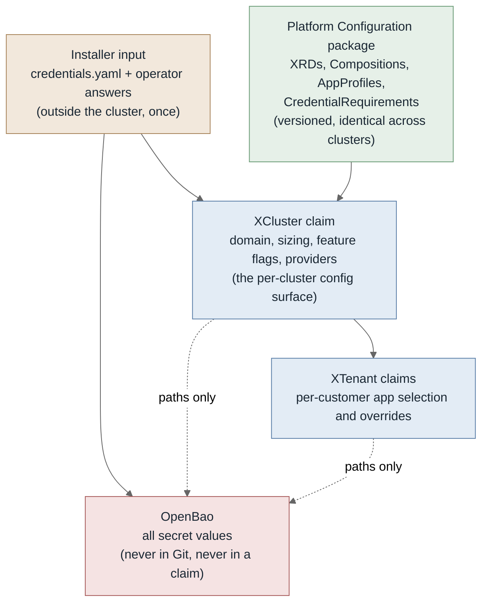
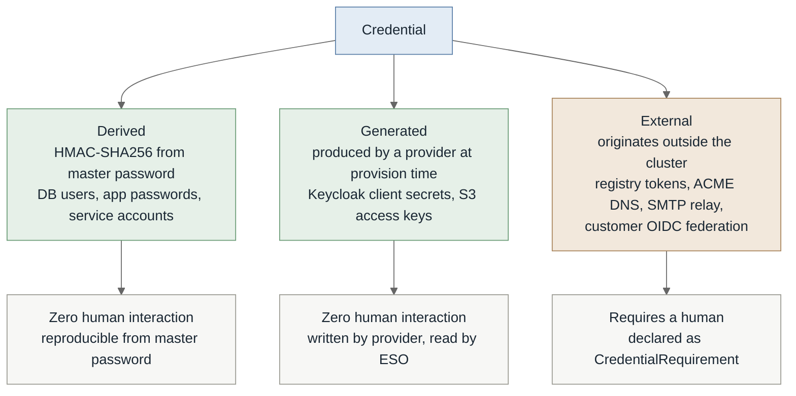
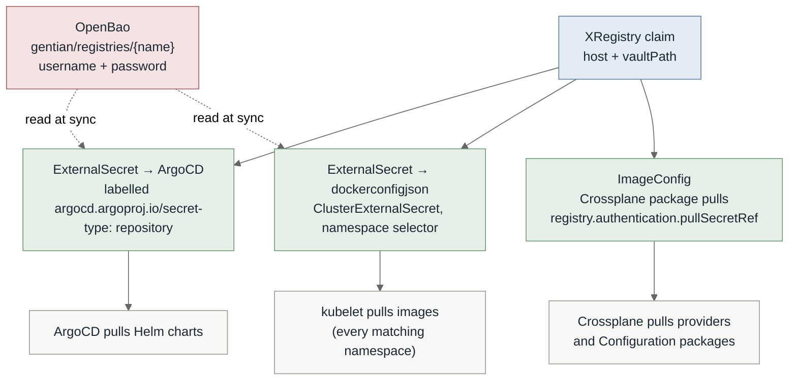
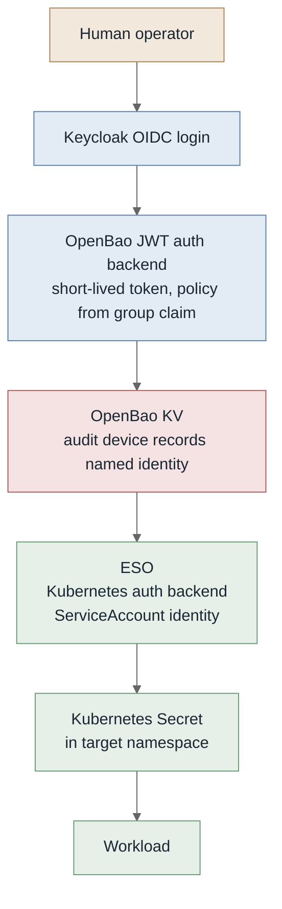
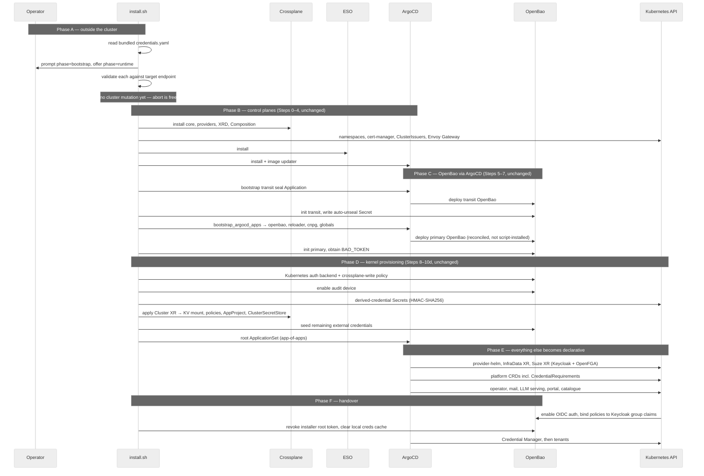
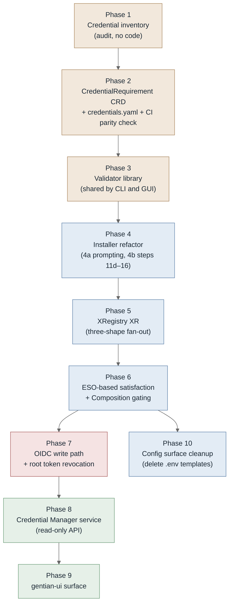

# Configuration and Credential Architecture

**Status:** Draft
**Scope:** `gentian-os` bootstrap, cluster configuration surfaces, credential lifecycle
**Applies to:** `install.sh`, `scripts/lib/`, `gentian-deployments`

---

## 1. Problem Statement

The current bootstrap conflates three concerns that have different lifecycles, different
authorities, and different failure modes.

**Measured baseline** (`install.sh`, develop):

| Metric | Value |
|---|---|
| Lines in `install.sh` | 1,544 (74 KB) |
| Functions defined in `install.sh` | 28 |
| Functions called by `main_cp` but defined in `scripts/lib/` | 32 |
| Numbered install steps in `main_cp` | ~40 (Step 0 → Step 16) |
| Distinct environment variables referenced | 42 |
| `envsubst`-rendered YAML templates | 1 (`root-applicationset.yaml.tmpl`) |

The true bootstrap surface is therefore materially larger than `install.sh` alone: roughly
half the orchestration lives behind `scripts/lib/load.sh`.

| Concern | Current mechanism | Problem |
|---|---|---|
| Bootstrap sequencing | `install.sh` + `scripts/lib/` | Steps 11d–16 name individual applications (`apply_suze_xr`, `install_kernel_mail`, `install_llm_serving`, `install_portal_login`, `bootstrap_appprofiles`, `install_app_catalogue`); this half grows with the catalogue |
| Cluster configuration | `gentian-deployments` profiles (YAML) + `cluster-settings.env` + 42 env vars | Profiles are declarative; `cluster-settings.env` and the env surface are not, and are invisible to reconciliation |
| Human-supplied credentials | `prompt_credentials`, `prompt_kernel_secrets`, `prompt_app_repos`, `validate_config`, `load_creds_cache` | Prompting and validation exist but are ad hoc: no machine-readable inventory, no runtime path once installation completes, no named audit attribution |

The consequence is that a cluster's effective configuration exists only in the shell history of
whoever installed it. For a platform whose product thesis is customer self-hosting, this is the
wrong failure mode: the installing operator is frequently not the person who later has to change
something.

### Invariants

Three properties of the current bootstrap are load-bearing and are preserved by everything below.

1. **OpenBao is deployed by ArgoCD, not by the installer** (`bootstrap_argocd_apps`, Step 6),
   which makes it a reconciled Application. Installing it imperatively ahead of ArgoCD would
   place it outside drift detection.
2. **Transit auto-unseal requires no cloud KMS** (`bootstrap_transit_app`,
   `init_openbao_transit`), so the same mechanism serves AWS and Infomaniak without divergence.
3. **Re-run semantics are idempotent** (`try_load_creds_from_openbao`, `load_install_state`,
   `INSTALL_START_EPOCH` staleness guards, `kv_put_once`): credentials survive a partial install
   without re-prompting.

### Known concern

`load_creds_cache` persists credential state locally across runs. Its contents, location, and
cleanup behaviour need auditing — a local credential cache is in tension with the
OpenBao-as-sole-authority model described here.

### Design goals

1. **One configuration surface per cluster** — the `XCluster` claim, not a set of files.
2. **Bootstrap script knows about four components only** — OpenBao, ESO, Crossplane, ArgoCD.
   Awareness of a fifth is a signal that something belongs in the catalogue instead.
3. **Human-supplied credentials are declared, inventoried, and validated** — not prompted ad hoc.
4. **Every runtime credential write carries a named identity** into the OpenBao audit device.
5. **Install-time and day-2 credential entry share one code path.** Two paths will drift.

---

## 2. Configuration Surfaces

Configuration is split by *who authors it* and *when it changes*, not by file format.



### Rules

- **No value that varies per cluster lives in Git.** It is a field on the `XCluster` claim.
- **No secret value lives in a claim.** A claim may carry an OpenBao *path*; never a value.
- **No rendered artefact is applied by a script.** If a script renders it, the reconciler cannot
  detect drift in it.

Every value in an `.env` template resolves to exactly one of: a field on `XCluster`, a
field on an `AppProfile`, or an OpenBao path. There is no fourth destination.

---

## 3. Credential Taxonomy

The single most important distinction in this document:



The **derived** and **generated** classes cover the overwhelming majority of secret material in a
Gentian cluster and require no tooling beyond what exists. The **external** class is small —
on the order of a dozen entries for the entire platform — and it is the only class requiring an
inventory, a validation step, and a runtime entry path.

> **Naming.** These are called **credential requirements** or **credential inputs**, never
> "external secrets". The collision with External Secrets Operator terminology is expensive:
> ESO's `ExternalSecret` is *a reference to a secret stored externally*, which is nearly the
> opposite of *a secret that must be supplied from outside*.

---

## 4. The `CredentialRequirement` Resource

### Why a plain CRD, not an XRD

`CredentialRequirement` composes nothing. It is declarative catalogue data: a schema, a target
path, and a validation hint. A Crossplane XRD would require a Composition producing managed
resources, and there are none to produce. It ships inside the platform Configuration package as a
plain cluster-scoped CRD, sitting beside `AppProfile` as catalogue rather than as a provisioning
API.

The Crossplane half of this design is on the **consumption** side — see `XRegistry` in §5 — where
genuine fan-out composition exists.

### Definition

```yaml
apiVersion: gentian.io/v1alpha1
kind: CredentialRequirement
metadata:
  name: private-charts-registry
spec:
  displayName: "Private Chart Registry"
  description: >
    Credentials for a private OCI registry supplying Helm charts and
    container images. Example only — substitute the registry actually in
    use. A cluster may declare several of these.
  phase: bootstrap              # bootstrap | runtime
  scope: cluster                # cluster | tenant
  optional: false
  vaultPath: gentian/registries/private-charts
  fields:
    - key: username
      format: string
      secret: false
    - key: password
      format: string
      secret: true
  validate:
    type: oci-registry
    host: registry.example.net
  consumedBy:
    - kind: XRegistry
      name: private-charts
```

| Field | Purpose |
|---|---|
| `phase` | `bootstrap` blocks installation; `runtime` is deferrable to the Credential Manager |
| `scope` | Determines which OpenBao policy governs the write, and who may see the requirement |
| `optional` | Whether an unsatisfied requirement is an error or an informational gap |
| `vaultPath` | The only coupling between the requirement and the storage layer |
| `validate` | Endpoint probe run *before* the value is written — see §7 |
| `consumedBy` | Documentation and impact analysis; not enforced |

### Satisfaction is read from ESO, not from a controller

There is no `CredentialRequirement` controller. Each requirement emits an `ExternalSecret`; ESO's
sync status *is* the satisfaction probe.

- Path absent in OpenBao → `SecretSyncedError` on the `ExternalSecret`
- Path present → `Ready`

This has three consequences worth stating explicitly:

1. No polling of OpenBao from a bespoke component, and therefore no bespoke component holding an
   OpenBao token.
2. Satisfaction is a Kubernetes object condition, so `function-extra-resources` can gate
   Compositions on it — an `XApp` can refuse to compose until its registry credential exists.
3. The Credential Manager (§8) is a read-only view over ESO status plus the CRD catalogue. It
   stores nothing.

---

## 5. Consumption: `XRegistry`

One registry credential must be materialised in three shapes for three different consumers. This
is real fan-out and therefore correctly a Crossplane XR.



One OpenBao path per registry, one rotation point, three consumer-shaped artefacts. Whatever
number of registries a cluster draws from, hand-writing three artefacts per registry is the kind
of repetition that drifts. The XR keeps them in lockstep, and adding a registry is one claim.

`ClusterExternalSecret` with a namespace selector matters here: adding a tenant does not add a Git
object, because the dockerconfigjson materialises into every matching namespace, present and
future.

---

## 6. Write Path and Read Path

The asymmetry is deliberate and permanent.



**Write path** — imperative, authenticated, human-identified, forever. Secret material enters
through the OpenBao API with a Keycloak identity attached. Bootstrap is the single exception,
because there is no Keycloak yet.

**Read path** — declarative, reconciled, machine-identified, forever. Git contains paths only.

### `provider-vault` boundary

| Use | Verdict |
|---|---|
| Declaring mounts, policies, auth backends as infrastructure | Correct |
| Materialising secret *values* into namespaces | Use ESO instead |
| Injecting secret values sourced from XR spec fields | Prohibited — the value then lives in the spec |

`provider-vault` v3 uses periodic-token auth and lacks the Kubernetes auth backend support ESO
has. Keeping value materialisation in ESO means the runtime read path does not depend on
the weaker component, and the day-2 write path does not depend on Crossplane at all.

### Anti-pattern

`kubectl create secret` against a live cluster, outside bootstrap. It works, it is invisible to
reconciliation, and it survives until the cluster is rebuilt from Git and one workload
mysteriously cannot pull. **A Secret with no `ExternalSecret` pointing at it is a latent outage.**
Worth a policy check early.

---

## 7. Installation Sequence

### The bootstrap paradox

The catalogue of required credentials lives in CRDs → which arrive in the Configuration package →
which lives in a registry → which needs a credential.

**Resolution:** ship the catalogue twice from one source. A `credentials.yaml` bundled with the
installer, and the same content rendered as CRD instances inside the Configuration package. Same
schema, two carriers, generated from one file at release time. A CI check asserts they are
identical.

This also resolves install-time prompting for optional credentials: the bundled catalogue is the
complete set for that release, so the installer can offer `phase: runtime` entries without needing
the cluster to enumerate them.

### Sequence

The ordering in `main_cp` is preserved. What changes is **where the installer stops**, not how it
starts.



### What changes and what does not

| Step range | Disposition |
|---|---|
| Step 0 – Step 10d (`install_crossplane` → `bootstrap_root_appset`) | **Keep.** This is legitimate bootstrap: it knows only about Crossplane, cert-manager, Envoy Gateway, ESO, ArgoCD, and OpenBao |
| Step 11 – Step 11c (`install_provider_helm`, `apply_infra_data_xr`, `install_mac_admission`) | **Borderline.** Shared infrastructure; candidate for the root ApplicationSet |
| Step 11d – Step 16 (`ensure_kernel_services_configmap` → `install_app_catalogue`) | **Move to declarative.** These name individual applications — Keycloak, OpenFGA, mail, LLM serving, portal login, catalogue. Each should arrive via the root ApplicationSet or an `AppProfile`, gated on credential satisfaction (§6) rather than on shell ordering |
| `prompt_*` functions | **Refactor, do not delete.** They become renderers over the `CredentialRequirement` catalogue, sharing validators with the future service |
| `try_load_creds_from_openbao`, `load_install_state`, `kv_put_once` | **Keep.** These implement Invariant 3 |
| `load_creds_cache` | **Audit, likely remove.** See §1 |
| `_reset_suze_ghost_helm_releases` | **Keep, but treat as a symptom.** Heal hooks for partial installs are evidence of the debugging cost named in §11 |

### Auto-unseal

`bootstrap_transit_app` and `init_openbao_transit` deploy a transit-seal OpenBao as an ArgoCD
Application, which unseals the primary. No cloud KMS is involved, so the mechanism is identical
on AWS and Infomaniak. Unchanged by this design.

HMAC-SHA256 derivation (`SECRET_MODE=derived`, `MASTER_PASSWORD` + `DERIVATION_SALT`) collapses the
entire derived-credential class into a single root. `MASTER_PASSWORD` is length-validated at
16 characters minimum in two places (`create_crossplane_secrets` and `run_portal_only`); that rule
moves into the `CredentialRequirement` schema so it is declared once.

### Target scope for `install.sh`

The target is expressed as a property, not a line count:

> **The installer names no application that appears in the app catalogue.**

A `grep` for kernel and catalogue application names (`keycloak`, `openfga`, `postfix`, `vllm`,
`litellm`, `portal`) across `install.sh` and `scripts/lib/` returns nothing. Whatever line count
results from that is the correct one.

---

## 8. Credential Manager

A renderer over the `CredentialRequirement` catalogue and ESO status. It is a *view plus a form*,
not a store.

### Two non-negotiable design constraints

**1. The service holds no OpenBao token of its own.**
It exchanges the user's Keycloak OIDC token for a short-lived OpenBao token via the JWT auth
backend, and the *user's* identity performs the write. The alternative — the service holding broad
write credentials and performing authorisation itself — creates a single component able to write
every secret in the cluster and records the service rather than the human in the audit device.
That weakens the audit guarantee rather than strengthening it. Done correctly, the component holds nothing at
rest and OpenBao's policy engine remains the sole authority.

**2. Write-only. No read-back.**
Displaying credentials creates an exfiltration surface, requires a different threat model, and
hands an attacker with a stolen session everything at once. Display metadata only:

- exists / does not exist
- who set it, when (from the audit device)
- last validation result
- optionally a truncated fingerprint, letting an operator confirm which value is stored

Lost credentials are rotated, not recovered. This constraint keeps the security review small and
is straightforward to explain to a customer's auditor.

### What justifies the build

Not convenience — **validation**. A form that tests a token against its target endpoint before
storing it converts a class of latent failure ("tenant provisioning stalled; the path exists; the
registry password was pasted with a trailing newline") into a red field at install time.

Secondary justification: a traditional sysadmin can complete a validated form. Requiring them to
hold OpenBao path conventions in their head is where the sysadmin-accessible design promise breaks
down — and given that traditional IT admins outnumber Kubernetes engineers by roughly an order of
magnitude, this is closer to core product than to internal tooling.

### Scope boundary

Most requirements are cluster-scoped (registries, ACME DNS, upstream relays). The tenant-scoped
set is narrower: a customer's own SMTP relay, their own S3 endpoint, external OIDC federation.
The `scope` field drives visibility, and a tenant admin's OpenBao policy must not reach
`gentian/registries/*`. A UI showing a tenant admin a cluster-scoped form and OpenBao rejecting
the write is an annoyance; the inverse is a breach.

### Sequencing

The CLI form of the Credential Manager lives in the installer, because the service itself arrives
only in Phase E — after the cluster is running. CLI and GUI share the schema and the validators
but not the service. The CLI is built first; the gentian-ui surface is the same API rendered
differently.

---

## 9. Implementation Plan

Sequential phases. Each phase is independently useful and independently revertible.



---

### Phase 1 — Credential inventory

Audit the 42 environment variables referenced by `install.sh`, everything read by
`prompt_credentials`, `prompt_kernel_secrets`, `prompt_app_repos`, and `load_operator_config`,
plus `cluster-settings.env` and every `AppProfile`. Classify each per §3.

Candidate external set, derived from `install.sh`. `scripts/lib/` must be inspected to confirm
completeness:

| Variable | Class | Phase | Note |
|---|---|---|---|
| `MASTER_PASSWORD` | external | bootstrap | Root of HMAC derivation; ≥16 chars |
| `DERIVATION_SALT` | external | bootstrap | Paired with the above |
| Registry auth (`INFRA_CHART_REPO`) | external | bootstrap | One entry per private registry the cluster pulls from |
| `CF_API_TOKEN` | external | bootstrap if wildcard TLS, else runtime | Consumed by `install_kernel_wildcard` |
| `SMTP_RELAY_USERNAME` / `SMTP_RELAY_PASSWORD` | external | runtime | Only when `MAIL_SERVICE_MODE=external` |
| `EXTERNAL_SMTP_HOST` / `EXTERNAL_SMTP_PORT` | config, not secret | runtime | Belongs on `XCluster` |
| `CI_BOT_PAT` | external | runtime | Consumed by `configure_github_actions_secrets` |
| `BAO_TOKEN` | transient | — | Must not persist; see Phase 7 |
| `KERNEL_DOMAIN`, `KERNEL_REALM`, `TENANCY_MODE`, `ROUTING_MODE`, `GPU_ACCELERATION`, `LLM_SUPPORT`, `SECRET_MODE`, `ENV` | config, not secret | — | Belongs on `XCluster` |

**Acceptance**
- All 42 environment variables are classified: external credential, non-secret config, or
  internal/derived. None unclassified.
- The 32 `scripts/lib/` functions called by `main_cp` are inspected for additional prompts or
  secret reads not visible in `install.sh`.
- `load_creds_cache` is documented: what it writes, where, with what permissions, and whether it
  is cleared on success.
- Bootstrap-blocking set is enumerated and is expected to number under five.
- Reviewed against a clean-room install by someone other than the author.

---

### Phase 2 — `CredentialRequirement` CRD and dual-carrier catalogue

Define the CRD. Author `credentials.yaml`. Generate CRD instances from it at release time. Add a
CI job asserting the two carriers are byte-equivalent after normalisation.

**Acceptance**
- CRD applies cleanly; OpenAPI schema rejects a requirement lacking `vaultPath` or `fields`.
- `phase` and `scope` are enums; invalid values rejected at admission.
- CI fails when `credentials.yaml` is edited without regenerating the packaged CRDs.
- Every Phase 1 external credential has a corresponding requirement.
- No controller was written.

---

### Phase 3 — Validator library

One library, one interface, consumed by both the installer CLI and the later service. Validator
types keyed to `spec.validate.type`.

Initial set: `oci-registry`, `smtp`, `s3`, `dns-provider`, `oidc-discovery`, `noop`.

**Acceptance**
- Each validator has a passing and a failing integration test against a real or containerised
  endpoint.
- Trailing whitespace and newline in a pasted secret is caught, not silently accepted.
- A validator failure returns an actionable message naming the endpoint and the failure class,
  never a stack trace.
- Timeouts are bounded; an unreachable endpoint does not hang the installer.
- Library has no Kubernetes dependency.

---

### Phase 4 — Installer refactor

Two independent changes, in order.

**4a — Prompting becomes catalogue-driven.** `prompt_credentials`, `prompt_kernel_secrets`, and
`prompt_app_repos` are rewritten to iterate the bundled `credentials.yaml` rather than hardcode
variable names. Validators from Phase 3 run before any cluster mutation. The `MASTER_PASSWORD`
length rule moves into the CRD schema and out of its two hardcoded sites.

**4b — Steps 11d–16 move declarative.** `apply_suze_xr`, `install_gentian_os_operator`,
`install_kernel_mail`, `install_llm_serving`, `install_portal_login`, `bootstrap_appprofiles`, and
`install_app_catalogue` are replaced by entries in the root ApplicationSet or by `AppProfile`
instances, gated on credential satisfaction (Phase 6) instead of on shell ordering.

**Acceptance**
- `grep -riE 'keycloak|openfga|postfix|vllm|litellm|portal|nextcloud'` across `install.sh` and
  `scripts/lib/` returns nothing.
- Adding a new prompt requires editing `credentials.yaml` only — no shell change.
- A failed validation aborts with zero cluster mutations, verified by diffing cluster state.
- The reduction is deletion, not relocation into `scripts/lib/`: the combined line count of
  `install.sh` plus `scripts/lib/` falls.
- Audit device is enabled before the first OpenBao write, asserted by checking the first entry in
  the audit log.
- Clean-room install on both AWS and Infomaniak reaches a running root ApplicationSet with only
  the bootstrap-phase credentials supplied.
- Invariant 3 holds: `try_load_creds_from_openbao`, `load_install_state`, and the
  `INSTALL_START_EPOCH` staleness guard behave correctly against a partially-completed install.
- `--validate` still performs config validation with no cluster changes.

---

### Phase 5 — `XRegistry`

XRD plus Composition emitting the ArgoCD repository Secret, the `ClusterExternalSecret` for
dockerconfigjson, and the Crossplane `ImageConfig`.

**Acceptance**
- One claim produces all three artefacts.
- ArgoCD picks up the repository credential without a restart.
- A newly created tenant namespace receives the dockerconfigjson without a new Git object.
- Rotating the value in OpenBao propagates to all three consumers within the ESO refresh interval,
  with no Git commit.
- Deleting the claim removes all three; no orphaned Secrets.
- Every registry the cluster pulls from is driven by this XR, including `ghcr.io/gentian-org`.
- Adding a second registry requires one claim and no new Composition.

---

### Phase 6 — ESO-based satisfaction and Composition gating

Emit an `ExternalSecret` per requirement. Use `function-extra-resources` so an `XApp` whose
registry credential is unsatisfied does not compose.

**Acceptance**
- A requirement with no value in OpenBao surfaces as a non-Ready `ExternalSecret`, not a crash
  loop in a consuming workload.
- An `XApp` depending on an unsatisfied requirement reports a clear, non-Ready condition naming
  the missing requirement.
- Supplying the value later causes composition to proceed without manual intervention.
- No polling of OpenBao by any bespoke component.

---

### Phase 7 — OIDC write path and root token revocation

Enable OpenBao's OIDC auth backend against Keycloak. Bind policies to group claims. Revoke the
installer root token as a scripted step, not a runbook note.

**Acceptance**
- `bao login -method=oidc` succeeds and yields a policy set derived from Keycloak groups.
- A write by a named operator appears in the audit device with that identity.
- The installer root token is invalid after installation completes — asserted by a test that
  attempts a write with it and expects failure.
- A tenant-admin identity is denied read and write on `gentian/registries/*`.
- Cluster-admin and tenant-admin policy sets are covered by explicit allow and deny tests.

---

### Phase 8 — Credential Manager service

Read-only API over the CRD catalogue and ESO status, plus a write endpoint that performs a token
exchange and writes as the user.

**Acceptance**
- The service has no OpenBao token in its own configuration — verified by inspecting its
  Deployment and its ServiceAccount's OpenBao policy.
- Removing the user's token causes writes to fail; the service cannot write on its own authority.
- No endpoint returns a secret value. Asserted by a test enumerating every route.
- Metadata surfaced: existence, setter identity, timestamp, last validation result.
- Validation runs before the write; a failing value is not stored.
- A tenant admin sees only `scope: tenant` requirements.

---

### Phase 9 — gentian-ui surface

Credential Manager view in the desktop shell, consuming the Phase 8 API. Auth through Keycloak,
consistent with all other gentian-ui flows.

**Acceptance**
- No credential value is ever rendered in the DOM.
- Unsatisfied required credentials are visible without navigating into a detail view.
- Validation failure is presented inline against the offending field.
- Behaviour is equivalent to the CLI; both are exercised by the same API contract tests.

---

### Phase 10 — Configuration surface cleanup

Migrate every remaining `.env` template value to an `XCluster` field, an `AppProfile` field, or an
OpenBao path. Delete the templates.

**Acceptance**
- No `.env` or `.env.tmpl` remains in the repository.
- No shell-rendered YAML is applied by the installer.
- A cluster's complete non-secret configuration is readable via `kubectl get xcluster -o yaml`.
- Two clusters differing only in domain differ only in their `XCluster` claim.

---

## 10. Open Questions

| Question | Notes |
|---|---|
| `load_creds_cache` contents | Blocks Phase 1. A local credential cache is in tension with OpenBao-as-sole-authority. Determine what it stores, its file permissions, and whether it is cleared on success. |
| `scripts/lib/` surface | The 32 functions called by `main_cp` from `scripts/lib/` are unaudited. Additional prompts, secret reads, or application-specific knowledge there would change Phase 1 and Phase 4b scope. |
| `gentian-os-operator` boundary | `install_gentian_os_operator` deploys an operator with an authz bridge alongside the Crossplane control plane. Which credential-related responsibilities belong to it versus to Crossplane compositions is unresolved. |
| Transit seal root of trust | Auto-unseal works, but the transit OpenBao is itself unsealed somehow. Where that key lives and how it is protected in a customer-operated cluster needs stating explicitly for audit. |
| `cluster-settings.env` migration | The `gentian-deployments` profiles are YAML; `cluster-settings.env` is not. Whether it folds into the profile YAML or into the `XCluster` claim. |
| Rotation triggers | Rotation is operator-initiated. Whether `CredentialRequirement` should carry a `maxAge` and surface staleness is unresolved. |
| Tenant-scoped requirement authoring | Whether tenant admins may *declare* requirements (their own SMTP relay) or only satisfy platform-declared ones. Declaration is more flexible and materially larger in scope. |
| Validator coverage | Some credentials have no meaningful pre-flight probe. Whether `noop` validation is permitted for `phase: bootstrap` entries, or whether those reclassify as `runtime`. |
| Offline install | The dual-carrier catalogue assumes the installer is current for the target release. Air-gapped installation needs an explicit version-compatibility check. |

---

## 11. Trade-off Statement

This design trades **legible linear failure** for **eventual-consistency debugging**.

A 700-line script fails at line 340 with a message. A reconciler-driven install fails as an XR that
never reaches Ready, and the cause is somewhere in a dependency graph. That is a real cost, and it
is worse when the operator is alone and unfamiliar with Crossplane.

It pays off in exactly one circumstance: when someone other than the platform author has to install
and operate a cluster. Given that customer self-hosting is the product thesis, that is the case
being optimised for.

The cost is visible in the existing codebase: `_reset_suze_ghost_helm_releases` and the
`INSTALL_START_EPOCH` staleness guards exist because partial installs leave resources that are
hard to classify. Phase 4b enlarges the declarative surface and so enlarges this class of problem
before reducing it.

The mitigation is Phase 6 — composition gating with named, actionable non-Ready conditions —
which converts "something is not Ready" into "requirement `private-charts-registry` is unsatisfied".
Phase 6 should not be deferred past Phase 4b.

---

## 12. Repository Hygiene Backlog

Findings from a structural review of the repository (see
[../folder-structure.md](../folder-structure.md)). Most are independent of the credential
work and can land at any time; the ones marked **Phase 4b** are direct evidence for the
`scripts/lib/` open question in §10 and should be folded into that refactor rather than
fixed twice.

### 12.1 Correctness — fix regardless of this plan

| Finding | Evidence | Disposition |
|---|---|---|
| **`manager` binary tracked in Git** — a 45.6 MB compiled artefact committed in `02235d7` (2026-06-07). `.gitignore` covers `bin/` and `*.test` but not this path. | `git ls-files manager` | `git rm --cached manager`, add `/manager` to `.gitignore`. History rewrite optional. |
| **Kernel mail install path applies directories that no longer exist.** `deploy_kernel_mail_services()` runs `kubectl apply -f kernel/services/{postfix,dovecot}/manifests/${env}/`, but those services were converted to env-parameterised Helm charts (`manifests/Chart.yaml` + `templates/` + `values.yaml`) with no per-stage subdirectory. It also waits on `externalsecret/dovecot-sensitive-values`, which the dovecot chart does not template. Any `MAIL_SERVICE_MODE=kernel` install fails here. | `scripts/lib/common.sh:2032`, `:2041` | **Phase 4b.** Postfix and Dovecot already arrive via the `09-infra-helm` ApplicationSet; delete `deploy_kernel_mail_services` rather than repair it. |
| **`make clean` destroys hand-maintained fixtures.** `rm -rf config/crd/*.yaml` also deletes the envtest stubs (`gentianos.io_apps.yaml`, `gentianos.io_xtenants.yaml`) and six vendored third-party CRDs, none of which `make manifests` regenerates. `make clean && make manifests` silently breaks the envtest suite. | `Makefile:92` | Narrow the glob to `config/crd/gentianos.io_{appcatalogues,appgrants,apppackages,appprofiles,customizations,integrationbindings,oidcpackcatalogs,platformsecuritypolicies,tenants}.yaml`, or move the hand-maintained files to `config/crd/fixtures/`. |

### 12.2 Dead code and empty scaffolding

| Finding | Evidence | Disposition |
|---|---|---|
| `internal/tiles/` has zero importers outside its own test — `resolver.go` plus a 20 KB embedded `catalogue.json`. | `grep -r 'internal/tiles"'` | Delete, or state in the package doc which consumer is pending. |
| `kernel/argocd/install/argocd.yaml` is unreferenced; its own header says "This is a reference file". It pins ArgoCD **v2.11.3**. | no callers | Delete. `scripts/install-argocd.sh` is the real path. |
| `crossplane/tests/unit/functions/` contains only `.gitkeep`, so `make test-unit-functions` always prints SKIP — yet CI spends a step on `pip install pytest`. The root `.pytest_cache/` and `.ruff_cache/` are residue. | `Makefile:166`, `.github/workflows/ci.yaml:181` | Either land the first function test or drop the target and the CI step. |
| `crossplane/functions/` and `crossplane/tests/e2e/fixtures/` are `.gitkeep`-only. | — | Keep only if a named piece of work will fill them; otherwise remove. |
| `scripts/verify-authz-model.sh` and `scripts/normalize-go-headers.sh` are wired to neither `make` nor CI. | 0 references | Wire `verify-authz-model.sh` into the lint job (there is an `authz/model/v0/tests.fga.yaml` to run); `normalize-go-headers.sh` is a completed one-off — delete. |
| `export/gentian-apps.tar.gz` and `export/gentian-apps-*.bundle` (255 KB tracked) are no longer listed in `export/README.md`'s export table. | `export/README.md` | Delete; the catalogue has its own repo. |

### 12.3 Orphaned configuration — relevant to Phase 10

These are `.env`-adjacent value files with **no consumer**, kept in sync by convention. They
are the same failure mode §2 describes, and should be swept in Phase 10 alongside the
`.env` templates.

| Finding | Evidence | Disposition |
|---|---|---|
| `kernel/services/{minio,redis}/values/` and `kernel/services/{postfix,dovecot}/values/` are referenced only from comments (`# Source of truth: …`) in the `infra-*` ConfigMap templates and from `charts/infra/*/UPSTREAM.md`. The effective values are inlined in the charts. | `kernel/services/infra-minio/manifests/templates/configmap.yaml:4` | Delete, or make the ConfigMap templates actually read them. Manual-sync-by-comment will drift. |
| `kernel/values/env/{dev,prod,functional}.yaml` likewise have only comment references, and describe an `apps/{app}/values/_base.yaml` layout that does not exist in this repo. | `kernel/values/env/functional.yaml:5` | Fold the intent into the `XCluster` schema (Phase 10) and delete. |

### 12.4 Local operator cruft

Not tracked, but present in a working tree and worth an explicit cleanup note in
`GETTING-STARTED.md`:

`controller.test` (80 MB), `bin/manager` (45 MB), root `minio-16.0.10.tgz` and
`redis-18.6.1.tgz` (duplicates of `charts/infra/packages/`), `.install-state.env`,
`install.env.backup`, and **`install.secrets.env.backup`** — a stale credential file that
outlives the install it belonged to. That last one is a concrete instance of the
`load_creds_cache` concern in §1: the audit in Phase 1 should cover every local file the
installer writes containing secret material, not just the cache.

### 12.5 Documentation drift

| Finding | Disposition |
|---|---|
| `architecture.md` §8 "Repository Structure" claims `crossplane/functions/` holds composition functions (it is empty) and omits `internal/`, `api/`, `charts/`, `scripts/`, `authz/`, `config/`. | Replace the tree with a pointer to `docs/folder-structure.md`. |
| `charts/infra/{mariadb,postgresql}/README.md.gotmpl.tpl` are Bitnami readme-generator leftovers sitting beside the real `.gotmpl`. | Delete; note in the chart's `UPSTREAM.md`. |
| The baseline in §1 of this document (`install.sh` at 1,544 lines / 74 KB) is stale — the file has since grown past 1,900 lines. | Re-measure when Phase 1 starts; the target in §7 is a property, not a line count, so the baseline is only useful as a before/after datum. |
