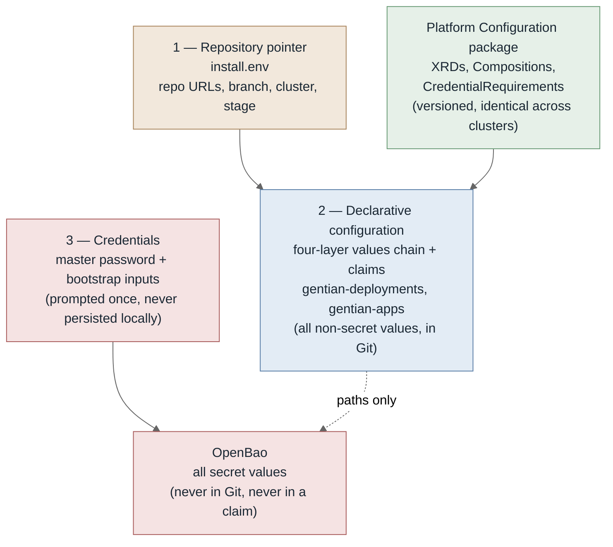
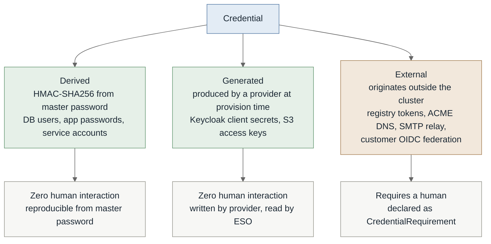
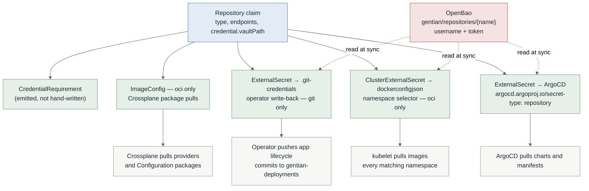
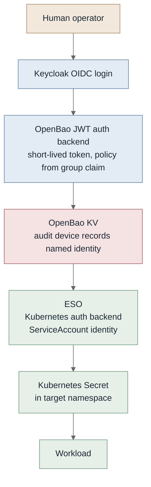
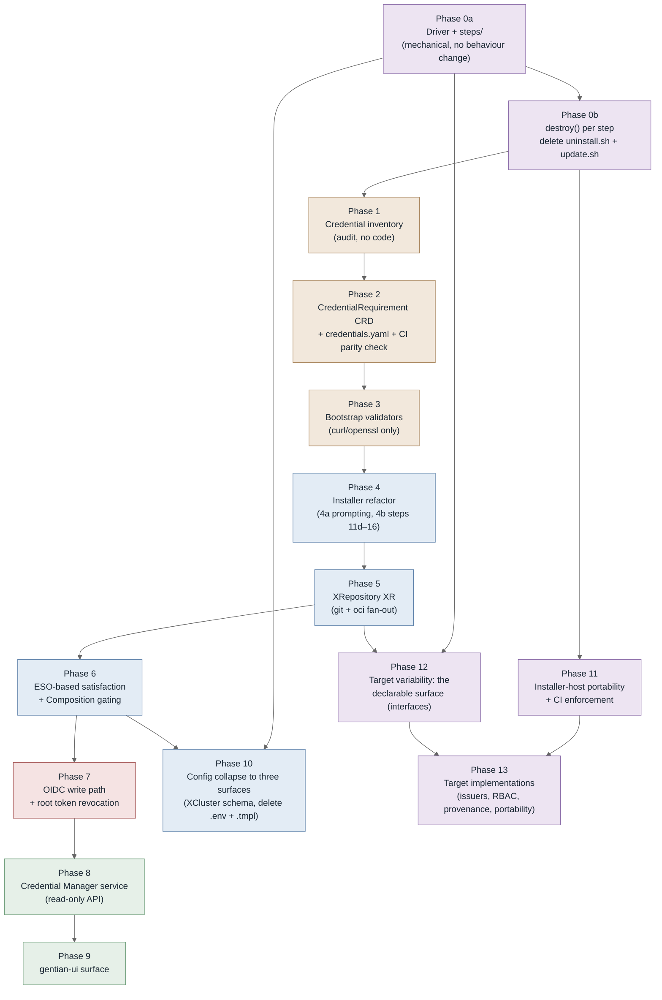

# Configuration and Credential Architecture

**Status:** Draft
**Scope:** `gentian-os` bootstrap and installer structure, cluster configuration surfaces,
credential lifecycle
**Applies to:** `install.sh`, `uninstall.sh`, `update.sh`, `scripts/lib/`, `gentian-deployments`

---

## 1. Problem Statement

The current bootstrap conflates three concerns that have different lifecycles, different
authorities, and different failure modes.

**Measured baseline** (develop, 2026-08-14):

| Metric | Value |
|---|---|
| `install.sh` | 1,545 lines |
| `scripts/lib/` (7 files) | 4,626 lines — `common.sh` alone is 2,209 |
| `uninstall.sh` | 1,453 lines |
| `update.sh` | 801 lines |
| `scripts/kubectl-gentian` | 2,765 lines |
| `scripts/*.sh` (helpers) | 4,139 lines |
| **Total shell surface** | **15,329 lines** |
| Numbered install steps in `main_cp` | ~40 (Step 0 → Step 16) |
| Distinct environment variables referenced | 42 |
| `envsubst`-rendered YAML templates | 16 files, 15 call sites |
| Required external CLIs | 11 — `kubectl helm jq yq openssl curl bao crossplane python3 argocd git` |

Two facts dominate everything below.

**The orchestration is not in `install.sh`.** `main_cp` is 40 step *names*; the bodies live behind
`scripts/lib/load.sh`. An operator reading the installer learns the order of operations and
nothing else. The readability that justifies keeping the installer in shell is therefore not
currently delivered.

**The same step knowledge is encoded three times.** `install.sh` applies it, `update.sh`
re-applies it as `op_mail` / `op_portal` / `op_argocd_bootstrap` / `op_llm_serving` / …, and
`uninstall.sh` reverses it as 18 bespoke `_delete_*` helpers. `uninstall.sh` does not even source
`scripts/lib/load.sh`, so it re-implements the primitives as well. Adding a step means editing
three files in two directories, and nothing enforces that all three agree.

| Concern | Current mechanism | Problem |
|---|---|---|
| Bootstrap sequencing | `install.sh` + `scripts/lib/` | Steps 11d–16 name individual applications (`apply_suze_xr`, `install_kernel_mail`, `install_llm_serving`, `install_portal_login`, `bootstrap_appprofiles`, `install_app_catalogue`); this half grows with the catalogue |
| Cluster configuration | `gentian-deployments` profiles (YAML) + `cluster-settings.env` + 42 env vars | Profiles are declarative; `cluster-settings.env` and the env surface are not, and are invisible to reconciliation |
| Human-supplied credentials | `prompt_credentials`, `prompt_kernel_secrets`, `prompt_app_repos`, `validate_config`, `load_creds_cache` | Prompting and validation exist but are ad hoc: no machine-readable inventory, no runtime path once installation completes, no named audit attribution |

The consequence is that a cluster's effective configuration exists only in the shell history of
whoever installed it. For a platform whose product thesis is customer self-hosting, this is the
wrong failure mode: the installing operator is frequently not the person who later has to change
something.

### Invariants

Three properties of the current bootstrap are load-bearing and are preserved by everything below.

1. **OpenBao is deployed by ArgoCD, not by the installer** (`bootstrap_argocd_apps`, Step 6),
   which makes it a reconciled Application. Installing it imperatively ahead of ArgoCD would
   place it outside drift detection.
2. **Transit auto-unseal requires no cloud KMS** (`bootstrap_transit_app`,
   `init_openbao_transit`), so the same mechanism serves AWS and Infomaniak without divergence.
3. **Re-run semantics are idempotent** (`try_load_creds_from_openbao`, `load_install_state`,
   `INSTALL_START_EPOCH` staleness guards, `kv_put_once`): credentials survive a partial install
   without re-prompting.

### Known concern

`load_creds_cache` persists credential state locally across runs. Its contents, location, and
cleanup behaviour need auditing — a local credential cache is in tension with the
OpenBao-as-sole-authority model described here.

### Design goals

1. **Three configuration surfaces, cluster-wide** — a repository pointer, declarative YAML in
   those repositories, and credentials. There is no fourth. See §2.
2. **Bootstrap script knows about four components only** — OpenBao, ESO, Crossplane, ArgoCD.
   Awareness of a fifth is a signal that something belongs in the catalogue instead.
3. **The shell does the minimum and no more.** Every line of bash is a line an operator must read
   to trust the install, and a line that has to behave identically on Linux and macOS. Work that
   a reconciler can do belongs to the reconciler; work that the cluster can do belongs on the
   cluster. See §7.
4. **The installer is readable top to bottom by a cluster administrator.** This is the reason the
   installer stays in shell rather than becoming a compiled binary, and it is a requirement on the
   structure, not a property that shell provides for free.
5. **Human-supplied credentials are declared, inventoried, and validated** — not prompted ad hoc.
6. **Every runtime credential write carries a named identity** into the OpenBao audit device.

### Language choice

The installer stays in Bash. A compiled binary would collapse the 11-CLI prerequisite list to
zero and make the credential and status-aggregation work materially easier, but it would also
make the install opaque at exactly the moment an operator most needs to understand it — a
customer-run cluster, mid-bootstrap, on infrastructure the platform author has never seen. The
prerequisites are standard tooling for whoever holds cluster admin, and shell runs everywhere the
installer is targeted.

That choice is only worth its cost if the shell is actually legible, which today it is not
(§1). §7 is the structure that makes it so. Goals 3 and 4 exist to keep the trade honest: shell
is retained *for* readability, so anything that does not improve readability should not be in
shell at all.

macOS support requires closing the portability gaps recorded in §7. Windows support means WSL2;
there is no native path and the plan does not pretend otherwise.

---

## 2. Configuration Surfaces

A Gentian cluster has exactly **three** configuration surfaces. Everything an operator supplies
belongs to one of them, and the three differ in carrier, author, and lifecycle.

| # | Surface | Carrier | Answers | Changes |
|---|---|---|---|---|
| 1 | **Repository pointer** | `install.env` — a dozen lines on the installing machine | *Where is this cluster's configuration?* | Almost never |
| 2 | **Declarative configuration** | YAML in `gentian-deployments` and `gentian-apps` | *What is this cluster, its tenants, and their apps?* | Continuously, via Git |
| 3 | **Credentials** | Prompted by the installer, written to OpenBao | *What secrets does it need that cannot be derived?* | On rotation |



### Surface 1 — Repository pointer

The only non-secret file the installer reads from the local filesystem. It answers one question —
*where does everything come from?* — and carries no cluster configuration of its own:

```bash
# Where the configuration lives
GENTIAN_DEPLOYMENTS_REPO=https://github.com/gentian-org/gentian-deployments
GENTIAN_DEPLOYMENTS_BRANCH=main
GENTIAN_DEPLOYMENTS_CLUSTER=default-cluster
GENTIAN_DEPLOYMENTS_STAGE=dev
GENTIAN_APPS_REPO=https://github.com/gentian-org/gentian-apps
GENTIAN_APPS_BRANCH=main

# Where the platform itself comes from
GENTIAN_OS_REPO=https://github.com/gentian-org/gentian-os
GENTIAN_OS_BRANCH=main
GENTIAN_OS_IMAGE_REPOSITORY=ghcr.io/gentian-org
```

**Platform provenance is part of this surface.** A customer running a mirrored, forked, or
air-gapped install must be able to say where gentian-os itself comes from — both its Git
repository, which every child ApplicationSet tracks back to, and its image registry. Omitting
these makes "self-hosted" mean "self-hosted, provided you can reach the vendor's GitHub", which
is not the product thesis in §1. This is the *platform provenance* dimension in §9.

`GENTIAN_OS_BRANCH` already exists and is load-bearing: `root-applicationset.yaml.tmpl` passes it
to `kernel/appsets/values.yaml` as `targetRevision`, so every child ApplicationSet follows the
branch or tag the parent was installed from. `GENTIAN_OS_REPO` is its missing counterpart — the
repository URL is currently hardcoded, so a mirror can pin the *ref* but not the *origin*.

`install.env.template` is already close to this. The residue to remove is
`INSTALL_CLUSTER_INFRA`, `GITHUB_ACTIONS_OS_REPO`, `GITHUB_ACTIONS_UI_REPO`, and
`GENTIAN_NONINTERACTIVE` — none of which describe where anything comes from.
`INSTALL_CLUSTER_INFRA` is cluster configuration (surface 2); the GitHub Actions pair belongs to
CI, not to a cluster install (see *What is not a configuration surface* below); non-interactivity
is a command-line flag, not configuration.

### Surface 2 — Declarative configuration

Everything non-secret that varies per cluster, tenant, or app, expressed as YAML in Git and
reconciled.

**This surface already has a documented internal structure and this plan does not replace it.**
[`deployment.md` §1](../deployment.md) defines a four-layer values chain that ArgoCD merges as
Helm `valueFiles`, plus the claim as a fifth, differently-shaped layer:

| Layer | Lives in | Scope |
|---|---|---|
| 1. Chart defaults | `gentian-os/charts/gentian-os/values.yaml` | every cluster, every deployer |
| 2a. Cross-stage shared | `gentian-deployments/profiles/_base.yaml` | every cluster of this deployment |
| 2b. Stage profile | `gentian-deployments/profiles/<stage>.yaml` | every cluster of that stage |
| 3. Cluster overlay | `gentian-deployments/clusters/<name>/kernel/values.yaml` | one cluster |
| 4. Claims | `clusters/<name>/kernel/claims/`, `clusters/<name>/tenants/`, `gentian-apps` AppProfiles | one cluster, one tenant, one app |

The layering is the point. A claim is flat: collapsing layers 1–3 into it would force every
cluster to restate its stage's values, which is the duplication the chain exists to prevent.
**Layers 1–3 are already declarative, already reconciled, and are not a problem this plan
solves.**

### The surface-2 gap: `cluster-settings.env`

The gap is one file: `gentian-deployments/clusters/<name>/kernel/cluster-settings.env`, carrying
**26 variables** of non-secret cluster configuration in shell syntax, read by the installer,
invisible to reconciliation — sitting directly beside a perfectly good values chain that it does
not use.

Each variable resolves to a layer, not all to the claim. The rule is **who consumes it**:

| Group | Variables | Destination | Why |
|---|---|---|---|
| Cluster modes | `TENANCY_MODE`, `NETWORK_MODE`, `ROUTING_MODE`, `SECRET_MODE` | Layer 4 — `XCluster.spec` | Consumed by Crossplane Compositions directly |
| Storage | `STORAGE_CLASS` | Layer 3 | Cluster-unique, consumed as a Helm value |
| Mail | `MAIL_SERVICE_MODE`, `EXTERNAL_SMTP_{HOST,PORT,SSL,STARTTLS}` | Layer 4 — `XCluster.spec.mail` | Composition emits the relay config and the ESO reference |
| LLM serving | `GPU_TIME_SLICE_REPLICAS`, `VLLM_INSTANCES`, `VLLM_QWEN_*` (6) | Layer 3 | Hardware-dependent, and `deployment.md` §1 already records `llmSupport`/GPU as cluster-not-stage |
| Tenant defaults | `TENANT_LIMITRANGE_*` (4), `TENANT_INITJOB_*` (4) | Layer 2a | Identical across this deployment's clusters; a per-cluster copy would be pure duplication |

The `XCluster` XRD today declares only `kernelDomain`, `masterPasswordSecretRef`, `openbao`, and
`argocd` (`crossplane/xrds/cluster.yaml`), so the claim rows above are genuinely new schema. The
layer-2 and layer-3 rows are moves into files that already exist.

**Deleting `clusters/<name>/kernel/values.yaml` is not a goal.** It is layer 3 and it is correct.
`deployment.md` §1 documents one structurally necessary duplication in it — `kernelDomain`
mirrored from the claim, because a running Go process needs it as a boot-time env var — and that
should be covered by the CI lint that document already suggests, not by deleting the layer.

### Stage is a layer selector, not a switch

A cluster has exactly one stage, fixed at bootstrap, and it selects which `profiles/<stage>.yaml`
that cluster's layer 2b reads. That is all it does.

`stage` must not become a magic flag that silently enables a bundle of behaviour. The existing
profiles get this right on purpose — `dev.yaml` and `prod.yaml` differ only in `logLevel` and the
ACME issuer, and both carry a comment listing what was deliberately kept out. Preserve that
discipline: if dev clusters want an image updater and prod clusters do not, the carrier is an
explicit `imageUpdater.enabled` field defaulted in `profiles/dev.yaml`, never a conditional on the
stage string. A reader must be able to see the behaviour by reading a value, not by knowing what
`dev` implies.

The same rule extends to credentials, and there it is load-bearing — see §4, *Requirements follow
from claims*.

### Surface 3 — Credentials

Prompted by the installer, validated, written to OpenBao, and never written to local disk. The
master password is the root of the derived-credential class (§3) and the single most important
value the operator supplies. Everything else in this surface is small by construction: the
bootstrap-blocking set is expected to number under five, and every other credential is
`phase: runtime` and belongs to the on-cluster credential manager (§10).

The one credential this surface must hold that surface 2 cannot declare is the token for the
deployments repository itself — a private repository cannot describe its own access. That is the
sole permanent member of the tier-0 set in §4; every other repository credential, including for
private app repositories, is declared as data in surface 2.

`install.secrets.env` and `INSTALL_SECRETS_CACHE` are both deleted by this design — see §6 and
the `load_creds_cache` concern in §1.

### What is not a configuration surface

**CI is not cluster configuration.** Build, test, and artefact publication are properties of the
source code and live in `.github/workflows/` in the repository being built — `gentian-os`,
`gentian-apps`, `gentian-ui`. They are not a property of any cluster, they are not in
`gentian-deployments`, and the installer has no business configuring them.

`configure_github_actions_secrets` (`scripts/lib/catalogue.sh:160`,
`scripts/configure-github-actions-secrets.sh`) violates this: it uploads `CI_BOT_PAT` to the
`gentian-os` and `gentian-ui` GitHub repositories so image-pin workflows can commit back. That is
the platform vendor configuring its own SaaS CI from a customer's cluster install. It is already
commented out at `install.sh:1484`. **Disposition: delete it, along with `CI_BOT_PAT`,
`GITHUB_ACTIONS_OS_REPO`, and `GITHUB_ACTIONS_UI_REPO`.** It becomes a developer-workstation task
in the repository it belongs to.

The distinction worth holding onto:

| | Belongs to | Carrier |
|---|---|---|
| **CI** — build, test, publish | The source repository | `.github/workflows/` |
| **CD policy** — auto-sync, image-updater tag tracking vs pinned digests, ACME issuer, promotion gates | The cluster | Surface 2, layers 2b/3/4 |

"No CI at prod stage" is almost always a CD-policy statement in disguise. Expressed as CD policy
it needs no stage conditional at all: it is a field with a different default per profile.

### Rules

- **No value that varies per cluster lives outside Git**, except secrets. It belongs to a layer of
  surface 2, chosen by who consumes it.
- **No secret value lives in Git or in a claim.** A claim may carry an OpenBao *path*; never a
  value.
- **No non-secret configuration lives in shell syntax.** `.env` is not a configuration format for
  a reconciled system; it is the absence of one.
- **No rendered artefact is applied by a script.** If a script renders it, the reconciler cannot
  detect drift in it. The 16 `.tmpl` files and 15 `envsubst` call sites are all in scope.
- **No configuration file on the installing machine survives the install**, other than surface 1.

Every value in an `.env` file resolves to exactly one of: a surface-2 layer, or an OpenBao path.
There is no third destination.

---

## 3. Credential Taxonomy

The single most important distinction in this document:



The **derived** and **generated** classes cover the overwhelming majority of secret material in a
Gentian cluster and require no tooling beyond what exists. The **external** class is small —
on the order of a dozen entries for the entire platform — and it is the only class requiring an
inventory, a validation step, and a runtime entry path.

> **Naming.** These are called **credential requirements** or **credential inputs**, never
> "external secrets". The collision with External Secrets Operator terminology is expensive:
> ESO's `ExternalSecret` is *a reference to a secret stored externally*, which is nearly the
> opposite of *a secret that must be supplied from outside*.

---

## 4. The `CredentialRequirement` Resource

### Why a plain CRD, not an XRD

`CredentialRequirement` composes nothing. It is declarative catalogue data: a schema, a target
path, and a validation hint. A Crossplane XRD would require a Composition producing managed
resources, and there are none to produce. It ships inside the platform Configuration package as a
plain cluster-scoped CRD, sitting beside `AppProfile` as catalogue rather than as a provisioning
API.

The Crossplane half of this design is on the **consumption** side — see `XRepository` in §5 —
where genuine fan-out composition exists.

### Where requirements are declared: the two-tier rule

Requirements come from two authors, and the split is forced by a dependency, not chosen:

| Tier | Requirement | Declared in | Count |
|---|---|---|---|
| **0** | The credential needed to read the *first* repository | The installer's bundled `credentials.yaml` | Exactly **one**, permanently |
| **1+** | Everything else | Claims in `gentian-deployments`, or the platform Configuration package | Unbounded |

**A tier-0 credential cannot be declared as data**, because the thing that would declare it sits
behind it. The deployments repository token is the only member: the installer must hold that
credential before it can clone the repository that would have described it.

Every other credential is tier 1. By the time it is needed, the repository declaring it is already
readable, so it can be authored as a claim — including credentials for repositories that are
themselves private (§5). This is what makes the design scale: **tier 0 is fixed at one member
forever, and tier 1 grows without the installer changing.**

Two authors emit tier-1 requirements, both producing the same CRD:

- **Platform-declared** — shipped in the Configuration package. Requirements the platform knows
  about for every cluster.
- **Operator-declared** — emitted by a Composition from a claim the cluster admin wrote. A
  `Repository` claim (§5) carries its own credential declaration, so adding a private repository
  is one object rather than a claim plus a hand-kept requirement that can drift from it.

### Requirements follow from claims

A consequence worth stating on its own, because it removes a whole category of conditional
configuration:

> **The requirement set is a function of which claims exist, not of any flag.**

A dev cluster pulling from a CI registry has a `Repository` claim for it; a prod cluster does not
have that claim, so that requirement never exists on it. There is no `if stage == dev` anywhere,
no conditional requirements, and no misuse of `optional: true` to paper over a requirement that
applies to some clusters and not others. This is the credential half of §2, *Stage is a layer
selector, not a switch*.

### Definition

```yaml
apiVersion: gentian.io/v1alpha1
kind: CredentialRequirement
metadata:
  name: private-charts-registry
spec:
  displayName: "Private Chart Registry"
  description: >
    Credentials for a private OCI registry supplying Helm charts and
    container images. Example only — substitute the registry actually in
    use. A cluster may declare several of these.
  phase: bootstrap              # bootstrap | runtime
  scope: cluster                # cluster | tenant
  optional: false
  vaultPath: gentian/repositories/private-charts
  fields:
    - key: username
      format: string
      secret: false
    - key: password
      format: string
      secret: true
  validate:
    type: oci-registry
    host: registry.example.net
  consumedBy:
    - kind: XRepository
      name: private-charts
```

| Field | Purpose |
|---|---|
| `phase` | `bootstrap` blocks installation; `runtime` is deferrable to the Credential Manager |
| `scope` | Determines which OpenBao policy governs the write, and who may see the requirement |
| `optional` | Whether an unsatisfied requirement is an error or an informational gap |
| `vaultPath` | The only coupling between the requirement and the storage layer |
| `validate` | Endpoint probe run *before* the value is written — see §8 |
| `consumedBy` | Documentation and impact analysis; not enforced |

### Satisfaction is read from ESO, not from a controller

There is no `CredentialRequirement` controller. Each requirement emits an `ExternalSecret`; ESO's
sync status *is* the satisfaction probe.

- Path absent in OpenBao → `SecretSyncedError` on the `ExternalSecret`
- Path present → `Ready`

This has three consequences worth stating explicitly:

1. No polling of OpenBao from a bespoke component, and therefore no bespoke component holding an
   OpenBao token.
2. Satisfaction is a Kubernetes object condition, so `function-extra-resources` can gate
   Compositions on it — an `XApp` can refuse to compose until its registry credential exists.
3. The Credential Manager (§10) is a read-only view over ESO status plus the CRD catalogue. It
   stores nothing.

### One catalogue, three entry points

Because satisfaction is a Kubernetes condition and the catalogue is data, the same check serves
three contexts with no duplicated logic. This is the answer to "how do we know the requirements
are met, and what happens when they are not":

| Context | Question asked | Unsatisfied behaviour |
|---|---|---|
| **Install** | Which requirements do this cluster's claims declare, and which paths are missing? | Prompt for the gap; abort before any cluster mutation |
| **Day 2** | Same, continuously | Claim reports non-Ready naming the requirement; Credential Manager lists it as outstanding; supplying the value lets composition proceed unattended |
| **CI on `gentian-deployments`** | Does this PR add a claim whose `vaultPath` has no value yet? | Fail the check *before merge* |

The CI check is the cheapest of the three and catches the most. A pull request adding a private
repository fails review with "this needs credential `gentian/repositories/partner-apps`, which is
unset" rather than merging cleanly and surfacing an hour later as a stuck sync. It needs only
metadata-level access — whether a path exists — and never reads a value, so its OpenBao policy is
a `list` on the metadata path and nothing else.

### Unsatisfied means unconverged, not rolled back

There is no rollback in this design, and none is needed.

An unsatisfied requirement does not cause a partial apply that must be undone. The gated
Composition creates **nothing**, the claim sits non-Ready with a named reason, and Git remains the
desired state. When the credential arrives, convergence resumes from where it stopped. Rollback is
an imperative concept and it has no place here — there is no intermediate state to return from.

One property makes this true and must be preserved: **gating is all-or-nothing per claim.** A
claim composing three resources where only one consumes the credential must create zero of them,
not two. `function-extra-resources` supports this, and it is already used in
`crossplane/compositions/tenant-default.yaml` and `infra-data.yaml`, so the mechanism is proven in
this codebase rather than speculative. Without that property, "unsatisfied" degrades into
"half-applied", which is precisely the state rollback would exist to clean up.

---

## 5. Consumption: `XRepository`

A cluster draws from two kinds of external source — Git repositories holding configuration and
app catalogues, and OCI registries holding charts and images. Both may be private, a cluster may
have several of each, and each credential must be materialised in several consumer-specific
shapes. This is real fan-out and therefore correctly a Crossplane XR.

**One XR covers both, discriminated by `type`.** A separate `XGitRepository` and `XRegistry` would
share their credential handling, their `CredentialRequirement` emission, and their gating, and
differ only in which artefacts they emit — that is a field, not a second API.

```yaml
apiVersion: gentianos.io/v1alpha1
kind: Repository
metadata:
  name: partner-apps
  namespace: crossplane-system
spec:
  type: git                                      # git | oci
  endpoints:
    inCluster: https://git.partner.example/apps  # what pods and controllers use
    # external: https://10.0.0.5:8443/apps       # optional — what the install host uses
  branch: main
  credential:
    vaultPath: gentian/repositories/partner-apps
    displayName: "Partner App Catalogue"
    validate:
      type: git-https
```

The claim carries its credential *declaration*, never a value. The Composition emits the
`CredentialRequirement` alongside the consumer artefacts, so a private repository is **one object
in Git** rather than a claim plus a separately-maintained requirement that can drift from it.

### Two endpoints, because there may be two network paths

`endpoints.inCluster` is the address controllers and pods use. `endpoints.external` is the address
the **install host** uses, and it is optional — when absent it equals `inCluster`, which is the
common case.

They diverge whenever the operator's machine and the cluster do not share a network path: a
tunnelled or remote cluster reaching a chart server that is only routable from inside, a NAT
boundary, or split-horizon DNS. A single `url` field forces one of the two consumers to be wrong,
and the resulting failure reports the *repository* as unreachable when the address is simply the
wrong one for that caller. This is the *network topology* dimension in §9.

The installer's own reachability probes must use `external`; everything written into a claim,
Secret, or ApplicationSet must use `inCluster`. Nothing may use a single field for both.

### Emitted artefacts

| Emitted artefact | `type: git` | `type: oci` |
|---|---|---|
| `CredentialRequirement` CR | ✓ | ✓ |
| `ExternalSecret` → ArgoCD repository Secret (`argocd.argoproj.io/secret-type`) | ✓ | ✓ |
| Entry in the tenants `AppProject.spec.sourceRepos` | ✓ | ✓ |
| `ClusterExternalSecret` → `dockerconfigjson`, namespace selector | — | ✓ |
| Crossplane `ImageConfig` (`registry.authentication.pullSecretRef`) | — | ✓ |
| `ExternalSecret` → operator `.git-credentials` | ✓ (when `writable: true`) | — |

The `sourceRepos` row matters more than it looks. ArgoCD refuses to sync an Application whose
source is not whitelisted in its AppProject, so a repository that is *credentialled but not
whitelisted* fails at sync with a permission error rather than an authentication one — a
misleading symptom for the operator. `XCluster.spec.argocd.sourceRepos` already exists in
`crossplane/xrds/cluster.yaml` for manually-added entries; the Composition must contribute to the
same list so that adding a repository stays **one object** and cannot half-land.



One OpenBao path per repository, one rotation point, N consumer-shaped artefacts kept in lockstep.
Adding a repository is one claim and no new Composition.

**Several claims may share one `vaultPath.`** When a single PAT covers five repositories, five
claims reference one path and rotation stays a single write. `consumedBy` on the emitted
requirement then lists all five, which is what makes the impact of a rotation visible.

`ClusterExternalSecret` with a namespace selector matters for `type: oci`: adding a tenant does
not add a Git object, because the dockerconfigjson materialises into every matching namespace,
present and future.

### What this replaces

| Today | Problem |
|---|---|
| `kernel/argocd/repos/*.yaml` — hand-written ArgoCD repository Secrets, two of them | Does not scale to N private repositories, and a credential in a committed Secret cannot be private |
| `scripts/create-deployments-git-credentials.sh` — `kubectl create secret generic` for the operator's `.git-credentials` | The §6 anti-pattern exactly: a Secret with no `ExternalSecret` pointing at it. Becomes the `writable: true` row above |

### The bootstrap case

The deployments repository is the one repository whose credential is tier 0 (§4) and therefore
cannot be declared this way — a `Repository` claim for it would live in the repository it grants
access to. Its value is prompted by the installer and written to
`gentian/repositories/deployments`.

A `Repository` claim for it may still exist afterwards, pointing at that already-populated path,
so that ArgoCD and the operator consume it through the same mechanism as every other repository.
The claim is then a consumer of a tier-0 credential, not a declaration of one — the ordering is
what differs, not the machinery.

---

## 6. Write Path and Read Path

The asymmetry is deliberate and permanent.



**Write path** — imperative, authenticated, human-identified, forever. Secret material enters
through the OpenBao API with a Keycloak identity attached. Bootstrap is the single exception,
because there is no Keycloak yet.

**Read path** — declarative, reconciled, machine-identified, forever. Git contains paths only.

### `provider-vault` boundary

| Use | Verdict |
|---|---|
| Declaring mounts, policies, auth backends as infrastructure | Correct |
| Materialising secret *values* into namespaces | Use ESO instead |
| Injecting secret values sourced from XR spec fields | Prohibited — the value then lives in the spec |

`provider-vault` v3 uses periodic-token auth and lacks the Kubernetes auth backend support ESO
has. Keeping value materialisation in ESO means the runtime read path does not depend on
the weaker component, and the day-2 write path does not depend on Crossplane at all.

### Anti-pattern

`kubectl create secret` against a live cluster, outside bootstrap. It works, it is invisible to
reconciliation, and it survives until the cluster is rebuilt from Git and one workload
mysteriously cannot pull. **A Secret with no `ExternalSecret` pointing at it is a latent outage.**
Worth a policy check early.

---

## 7. Installer Architecture

The installer stays in Bash (§1, *Language choice*). This section is what makes that choice pay
for itself: a structure in which an operator can read the install step by step, and in which the
shell does as little as possible.

### One driver, one file per step

The `main_cp` step list becomes a directory. Each step is a self-contained file, readable top to
bottom, with no orchestration hidden behind it:

```text
scripts/steps/
  00-crossplane.sh       01-crossplane-providers.sh  02-namespaces.sh
  04-cert-manager.sh     05-cluster-issuers.sh       07-eso.sh
  08-argocd.sh           10-openbao-transit.sh       13-openbao-init.sh
  16-cluster-xr.sh       19-root-appset.sh           ...
```

They live under `scripts/` with the rest of the shell, next to `scripts/lib/`. The distinction the
directories carry is what the installer *does* versus what it *uses* to do it — the same boundary
as the minimum-bash rule below.

`install.sh` becomes a driver: discover the step files, order them, and for each one report what
it found before changing anything. `scripts/lib/` shrinks to primitives that know nothing about
what Gentian installs — logging, retry, waiters, port-forward, kube helpers.

### The step contract

Every step file declares its contract in a header and implements three verbs:

```bash
# step: 30-cert-manager
# requires: 20-namespaces
# provides: cert-manager, ClusterIssuers
# mutates: cluster-scoped CRDs, namespace cert-manager

check()   { ... }   # read-only. 0 = already satisfied, 1 = work to do
apply()   { ... }   # make it so. Idempotent.
destroy() { ... }   # reverse it. Idempotent.
```

`check()` is the load-bearing verb. It reads cluster state and answers whether the step's
`provides:` already holds. Three things follow from it:

**Install becomes step-by-step and legible.** The driver prints the verdict before acting, so the
operator sees what is being changed and why:

```text
[30] cert-manager        requires 20-namespaces … ok
     check: not present  →  applying
     + helm upgrade --install cert-manager …
     ✓ 34s
[40] eso                 check: present, version matches  →  skip
```

**`--dry-run` and `--explain` become real.** Because `check()` cannot mutate and `apply()` is the
only thing that does, the driver can print the plan without executing it. An operator can read
what the installer intends to do before it touches the cluster, and diff it against what happened.
This is the readability goal made executable rather than asserted.

**Local install state disappears.** State is read from the cluster by `check()`, not from
`.install-state.env`. `load_install_state`, `save_install_state`, and the `INSTALL_START_EPOCH`
staleness guards exist because there is no way to ask the cluster what has already been done;
`check()` is that way. Invariant 3 is preserved and stops needing local files to hold it up.

`--step 30`, `--from 50`, and `--only 70,80` fall out for free, which removes the other reason
partial-install machinery exists.

### `uninstall.sh` and `update.sh` are deleted

They are the driver run differently, not separate programs:

| Command | Driver behaviour |
|---|---|
| `install.sh` | Forward. Skip where `check()` is satisfied, `apply()` where it is not |
| `install.sh --update` | Identical. Convergence *is* update — this is why it is the same code path |
| `uninstall.sh` | Reverse order, `destroy()` each step |

This collapses 3,799 lines encoding the same knowledge three times (§1) into one driver plus N
step files, each owning its own teardown next to its own setup. It is the single largest
reduction available, and unlike everything else in this plan it requires no architectural change
— only that teardown live beside the thing it tears down.

`scripts/kubectl-gentian` (2,765 lines) is out of scope here; it is a day-2 tool, not part of the
install path.

### The minimum-bash rule

> A step may orchestrate. It may not implement.

Concretely, work leaves the shell in three directions:

| Work | Belongs to | Not to |
|---|---|---|
| Anything a reconciler can converge | ArgoCD, Crossplane | A step |
| Anything needing an SDK, a signing algorithm, or a real parser | The on-cluster credential manager (§10), or the operator | A step |
| Anything rendering YAML from variables | A claim field, or a Helm chart | `envsubst` |

The 16 `.tmpl` files and 15 `envsubst` call sites are the clearest violation: each is a rendered
artefact applied by a script, which §2 prohibits outright because the reconciler cannot detect
drift in it. Most should become fields on the `XCluster` claim consumed by a chart.

The test for whether a step is too large is not its line count but whether an operator can read
it and predict what it will do to their cluster.

### Installer-host portability

macOS is a supported install host; Windows means WSL2 and no more than that. This section is
about the machine the operator types on. The *cluster* being installed onto varies along a
different set of axes — see §9.

| Hazard | Sites | Resolution |
|---|---|---|
| bash 4+ constructs — macOS ships bash 3.2 | 8 — `mapfile` ×4 (`uninstall.sh`), `declare -A`/`local -A` ×2 (`scripts/lib/common.sh`, `scripts/kubectl-gentian`), `${var^^}` ×2 (`scripts/llm-lib.sh`) | `while read` loops; `tr` for case conversion; parallel arrays instead of associative arrays |
| `sed -i` — BSD requires an argument, GNU forbids one | 8 | A `sed_inplace()` primitive, or `sed -i.bak … && rm -f` which is valid on both |
| `xargs -r` | 20 | Verify against a current macOS; BSD `xargs` skips empty input by default, but dropping `-r` changes GNU behaviour, so guard on non-empty input instead |

Two things are *not* problems and should not be treated as such: there are no invocations of
`timeout(1)` anywhere (all 82 apparent hits are `--timeout` flags on `helm`/`kubectl`,
`--max-time` on `curl`, or shell variables named `timeout`), and there are no uses of
`readlink -f`, `base64 -w`, `grep -P`, `stat -c`, or `date -d`. The existing code is closer to
portable than it looks.

**Enforcement.** `make lint-shell` already runs `shellcheck -x` across `git ls-files '*.sh'`, so
new step files are covered automatically. Add a `macos-latest` runner to that CI job. Note that
shellcheck does not flag bash-3.2 incompatibility by default — the eight sites above need
`shellcheck --shell=bash` with explicit review, or removal, which is why removal is the
disposition.

---

## 8. Installation Sequence

### The bootstrap paradox

The catalogue of required credentials lives in CRDs → which arrive in the Configuration package →
which lives in a registry → which needs a credential.

**Resolution:** ship the catalogue twice from one source. A `credentials.yaml` bundled with the
installer, and the same content rendered as CRD instances inside the Configuration package. Same
schema, two carriers, generated from one file at release time. A CI check asserts they are
identical.

This also resolves install-time prompting for optional credentials: the bundled catalogue is the
complete set for that release, so the installer can offer `phase: runtime` entries without needing
the cluster to enumerate them.

### Sequence

The ordering in `main_cp` is preserved. What changes is **where the installer stops**, not how it
starts.


### What changes and what does not

| Step range | Disposition |
|---|---|
| Step 0 – Step 10d (`install_crossplane` → `bootstrap_root_appset`) | **Keep.** This is legitimate bootstrap: it knows only about Crossplane, cert-manager, Envoy Gateway, ESO, ArgoCD, and OpenBao |
| Step 11 – Step 11c (`install_provider_helm`, `apply_infra_data_xr`, `install_mac_admission`) | **Borderline.** Shared infrastructure; candidate for the root ApplicationSet |
| Step 11d – Step 16 (`ensure_kernel_services_configmap` → `install_app_catalogue`) | **Move to declarative.** These name individual applications — Keycloak, OpenFGA, mail, LLM serving, portal login, catalogue. Each should arrive via the root ApplicationSet or an `AppProfile`, gated on credential satisfaction (§6) rather than on shell ordering |
| `prompt_*` functions | **Refactor, do not delete.** They become renderers over the `CredentialRequirement` catalogue, restricted to the `phase: bootstrap` set (§10) |
| `try_load_creds_from_openbao`, `kv_put_once` | **Keep.** These implement Invariant 3 |
| `load_install_state`, `save_install_state`, `INSTALL_START_EPOCH` | **Delete.** Superseded by `check()` reading cluster state (§7) |
| `load_creds_cache`, `INSTALL_SECRETS_CACHE` | **Delete.** See §1 and §2, surface 3 |
| `_reset_suze_ghost_helm_releases` | **Keep, but treat as a symptom.** Heal hooks for partial installs are evidence of the debugging cost named in §13 |
| `uninstall.sh`, `update.sh` | **Delete.** Replaced by `destroy()` per step and by convergent re-run (§7) |
| 16 `.tmpl` files, 15 `envsubst` call sites | **Delete.** Each is a script-rendered artefact the reconciler cannot see; values move to claim fields consumed by charts (§2) |

### Auto-unseal

`bootstrap_transit_app` and `init_openbao_transit` deploy a transit-seal OpenBao as an ArgoCD
Application, which unseals the primary. No cloud KMS is involved, so the mechanism is identical
on AWS and Infomaniak. Unchanged by this design.

HMAC-SHA256 derivation (`SECRET_MODE=derived`, `MASTER_PASSWORD` + `DERIVATION_SALT`) collapses the
entire derived-credential class into a single root. `MASTER_PASSWORD` is length-validated at
16 characters minimum in two places (`create_crossplane_secrets` and `run_portal_only`); that rule
moves into the `CredentialRequirement` schema so it is declared once.

### Target scope for the installer

The target is expressed as four properties, not a line count. Line counts follow from them.

> 1. **The installer names no application that appears in the app catalogue.**
>    A `grep` for `keycloak`, `openfga`, `postfix`, `vllm`, `litellm`, or `portal` across
>    `install.sh`, `steps/`, and `scripts/lib/` returns nothing.
> 2. **The installer reads exactly one non-secret file from local disk** — `install.env`, the
>    repository pointer (§2, surface 1).
> 3. **The installer renders no YAML.** No `envsubst`, no `.tmpl`, no here-doc manifests.
> 4. **There is one driver, not three.** No `uninstall.sh`, no `update.sh`.

Properties 2–4 are mechanically checkable and belong in CI.

---

## 9. Deployment Target Variability

Everything above answers *who authors configuration and when*. This section answers a second,
independent question that the rest of the document does not: **what does this cluster run on?**

The two axes are genuinely separate. A cluster can have a flawless `XCluster` claim, a fully
satisfied credential catalogue, and still fail to install because its nodes are arm64, its domain
resolves only internally, or its operator cannot grant the RBAC a Crossplane provider expects.

### Why target variability is a first-class concern

§1 rests on customer self-hosting as the product thesis, and on the observation that *"the
installing operator is frequently not the person who later has to change something."* Target
divergence is what that persona actually encounters first. The first external install — a machine
the platform author had never seen, an internal domain, a divergent CPU architecture — produced a
set of fixes of which **the majority address target variability rather than configuration**.

Optimising for that persona while treating the target as fixed addresses the wrong half of what
they hit.

### The five dimensions

| Dimension | Question a cluster must answer | Consequence when unstated |
|---|---|---|
| **CPU architecture** | Are nodes amd64, arm64, or mixed? | Digest-pinned images resolve to one architecture's manifest and fail to pull. Platform images built for one platform will not schedule |
| **Trust anchor** | Public DNS with ACME, private ACME, or a self-signed CA? | The install assumes reachable Let's Encrypt. On an internal domain no certificate is ever issued and every Gateway listener stays `ResolvedRefs=False` |
| **Network topology** | Do the install host and in-cluster pods reach the same endpoints at the same addresses? | A single URL field cannot express two paths; the installer's own reachability check and the cluster's differ, and one of them is wrong |
| **Platform provenance** | Which repository and registry does the *platform itself* come from? | A mirrored, forked, or air-gapped install has nowhere to say so, and ApplicationSets track back to an unreachable upstream |
| **Cluster permission model** | What RBAC can the operator actually grant? | Crossplane providers run with insufficient permissions and their Releases fail in ways that read as workload bugs |

Each is a property of the target, fixed before installation, and knowable in advance. Each
therefore belongs in surface 2 or surface 1 — not discovered by the installer at runtime, and not
patched into a live cluster afterwards.

### Where each dimension is carried

| Dimension | Carrier |
|---|---|
| CPU architecture | Chart values (layer 1/3); manifest-list digests rather than per-architecture ones; a multi-arch platform image |
| Trust anchor | `XCluster.spec.certificates` — issuer mode (`acme-dns01`, `acme-http01`, `private-ca`, `self-signed`) plus the CA reference |
| Network topology | `XRepository.spec.endpoints` — see §5 |
| Platform provenance | Surface 1 — see §2, *Surface 1* |
| Cluster permission model | Explicit ClusterRoles applied by the provider step, not assumed from the provider package's defaults |

The interfaces for these land in Phases 11–12 and the implementations in Phase 13; see
*Interfaces before implementations* in §11.

### Rules for target properties

- **A target property is declared, never detected.** Probing the cluster to guess its architecture
  or its DNS reachability produces installs that behave differently on reruns.
- **No image is pinned to a per-architecture digest.** Pin to the manifest-list digest, which
  keeps supply-chain provenance without excluding an architecture. Dropping the digest entirely is
  not the fix.
- **Certificate issuance has more than one mode, and the mode is a field.** An install that can
  only succeed with public ACME is not a self-hostable install.
- **The platform's own repository and registry are configuration**, on the same footing as the
  deployments and apps repositories.

### Relationship to §7, *Installer-host portability*

The two are complementary and frequently confused. §7 is about the machine the operator types on
— bash 3.2, BSD `sed`, macOS. This section is about the cluster the operator is installing onto.
For a self-hosted product the second matters more: running the installer from a Mac is a
convenience, while deploying to arm64 nodes on an internal domain is the deployment.

---

## 10. Credential Manager

A renderer over the `CredentialRequirement` catalogue and ESO status. It is a *view plus a form*,
not a store.

### Two non-negotiable design constraints

**1. The service holds no OpenBao token of its own.**
It exchanges the user's Keycloak OIDC token for a short-lived OpenBao token via the JWT auth
backend, and the *user's* identity performs the write. The alternative — the service holding broad
write credentials and performing authorisation itself — creates a single component able to write
every secret in the cluster and records the service rather than the human in the audit device.
That weakens the audit guarantee rather than strengthening it. Done correctly, the component holds nothing at
rest and OpenBao's policy engine remains the sole authority.

**2. Write-only. No read-back.**
Displaying credentials creates an exfiltration surface, requires a different threat model, and
hands an attacker with a stolen session everything at once. Display metadata only:

- exists / does not exist
- who set it, when (from the audit device)
- last validation result
- optionally a truncated fingerprint, letting an operator confirm which value is stored

Lost credentials are rotated, not recovered. This constraint keeps the security review small and
is straightforward to explain to a customer's auditor.

### What justifies the build

Not convenience — **validation**. A form that tests a token against its target endpoint before
storing it converts a class of latent failure ("tenant provisioning stalled; the path exists; the
registry password was pasted with a trailing newline") into a red field at install time.

Secondary justification: a traditional sysadmin can complete a validated form. Requiring them to
hold OpenBao path conventions in their head is where the sysadmin-accessible design promise breaks
down — and given that traditional IT admins outnumber Kubernetes engineers by roughly an order of
magnitude, this is closer to core product than to internal tooling.

### Scope boundary

Most requirements are cluster-scoped (registries, ACME DNS, upstream relays). The tenant-scoped
set is narrower: a customer's own SMTP relay, their own S3 endpoint, external OIDC federation.
The `scope` field drives visibility, and a tenant admin's OpenBao policy must not reach
`gentian/repositories/*`. A UI showing a tenant admin a cluster-scoped form and OpenBao rejecting
the write is an annoyance; the inverse is a breach.

### The service runs on the cluster; the installer does not duplicate it

The Credential Manager is an on-cluster component. It arrives in Phase E, after the cluster is
running, and it owns validation for every `phase: runtime` credential. The installer never
reimplements it.

This creates one unavoidable seam. During Phase A the cluster does not exist, so the installer
must prompt and validate on its own. Design goal 5 warns that two paths drift — so the resolution
is to make the shell path as small as it can be, rather than to pretend the seam is not there:

> **The installer prompts for and validates only `phase: bootstrap` credentials. Everything else
> is `phase: runtime` and belongs to the on-cluster credential manager.**

The bootstrap set is expected to number under five (§11, Phase 1 acceptance), and every member of
it must be validatable with `curl` or `openssl` alone — an `oci-registry` probe is a `curl -u`
against `/v2/`, `oidc-discovery` is a fetch of the well-known document, `smtp` is
`openssl s_client`. A credential requiring a real SDK or a signing algorithm is by that fact
`phase: runtime`, and the shell never sees it.

The consequence for §7's minimum-bash rule is direct: this constraint puts a hard ceiling on how
much credential logic can ever accumulate in the installer.

Once the cluster is up, day-2 entry happens through the service — from the gentian-ui surface, or
from a shell against the service's API. Shell access to the credential manager is fine; a second
implementation of it is not.

---

## 11. Implementation Plan

Sequential phases. Each phase is independently useful and independently revertible.

Phases 0a and 0b are pure structure: no cluster behaviour changes, no architectural commitment,
and they can be reverted by moving files back. They come first because every later phase edits the
installer, and editing it before it has a shape means paying for the restructure twice. Both are
implemented; the criteria needing a throwaway cluster are marked unverified in their tables rather
than assumed.

Phases 11–13 sit off the main chain deliberately. They are independent of the credential work,
and they are listed last because they depend on `XRepository` (12d) and on surface 1 being
settled (12a) — not because they matter least. An install that cannot run on the target's
architecture or issue a certificate for its domain fails before any configuration work matters.

They also split differently from every other phase: 11 and 12 define where a variation plugs in,
13 supplies the variations. See *Interfaces before implementations* below for why that boundary
earns its place.



Phase 10 has two halves with different dependencies. The non-secret half — extending the
`XCluster` schema to absorb `cluster-settings.env` — depends only on Phase 0a and can land early.
The deletion half waits for Phase 6, because removing a value is only safe once something
reconciles it.

---

### Phase 0a — Driver and step files

**Status: implemented.** Acceptance is partly verified — see the table.

Mechanical restructure with no behaviour change. Each numbered step in `main_cp` is a file in
`scripts/steps/` implementing `check()` and `apply()` with the header contract from §7.
`install.sh` is the driver.

**`scripts/lib/` does not yet hold only primitives.** Step `apply()` bodies delegate to the
existing library functions rather than owning their logic. That was deliberate: moving those
bodies is where behaviour-change risk lives, and steps 11d–16 are deleted outright in Phase 4b, so
migrating them first would be wasted. The step files are the seam that makes the migration
incremental. The end state in §7 still stands; it is reached during Phases 4b and 10, not here.

| # | Criterion | Status |
|---|---|---|
| 1 | Clean-room install produces the same cluster state as the pre-refactor installer, diffed | **Unverified** — needs a throwaway cluster |
| 2 | `--dry-run` prints the plan and makes zero mutations, verified by diffing cluster state | **Partial** — the code path is exercised and calls no `apply()`; the before/after state diff has not been run |
| 3 | Every `check()` is read-only, asserted by running all of them and diffing | **Partial** — all 34 ran against a live installed cluster; no before/after diff was taken |
| 4 | Re-running a completed install reports every step satisfied and applies nothing | **Not met** — 13, 14, 17 and 34 return unsatisfied by design (per-run token, idempotent seeding, per-tenant reconciliation), so a re-run re-applies them. Each says why in its own file |
| 5 | `--step`, `--from`, `--only` select correctly, including `requires:` validation | **Partial** — selection is verified, including the `08`/`09` octal trap. `requires:` is read into `--explain` but not enforced; that is Q2 |
| 6 | No step file is too long for an operator to predict its effect | **Passing** — reviewed, not measured, as written |
| 7 | `make lint-shell` passes across the step files | **Passing** — plus `make validate-steps`, which asserts the header contract and the `# pins:` inventory |

---

### Phase 0b — `destroy()` and driver unification

**Status: implemented.** Acceptance is partly verified — see the table.

Each step file carries `destroy()`, ported from `uninstall.sh`'s 18 `_delete_*` helpers.
`uninstall.sh` and `update.sh` are deleted: uninstall is the same list reversed, and update is the
forward pass, because convergence *is* update.

`install-legacy.sh`, `update-legacy.sh` and `uninstall-legacy.sh` are verbatim copies kept as
reference while step bodies are still delegating into `scripts/lib/`. They are not an entrypoint
and are removed once Phase 4b lands.

| # | Criterion | Status |
|---|---|---|
| 1 | Install then uninstall returns the cluster to its pre-install state, diffed | **Unverified** — `destroy()` has never been run against any cluster |
| 2 | Uninstall is idempotent: running it twice succeeds | **Unverified** |
| 3 | `install.sh --update` converges without a separate code path | **Unverified** as a run; structurally true — it is the same forward pass |
| 4 | `uninstall.sh` and `update.sh` no longer exist, and no step logic was copied to preserve them | **Passing** |
| 5 | Total shell surface falls by at least 2,254 lines; deletion, not relocation | **Not met while the `*-legacy.sh` copies are tracked.** The driver path is 1,375 lines against the 3,799 it replaces; the reduction only registers once the copies are dropped |
| 6 | Every `op_*` behaviour is reachable through a step or recorded as dropped, with the reason | **Passing** — audited; see below |

**`op_*` disposition.** All ten are accounted for:

| `op_*` | Disposition |
|---|---|
| `op_portal` | `30-portal-login` |
| `op_mail` | `28-mail` and `30-portal-login`; the per-tenant half is `34-tenant-reconcile` |
| `op_llm_serving` | `29-llm-serving`; the per-tenant half is `34-tenant-reconcile` |
| `op_appprofiles_bootstrap` | `31-appprofiles` |
| `op_acme_issuers` | `05-cluster-issuers` |
| `op_staging_ca_secret` | `18-wildcard-cert`, via `certs.sh` |
| `op_secrets` | `15-crossplane-secrets` and `17-seed-secrets` |
| `op_crossplane_update` | `01-crossplane-providers`, which now globs the whole compositions directory instead of a named subset |
| `op_argocd_bootstrap` | `19-root-appset`. **Dropped:** the hard-refresh of all Applications, which was a manual nudge for a reconciler that gets there on its own |
| `op_reconcile_releases` | `force_reconcile_failed_helm_releases` in `check_prereqs`. **Dropped:** the `--force` variant, which re-reconciled *healthy* Releases — a heal hook for a problem Phase 6 gating addresses at the source |

The audit found four functions left with no caller when `update.sh` was deleted:
`ensure_litellm_teams`, `ensure_litellm_vllm_model`, `configure_tenant_realms_smtp` and
`apply_crossplane_platform_compositions_update`. The first three are per-*tenant* reconciliation,
which no cluster-level `check()` can notice — `34-tenant-reconcile` exists because of them, and is
the one step that converges tenant state rather than cluster state.

---

### Phase 1 — Credential inventory

**Status: implemented.** The audited result is `credentials.yaml`; this is its summary.

Every variable the installer reads was classified per §3. The result is lopsided in the way the
taxonomy predicts: the human-supplied class is small, and everything else needs no operator at all.

| Class | Count | Members |
|---|---|---|
| **External** — needs a human | 6 | Deployments repo token, master password (+salt), infra chart registry user/password, Cloudflare DNS token, SMTP relay credentials, ArgoCD GitHub webhook secret |
| **Derived** — HMAC-SHA256 of master password + salt | 16 | 11 kernel credentials (`postgres` ×4, `mariadb`, `minio`, `redis`, `openfga`, `keycloak`, `dovecot` ×2), plus `VLLM_API_KEY`, `LITELLM_MASTER_KEY`, and three per-service OIDC client secrets (ArgoCD, portal BFF, LiteLLM SSO) |
| **Generated** — produced at provision time | 7 | `DERIVATION_SALT`, `BAO_TOKEN`, `AUTOUNSEAL_TOKEN`, `TRANSIT_ROOT_TOKEN`, `TRANSIT_UNSEAL_KEY`, `ARGOCD_TOKEN`, `PORTAL_LOGIN_PASSWORD` |
| **Config, not secret** | ~40 | Cluster modes, mail endpoints, LLM sizing, tenant defaults, repo pointers — destinations in §2 |
| **Internal** | remainder | Script locals, colour codes, loaded-guards, timeouts |

**Bootstrap-blocking set: four requirements** — deployments repo token, master password, infra
chart registry, Cloudflare DNS token. The last two are `optional: true`, so a cluster pulling only
public charts with no wildcard certificate is blocked by two. That satisfies the "expected to
number under five" bound.

`CI_BOT_PAT` is classified as **not a cluster credential**. It uploads a PAT to the vendor's own
GitHub repositories so image-pin workflows can commit back — CI configuration, deleted per §2,
*What is not a configuration surface*, rather than migrated.

**Acceptance**

| # | Criterion | Status |
|---|---|---|
| 1 | Every environment variable classified; none unclassified | **Passing** — 263 referenced names reduced to the table above |
| 2 | The `scripts/lib/` functions called by the driver inspected for additional prompts or secret reads | **Passing** — the derivation set was extracted from `create_crossplane_secrets`, and the three per-service OIDC secrets found in `portal-login-bootstrap.sh` were not in the original candidate list |
| 3 | `load_creds_cache` documented: what it writes, where, with what permissions, whether it is cleared | **Passing** — `${INSTALL_SECRETS_CACHE}`, `install -m 0600`, holding `MASTER_PASSWORD`, `SMTP_RELAY_*`, `CF_API_TOKEN`, `GENTIAN_DEPLOYMENTS_GIT_TOKEN`, `CI_BOT_PAT`, `ARGOCD_TOKEN`. **Never cleared on success** — that is the §1 known concern, resolved by deletion in Phase 4a |
| 4 | Bootstrap-blocking set enumerated and under five | **Passing** — four, two of them optional |
| 5 | Reviewed against a clean-room install by someone other than the author | **Not met** — no second reviewer, no clean-room run |

---

### Phase 2 — `CredentialRequirement` CRD and dual-carrier catalogue

**Status: implemented.**

`api/v1alpha1/credentialrequirement_types.go` defines the CRD; `credentials.yaml` is the
catalogue; `scripts/gen-credential-requirements.py` renders it into
`kernel/credentials/credential-requirements.yaml`, wired into `make gen-all` and `make verify-gen`.

**Acceptance**

| # | Criterion | Status |
|---|---|---|
| 1 | CRD applies cleanly; schema rejects a requirement lacking `vaultPath` or `fields` | **Passing** — verified by server-side dry-run: a missing `vaultPath` gives `Required value`, an empty `fields` gives `should have at least 1 items` |
| 2 | `phase` and `scope` are enums, invalid values rejected at admission | **Passing** — `phase: whenever` is rejected with `Unsupported value ... supported values: "bootstrap", "runtime"` |
| 3 | CI fails when `credentials.yaml` is edited without regenerating | **Passing** — `--check` verified against a tampered target |
| 4 | Every Phase 1 external credential has a requirement | **Passing** — all six |
| 5 | No controller was written | **Passing** — satisfaction comes from ESO sync status |

The generator also enforces two rules the CRD schema cannot: requirements sharing a `vaultPath`
must declare identical fields, or a write through one silently truncates the other; and
`phase: bootstrap` with `validate: noop` is rejected, which is what holds the validator set at the
curl/openssl ceiling. Both are covered by negative tests.

---

### Phase 3 — Validator library

Shell validators keyed to `spec.validate.type`, covering **only** the `phase: bootstrap` set
(§10). Everything else is validated by the on-cluster credential manager in Phase 8, and the two
sets must not overlap.

Bootstrap set, all expressible in `curl` or `openssl`:

| Type | Probe |
|---|---|
| `oci-registry` | `curl -u user:pass https://<host>/v2/` — expect 200, not 401 |
| `oidc-discovery` | Fetch `/.well-known/openid-configuration`, assert `issuer` matches |
| `smtp` | `openssl s_client -starttls smtp`, then `AUTH LOGIN` |
| `noop` | Permitted only for `phase: runtime`; a `phase: bootstrap` entry with no probe is a design error to be resolved by reclassifying it |

`s3` and `dns-provider` are deliberately **not** in this set. Both need request signing or a
provider SDK, which is the §7 boundary — they are `phase: runtime` by construction.

**Status: implemented** as `scripts/lib/validators.sh`.

**Acceptance**

| # | Criterion | Status |
|---|---|---|
| 1 | Each validator has a passing and a failing test | **Partial** — `git-https` and `oidc-discovery` exercised against live endpoints in both directions; `oci-registry` and `smtp` have no test yet, and none are automated |
| 2 | Trailing whitespace and newline in a pasted secret is caught | **Passing** — `validate_whitespace` runs before every probe, verified both ways |
| 3 | Failures name the endpoint and the class, distinguishing unreachable from rejected | **Passing** — verified; a bad host reports `unreachable`, a bad token `credentials rejected (HTTP 401)` |
| 4 | Timeouts bounded by the tool's own flag; no `timeout(1)` dependency | **Passing** — `curl --max-time`, default 15s, overridable |
| 5 | No validator requires a CLI outside the 11 already required | **Passing** — `curl` and `openssl` only |
| 6 | A `phase: bootstrap` requirement with an out-of-table `validate.type` fails CI | **Passing** — enforced by the Phase 2 generator, which also rejects `noop` at bootstrap |

An unknown `validate.type` is an error rather than a pass. Silently accepting a credential the
catalogue asked to have checked is the exact failure the validators exist to prevent.

**Bug found while testing.** `validate_git_https` and `validate_oci_registry` passed `curl -u`
unconditionally. An empty password makes a *public* repository answer 401, so a perfectly good
public source reported as a rejected credential. Both now send credentials only when there are
some — which is also what makes `optional: true` requirements work.

---

### Phase 4 — Installer refactor

**Status: 4a implemented. 4b deliberately held** — see below.

**4a — Prompting is catalogue-driven.** `collect_bootstrap_credentials` in
`scripts/lib/credentials.sh` iterates `credentials.yaml` and prompts for `phase: bootstrap`
fields only. Validators run after collection and before the first `apply()`, so a bad credential
aborts with the cluster untouched. `prompt_credentials`, `prompt_kernel_secrets`,
`load_creds_cache` and `save_creds_cache` are deleted along with `INSTALL_SECRETS_CACHE` — 93
lines out of `common.sh`, and the §1 known concern with them.

The `MASTER_PASSWORD` length rule now lives in `credentials.yaml` as `minLength: 16`, enforced by
the prompt loop, instead of being hardcoded in two places.

| # | Criterion | Status |
|---|---|---|
| 1 | No application name appears in the installer | **Not met** — that is 4b |
| 2 | Adding a prompt requires editing `credentials.yaml` only | **Passing** |
| 3 | A failed validation aborts with zero cluster mutations | **Passing** — verified with a bogus token: every validator still runs, the run stops before `check_prereqs`, and the message says nothing was applied |
| 4 | The reduction is deletion, not relocation | **Passing** for 4a — 93 lines removed with no new equivalent |
| 5 | Step files deleted in 4b are deleted outright | **Not applicable yet** |
| 6 | Audit device enabled before the first OpenBao write | **Unverified** |
| 7 | Clean-room install on AWS and Infomaniak with only bootstrap credentials | **Unverified** |
| 8 | Invariant 3 holds against a partial install | **Partial** — `_prompt_field` returns early when a value is already present from the environment or `try_load_creds_from_openbao`; not exercised against a real partial install |
| 9 | `--validate` performs config validation with no cluster changes | **Passing** |
| 10 | No credential value is written to local disk | **Passing** — there is no cache to write to |

**Why 4b is held.** §13 says composition gating should not be deferred past 4b, because moving
steps 11d–16 into the root ApplicationSet enlarges the eventual-consistency debugging surface
*before* the mechanism that makes those failures legible exists. Running 4b now would delete eight
working steps and replace them with objects that, when a credential is missing, report only that
something is not Ready. Phase 6 first, then 4b.

---

### Phase 5 — `XRepository`

**Status: implemented.** `crossplane/xrds/repository.yaml` and
`crossplane/compositions/repository-default.yaml`, applied by `01-crossplane-providers`, with
golden-file render tests for both types.

One XRD plus one Composition covering `type: git` and `type: oci`, emitting the artefact set in
§5 and the `CredentialRequirement` alongside it.

**Acceptance**

| # | Criterion | Status |
|---|---|---|
| 1 | `type: oci` emits the ArgoCD repo Secret, `ClusterExternalSecret`, `ImageConfig` and `CredentialRequirement` | **Passing** — render asserts all five artefacts, the four plus the AppProject entry |
| 2 | `type: git` emits the repo Secret and requirement, plus `.git-credentials` when `writable` | **Passing** — render asserts four, and that `oci` emits no `.git-credentials` |
| 3 | The emitted `CredentialRequirement` is never hand-written | **Passing** — only the Composition produces it |
| 4 | `endpoints.external` never reaches the cluster | **Passing** — render asserts the external address appears zero times in the output while `inCluster` appears three times |
| 5 | ArgoCD picks up a repository credential without a restart | **Unverified** |
| 6 | A new tenant namespace receives the dockerconfigjson without a Git object | **Unverified** — `ClusterExternalSecret` with a namespace selector is the mechanism |
| 7 | Rotation propagates to every consumer with no Git commit | **Unverified** |
| 8 | Two claims sharing one `vaultPath` both work | **Unverified** — the schema permits it; the Phase 2 generator enforces that their field sets agree |
| 9 | Deleting a claim removes everything it emitted | **Unverified** |
| 10 | Every repository the cluster draws from is driven by this XR | **Not met** — no claims authored yet; `kernel/argocd/repos/*.yaml` and `scripts/create-deployments-git-credentials.sh` still exist |
| 11 | Adding a repository of either type needs one claim and no new Composition | **Passing** by construction |

Criteria 5–9 need a cluster with Crossplane, ESO and ArgoCD running. Criterion 10 is the
migration itself, best done alongside Phase 6 so an unsatisfied repository credential surfaces as
a named condition rather than a stuck sync.

---

### Phase 6 — ESO-based satisfaction, gating, and the three entry points

**Status: 6a and 6b implemented. Composition gating not started.**

**Satisfaction, without a controller.** Each requirement emits an `ExternalSecret` with
`target.creationPolicy: None`. ESO still resolves the remote reference and still reports
`SecretSynced`, but creates no Secret — so satisfaction becomes an observable Kubernetes condition
*without materialising cluster-wide credential material into a namespace that has no use for it*.
That is what makes the "no controller" claim in §4 hold: nothing bespoke polls OpenBao, because
ESO already does and publishes the answer as a condition.

Step `24-credential-catalogue` applies both carriers to the cluster.

**The check, in all three contexts** — `scripts/check-credentials.sh`, one implementation:

| `--source` | Caller | Reads |
|---|---|---|
| `vault` | Installer preflight, before ESO exists | `bao kv metadata get` — existence, never a value |
| `cluster` | Day-2 report | The ExternalSecret probes; touches OpenBao not at all |
| `git` | CI on `gentian-deployments` | `Repository` claims a branch declares, checking their paths |

Every mode is metadata-only. The OpenBao policy this needs is `list` on the metadata path; a CI
job that could read secrets would be a worse problem than the one it prevents.

| # | Criterion | Status |
|---|---|---|
| 1 | An unset requirement surfaces as a non-Ready `ExternalSecret`, not a crash loop | **Partial** — the probe is emitted and applied by step 24; ESO's verdict is unverified |
| 2 | An `XApp` on an unsatisfied requirement reports a clear non-Ready condition naming it | **Not started** — needs `function-extra-resources` gating in the consuming Compositions |
| 3 | Gating is all-or-nothing per claim | **Not started** |
| 4 | Supplying the value later lets composition proceed without intervention | **Unverified** |
| 5 | No polling of OpenBao by any bespoke component | **Passing** — by construction; ESO is the only reader |
| 6 | The CI check fails a PR adding a claim for an unset `vaultPath`, naming path and claim | **Passing** — verified against a fixture claim |
| 7 | The CI check's OpenBao policy grants `list` on metadata only | **Partial** — the script only ever calls `bao kv metadata get`; the policy itself is Phase 7 |
| 8 | Preflight and CI produce the same verdict for the same state | **Passing** by construction — one implementation, one catalogue |

**Gating is the remaining piece, and it is what 4b waits on.** Emitting the probes makes
satisfaction *observable*; gating makes it *enforced*. Until a consuming Composition refuses to
compose on a non-Ready probe, moving steps 11d–16 declarative would trade legible shell failures
for "something is not Ready" — precisely the trade §13 says not to make.

---

### Phase 7 — OIDC write path and root token revocation

Enable OpenBao's OIDC auth backend against Keycloak. Bind policies to group claims. Revoke the
installer root token as a scripted step, not a runbook note.

**Acceptance**
- `bao login -method=oidc` succeeds and yields a policy set derived from Keycloak groups.
- A write by a named operator appears in the audit device with that identity.
- The installer root token is invalid after installation completes — asserted by a test that
  attempts a write with it and expects failure.
- A tenant-admin identity is denied read and write on `gentian/repositories/*`.
- Cluster-admin and tenant-admin policy sets are covered by explicit allow and deny tests.

---

### Phase 8 — Credential Manager service

Read-only API over the CRD catalogue and ESO status, plus a write endpoint that performs a token
exchange and writes as the user.

**Acceptance**
- The service has no OpenBao token in its own configuration — verified by inspecting its
  Deployment and its ServiceAccount's OpenBao policy.
- Removing the user's token causes writes to fail; the service cannot write on its own authority.
- No endpoint returns a secret value. Asserted by a test enumerating every route.
- Metadata surfaced: existence, setter identity, timestamp, last validation result.
- Validation runs before the write; a failing value is not stored.
- A tenant admin sees only `scope: tenant` requirements.

---

### Phase 9 — gentian-ui surface

Credential Manager view in the desktop shell, consuming the Phase 8 API. Auth through Keycloak,
consistent with all other gentian-ui flows.

**Acceptance**
- No credential value is ever rendered in the DOM.
- Unsatisfied required credentials are visible without navigating into a detail view.
- Validation failure is presented inline against the offending field.
- Behaviour is equivalent to the CLI; both are exercised by the same API contract tests.

---

### Phase 10 — Collapse to three configuration surfaces

The work that makes §2 true. **This phase does not flatten the four-layer values chain** — layers
1–3 are already declarative and reconciled, and collapsing them into a flat claim would force
every cluster to restate its stage's values. The target is `cluster-settings.env` and the
shell-rendered artefacts, not the layering.

Three parts with different dependencies.

**10a — Extend the `XCluster` schema. Implemented.** `crossplane/xrds/cluster.yaml` now carries
the groups §2 assigns to layer 4: `tenancyMode`, `networkMode`, `routingMode`, `secretMode`, and a
`mail` object. Those are the ones Compositions consume directly; the rest of `cluster-settings.env`
belongs to layers 2a and 3 and is 10b.

The mail block carries the relay's *address and transport settings only*. Its credentials are the
`smtp-relay` requirement in `credentials.yaml` — a claim may carry an OpenBao path, never a value
(§2, Rules), and here it does not even need the path because ESO resolves it by requirement name.

Verified by server-side dry-run against a live API server, so the enums and defaults are known to
admit.

**10b — Redistribute the rest across existing layers.** Storage class and the LLM/GPU block move
to layer 3 (`clusters/<name>/kernel/values.yaml`); tenant `LimitRange` and init-job defaults move
to layer 2a (`profiles/_base.yaml`), since they are identical across this deployment's clusters.
These are moves into files that already exist, with no new schema.

**10c — Delete the old carriers.** Once Phase 6 gating proves the values are reconciled: delete
`cluster-settings.env` and its template, `install.secrets.env` and its template, the 16 `.tmpl`
files, and the 15 `envsubst` call sites. Delete `CI_BOT_PAT`, `GITHUB_ACTIONS_OS_REPO`,
`GITHUB_ACTIONS_UI_REPO`, `configure_github_actions_secrets`, and
`scripts/configure-github-actions-secrets.sh` per §2, *What is not a configuration surface*.
Reduce `install.env.template` to the nine pointer variables in §2. Sweep the orphaned value
files in §14.3 in the same pass — they are the same failure mode.

`clusters/<name>/kernel/values.yaml` **is not deleted.** It is layer 3 and it is correct.

**Acceptance**
- `install.env` is the only non-secret file the installer reads from local disk, and it contains
  nothing but repository URLs, branches, an image repository, cluster name, and stage.
- No `.env`, `.env.template`, or `.tmpl` remains in `gentian-os` or `gentian-deployments`, other
  than `install.env.template`.
- `grep -r envsubst` across the repository returns nothing.
- Every one of the 26 `cluster-settings.env` variables lands in the layer §2 assigns it, and a
  reviewer can name the layer for each without reading a script.
- The four-layer chain in `deployment.md` §1 still holds; that document is updated in the same
  pass rather than left describing a superseded model.
- Two clusters of the same stage differing only in domain differ only in their `Cluster` claim —
  their stage values are not duplicated.
- The `XCluster` OpenAPI schema rejects an unknown field, so a stray setting fails at admission
  rather than being silently ignored.
- The `kernelDomain` duplication between layer 3 and layer 4 that `deployment.md` §1 documents as
  structurally necessary is covered by a CI lint diffing the two, not by deleting either.
- The installer configures no third-party CI system.
- Nothing on the installing machine holds cluster configuration after the install completes.

---

### Interfaces before implementations — Phases 11, 12, 13

Portability and target variability are the two areas where the work divides cleanly between
*defining where a variation plugs in* and *supplying the variation*. Phases 11 and 12 do the
first; Phase 13 does the second, and can be carried by someone who did not design the interface.

Three properties make the split worth the extra phase boundary:

1. **The step contract is already the extension point.** Most of the scaffolding is an edit to an
   existing step's header and a schema field, not a new step — provider RBAC belongs to
   `01-crossplane-providers`, the trust anchor to `05-cluster-issuers`, provenance to
   `19-root-appset`.
2. **The implementations already exist and work.** They come from the first external install, so
   the interfaces are derived from working code rather than guessed at. This inverts the usual
   risk of interface-first design.
3. **It stops the implementations rebasing onto a moving installer.** Landing the interfaces first
   gives the implementation work a stable surface to target.

The split is not forced where it does not fit. `12b` has no interface worth defining — the lint
*is* the scaffolding, and the value change is trivial — so it lands complete in Phase 12 rather
than being artificially deferred.

---

### Phase 11 — Portability primitives and enforcement

The compatibility layer and the checks that keep it honest. Migrating the call sites is Phase 13.

**Scaffolding**
- `scripts/lib/compat.sh` providing `sed_inplace()` and any other BSD/GNU divergence helper the
  call-site audit turns up, each with a test exercising both behaviours.
- CI runs `make lint-shell` on `macos-latest` as well as Linux.
- A lint that fails on bash 4+ constructs (`declare -A`, `mapfile`, `${var^^}`), so the eight
  known sites cannot be joined by a ninth while Phase 13 is in flight.
- The four target-scope properties in §8 asserted mechanically in CI.

**Acceptance**
- The bash-4 lint fails today, naming all eight known sites — a lint that passes before the work
  is done is not enforcing anything.
- `sed_inplace()` produces identical results under BSD and GNU `sed`, proven by a test run on
  both CI platforms.
- The macOS CI job runs and reports, even while it still fails.

---

### Phase 12 — Deployment target variability: the declarable surface

Make each dimension in §9 *expressible*. Supplying the values and the artefacts behind them is
Phase 13, except where noted.

**12a — Platform provenance (interface).** Add `GENTIAN_OS_REPO` and
`GENTIAN_OS_IMAGE_REPOSITORY` to surface 1, and define the threading contract: the repository URL
reaches `kernel/appsets/values.yaml` through `root-applicationset.yaml.tmpl` beside the existing
`targetRevision`, and the image repository reaches the operator's chart values. Record the
contract in `19-root-appset`'s header.

**12b — CPU architecture (complete here).** A lint rejecting per-architecture digest pins,
plus the fix it demands: manifest-list digests in `charts/infra/mariadb/values.yaml`, which pins
`11.1.2-jammy@sha256:b6440c…` in two places today, and a buildx matrix producing `linux/amd64`
and `linux/arm64`. There is no interface to define here, so deferring it would be ceremony.

**12c — Trust anchor (interface).** Add `XCluster.spec.certificates.issuerMode` as an enum over
`acme-dns01`, `acme-http01`, `private-ca`, `self-signed`, and make `05-cluster-issuers` read it
and dispatch. Define the CA-bundle distribution contract — which consumers must receive it and
by what carrier — without yet implementing the non-ACME modes. This is the dimension that decides
whether an install on an internal domain is possible at all, and it has the largest
implementation behind it.

**12d — Network topology (interface).** Add `XRepository.spec.endpoints` (§5) to the XRD, with
`external` defaulting to `inCluster`. Establish the rule in code review terms: installer-side
probes read `external`, anything written into the cluster reads `inCluster`.

**12e — Cluster permission model (interface).** Have `01-crossplane-providers` apply
`crossplane/providers/*-rbac.yaml` when present, and say so in its header. The files themselves
are Phase 13.

**Acceptance**
- Every dimension in §9 is expressible in surface 1 or surface 2. None is detected at runtime.
- `XCluster` rejects an `issuerMode` outside the enum at admission.
- A `Repository` claim with only `endpoints.inCluster` set behaves exactly as one with a single
  `url` did — the new field costs nothing where the two paths agree.
- The per-architecture-digest lint passes, and an arm64 install reaches a running root
  ApplicationSet (12b is complete, so this is not deferred).
- Selecting an unimplemented `issuerMode` fails with a message naming the mode and the phase that
  supplies it — never a silent fallback to ACME.

---

### Phase 13 — Target implementations

Supply what Phases 11 and 12 made room for. Every item has working prior art from the first
external install; that branch is the starting payload, rebased onto the interfaces rather than
onto a moving installer.

| Item | Interface from | Prior art |
|---|---|---|
| Migrate bash-4, `sed -i` and `xargs -r` call sites | Phase 11 `compat.sh` + lint | — |
| Self-signed and private-CA issuers, CA secret, bundle distribution | 12c `issuerMode` | Self-signed CA support, with tests |
| Thread provenance through appsets and operator chart values | 12a contract | `GENTIAN_OS_REPO`, image repository, appset `repoURL` |
| `provider-helm` / `provider-kubernetes` ClusterRoles | 12e apply hook | Both RBAC files |
| Route probes to `endpoints.external` | 12d field | Split chart-repo verify URL |
| `AppProject.sourceRepos` contribution from `XRepository` | §5 | Repo whitelisting |

**Acceptance**
- The bash-4 lint from Phase 11 passes, and a clean-room install from a macOS host on stock bash
  3.2 reaches a running root ApplicationSet.
- A clean-room install succeeds on a domain with no public DNS and no reachable ACME endpoint,
  using `self-signed`, with every Gateway listener reaching `Programmed`.
- A clean-room install succeeds with `GENTIAN_OS_REPO` and `GENTIAN_OS_IMAGE_REPOSITORY` pointing
  at a mirror, making no request to the upstream origin — asserted by egress logging, not by
  inspection.
- An install where the host and the cluster reach a repository at different addresses succeeds
  without editing any script.
- Removing the shipped provider ClusterRoles produces a named, diagnosable failure rather than a
  Release that fails as if the workload were broken.
- Adding a private repository whitelists it in the tenants AppProject in the same object.
- No interface defined in Phase 11 or 12 needed changing to accommodate an implementation. Where
  one did, the change is recorded against that phase — an interface that survives contact is the
  point of splitting them.

---

## 12. Open Questions

Each carries a stable identifier. Q3 blocks estimation of Phase 0a; the rest are answerable in any
order. When one is answered, fold the decision into the section it affects and delete the row —
the sections are the record, not this list.

| # | Question | Notes |
|---|---|---|
| Q1 | Step granularity | How fine is a step? Too coarse and `check()` becomes a partial answer; too fine and the driver output stops reading as a narrative. The §7 test — an operator can predict what the file does — is a judgement, not a rule, and needs calibrating against the first real `steps/` directory. |
| Q2 | `requires:` enforcement | Whether the driver validates the dependency header or treats it as documentation and relies on numeric ordering. Enforcement catches mis-ordered `--from` invocations; it also adds driver complexity that §7 would rather not spend. |
| Q3 | `scripts/lib/` surface | The 32 functions called by `main_cp` from `scripts/lib/` are unaudited. Additional prompts, secret reads, or application-specific knowledge there would change Phase 0a, Phase 1, and Phase 4b scope. Blocks estimation of Phase 0a. |
| Q4 | `scripts/kubectl-gentian` | 2,765 lines, explicitly out of scope for §7 as a day-2 tool. Whether it eventually becomes a client of the on-cluster API (§10) rather than a second implementation of cluster manipulation is unresolved, and it is the largest remaining shell artefact once Phase 0b lands. |
| Q5 | `gentian-os-operator` boundary | `install_gentian_os_operator` deploys an operator with an authz bridge alongside the Crossplane control plane. Which credential-related responsibilities belong to it versus to Crossplane compositions is unresolved. |
| Q6 | Transit seal root of trust | Auto-unseal works, but the transit OpenBao is itself unsealed somehow. Where that key lives and how it is protected in a customer-operated cluster needs stating explicitly for audit. |
| Q7 | Rotation triggers | Rotation is operator-initiated. Whether `CredentialRequirement` should carry a `maxAge` and surface staleness is unresolved. |
| Q8 | Tenant-scoped requirement authoring | Cluster admins may declare requirements via `Repository` claims (§4). Whether *tenant* admins may declare their own — their own SMTP relay, their own S3 endpoint — is still open and materially larger in scope. |
| Q9 | Offline install | The dual-carrier catalogue assumes the installer is current for the target release. Air-gapped installation needs an explicit version-compatibility check. |
| Q10 | CI check access to OpenBao | The `gentian-deployments` CI job needs `list` on requirement metadata (§4). How that identity authenticates from CI — a long-lived token in Actions secrets is exactly what this plan removes elsewhere — is unresolved. OIDC federation from the CI provider into OpenBao's JWT backend is the candidate. |
| Q11 | Repository deletion semantics | Deleting a `Repository` claim removes its emitted artefacts (Phase 5), but not the value in OpenBao. Whether an orphaned path is garbage, an audit record, or a rotation hazard needs a decision. |
| Q12 | `writable: true` scope | The operator's `.git-credentials` grants push access to `gentian-deployments` for GitOps app lifecycle. Whether that warrants a distinct credential from the read path — different token, different rotation, narrower scope — rather than reusing one. |
| Q13 | Mixed-architecture clusters | §9 treats architecture as a cluster-level property. A cluster with both amd64 and arm64 nodes needs per-workload node affinity or multi-arch images everywhere, and which of those the platform guarantees is undecided. |
| Q14 | Trust-anchor distribution | `self-signed` and `private-ca` modes require the CA bundle to reach every workload that makes TLS calls to a kernel service, plus the operator's own HTTP clients. Whether that is a `ClusterExternalSecret`, a chart value, or a node-level trust store is unresolved. `internal/kernel/stagingca/` is the existing precedent and should be reviewed before choosing. |
| Q15 | Air-gapped provenance completeness | 12a covers the gentian-os repository and image registry, but the install also pulls Crossplane providers, cert-manager, ArgoCD, and Bitnami-derived charts. Whether a mirrored install must redirect all of those — and how — is a larger question than 12a resolves. |

---

## 13. Trade-off Statement

This design trades **legible linear failure** for **eventual-consistency debugging**.

A 700-line script fails at line 340 with a message. A reconciler-driven install fails as an XR that
never reaches Ready, and the cause is somewhere in a dependency graph. That is a real cost, and it
is worse when the operator is alone and unfamiliar with Crossplane.

It pays off in exactly one circumstance: when someone other than the platform author has to install
and operate a cluster. Given that customer self-hosting is the product thesis, that is the case
being optimised for.

The cost is visible in the existing codebase: `_reset_suze_ghost_helm_releases` and the
`INSTALL_START_EPOCH` staleness guards exist because partial installs leave resources that are
hard to classify. Phase 4b enlarges the declarative surface and so enlarges this class of problem
before reducing it.

The mitigation is Phase 6 — composition gating with named, actionable non-Ready conditions —
which converts "something is not Ready" into "requirement `private-charts-registry` is unsatisfied".
Phase 6 should not be deferred past Phase 4b.

### A second, smaller trade

Phases 0a and 0b trade a small amount of indirection for legibility. A driver plus 10 step files
is one more hop than a single linear script: an operator now has to know that `install.sh`
dispatches into `steps/`. That is a real cost and it is the cost the current `scripts/lib/`
arrangement already imposes, at far worse odds — 40 step names dispatching into 4,626 lines
across seven files, with no contract and no way to ask a step what it would do.

The trade is worth taking only if the step files stay small enough to read. If they do not, the
result is `scripts/lib/` with different filenames, and the readability argument that justifies
keeping the installer in shell (§1, *Language choice*) fails a second time. That is the risk
Phase 0a's acceptance criteria are written to catch.

---

## 14. Repository Hygiene Backlog

Findings from a structural review of the repository (see
[../folder-structure.md](../folder-structure.md)). Most are independent of the credential
work and can land at any time; the ones marked with a phase are direct evidence for that phase's
scope and should be folded into it rather than fixed twice.

### 14.1 Correctness — fix regardless of this plan

| Finding | Evidence | Disposition |
|---|---|---|
| **Step knowledge is encoded three times** — `install.sh` applies it, `update.sh` re-applies it as `op_*`, `uninstall.sh` reverses it as 18 `_delete_*` helpers, and `uninstall.sh` does not source `scripts/lib/load.sh` so it duplicates the primitives too. Nothing enforces that the three agree, and a step added to one is silently absent from the others. | §1 baseline | **Phase 0b.** This is the finding the driver-and-steps structure exists to fix. |
| **Repository credentials are applied imperatively.** `scripts/create-deployments-git-credentials.sh` runs `kubectl create secret generic` for the operator's `.git-credentials`, and `kernel/argocd/repos/*.yaml` are hand-written ArgoCD repository Secrets. Both are the §6 anti-pattern — a Secret with no `ExternalSecret` pointing at it — and neither can carry a private credential. | `scripts/create-deployments-git-credentials.sh`, `kernel/argocd/repos/` | **Phase 5.** Both become `Repository` claims. |
| **`manager` binary tracked in Git** — a 45.6 MB compiled artefact committed in `02235d7` (2026-06-07). `.gitignore` covers `bin/` and `*.test` but not this path. | `git ls-files manager` | `git rm --cached manager`, add `/manager` to `.gitignore`. History rewrite optional. |
| **Kernel mail install path applies directories that no longer exist.** `deploy_kernel_mail_services()` runs `kubectl apply -f kernel/services/{postfix,dovecot}/manifests/${env}/`, but those services were converted to env-parameterised Helm charts (`manifests/Chart.yaml` + `templates/` + `values.yaml`) with no per-stage subdirectory. It also waits on `externalsecret/dovecot-sensitive-values`, which the dovecot chart does not template. Any `MAIL_SERVICE_MODE=kernel` install fails here. | `scripts/lib/common.sh:2032`, `:2041` | **Phase 4b.** Postfix and Dovecot already arrive via the `09-infra-helm` ApplicationSet; delete `deploy_kernel_mail_services` rather than repair it. |
| **`make clean` destroys hand-maintained fixtures.** `rm -rf config/crd/*.yaml` also deletes the envtest stubs (`gentianos.io_apps.yaml`, `gentianos.io_xtenants.yaml`) and six vendored third-party CRDs, none of which `make manifests` regenerates. `make clean && make manifests` silently breaks the envtest suite. | `Makefile:92` | Narrow the glob to `config/crd/gentianos.io_{appcatalogues,appgrants,apppackages,appprofiles,customizations,integrationbindings,oidcpackcatalogs,platformsecuritypolicies,tenants}.yaml`, or move the hand-maintained files to `config/crd/fixtures/`. |

### 14.2 Dead code and empty scaffolding

| Finding | Evidence | Disposition |
|---|---|---|
| `internal/tiles/` has zero importers outside its own test — `resolver.go` plus a 20 KB embedded `catalogue.json`. | `grep -r 'internal/tiles"'` | Delete, or state in the package doc which consumer is pending. |
| `kernel/argocd/install/argocd.yaml` is unreferenced; its own header says "This is a reference file". It pins ArgoCD **v2.11.3**. | no callers | Delete. `scripts/install-argocd.sh` is the real path. |
| `crossplane/tests/unit/functions/` contains only `.gitkeep`, so `make test-unit-functions` always prints SKIP — yet CI spends a step on `pip install pytest`. The root `.pytest_cache/` and `.ruff_cache/` are residue. | `Makefile:166`, `.github/workflows/ci.yaml:181` | Either land the first function test or drop the target and the CI step. |
| `crossplane/functions/` and `crossplane/tests/e2e/fixtures/` are `.gitkeep`-only. | — | Keep only if a named piece of work will fill them; otherwise remove. |
| `scripts/verify-authz-model.sh` and `scripts/normalize-go-headers.sh` are wired to neither `make` nor CI. | 0 references | Wire `verify-authz-model.sh` into the lint job (there is an `authz/model/v0/tests.fga.yaml` to run); `normalize-go-headers.sh` is a completed one-off — delete. |
| `export/gentian-apps.tar.gz` and `export/gentian-apps-*.bundle` (255 KB tracked) are no longer listed in `export/README.md`'s export table. | `export/README.md` | Delete; the catalogue has its own repo. |

### 14.3 Orphaned configuration — relevant to Phase 10

These are `.env`-adjacent value files with **no consumer**, kept in sync by convention. They
are the same failure mode §2 describes, and should be swept in Phase 10 alongside the
`.env` templates.

| Finding | Evidence | Disposition |
|---|---|---|
| `kernel/services/{minio,redis}/values/` and `kernel/services/{postfix,dovecot}/values/` are referenced only from comments (`# Source of truth: …`) in the `infra-*` ConfigMap templates and from `charts/infra/*/UPSTREAM.md`. The effective values are inlined in the charts. | `kernel/services/infra-minio/manifests/templates/configmap.yaml:4` | Delete, or make the ConfigMap templates actually read them. Manual-sync-by-comment will drift. |
| `kernel/values/env/{dev,prod,functional}.yaml` likewise have only comment references, and describe an `apps/{app}/values/_base.yaml` layout that does not exist in this repo. | `kernel/values/env/functional.yaml:5` | Fold the intent into the `XCluster` schema (Phase 10) and delete. |

### 14.4 Local operator cruft

Not tracked, but present in a working tree and worth an explicit cleanup note in
`GETTING-STARTED.md`:

`controller.test` (80 MB), `bin/manager` (45 MB), root `minio-16.0.10.tgz` and
`redis-18.6.1.tgz` (duplicates of `charts/infra/packages/`), `.install-state.env`,
`install.env.backup`, and **`install.secrets.env.backup`** — a stale credential file that
outlives the install it belonged to. That last one is a concrete instance of the
`load_creds_cache` concern in §1: the audit in Phase 1 should cover every local file the
installer writes containing secret material, not just the cache.

### 14.5 Documentation drift

| Finding | Disposition |
|---|---|
| `architecture.md` §8 "Repository Structure" claims `crossplane/functions/` holds composition functions (it is empty) and omits `internal/`, `api/`, `charts/`, `scripts/`, `authz/`, `config/`. | Replace the tree with a pointer to `docs/folder-structure.md`. |
| `charts/infra/{mariadb,postgresql}/README.md.gotmpl.tpl` are Bitnami readme-generator leftovers sitting beside the real `.gotmpl`. | Delete; note in the chart's `UPSTREAM.md`. |
| `GETTING-STARTED.md` is 34 KB and documents the current `install.sh` / `uninstall.sh` / `update.sh` split. Phases 0a and 0b invalidate most of it. | Rewrite as part of Phase 0b, not after it. Much of its length exists to explain sequencing that the driver's own output will make self-evident. |
