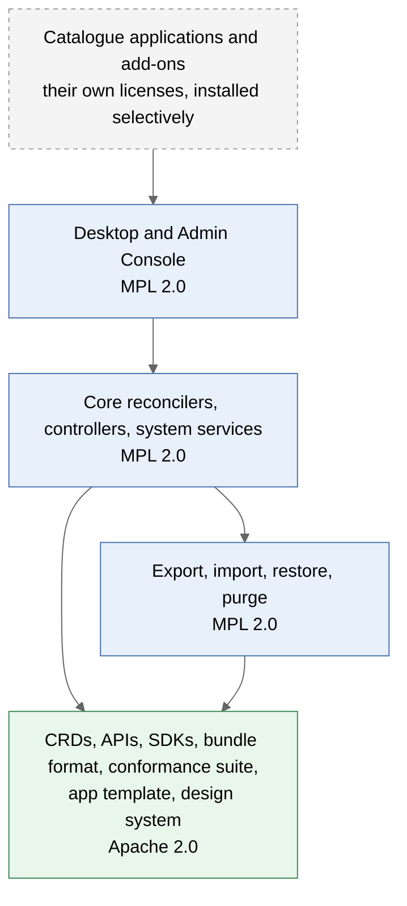
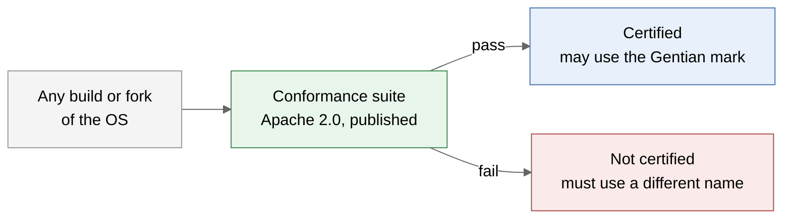
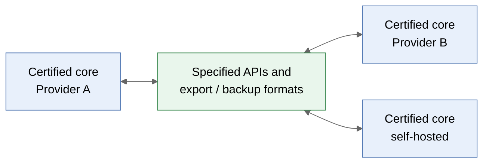

# Gentian OS Licensing

## Objective

Digital sovereignty means that workloads and data run on any conforming Gentian core, so tenants can move wherever they want.

| Goal | Meaning |
|---|---|
| **Portability** | One compatibility standard, with no incompatible variants of the OS |
| **Enterprise adoptability** | Large organisations run the OS internally without a legal exception process |
| **Open core engine** | The OS itself is fully open source |

## License Allocation

| Layer | License | Rationale |
|---|---|---|
| CRDs, APIs, SDKs, the bundle format, the store contract, conformance suite | **Apache 2.0** | The portability contract; anyone can implement and integrate without friction |
| App template, design system | **Apache 2.0** | Made to be copied into other people's apps, open and closed alike |
| Core reconcilers, controllers, system services | **MPL 2.0** | Widely accepted by large enterprises; file-level copyleft keeps distributed modifications visible and mergeable |
| Desktop and Admin Console | **MPL 2.0** | Same as the core they are the face of. Customised through branding and extension points, which are not modifications |
| Exit tooling: export, import, restore, purge | **MPL 2.0** | Part of the core, so tenant mobility never depends on an add-on |
| Catalogue applications | **Upstream licenses** | Not part of the OS; installed selectively by the customer |
| Optional add-ons | **Their own licenses** | Not part of the OS and never required by it; see below |

**Exit is in the core; looking after the data is not.** Taking all of a
tenant's data out, bringing it in elsewhere and destroying what is left are
core functions under the core's license, and the bundle they produce is an
Apache-licensed format readable with standard tools. Backup as a service —
schedules, remote destinations, retention, recovery on a click, converters
from other workspace products — is an add-on that calls those functions. A
tenant can always leave without it.

**Where this stands.** Adopted for this repository: the core is MPL 2.0,
`api/` is Apache 2.0, and [LICENSING.md](../../LICENSING.md) is the map. The
desktop and the Admin Console are MPL 2.0 with their design system and
console kit under Apache 2.0, and the app template is Apache 2.0. Still open
are the items under Open Decisions, and the conformance suite, which does not
exist yet.

## Excluded Licenses

No code the Gentian project writes for the OS carries any of these licenses.

| License | Reason for exclusion |
|---|---|
| AGPLv3 | Banned by default in many large organisations, e.g. Google's public policy (https://opensource.google/docs/using/agpl-policy/) |
| EUPL | Banned on the same Google policy page for the same reasons |
| SSPL | Not open source under the OSI definition |
| BSL / FSL | Source-available, not open source; history of triggering community forks |

**What the OS installs is not yet held to the same list.** One system
service is an exception: MinIO, the default object store, is AGPLv3. It runs
as a separate service behind the S3 API and no Gentian code is derived from
it, but an organisation that bans AGPL software outright will meet it on a
default install. It is to be replaced by an object store under a permissive
license, or made a choice at install time. Catalogue applications keep their
upstream licenses, several of which are AGPLv3; they are installed by choice.

**Optional add-ons may carry other licenses**, including source-available
ones. The rule that binds the OS is that it builds, installs and runs with
none of them present, and that nothing above — the APIs, the formats, exit —
depends on one. A default install may propose an add-on; it never requires it.

## Anti-Fragmentation Mechanisms

No open-source license prevents forks. The trademark, tied to conformance certification, prevents fragmentation instead.

Tenants move freely between certified cores because every certified core implements the same specified APIs and data formats:

| Mechanism | What it prevents |
|---|---|
| **Trademark** | Incompatible forks sold under the Gentian name |
| **Open specification + conformance certification** | Silent API and data-format divergence (Certified Kubernetes model) |
| **MPL 2.0 on the core** | Hidden modifications in builds that are *distributed* — a product, an appliance, a download |
| **Neutral governance** | The usual motives for forking: license changes and loss of trust |

**What the license does not reach.** MPL 2.0 obliges whoever distributes a
modified build to publish the files they changed. A provider that modifies
the core and only *hosts* it distributes nothing, and the license asks
nothing of them. For hosted cores it is certification and the mark that keep
providers compatible: a hosted core that has drifted fails the suite and may
not be called Gentian. The one part of a hosted deployment that is
distributed is the browser code of the desktop and the console, so modified
files there are published.

## Contributions

| Mechanism | Use |
|---|---|
| **DCO** (Developer Certificate of Origin) | Default for all repositories |
| **CLA** | Only if dual licensing is adopted, since it raises the barrier for contributors. MPL 2.0 and Apache 2.0 already allow combination with code under other licenses, so no one needs relicensing rights |

## Open Decisions

| Decision | Options | Trade-off |
|---|---|---|
| Default object store | Replace MinIO / make it an install-time choice | One less service to choose vs. a default install free of AGPLv3 |
| Conformance scope | Minimal API set / APIs plus data formats | Ease of certification vs. strength of the portability guarantee |
