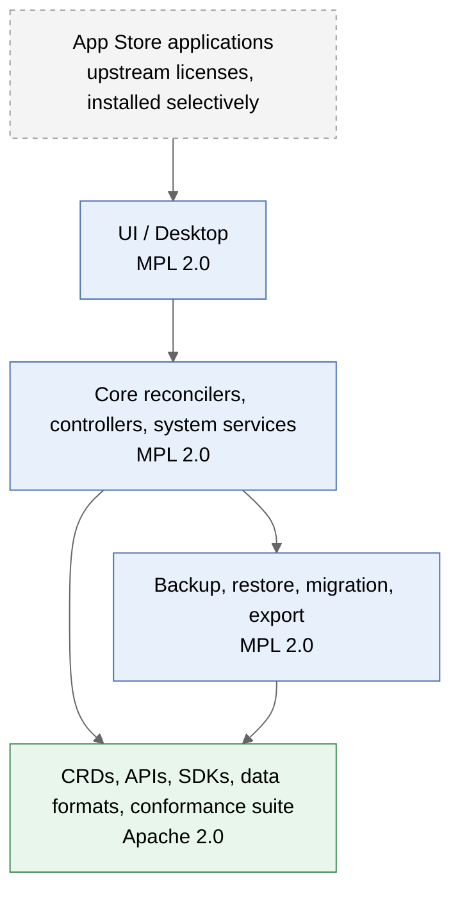
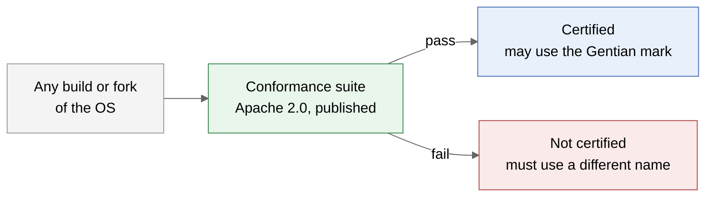
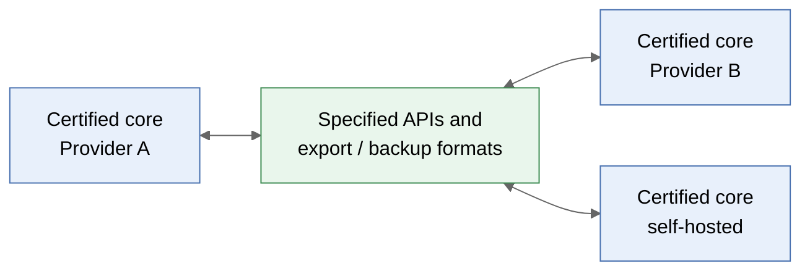

# Gentian OS Licensing Proposal

## Objective

Digital sovereignty means that workloads and data run on any conforming Gentian core, so tenants can move wherever they want.

| Goal | Meaning |
|---|---|
| **Portability** | One compatibility standard, with no incompatible variants of the OS |
| **Enterprise adoptability** | Large organisations run the OS internally without a legal exception process |
| **Open core engine** | The OS itself is fully open source |

## License Allocation

| Layer | License | Rationale |
|---|---|---|
| CRDs, APIs, SDKs, data/backup/export formats, conformance suite | **Apache 2.0** | The portability contract; anyone can implement and integrate without friction |
| Core reconcilers, controllers, system services, UI | **MPL 2.0** | Widely accepted by large enterprises; file-level copyleft keeps distributed modifications visible and mergeable |
| Exit-critical tooling | **MPL 2.0** | Tenant mobility never depends on a commercial component |
| App Store applications | **Upstream licenses** | Not part of the OS; installed selectively by the customer |

## Excluded Licenses

No component that a customer must install carries any of these licenses.

| License | Reason for exclusion |
|---|---|
| AGPLv3 | Banned by default in many large organisations, e.g. Google's public policy (https://opensource.google/docs/using/agpl-policy/) |
| EUPL | Banned on the same Google policy page for the same reasons |
| SSPL | Not open source under the OSI definition |
| BSL / FSL | Source-available, not open source; history of triggering community forks |

## Anti-Fragmentation Mechanisms

No open-source license prevents forks. The trademark, tied to conformance certification, prevents fragmentation instead.

Tenants move freely between certified cores because every certified core implements the same specified APIs and data formats:

| Mechanism | What it prevents |
|---|---|
| **Trademark** | Incompatible forks sold under the Gentian name |
| **Open specification + conformance certification** | Silent API and data-format divergence (Certified Kubernetes model) |
| **MPL 2.0 on the core** | Hidden modifications in distributed builds |
| **Neutral governance** | The usual motives for forking: license changes and loss of trust |

## Commercial Model

Revenue comes from services around open code, not from proprietary licensing of the OS.

| Offering | Value to the customer |
|---|---|
| Certified distribution | Signed artifacts, SBOMs, CVE patch SLAs |
| Curated App Store | Curation, signing, compliance attestation |
| LTS releases | Predictable upgrade cycles |
| Partner support and managed operation | Operational responsibility |

## Contributions

| Mechanism | Use |
|---|---|
| **DCO** (Developer Certificate of Origin) | Default for all repositories |
| **CLA** | Only if dual licensing is adopted, since it raises the barrier for contributors |

## Open Decisions

| Decision | Options | Trade-off |
|---|---|---|
| Core license | MPL 2.0 / Apache 2.0 | Visible modifications vs. maximum acceptance |
| Trademark holder | To be defined | Neutrality vs. commercial control |
| Conformance scope | Minimal API set / APIs plus data formats | Ease of certification vs. strength of the portability guarantee |
