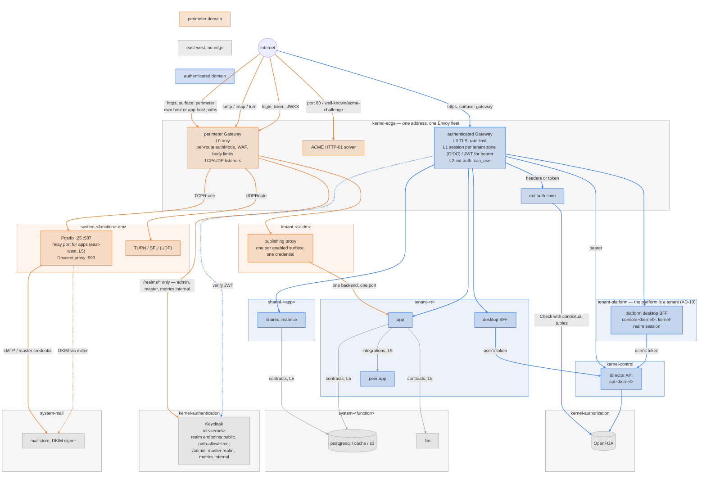

# Networking

How traffic reaches a component, where it is authenticated, and what each
layer may decide. Companion to [roles-and-authorizations.md](roles-and-authorizations.md)
(who) and [namespace-cleanup.md](namespace-cleanup.md) (where); the rules
are AD-1, AD-6 and AD-9 in [architectural-decisions.md](architectural-decisions.md).

## 1. One address, two edges

The cluster has one external address (`networkMode: static-ip`) or one
tunnel (`tunnel`). Every hostname resolves to it. [routing.md](../design/routing.md)
§2.1 records why that forces one Envoy deployment: two Gateway Services
contend for the address and TLS handshakes fail on whichever loses. So the
"two gateways" are two **policy domains** served by one Envoy fleet, not two
fleets:

| Edge | Serves | Policy | Backends |
| --- | --- | --- | --- |
| **Authenticated edge** | every `expose[]` entry with `surface: gateway` | a Keycloak session per tenant zone, JWT for bearer clients, ext-auth for *may this user reach this app* | services in `tenant-<t>`, `shared-<app>`, `kernel-control` |
| **Perimeter edge** | every `surface: perimeter` entry a tenant enabled; non-HTTP listeners | no session; the entry's `authMode`; rate limit, body limits, WAF rules | publishing proxies in `tenant-<t>-dmz`; system edges in `system-<function>-dmz` |

In Gateway API terms: two `Gateway` objects, `authenticated` and
`perimeter`, both in `kernel-edge`, with Envoy Gateway's `mergeGateways`
so they share the one deployment and address. Listeners must not collide,
which gives the split its shape:

- **Perimeter surfaces on their own hostname or port** — Matrix federation
  on `:8448`, a public website on the tenant's vanity apex, SMTP and IMAP
  as `TCPRoute`s, TURN as a `UDPRoute` — are listeners on the `perimeter`
  Gateway. Cleanly separate: their own policies, their own rate-limit
  budgets, no session code in the path.
- **Perimeter surfaces on the app's own hostname** — Nextcloud's `/s/*`
  share links, `/remote.php/dav/*`, `/.well-known/*` — cannot leave that
  hostname, because the app mints the URLs. They are `HTTPRoute`s in
  `tenant-<t>-dmz` attached to the tenant's listener on the `authenticated`
  Gateway with a `ReferenceGrant`, carrying their own `SecurityPolicy`
  (no OIDC) and winning by path precedence. The route's *backend* is still
  the DMZ proxy, never the app, so the DMZ namespace remains the only thing
  that receives anonymous traffic.

The first kind is a genuine second edge. The second kind is a second policy
on the first edge, which is as far as the split can go while share links
keep working. The compromise this leaves — one Envoy process serving both —
is bounded by Envoy's own model: a policy attaches to a route, and the
route to a DMZ proxy has no session, no ext-auth and no reach beyond one
backend.

Tunnel mode changes nothing above: cloudflared publishes hostnames to the
same Envoy Service. Vanity domains (custom `Tenant.spec.domain`) add
listeners to the same Gateways with per-host certificates; see §6.

## 2. Layers

Each layer answers one question and is enforced by one component. A
request passes them top to bottom; a lower layer never re-answers a
higher one.

| # | Layer | Question | Enforced by | Identity it sees |
| --- | --- | --- | --- | --- |
| L0 | TLS, DNS, rate limit | is this traffic well-formed and within budget? | Envoy listener, `BackendTrafficPolicy` | none |
| L1 | Edge session | who is this, in which realm? | Envoy `SecurityPolicy.oidc` (one confidential client per tenant zone in that tenant's realm; the kernel realm for `console.<kernel>`) and `SecurityPolicy.jwt` for bearer clients | Keycloak token: `sub`, realm, groups |
| L2 | Reachability | may this person reach this component at all? | ext-auth shim → OpenFGA `can_use` on `app`, with the token's groups as contextual tuples; cached per `(sub, route)` for the session | the same token |
| L3 | App session and authorization | what may they do inside? | the app: its own OIDC login (silent, SSO), its own session cookie, its own model from the token's groups | the app's own session |
| L4 | Delegated access | may this agent or peer act, and for whom? | MCP gateway and contract bindings: RFC 8693 exchanged tokens carrying `act`; per-tenant contract credentials | agent identity + delegating human |
| L5 | Network | may these two pods talk at all? | NetworkPolicy derived from `requires` and `integrations`; Kyverno | ServiceAccount, namespace labels |

Two things follow. **The edge decides reachability, the app decides
everything finer** — the gateway never asks "may Alice edit document 4711",
so its OpenFGA load scales with logins × apps, not with requests. And **a
perimeter route skips L1–L2 by declaration**: its `authMode` is the whole
of its authentication, which is why the field is mandatory and `none` is a
word someone wrote.

## 3. Route classes

| Class | Hostname | `authMode` | L1 | L2 | Backend |
| --- | --- | --- | --- | --- | --- |
| Tenant app, browser | `<app>.<t>.<kernel>` or vanity | `oidc` | tenant-realm session | `can_use` | app in `tenant-<t>` |
| Tenant app, API | same host, API paths, or an `api.` host | `bearer` / `jwt` | JWT verified, no redirect | `can_use` | app |
| Tenant desktop | `desktop.<t>.<kernel>` or vanity | `oidc` | tenant-realm session | `can_enter` on `tenant:<t>` — members and admins both reach the desktop; which tiles they see is `can_launch` per app, answered by the director | desktop BFF in `tenant-<t>` |
| Shared app | `<app>.<t>.<kernel>` per granted tenant | `oidc` | tenant-realm session | `can_use` via the tenant's grant | instance in `shared-<app>` |
| Platform desktop (console) | `console.<kernel>` | `oidc` | **kernel**-realm session | `can_enter` on `tenant:platform` | desktop BFF in `tenant-platform` (AD-10) — a tenant desktop whose realm is the kernel realm |
| Director API | `api.<kernel>` | `bearer` | JWT, any realm; the director verifies again | its own OpenFGA check | director |
| Kernel UI | `argocd.<kernel>`, `headlamp.<kernel>`, Keycloak `/admin/*` on `id-admin.<kernel>` | `oidc` | **kernel**-realm session | `can_configure`, or `can_audit` for read-only tools | the tool in its `kernel-*` namespace. "Hidden" means behind a session with a platform role, not an internal hostname: the tool's own login is the second factor, not the first |
| Identity provider | `id.<kernel>` | `none` — it *is* the issuer; a kernel-owned perimeter surface on the `perimeter` Gateway with a **path allowlist**: `/realms/<r>/protocol/openid-connect/*`, `/realms/<r>/login-actions/*`, theme assets. `/admin/*`, the `master` realm, metrics and health are served on an internal hostname only (roadmap 1.6) | — | — | Keycloak in `kernel-authentication`; brute-force detection per realm, per-IP and per-username rate limits, body limits at L0 |
| Perimeter, HTTP | app host (paths) or own host | per entry | — | — | proxy in `tenant-<t>-dmz` |
| Perimeter, TCP/UDP | own port | protocol-native | — | — | `system-mail-dmz` (edge MTA, Dovecot proxy), `system-turn` |
| ACME HTTP-01 | any host, `/.well-known/acme-challenge/*`, port 80 | `none` | — | — | cert-manager solver in `kernel-edge`; with the realm endpoints, one of exactly two kernel-owned perimeter surfaces |

Nothing is routable without a class. A hostname with no `expose[]` entry
behind it returns 404 at the listener.

## 4. Sessions, caching, logout

- **One edge session per tenant zone**, cookie on `.<t>.<kernel>` (or the
  vanity zone), established by the code flow against `id.<kernel>` and
  silent whenever the Keycloak SSO session exists. Its lifetime is the
  shorter one; app sessions may live longer and it does not matter, because
  no request reaches an app without passing L1.
- **L2 caches its decision** per `(token, route)` — keyed on the token's
  `jti`, not only on `sub` — for min(token lifetime, a few minutes). Load on
  OpenFGA is logins × apps. A new token is a cache miss by construction, so
  a refresh that carries different groups is re-evaluated; where a
  structural change (a grant deleted) must be immediate, the shim subscribes
  to OpenFGA's changes stream and evicts.
- **Logout is one back-channel client per zone.** Keycloak's logout token
  reaches the `authenticated` Gateway's client for that zone; the session
  dies; every app in the zone becomes unreachable whatever its own cookie
  says. Which of thirty apps implement back-channel logout stops mattering.
  Refresh tokens are session-bound and die with it; offline tokens are
  disabled, because they would survive it.
- **Rights live in the token, so a rights change mints a new token.**
  Membership arrives as contextual tuples (AD-12), which means a grant or
  revocation is invisible until Keycloak issues a token that reflects it.
  The rule: **a membership change revokes the user's Keycloak sessions.**
  The operator, on applying a group change, calls the admin API's logout for
  that user; back-channel logout ends every edge session; the next request
  is a silent re-login with the new groups. A removed administrator loses
  the role within one request, not one token lifetime. Grants ride the same
  path, or the next refresh — Keycloak recomputes the groups claim at every
  issuance. The hard bound is the access-token lifetime, which is why it
  stays short (five minutes) regardless of how long the session may live.
- **Fail closed, cached allows carry.** If OpenFGA is unreachable, decisions
  already cached stay valid until they expire; new logins wait. Nothing not
  previously allowed gets through.
- **WebSockets** are authorised at upgrade only. A `BackendTrafficPolicy`
  caps connection duration so a revoked session does not keep a live
  socket for hours.

## 5. Stress test

Each scenario: the path it takes, the layer that decides, and what the
design cannot do for it.

| Scenario | Path | Decides | Limit |
| --- | --- | --- | --- |
| **Share a document with a colleague in the same tenant** | authenticated edge, `oidc`; the app's own ACL | L1–L2 the person, L3 the document | none |
| **Share with someone in another tenant** | the other person cannot get a session in this zone: different realm. Either a *public link* (below) or *federation* between the two instances — Nextcloud federated shares over OCS, a perimeter surface with `authMode: signature`, one proxy in each tenant's DMZ | L3 on both sides, via the two apps' federation trust | no cross-tenant session; cross-tenant is always perimeter-to-perimeter, which is the tenant boundary doing its job |
| **Public share link** | `/s/<token>` on the app host → DMZ proxy (`none`) → app | the app: the token in the URL is the capability | the edge cannot make a capability URL identified; it can throttle, log, size-limit and refuse malformed requests |
| **Password-protected share** | same path; the password prompt is the app's | the app | same |
| **Public WebDAV of a share** | `/public.php/webdav` → DMZ (`none`) | the app | same |
| **Desktop and mobile sync, calendars, contacts** | `/remote.php/dav/*` → DMZ (`basic`) with an app password from the broker; the proxy validates before forwarding | the broker issued the credential; the app scopes it | a bearer secret outside the session model; expiry and revocation through the broker are its only controls |
| **Conference call, members only** (Talk, Element Call, Jitsi) | signalling: the app host over the authenticated edge, WebSocket upgrade under L1–L2. Media: WebRTC over UDP to TURN/SFU in `system-turn` — a DMZ-tier service with its own `UDPRoute`, TURN credentials minted per session with a short HMAC lifetime | L1–L2 for signalling; the app for who is in the room; TURN checks only the time-limited credential | media never passes the gateway; TURN is all edge and holds no data, so its only defence is the credential's lifetime and the app's room membership |
| **Conference call with an external guest** | a guest link is a perimeter surface (`none`) for the app's guest signalling paths; the app issues a guest identity for that room; TURN as above | the app: room, guest name, host approval | the guest is unidentified to the platform by design; rate limits and the app's lobby are the controls |
| **Matrix federation** | `matrix.<t>.<kernel>:8448` on the `perimeter` Gateway, `authMode: signature`; `/.well-known/matrix/*` on the app host as a DMZ path (`none`) | Synapse verifies the peer server's signature | federation is a trust decision inside the app; the edge only rate-limits |
| **Inbound webhook** (payment provider, git host) | a perimeter path with `authMode: signature`; the proxy verifies the HMAC before the app sees the body | the proxy, then the app | replay protection is the app's unless the proxy keeps nonces |
| **Automation or agent calling an app API** | `authMode: bearer` on the authenticated edge: JWT verified, no redirect; ext-auth `can_use`; the token is an exchanged one carrying `act` | L2 for reach, L4 for the ceiling | none new |
| **Agent using tools over MCP** | the MCP gateway, itself an authenticated-edge route with `bearer` | L4 per tool call | none new |
| **Tenant admin in the console** | `desktop.<t>.<kernel>` → desktop BFF → director with the user's token | L1 the session, the director its own check | the BFF is a relay; it decides nothing |
| **Platform admin** | `console.<kernel>` → the platform tenant's desktop BFF in `tenant-platform`, kernel-realm session; writes through the director | same | kernel and tenant realms are different sessions by design; a platform admin acting inside a tenant does so through the director, never through that tenant's zone |
| **App-to-app inside a tenant** (Nextcloud ↔ Collabora, OpenProject ↔ Nextcloud) | never through the edge: Service-to-Service under NetworkPolicy from `integrations`, credentials from the binding | L5 and the binding | none |
| **App to system service** (database, S3, LLM) | Service-to-Service on the contract port | L5; the granted credential | none |
| **Outbound mail from an app** | app → Postfix in `system-mail-dmz` on the relay port; DKIM signed by the milter in `system-mail` (keys stay there); out on `:25` | the tenant's SMTP credential from the requirement | outbound reputation is shared per cluster address |
| **Inbound mail** | `:25` `TCPRoute` → Postfix in `system-mail-dmz` (spam filter, policy) → LMTP to the Dovecot store in `system-mail` | Postfix | a Postfix CVE lands on an MTA with no mailboxes and no keys |
| **User's external mail client** | only if the tenant enabled the surface: IMAP `:993` → Dovecot proxy, submission `:587` → Postfix, both in `system-mail-dmz`, verifying the broker's credential and relaying inward with one master credential | the broker's per-user credential, checked at the edge | not HTTP: no L1–L2; default off — webmail apps reach Dovecot internally over the contract, and most tenants never need the public ports |
| **Vanity domain, direct link** | `cloud.example.org`, its own listener and certificate; its own edge session, silent via `id.<kernel>` | L1–L2 as usual | one extra silent redirect per host |
| **Vanity domain, embedded in the desktop** | works only if the desktop is on the same site — `desktop.example.org` — because the edge cookie is per site | same | a desktop on `<kernel>` cannot embed an app on `example.org` (third-party cookie); serve the desktop on the vanity host |
| **Logout from the desktop** | RP-initiated logout at Keycloak → back-channel to the zone's edge client → session gone | L1 | app cookies live on, unreachable |
| **Renewing a certificate** | `/.well-known/acme-challenge/*` on port 80 to the solver | none | the only perimeter path the kernel owns; listed so it is never "forgotten" |

## 6. What the stress test found

- **The two-gateway picture is two policies on one process** wherever a
  perimeter path shares the app's hostname. Real process separation exists
  only for perimeter surfaces on their own hostname or port. Worth stating
  plainly rather than drawing two boxes.
- **Real-time media is outside the model.** WebRTC goes to TURN or an SFU
  over UDP; no gateway sees it. The controls are short-lived TURN
  credentials and the app's room membership. `system-turn` (coturn, or
  LiveKit for Element Call) is all edge: it holds no data, so it lives
  entirely in the DMZ tier, the way the mail edge does in `system-mail-dmz`.
  AD-9 has no exception list; a system service with an internet protocol has
  a DMZ namespace instead.
- **Cross-tenant collaboration is federation or public links, never a
  shared session.** That is correct, and it means the catalogue should say
  which apps federate (Nextcloud, Matrix) and which only share by link.
- **Group claims size the edge cookie.** With memberships as contextual
  tuples, the edge session's token must carry groups, and Envoy stores the
  session in cookies. A user in many `gentian:tenant:<t>:app:*` groups can
  exceed header limits. Mitigation: the edge client's scope maps only the
  `gentian:` groups for that realm; if that is not enough, the shim
  resolves groups from Keycloak by `sub` and caches them, and the cookie
  carries the id token only. Decide before wave 1 of the gap plan.
- **Bearer routes and browser routes on one hostname need one policy each.**
  A `SecurityPolicy` attaches per `HTTPRoute`, so an app's API paths are a
  separate route from its browser paths — which the profile already
  expresses as two `expose[]` entries with different `authMode`s.
- **The issuer is the kernel's largest public surface, and it cannot be
  otherwise.** Browsers authenticate by redirect, so `/realms/*` is public
  by the nature of OIDC — the same for every identity provider. What is
  avoidable is exposing the rest of Keycloak: `/admin/*`, the `master`
  realm, metrics and health go on an internal hostname, and the public
  route is a path allowlist. With the ACME path these are the only
  kernel-owned `authMode: none` entries, and both carry L0 controls:
  brute-force detection per realm, per-IP and per-username rate limits, a
  tight limit on the ACME path. A closed enterprise tenant can go further by
  requiring client certificates on `/realms/<t>/*` — a per-realm policy that
  does not touch public tenants. Passkeys for administrators remove the
  password from the most-attacked form on the platform.
- **App-issued credentials remain the weakest link** — app passwords for
  DAV and IMAP, TURN credentials, share tokens. Their lifetime is their only
  control. The broker's job is to make issuance, listing and revocation
  first-class; the edge's job is to make sure nothing else is reachable
  without a session.

## 7. What this changes in the tree

- One `Gateway` becomes two (`authenticated`, `perimeter`) in `kernel-edge`
  under `mergeGateways`; tenant listeners stay per-zone wildcards.
- `expose[]` in the profile ([component-profile.md](component-profile.md)
  §5) is the single source for every `HTTPRoute`, `TCPRoute`, `UDPRoute`
  and `SecurityPolicy`; `browserProxy` and `additionalIngresses` retire
  into it.
- The gateway reconciler emits, per `surface: gateway` entry, an
  `HTTPRoute` in the instance's namespace plus a `SecurityPolicy` for its
  `authMode`; per enabled `surface: perimeter` entry, an `HTTPRoute` in
  `tenant-<t>-dmz` targeting the proxy.
- The ext-auth shim is the new enforcement point of
  [security-gap-closing.md](security-gap-closing.md) G3; the per-zone edge
  OIDC clients are created by the operator alongside the app clients it
  already provisions, each with a back-channel logout URI.
- Mail splits into `system-mail` (Dovecot store, DKIM signer with the keys)
  and `system-mail-dmz` (the one Postfix, spam filter, and a Dovecot proxy
  only while IMAP exposure is enabled). Postfix stays a single instance;
  DKIM moves from the MTA to a milter inside. `system-turn` is added when
  the first conferencing profile declares it as a requirement.
