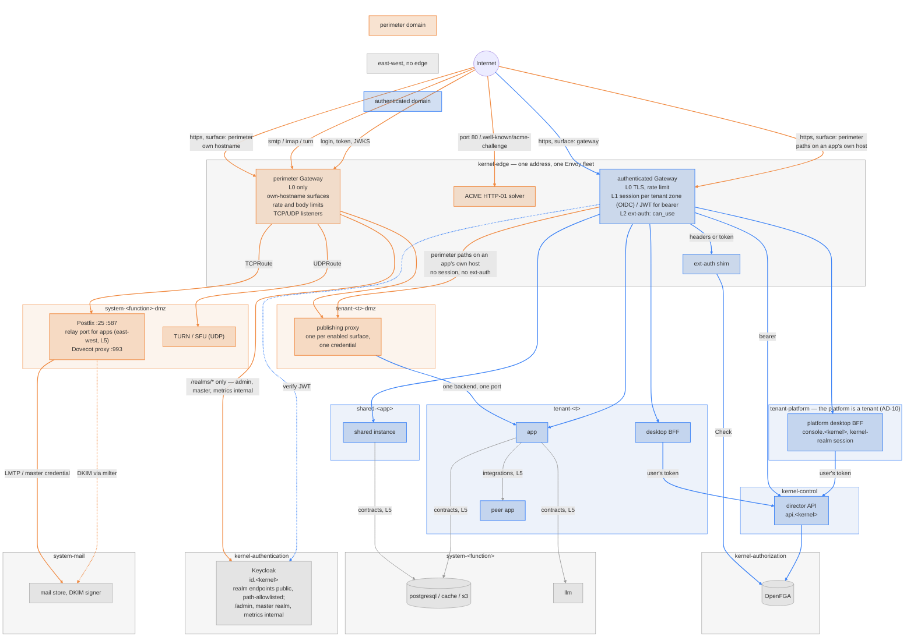

# Networking

How traffic reaches a component, where it is authenticated, and what each
layer may decide. Companion to [roles-and-authorizations.md](roles-and-authorizations.md)
(who) and [namespace-cleanup.md](namespace-cleanup.md) (where); the rules
are AD-1, AD-6 and AD-9 in [architectural-decisions.md](architectural-decisions.md).

## 1. One address, two edges

The cluster has one external address (`networkMode: static-ip`) or one
tunnel (`tunnel`). Every hostname resolves to it. [routing.md](../design/routing.md)
§2.1 records why that forces one Envoy deployment: two Gateway Services
contend for the address and TLS handshakes fail on whichever loses. So the
"two gateways" are two **policy domains** served by one Envoy fleet, not two
fleets:

| Edge | Serves | Policy | Backends |
| --- | --- | --- | --- |
| **Authenticated edge** | every `expose[]` entry with `surface: gateway` | a Keycloak session per tenant zone, JWT for bearer clients, ext-auth for *may this user reach this app* | services in `tenant-<t>`, `shared-<app>`, `kernel-control` |
| **Perimeter edge** | perimeter entries on **their own hostname**, and the non-HTTP listeners. Perimeter *paths on an app's own host* stay on the authenticated edge, because a hostname is served by one Gateway | no session; the entry's `authMode`; rate limit and body limits at the listener. The WAF is not here: it runs in the publishing-proxy image, which is the one component both kinds of perimeter entry pass through | publishing proxies in `tenant-<t>-dmz`; system edges in `system-<function>-dmz` |

In Gateway API terms: two `Gateway` objects, `authenticated` and
`perimeter`, both in `kernel-edge`, with Envoy Gateway's `mergeGateways`
so they share the one deployment and address. Listeners must not collide,
which gives the split its shape:

- **Perimeter surfaces on their own hostname or port** — Matrix federation
  on `:8448`, a public website on the tenant's vanity apex, SMTP and IMAP
  as `TCPRoute`s, TURN as a `UDPRoute` — are listeners on the `perimeter`
  Gateway. Cleanly separate: their own policies, their own rate-limit
  budgets, no session code in the path.
- **Perimeter surfaces on the app's own hostname** — Nextcloud's `/s/*`
  share links, `/remote.php/dav/*`, `/.well-known/*` — cannot leave that
  hostname, because the app mints the URLs. A hostname is served by exactly
  one Gateway — under `mergeGateways` listener uniqueness is class-wide — so
  these stay on the **`authenticated` Gateway**, where the rest of that
  hostname already lives. They are `HTTPRoute`s in `tenant-<t>-dmz` admitted
  by the tenant listener's `allowedRoutes.namespaces.selector`, which selects
  both `tenant-<t>` and `tenant-<t>-dmz`. (Not a `ReferenceGrant`: that
  governs cross-namespace backend and secret references, not route
  attachment, and here route and backend share a namespace anyway.) Each
  carries its own `SecurityPolicy` with no `oidc` block, which replaces the
  listener's rather than merging with it, and wins by path precedence. The
  route's *backend* is still the DMZ proxy, never the app, so the DMZ
  namespace remains the only thing that receives anonymous traffic.

  The consequence to hold on to: the `perimeter` Gateway serves surfaces on
  **their own hostname** and the non-HTTP listeners, nothing else. An
  app-host perimeter path never touches it, which is why the WAF belongs in
  the DMZ proxy image (§7) and not on a Gateway.

The first kind is a genuine second edge. The second kind is a second policy
on the first edge, which is as far as the split can go while share links
keep working. The compromise this leaves — one Envoy process serving both —
is bounded by Envoy's own model: a policy attaches to a route, and the
route to a DMZ proxy has no session, no ext-auth and no reach beyond one
backend.

Tunnel mode changes almost nothing above: cloudflared publishes hostnames to
the same Envoy Service. The exception is the non-HTTP perimeter — inbound
mail on `:25`/`:587`, IMAP on `:993`, Matrix federation on `:8448` and TURN's
UDP — which a tunnel cannot publish, because it carries HTTP origins and the
senders are external MTAs and WebRTC clients that will never run a tunnel
client. Those surfaces need `networkMode: static-ip`, and the director
refuses their enablement in tunnel mode rather than creating a listener
nothing can reach. Vanity domains (custom `Tenant.spec.domain`) add
listeners to the same Gateways with per-host certificates; see §6.

## 2. Layers

Each layer answers one question and is enforced by one component. A
request passes them top to bottom; a lower layer never re-answers a
higher one.

| # | Layer | Question | Enforced by | Identity it sees |
| --- | --- | --- | --- | --- |
| L0 | TLS, DNS, rate limit | is this traffic well-formed and within budget? | Envoy listener, `BackendTrafficPolicy` | none |
| L1 | Edge session | who is this, in which realm? | Envoy `SecurityPolicy.oidc` (one confidential client per tenant zone in that tenant's realm; the kernel realm for `console.<kernel>`) and `SecurityPolicy.jwt` for bearer clients | Keycloak token: `sub`, realm, groups |
| L1′ | Perimeter authentication | is this credential, signature or source valid? | the **publishing proxy** in the DMZ — a named enforcement point (principle 3): `none`, `basic` and `signature` are verified here and nowhere else. It strips every inbound identity header before forwarding and sets only its own, which is what lets the app trust one at all | the entry's `authMode` credential, or none |
| L2 | Reachability | may this person reach this component at all? | ext-auth shim → OpenFGA `can_use` on `app` over the stored membership projection (AD-12); cached per `(sub, sid, route)`; a token whose `sid` the shim has seen revoked is denied here | the same token |
| L3 | App session and authorization | what may they do inside? | the app: the forwarded token where it can consume one, otherwise its own silent SSO login and its own cookie, capped by the profile's `sessionMaxAge` | the forwarded token, or the app's own session |
| L4 | Delegated access | may this agent or peer act, and for whom? | MCP gateway and contract bindings: RFC 8693 exchanged tokens carrying `act`; per-tenant contract credentials | agent identity + delegating human |
| L5 | Network | may these two pods talk at all? | NetworkPolicy derived from `requires` and `integrations`; Kyverno | ServiceAccount, namespace labels |

Two things follow. **The edge decides reachability, the app decides
everything finer** — the gateway never asks "may Alice edit document 4711",
so its OpenFGA load scales with logins × apps, not with requests. And **a
perimeter route skips L1–L2 by declaration**: its `authMode` is the whole
of its authentication, which is why the field is mandatory and `none` is a
word someone wrote.

## 3. Route classes

| Class | Hostname | `authMode` | L1 | L2 | Backend |
| --- | --- | --- | --- | --- | --- |
| Tenant app, browser | `<app>.<t>.<kernel>` or vanity | `oidc` | tenant-realm session | `can_use` — the app's own entitlement group, the same relation the desktop's tiles resolve, so the route cannot be more open than the tile | app in `tenant-<t>` |
| Tenant app, API | same host, API paths, or an `api.` host | `bearer` / `jwt` | JWT verified, no redirect | `can_use` | app |
| Tenant desktop | `desktop.<t>.<kernel>` or vanity | `oidc` | tenant-realm session | `can_enter` on `tenant:<t>` — members and admins both reach the desktop; which tiles they see is `can_launch` per app, answered by the director | desktop BFF in `tenant-<t>` |
| Shared app | `<app>.<t>.<kernel>` per granted tenant | `oidc` | tenant-realm session | `can_use` via the tenant's grant | instance in `shared-<app>` |
| Platform desktop (console) | `console.<kernel>` | `oidc` | **kernel**-realm session | `can_enter` on `tenant:platform` | desktop BFF in `tenant-platform` (AD-10) — a tenant desktop whose realm is the kernel realm |
| Director API | `api.<kernel>` | `bearer` | JWT, any realm; the director verifies again | its own OpenFGA check | director |
| Kernel UI | `argocd.<kernel>`, `headlamp.<kernel>`, Keycloak `/admin/*` on `id-admin.<kernel>` | `oidc` | **kernel**-realm session | `can_configure`, or `can_audit` for read-only tools | the tool in its `kernel-*` namespace. "Hidden" means behind a session with a platform role, not an internal hostname: the tool's own login is the second factor, not the first |
| Identity provider | `id.<kernel>` | `none` — it *is* the issuer; a kernel-owned perimeter surface on the `perimeter` Gateway with a **path allowlist**: `/realms/<r>/protocol/openid-connect/*`, `/realms/<r>/login-actions/*`, theme assets. `/admin/*`, the `master` realm, metrics and health are served on an internal hostname only (roadmap 1.6) | — | — | Keycloak in `kernel-authentication`; brute-force detection per realm, per-IP and per-username rate limits, body limits at L0 |
| Perimeter, HTTP | app host (paths) or own host | per entry | — | — | proxy in `tenant-<t>-dmz` |
| Perimeter, TCP/UDP | own port | protocol-native | — | — | `system-mail-dmz` (edge MTA, Dovecot proxy), `system-turn` |
| ACME HTTP-01 | any host, `/.well-known/acme-challenge/*`, port 80 | `none` | — | — | cert-manager solver in `kernel-edge`; with the realm endpoints, one of exactly two kernel-owned perimeter surfaces |

Nothing is routable without a class. A hostname with no `expose[]` entry
behind it returns 404 at the listener.

## 4. Sessions, caching, logout

- **The edge is the only session authority** (AD-13). One confidential client per
  tenant zone, one cookie on `.<t>.<kernel>` (or the vanity zone),
  established by the code flow against `id.<kernel>` and silent whenever the
  Keycloak SSO session exists. Everything downstream consumes the forwarded
  token; nothing downstream runs a code flow of its own. The desktop BFF in
  particular holds no OIDC client secret: a second confidential client in the
  same realm is a second session with its own lifetime and its own logout,
  and in `tenant-platform` it would put a kernel-realm client secret inside a
  tenant namespace ([ui-restructure.md](ui-restructure.md) §1).
- **L2 caches its decision** per `(sub, sid, route)` — the session, not the
  token. Keying on `jti` would make every refresh a cache miss, so load would
  scale with refreshes rather than logins, and no entry could be evicted for a
  session nothing can name. Load on OpenFGA is logins × apps. Eviction, not
  expiry, is what makes a change visible: the shim polls OpenFGA's
  `ReadChanges` changelog on an interval and evicts by subject. OpenFGA has no
  push stream, so that interval is the stated bound on how long a revoked
  right survives.
- **Logout is a revocation list on the shim.** Envoy Gateway's OIDC filter
  implements only the local `logoutPath`: there is no back-channel endpoint,
  and the edge session is a signed cookie in the browser, so there is no
  server-side session for a logout token to end. The shim is the only
  component in every request path, so it is where revocation lives. Keycloak's
  back-channel logout URI for each zone client points at the shim; the shim
  records the revoked `sid` for the remainder of the token lifetime and denies
  it at L2. Every app in the zone becomes unreachable whatever its own cookie
  says, and which of thirty apps implement back-channel logout stops
  mattering. Refresh tokens are session-bound and die with the Keycloak
  session; offline tokens are disabled, because they would survive it.
- **Platform rights follow the store; app rights follow the token.**
  Membership reaches OpenFGA from Keycloak's events through the director
  sub-second on the normal path, and within one rolling sweep in the worst
  case (AD-12; the bound is in authorization-model.md §2), and the shim evicts its cached decisions on the
  `ReadChanges` poll, so a revoked platform right is gone within one poll
  interval without any token being touched. Apps, however, read groups from
  their own tokens, so for *their* rights the rule stays: **a membership
  change revokes the user's Keycloak sessions.** The operator, on applying
  a group change, calls the admin API's logout for that user; the back-channel
  logout reaches the shim, which denies the revoked `sid` at L2; the next
  request is a silent re-login with the new groups. The hard bound for
  app-level rights is the **app's own session**, not the access token: L1
  governs whether a request arrives, and does not refresh the group model an
  app captured at its own login. The access token stays short (five minutes)
  so that re-login is frequent, and a profile whose app keeps its own session
  declares `sessionMaxAge` so the bound is a number someone chose.
- **Fail closed, cached allows carry.** If OpenFGA is unreachable, decisions
  already cached stay valid until they expire; new logins wait. Nothing not
  previously allowed gets through.
- **WebSockets** are authorised at upgrade only. A `BackendTrafficPolicy`
  caps connection duration so a revoked session does not keep a live
  socket for hours.

## 5. Stress test

Each scenario: the path it takes, the layer that decides, and what the
design cannot do for it.

| Scenario | Path | Decides | Limit |
| --- | --- | --- | --- |
| **Share a document with a colleague in the same tenant** | authenticated edge, `oidc`; the app's own ACL | L1–L2 the person, L3 the document | none |
| **Share with someone in another tenant** | the other person cannot get a session in this zone: different realm. Either a *public link* (below) or *federation* between the two instances — Nextcloud federated shares over OCS, a perimeter surface with `authMode: signature`, one proxy in each tenant's DMZ | L3 on both sides, via the two apps' federation trust | no cross-tenant session; cross-tenant is always perimeter-to-perimeter, which is the tenant boundary doing its job |
| **Public share link** | `/s/<token>` on the app host → DMZ proxy (`none`) → app | the app: the token in the URL is the capability | the edge cannot make a capability URL identified; it can throttle, log, size-limit and refuse malformed requests |
| **Password-protected share** | same path; the password prompt is the app's | the app | same |
| **Public WebDAV of a share** | `/public.php/webdav` → DMZ (`none`) | the app | same |
| **Desktop and mobile sync, calendars, contacts** | `/remote.php/dav/*` → DMZ (`basic`) with an app password from the broker; the proxy validates before forwarding | the broker issued the credential; the app scopes it | a bearer secret outside the session model; expiry and revocation through the broker are its only controls |
| **Conference call, members only** (Talk, Element Call, Jitsi) | signalling: the app host over the authenticated edge, WebSocket upgrade under L1–L2. Media: WebRTC over UDP to TURN/SFU in `system-turn` — a DMZ-tier service with its own `UDPRoute`, TURN credentials minted per session with a short HMAC lifetime | L1–L2 for signalling; the app for who is in the room; TURN checks only the time-limited credential | media never passes the gateway; TURN is all edge and holds no data, so its only defence is the credential's lifetime and the app's room membership |
| **Conference call with an external guest** | a guest link is a perimeter surface (`none`) for the app's guest signalling paths; the app issues a guest identity for that room; TURN as above | the app: room, guest name, host approval | the guest is unidentified to the platform by design; rate limits and the app's lobby are the controls |
| **Matrix federation** | `matrix.<t>.<kernel>:8448` on the `perimeter` Gateway, `authMode: signature`; `/.well-known/matrix/*` on the app host as a DMZ path (`none`) | Synapse verifies the peer server's signature | federation is a trust decision inside the app; the edge only rate-limits |
| **Inbound webhook** (payment provider, git host) | a perimeter path with `authMode: signature`; the proxy verifies the HMAC before the app sees the body | the proxy, then the app | replay protection is the app's unless the proxy keeps nonces |
| **Automation or agent calling an app API** | `authMode: bearer` on the authenticated edge: JWT verified, no redirect; ext-auth `can_use`; the token is an exchanged one carrying `act` | L2 for reach, L4 for the ceiling | none new |
| **Agent using tools over MCP** | the MCP gateway, itself an authenticated-edge route with `bearer` | L4 per tool call | none new |
| **Tenant admin in the console** | `desktop.<t>.<kernel>` → desktop BFF → director with the user's token | L1 the session, the director its own check | the BFF is a relay; it decides nothing |
| **Platform admin** | `console.<kernel>` → the platform tenant's desktop BFF in `tenant-platform`, kernel-realm session; writes through the director | same | kernel and tenant realms are different sessions by design; a platform admin acting inside a tenant does so through the director, never through that tenant's zone |
| **App-to-app inside a tenant** (Nextcloud ↔ Collabora, OpenProject ↔ Nextcloud) | never through the edge: Service-to-Service under NetworkPolicy from `integrations`, credentials from the binding | L5 and the binding | none |
| **App to system service** (database, S3, LLM) | Service-to-Service on the contract port | L5; the granted credential | none |
| **Outbound mail from an app** | app → Postfix in `system-mail-dmz` on the relay port; DKIM signed by the milter in `system-mail` (keys stay there); out on `:25` | the tenant's SMTP credential from the requirement | outbound reputation is shared per cluster address |
| **Inbound mail** | `:25` `TCPRoute` → Postfix in `system-mail-dmz` (spam filter, policy) → LMTP to the Dovecot store in `system-mail` | Postfix | a Postfix CVE lands on an MTA with no mailboxes and no keys |
| **User's external mail client** | only if a perimeter approver enabled the surface: IMAP `:993` → Dovecot proxy, submission `:587` → Postfix, both in `system-mail-dmz`, verifying the broker's credential and relaying inward with one master credential | the broker's per-user credential, checked at the edge | not HTTP: no L1–L2; default off — webmail apps reach Dovecot internally over the contract, and most tenants never need the public ports |
| **Vanity domain, direct link** | `cloud.example.org`, its own listener and certificate; its own edge session, silent via `id.<kernel>` | L1–L2 as usual | one extra silent redirect per host |
| **Vanity domain, embedded in the desktop** | works only if the desktop is on the same site — `desktop.example.org` — because the edge cookie is per site | same | a desktop on `<kernel>` cannot embed an app on `example.org` (third-party cookie); serve the desktop on the vanity host |
| **Logout from the desktop** | RP-initiated logout at Keycloak → back-channel to the zone's edge client → session gone | L1 | app cookies live on, unreachable |
| **Renewing a certificate** | `/.well-known/acme-challenge/*` on port 80 to the solver | none | the only perimeter path the kernel owns; listed so it is never "forgotten" |

## 6. What the stress test found

- **The two-gateway picture is two policies on one process** wherever a
  perimeter path shares the app's hostname. Real process separation exists
  only for perimeter surfaces on their own hostname or port. Worth stating
  plainly rather than drawing two boxes.
- **Real-time media is outside the model.** WebRTC goes to TURN or an SFU
  over UDP; no gateway sees it. The controls are short-lived TURN
  credentials and the app's room membership. `system-turn` (coturn, or
  LiveKit for Element Call) is all edge: it holds no data, so it lives
  entirely in the DMZ tier, the way the mail edge does in `system-mail-dmz`.
  AD-9 has no exception list; a system service with an internet protocol has
  a DMZ namespace instead.
- **Cross-tenant collaboration is federation or public links, never a
  shared session.** That is correct, and it means the catalogue should say
  which apps federate (Nextcloud, Matrix) and which only share by link.
- **The edge token carries no groups.** Platform decisions are answered
  from the membership projection in OpenFGA (AD-12), so the edge client's
  scope omits the groups claim and Envoy's session cookie stays small
  whatever the number of `gentian:tenant:<t>:app:*` groups a user holds.
  Apps' own clients keep receiving groups; that token never passes through
  the edge session.
- **Bearer routes and browser routes on one hostname need one policy each.**
  A `SecurityPolicy` attaches per `HTTPRoute`, so an app's API paths are a
  separate route from its browser paths — which the profile already
  expresses as two `expose[]` entries with different `authMode`s.
- **The issuer is the kernel's largest public surface, and it cannot be
  otherwise.** Browsers authenticate by redirect, so `/realms/*` is public
  by the nature of OIDC — the same for every identity provider. What is
  avoidable is exposing the rest of Keycloak: `/admin/*`, the `master`
  realm, metrics and health go on an internal hostname, and the public
  route is a path allowlist. With the ACME path these are the only
  kernel-owned `authMode: none` entries, and both carry L0 controls:
  brute-force detection per realm, per-IP and per-username rate limits, a
  tight limit on the ACME path. A closed enterprise tenant can go further by
  requiring client certificates on `/realms/<t>/*` — a per-realm policy that
  does not touch public tenants. Passkeys for administrators remove the
  password from the most-attacked form on the platform.
- **App-issued credentials remain the weakest link** — app passwords for
  DAV and IMAP, TURN credentials, share tokens. Their lifetime is their only
  control. The broker's job is to make issuance, listing and revocation
  first-class; the edge's job is to make sure nothing else is reachable
  without a session.

## 7. What this changes in the tree

- One `Gateway` becomes two (`authenticated`, `perimeter`) in `kernel-edge`
  under `mergeGateways`; tenant listeners stay per-zone wildcards. Both
  Gateways are kernel resources reconciled by the operator from the Cluster
  claim — a tenant owns `HTTPRoute`s, never a `Gateway`, because listener
  uniqueness is class-wide once gateways are merged.
- **Certificates: two cases, two challenges — and this is what already
  happens.** The per-tenant `*.<domain>` certificate is issued by **DNS-01**
  today: `tenant_edge_tls.go` writes a `Certificate` with that single
  `dnsName` against a DNS-01 `ClusterIssuer`, defaulting to
  `letsencrypt-dns01-cloudflare`, and the chart ships both
  `letsencrypt[-staging]-http01` and `letsencrypt[-staging]-dns01-<provider>`.
  ACME issues wildcards by DNS-01 only, so nothing else could work. **HTTP-01**
  is for vanity hosts the *tenant* owns, where the platform deliberately holds
  no credential to the customer's zone. That is the whole of the restriction,
  and the only place it applies. It was previously written as a blanket "no
  DNS delegation", which described neither the intent nor the code, and would
  have made the zone wildcard unobtainable.

  Two different things travel under the word "wildcard" and should not be
  confused. The certificate's DNS-01 challenge is a **TXT** record at
  `_acme-challenge.<domain>`, written and removed by cert-manager. A wildcard
  **address** record is separate and generally unnecessary: external-dns
  publishes one record per routed hostname, so every host resolves without
  one. Only a deployment that chooses to rely on a wildcard address record has
  to care that a DNS wildcard matches a single label.

- **DNS ownership does not change.** external-dns owns records; the operator
  does not write them. On a static-ip cluster its gateway-httproute source
  reads hostnames off `HTTPRoute`s and takes the target from the Gateway's
  status address, and the operator publishes nothing at all. On a tunnelled
  cluster the Gateway never gets an address, so the operator publishes a
  `DNSEndpoint` naming the hostnames and the tunnel CNAME and external-dns
  reconciles that. As `edge_dnsendpoint.go` puts it: not the operator writing
  DNS, the operator declaring intent for the component that owns it.
- `expose[]` in the profile ([component-profile.md](component-profile.md)
  §5) is the single source for every `HTTPRoute`, `TCPRoute`, `UDPRoute`
  and `SecurityPolicy`; `browserProxy` and `additionalIngresses` retire
  into it.
- The gateway reconciler emits, per `surface: gateway` entry, an
  `HTTPRoute` in the instance's namespace plus a `SecurityPolicy` for its
  `authMode`; per enabled `surface: perimeter` entry, an `HTTPRoute` in
  `tenant-<t>-dmz` targeting the proxy.
- The ext-auth shim is the new enforcement point of
  [security-gap-closing.md](security-gap-closing.md) G3; the per-zone edge
  OIDC clients are created alongside the app clients, each with its
  back-channel logout URI pointing at the shim, not at the Gateway (§4).
  Which component performs that Keycloak write is open: AD-12 retires the
  operator's admin credential, which makes the director the candidate.
- Mail splits into `system-mail` (Dovecot store, DKIM signer with the keys)
  and `system-mail-dmz` (the one Postfix, spam filter, and a Dovecot proxy
  only while IMAP exposure is enabled). Postfix stays a single instance;
  DKIM moves from the MTA to a milter inside. `system-turn` is added when
  the first conferencing profile declares it as a requirement.

## 8. Exposure management

Nobody writes a route. People declare *exposures* at three levels; the
operator derives listeners, certificates, routes and DMZ proxies from them.
The three levels have different owners, cardinalities and lifetimes, and
keeping them apart is what makes self-service and control compatible.

### 8.1 Three levels

| Level | Object | Declared by | How many | Lives |
| --- | --- | --- | --- | --- |
| **Cluster ceiling** (`Cluster.spec.exposure`) | modes the cluster refuses outright, whether a `none` surface must provide the exposure-policy contract, default and maximum lifetime, review interval. A ceiling, not a permission list: nothing is published by default at any trust tier, so it has nothing to grant | security officer, through the director | one per cluster | permanent |
| **Tenant enablement** | *this* surface of *this* instance is on: `exposureName`, host, owner, `expiresAt`, `reviewAt`. The `authMode` is **not** restated — it is the profile entry's and the enablement cannot weaken it (component-profile.md §5.1); the view joins it for display | perimeter approver, through the director | a handful per tenant | months, bounded by policy |
| **App-level object** | a share link, a guest meeting, a public form | any app user, inside the app | thousands | days; expiry set by the app's policy, which the platform writes (§8.5) |

A share never needs an administrator: the perimeter approver enabled
*share links* once; the app issues them under a policy the platform set.
What the platform never does is learn about individual shares by routing
— they are capabilities inside a declared surface, not routes.

The enablement is the unit of record. Written through the director it
carries who, when and the OpenFGA decision in its commit; the operator
creates the proxy from it and removes the proxy when `expiresAt` passes.
Field shapes belong to [component-profile.md](component-profile.md).

### 8.2 Worked example: a vanity public website

Tenant `gentian` on a cluster at `gentian.cloud` wants Odoo's website
module to serve `www.gentian.org`.

| Piece | What is declared | What the operator derives |
| --- | --- | --- |
| Public site | enablement: surface `website` of the Odoo instance, host `www.gentian.org`, `authMode: none`, owner, expiry per policy | a listener on the `perimeter` Gateway; a certificate by HTTP-01 through the kernel-owned ACME path — HTTP-01 because this is a domain the *tenant* owns and the platform deliberately holds no credential to their zone; wildcards under the kernel domain are a different case (§7); a DMZ proxy with the profile's path allowlist — `/`, `/shop/*`, `/blog/*`, `/web/image/*`, `/web/content/*`, `/website/*` — and its deny list — `/web`, `/odoo`, `/web/login`, `/xmlrpc`, `/jsonrpc`; the Odoo website record mapped to the domain |
| DNS | the tenant creates `www CNAME gentian.gentian.cloud`; the apex needs an `A`/ALIAS to the cluster address, since an apex cannot be a CNAME | in tunnel mode, cloudflared publishes the hostname from the same enablement |
| Editing | nothing new: editors use the backend host `erp.gentian.gentian.cloud` — `surface: gateway`, `authMode: oidc`, L1–L2 — and switch to the `gentian.org` website in Odoo's editor | no backend path is reachable anonymously on either host |
| Customer portal, checkout | a second, separate enablement if wanted: `/web/login`, `/my/*`, `/shop/checkout/*` as app-validated (L3) paths under `authMode: none` — a declared choice, off by default | the same proxy, a wider allowlist |
| Mail from the site | a mail-domain enablement on the mail function: MX, DKIM key, SPF for `gentian.org` | not a routing object; listed so it is not forgotten |

Under the old structure this touched `Tenant.spec.domain`, the portal
ticket bridge, the wildcard certificate, Keycloak redirect URIs and a
hand-written HTTPRoute. Under the new one it is one enablement object.

### 8.3 Three inventories

An auditor asks three different questions, and only the first is answered
by declarations.

| Question | Source | Complete |
| --- | --- | --- |
| What **can** be reached anonymously — hosts, path prefixes, modes? | the enablements, and the routes derived from them | yes, by construction: nothing is routed without one |
| What **is** being reached, by whom, how often? | the DMZ proxies' access logs — every anonymous request crosses exactly one | yes for traffic; silent about an exposed but unvisited object |
| Which **objects** are public right now — this document, that meeting? | the app, through the `exposure-policy` contract (§8.5) | only for apps that provide it; otherwise **opaque**, bounded by expiry (§8.6) |

**Proxy logs are structured**: tenant, surface, host, normalised path
template, `authMode`, client address, status, bytes, latency, request id
— and any share token or capability in the path is **hashed**, otherwise
the log is a list of valid public links. They go to the cluster log store
(the audit stack of [security-gap-closing.md](security-gap-closing.md)
G10; the DMZ is the strongest argument for building it).

**A WAF is protection, not inventory.** Coraza with the OWASP core rules
runs in-cluster inside the proxy image for every `authMode: none` surface:
request-shape rejection, bot handling, per-surface rate and body limits.
It does not depend on Cloudflare and adds nothing to the inventory.

**A drift job** reconciles what is actually routed — listeners, DMZ
`HTTPRoute`s, DNS records, certificates — against the enablements, and
alerts on anything unaccounted for. In a declarative platform,
attack-surface management is a diff.

### 8.4 Console: the exposure view

A tenant view for the perimeter approver and a cluster-wide view for the
security officer and auditor, both read through the director's read API
so the console holds no log credential of its own.

**Surface summary** — every enablement: instance, surface, host, paths,
`authMode`, owner, created, `expiresAt`, `reviewAt`, and whether the
app's objects are enumerable or opaque. Expiring within 30 days sorted to
the top; opaque surfaces flagged.

**Condensed log** — over a selectable window (1h, 24h, 7d, 30d), per
surface and per path template:

- most requests;
- most recent activity, including "first seen" for a path template that
  has never appeared before — the signal that matters most;
- most traffic by bytes;
- error and rejection rates: 4xx, WAF blocks, rate-limit hits, token
  enumeration (many distinct hashed tokens from one client).

**Public objects** — for apps that provide the contract: every public
object with owner, created, expiry, and the count of hits it received in
the window, joined from the log by hashed token. One click revokes it
through the contract.

**Complete log** — filterable by surface, path, status, client, time;
exportable; capped by retention the security officer sets.

API: `GET /v1/tenants/{t}/exposure` (summary),
`GET /v1/tenants/{t}/exposure/log?window=&order=requests|recent|bytes`,
`GET /v1/tenants/{t}/exposure/objects`, and the cluster-wide equivalents
under `/v1/clusters/{c}/exposure`. Authorization: `can_view` on the
tenant for the tenant views and `can_audit` on the cluster for the rest —
reads never use the write verb, or a tenant administrator could not see an
inventory they are not the one to change (operator-split-plan.md §3.5).
`can_expose` gates the write that creates or removes an enablement.

### 8.5 Optional contract: `exposure-policy`

A profile may declare `provides: exposure-policy`. It is optional for
admission and **required for certification at `trustTier: platform` of any
profile with an `authMode: none` surface**. It gives the platform two
capabilities against the app, called with the tenant's credential from the
binding:

| Capability | Direction | Content |
| --- | --- | --- |
| `policy.read` / `policy.write` | platform → app | the app's public-sharing policy: default expiry, maximum expiry, password required, which groups may share publicly, whether anonymous upload is allowed |
| `objects.list` / `objects.revoke` | platform → app | the app's current public objects: id, kind, owner, created, expiry, hashed token; revoke one by id |

The platform writes the tenant's policy into the app through the contract
whenever the cluster policy or the tenant's enablement changes — so the
knobs Nextcloud, Docmost or a meeting app already have are set by the
platform, not by an administrator in thirty admin panels. Apps without the
contract still get their policy through profile values where the app
supports it, and their surfaces are opaque in the inventory.

### 8.6 Optional expiry policy

Expiry is optional at every level and, where present, enforced by the
platform rather than remembered by a person.

| Level | Field | Default | At expiry |
| --- | --- | --- | --- |
| Cluster policy | `defaultLifetime`, `maxLifetime` per surface kind; `reviewInterval` | none — a cluster that sets nothing behaves as today | enablements above `maxLifetime` are refused at the director |
| Tenant enablement | `expiresAt` (≤ policy maximum), `reviewAt` | always set, from `defaultLifetime`, which the cluster policy is required to carry | the operator removes the proxy, route and listener; the certificate is not renewed; the enablement stays in git as history |
| App objects | via `exposure-policy`: default and maximum object expiry | from the tenant's enablement, capped by cluster policy | the app expires the object; for opaque apps the enablement's own expiry is the only bound |

The director notifies the owner and the perimeter approver ahead of
`reviewAt` and `expiresAt`; a renewal is a new signed commit, so the
history of who kept a surface open is as complete as the history of who
opened it. A cluster with no expiry policy loses nothing but this bound —
an opaque surface is then exposed for as long as someone remembers to turn
it off, which is the state every platform without the policy is in today.
