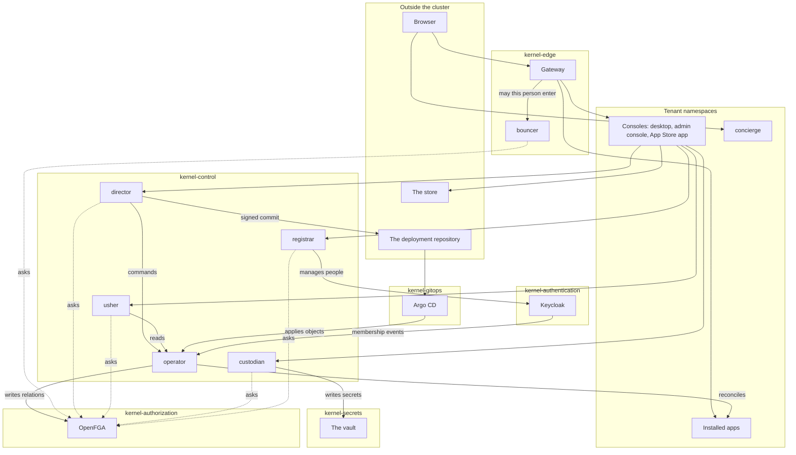
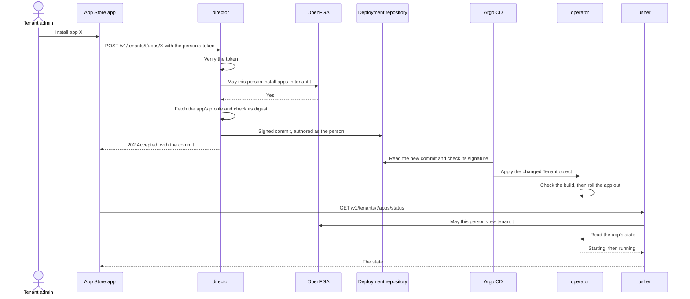
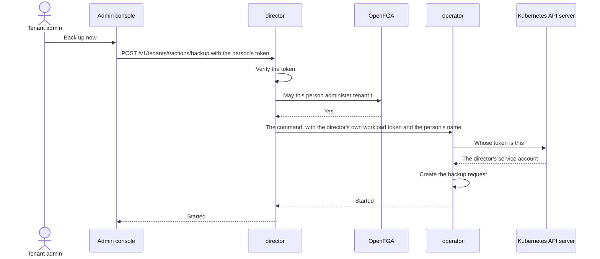
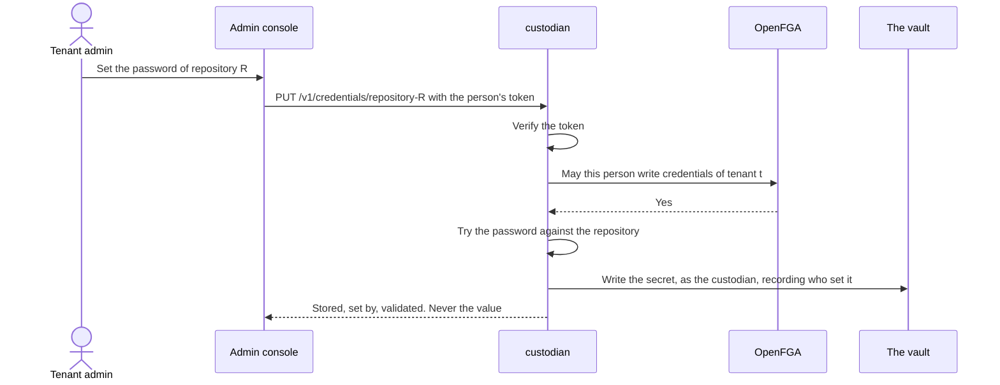
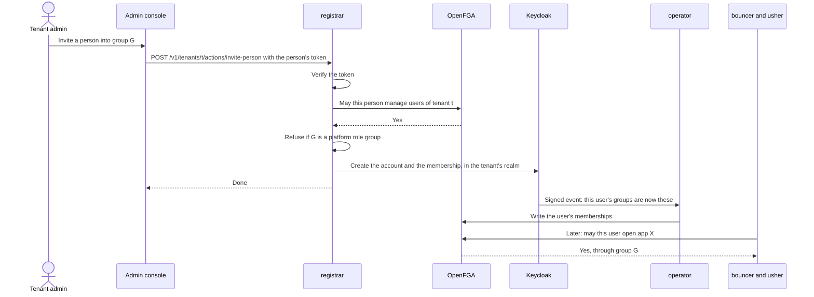
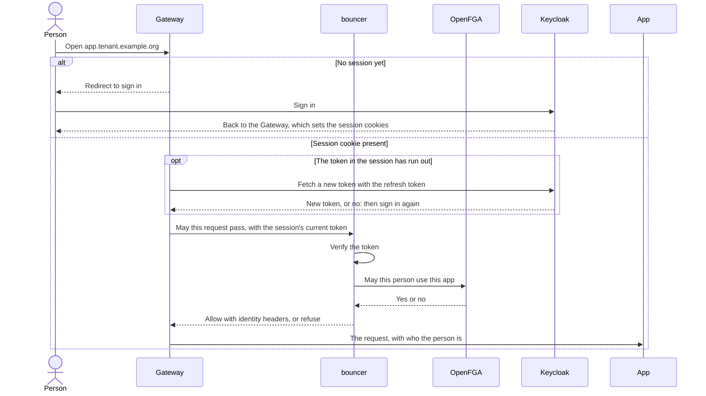
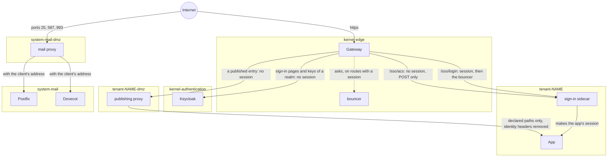

# The operator split: which program does what

## Read this first

This document describes the programs that run the Gentian OS control plane,
what each one does, and how they work together.

- Sections 1 and 2 say why there are several programs and list them in one
  table.
- Section 3 shows how they interact, in seven diagrams.
- Section 4 has one part per program, all in the same shape: what it does,
  what it must never do, what it holds, who calls it, what happens when it is
  down.
- Section 5 says who decides whether a person may do something.
- Section 6 says what a break-in at each program would cost, and names the
  known weaknesses.
- Sections 7 to 9 cover addresses, what is built and what is not, and a
  glossary.

Everything here describes the code and the charts as they are. Where
something is planned and not built, section 8 says so.

## 1. What this is

Gentian OS used to have one program, the operator, that did everything. It
changed the cluster, wrote to git, stored secrets, managed people in the
identity provider and answered every request, and it held every credential
needed for all of that. A mistake in one request handler, or one break-in,
could reach everything.

The work is now divided among a small cast of programs. Each has one job and
one credential that it holds all the time. A mistake or a break-in in one of
them cannot do what the others can.

**The rule: one standing credential per program.** The director holds the
credential that writes to git. The custodian holds the credential that writes
secrets. The registrar holds the credential that manages people. The operator
holds the credentials that change the cluster. No program holds two of these.
Section 6 says where the rule holds and where it does not yet.

**Desired state lives in git.** What the cluster should run (tenants, apps,
policies, settings) is written as files in one git repository, the deployment
repository. A change to the cluster is a commit to that repository; a program
called Argo CD copies the files into the cluster, and the operator makes the
cluster match them.

## 2. The cast at a glance

A *namespace* is a separate compartment of the cluster. The full list of
namespaces is in [kernel/namespaces.yaml](../../kernel/namespaces.yaml).

### The seven programs

| Program | Its job in one sentence | Runs in | Who may call it | What it holds | What it can change |
| --- | --- | --- | --- | --- | --- |
| **Director** | Turns a permitted request for a change into a signed commit in the deployment repository, and passes one-off commands to the operator. | `kernel-control` | The consoles' backends and the command line tool, each with the signed-in person's token. | The credential that pushes to the deployment repository, and the key that signs its commits. | The deployment repository. Nothing in the cluster directly. |
| **Operator** | Makes the cluster match what git declares, and carries out one-off commands. That includes what stands beside an app or in front of it: the publishing proxy for an entry published to the internet, the sign-in service for an app with no single sign-on of its own, what the mail servers read about each tenant, and the Job that archives or deletes a removed person's mailbox. | `kernel-control` | Argo CD (by applying objects), the director and the usher (on its listener), Keycloak (membership events), the Kubernetes API server (admission checks). | Wide rights in the cluster, Keycloak's administrator credential, a vault role that reads and writes every platform secret. | Everything in the cluster, Keycloak, the vault and OpenFGA. |
| **Custodian** | Takes a secret from the person entitled to set it and puts it in the vault; never gives one back. | `kernel-control` | The admin console's and the App Store app's backends, with the person's token. | A vault role that can write a secret and cannot read one. | Secrets in the vault (write only). |
| **Registrar** | Keeps the list of people: invites them, puts them in groups, removes them. | `kernel-control` | The admin console's backend and the command line tool, with the person's token. | One Keycloak client secret per realm, and the login of its own database. | People and groups in Keycloak. In the cluster, one kind and no other: the record of what was decided about a removed person's mailbox (`MailboxRemoval`). |
| **Usher** | Tells a signed-in person what is here, what they may open, and what the cluster currently holds of a tenant. | `kernel-control` | The consoles' backends and the command line tool, with the person's token. | An identity the operator admits to reads only. | Nothing. |
| **Bouncer** | Checks, for every request at the front door, whether this signed-in person may enter this address. Answers the same question, about one tenant, for a component that was given a key for it. | `kernel-edge` | The Gateway; and, on a second listener, a component whose profile declares the rights check. | Nothing of its own. | Nothing. It lets a request through or refuses it. |
| **Concierge** | Shows the page on the cluster's bare domain and sends a visitor to the sign-in of their workspace. | `tenant-platform`, published from `tenant-platform-dmz` | Anybody on the internet; no sign-in. | Nothing. | Nothing. |

Six of the seven also hold the key that opens OpenFGA (all but the
concierge). That is a known weakness, described in section 6.

### What they stand between

| Element | What it is | Runs in |
| --- | --- | --- |
| **Desktop** | The page a signed-in person lands on, with a tile for each thing they may open. One per tenant. Its backend calls the usher and the director. | `tenant-<name>` |
| **Admin console** | The pages where a tenant admin manages a tenant and a platform admin manages the cluster. One per tenant. Its backend calls the director, the usher, the custodian and the registrar. | `tenant-<name>` |
| **App Store app** | The pages where a tenant admin finds and installs apps. Its backend calls the store outside the cluster, and the director, the usher and the custodian. | `tenant-<name>`, on every tenant but the platform tenant, while the cluster reports its licences and names a store |
| **Gateway** | The front door: it terminates TLS, keeps the sign-in session in a cookie, and asks the bouncer before it forwards a request. It is Envoy Gateway. | `kernel-edge` |
| **Argo CD** | Reads the deployment repository and applies its files to the cluster. It refuses a commit that is not signed by a trusted key. | `kernel-gitops` |
| **Keycloak** | The identity provider: it holds the people, their passwords and their groups, and issues the tokens that prove who somebody is. People are kept in *realms*: the kernel realm for platform admins, one realm per tenant for everybody else. | `kernel-authentication` |
| **Publishing proxy** | Answers what a tenant published to the internet with no sign-in: one small proxy per published entry, written by the operator. It forwards the declared paths to the app and nothing else. | `tenant-<name>-dmz` |
| **Sign-in sidecar** | Signs a person in to an app that supports neither OIDC nor SAML: one small service per such app, written by the operator, which makes the app's own session for a person the tenant's realm vouches for. | `tenant-<name>`, beside the app |
| **Mail proxy** | The one thing of mail that faces the internet, on a cluster that runs its own mail: it passes connections on to the mail servers and keeps nothing. | `system-mail-dmz` |
| **OpenFGA** | The authorization store: the one place that answers "may this person do this to that". | `kernel-authorization` |
| **The vault** | The secret store (OpenBao). Passwords, tokens and keys live here and nowhere else. | `kernel-secrets` |
| **The deployment repository** | The git repository that holds the cluster's desired state. | outside the cluster, at a git host |
| **The store** | A service outside the cluster, run by a vendor, that describes apps and records what a tenant has acquired. It never calls the cluster. | outside the cluster |

## 3. How they interact

### 3.1 The big picture

How to read it:

- A person's browser reaches only the Gateway and the concierge. Everything
  else is inside the cluster. The concierge, like everything a tenant
  publishes without a sign-in, is reached through the Gateway and a
  publishing proxy; section 3.7 draws that path and the one mail takes.
- The four programs in the middle (director, usher, custodian, registrar) are
  called by the consoles' backends, never by a browser directly. Each verifies
  the person's token and asks OpenFGA (dotted lines) before it acts.
- A change travels from the director to the deployment repository, from
  there to Argo CD, and from Argo CD to the operator. The operator is the
  only program that changes the cluster.
- Only the operator writes to OpenFGA. Everybody else only asks.
- Not drawn, to keep the picture readable: the operator also configures
  Keycloak, the vault and the Gateway's routes.

### 3.2 A change, step by step: a tenant admin installs an app

How to read it:

- The director's answer (202) means "git has it". It does not mean the app
  runs. The director never waits for the cluster.
- The commit carries who asked and which permission allowed it, so the
  repository is also the record of changes.
- The operator checks that the profile it is about to roll out is exactly the
  build the install named (section 4.2, "checks before it acts").
- Whether the app is running is a separate question, asked of the usher.

### 3.3 A one-off action: take a backup, or purge an app

How to read it:

- Some requests are not a state to declare but an act to perform once. They
  produce no commit. Section 4.2 lists them.
- The operator does not verify the person. It verifies that the caller is the
  director, by asking the Kubernetes API server whose token was presented.
- The operator records the name the director passes. It takes the director's
  word for it.
- A backup answers when it has started. Purging an app is the exception: the
  operator answers when the purge is over, and the director waits up to five
  minutes for that.

### 3.4 A secret: setting a repository password

How to read it:

- The custodian writes under its own identity. The vault never sees the
  person's token.
- No route of the custodian returns a secret's value, and its vault role
  could not read one.
- A repository has two halves. Its address decides what software may enter,
  so declaring it is a commit made by the director. Its password is a secret,
  so setting it is the custodian's.

### 3.5 A person: inviting a user, and how a group becomes access

How to read it:

- Keycloak is where a membership is changed. OpenFGA holds a copy of it,
  written by the operator from Keycloak's signed events.
- A right follows from a group. Which group gives which right is declared in
  git and written to OpenFGA by the operator.
- The bouncer and the usher never read a group from a token. They ask
  OpenFGA.
- The registrar refuses any change to a group that carries a platform role,
  whoever asks (section 4.4).

### 3.6 A request at the front door

How to read it:

- The Gateway runs its own sign-in check first and asks the bouncer second.
  That is not the Gateway's own order. The installer sets it, in the settings
  of the Gateway's proxies
  ([envoyproxy.yaml](../../kernel/manifests/gateway/chart/templates/envoyproxy.yaml)),
  and does not report the Gateway installed without it.
- A request with no session never reaches the bouncer. The Gateway sends the
  browser to Keycloak. The Gateway also answers two addresses itself: the one
  Keycloak sends the browser back to, and the one that signs out.
- A session whose token has run out is renewed by the Gateway before the
  bouncer is asked. The bouncer is shown the new token.
- The bouncer is given the token by the Gateway, in the request's
  `Authorization` header. The Gateway removes whatever the browser sent in
  that header first. The bouncer does not read cookies; the Gateway encrypts
  them.
- A request that reaches the bouncer without a token it can verify is
  refused. There is no case in which the bouncer passes a request on
  unchecked.
- A request with a valid token is checked against OpenFGA. The question
  asked (which permission, on what) comes from a table the operator writes.
- The app receives headers that say who the person is. The bouncer sets them
  on every request it allows, which replaces any such header a client sent
  itself.

### 3.7 What is reached without a sign-in

How to read it:

- Three things answer a request that carries no session: a publishing proxy,
  the realm's own sign-in pages, and one path of a sign-in sidecar. Every
  other route on the Gateway signs the person in first and asks the bouncer.
- A publishing proxy exists only for an entry that an app's profile declares
  for the internet and that the tenant's perimeter approver published. It
  checks nobody. It forwards the declared paths, refuses a path that can be
  read in more than one way, removes every header that says who a person is,
  the cookies and the `Authorization` header, and limits size, time and the
  number of requests from one address.
- The sign-in sidecar has two paths. `/sso/login` is behind the session and
  the bouncer, so only a person who may use the app begins a sign-in.
  `/sso/acs` takes Keycloak's signed answer with no session; the sidecar
  accepts it only if the tenant's realm signed it, for a request the sidecar
  sent itself, in the same browser, for the same person.
- Mail does not pass the Gateway. The mail proxy has the one load balancer
  mail has; it holds no mail, no account and no key, TLS ends at the servers
  behind it, and the servers accept its connections on ports nothing else
  may reach. This exists only on a cluster that runs its own mail.
- The limits on posts to the sign-in pages and to `/sso/acs` are set at the
  Gateway, per client address.

## 4. The programs, one by one

### 4.1 Director

**What it does**

- Verifies the caller's token against the realm that issued it. A token must
  be issued for the audience `gentian-director`.
- Asks OpenFGA the permission each route names, on the tenant or the cluster
  the route is about, before doing anything else.
- Makes each permitted change as one commit to the deployment repository. The
  commit is authored as the person, signed with the director's key, and
  carries a line that names the request, the person and the permission that
  allowed it (`Gentian-Authz: …`).
- Answers a change with `202` and the commit. It does not wait for the
  cluster.
- Handles two writers at once by using git: if a push is rejected because the
  repository moved, it re-applies the change to the new state and tries
  again, for up to one minute from the first attempt. A caller who waited
  that long is told that another writer kept landing first.
- Lets its git do its housekeeping inside the command that caused it, so
  nothing is still writing to the checkout after a command has returned.
- Stops cleanly. Some changes are finished later by a task that waits on the
  cluster (a purge, an import, the removal of a profile that has left git).
  When the director is told to stop, a task that is waiting stops waiting,
  one that is writing finishes that commit first, and what is left to do is
  in git, where the next start finds it.
- Before a commit, asks the operator whether the cluster's resource
  definitions know every field the commit sets, and refuses the commit if a
  field would be silently dropped.
- Passes one-off commands to the operator (section 4.2), after the same token
  and permission check.

Its routes, by group. Every write is a commit unless marked as a command.

| Group | What a caller can do |
| --- | --- |
| Tenants | List tenants; create one; retire one (remove it and keep its data); purge one (remove it with its data, in two commits, resumed after a restart); set or clear a tenant's custom domain; import a tenant from a backup bundle. |
| Apps and add-ons | Read what git says a tenant has installed; install an app; uninstall it; choose its add-ons. |
| Catalogues | List the catalogues a tenant or the cluster installs from and their entries; add or remove a catalogue for the whole cluster or for one tenant; allow or forbid a tenant's own admins to add theirs. |
| Repositories | Declare or remove a repository (its address) for a tenant or for the cluster. The password is the custodian's. |
| Exposures | Read what a tenant publishes to the internet, and with it what each installed app asks to publish: the address, the paths and whether anybody signs in. Publish or withdraw one exposure. |
| Privileges | Read which extra privileges a tenant's apps asked for; grant or revoke one. |
| Settings | Read and change the cluster's settings and its branding; choose a tenant's resource plan; set a tenant's sign-in security policy and the languages its sign-in pages offer; set what an app may consume from other apps. |
| Backup policy | Set or clear a tenant's backup policy; set the cluster's. |
| Platform security | Read and replace the list of exceptions to the cluster's default security rules, as git declares it. |
| Records | Read the history of changes to a tenant or the cluster (from the commits); read who holds which right on a tenant or the cluster (from OpenFGA); answer which permissions the caller holds (`…/me`). |
| Commands relayed to the operator | Take a backup; delete a backup; upload or inspect a backup bundle; restore (as part of an import); send a notice to a tenant's people; purge the data of an uninstalled app; give an installed app to everybody who is a member now; remove one object the catalogue left behind, for the cluster or, on a cluster with one user tenant, for that tenant and one of its apps. |
| One live read | Download a backup bundle. This is the only read of live state the director serves. |

When an app is installed from a catalogue, the director fetches the app's
*component profile* (the file that describes how the app is installed, and
which may hold a few other objects the app needs beside it) from
the catalogue's address, checks that it matches the digest the request named
and holds nothing a catalogue of that kind may not bring,
and commits it to the deployment repository together with the exact bytes it
checked. It fetches only from public
https addresses, so an address somebody typed cannot be used to reach into
the cluster ([address.go](../../internal/director/catalogue/address.go)).

What it refuses, beyond a missing permission, each before anything is
committed:

- An install, or an import, of an app whose profile asks for an address name
  the platform keeps (`desktop`, `admin`, `id` and the others in
  [routing.md](../design/routing.md)); on a single-tenancy cluster also the
  names the kernel itself answers on under the cluster's domain. The operator
  refuses the same from the same list
  ([hostnames](../../internal/hostnames/)), so an install is not accepted
  only to never appear.
- The publication of an entry that no app installed in the tenant declares
  for the internet.
- A publication for the cluster's main address of an entry not declared for
  it, or the other way round; and one for the main address that does not
  carry the approver's acknowledgement of the rule for a website there. Who
  acknowledged, and when, is recorded on the entry.
- A domain for a tenant that is not a hostname, is the cluster's own domain
  or below it, or is bound to another tenant.

Where an entry answers is worked out by one package that the director and
the operator both use ([addresses](../../internal/addresses/)), so what the
director shows before an approval is what the operator publishes after it.

Nothing committed this way is taken out again by itself. Removing a profile
that no tenant uses is the one commit that does it: the director removes the
profile's files after checking every tenant's file in git and asking the
operator whether any tenant still holds data for it, and then has the
operator delete the object (section 4.2,
[residue.go](../../internal/director/api/residue.go)).

What a newer build of an app left behind is on the cluster once, for every
tenant that installed the app. So the permission on a tenant does not decide
its removal alone: the director also reads the cluster's tenancy mode from
git, and has the operator remove such an object for a tenant's administrator
only where the mode is `single` and the tenant is the one user tenant such a
cluster carries. Everywhere else it answers 403 and says to ask the
platform's administrator.

**What it must never do**

- Change the cluster. Its service account has no rights and no token for the
  Kubernetes API.
- Write to OpenFGA. It only asks.
- Hold a Keycloak credential or a vault role, or serve a route about a
  person.
- Answer for the live state of the cluster, apart from the bundle download.
- Put a secret in a commit.

**What it holds**

- The credential that pushes to the deployment repository.
- The private key its commits are signed with, delivered from the vault.
- The OpenFGA key.
- A short-lived token for its own service account, valid only at the
  operator's listener.

**Who calls it, and whom it calls**

- Called by: the desktop's backend (`…/me`), the admin console's backend, the
  App Store app's backend, and the command line tool (`kubectl gentian`,
  through a port-forward). It has no address on the Gateway.
- Calls: Keycloak's public keys (to verify tokens), OpenFGA, the git host,
  the operator's listener, and catalogue addresses on the internet.

**If it is unavailable**

Nothing can be changed and no command can be issued. Everything that runs
keeps running, people can sign in and use their apps, and the reads the usher
serves still work.

### 4.2 Operator

**What it does: reconcilers**

A *reconciler* is a loop that compares what should exist with what does and
corrects the difference. The operator runs these:

| Reconciler | What it produces |
| --- | --- |
| Tenant | A tenant's namespaces, realm, databases, storage, mail setup, quota and network rules; and one Component for every app and add-on the tenant's manifest lists. |
| Component | The app itself: its chart installed in the tenant's namespace, the services its component profile requires, and for each address it exposes a route, a session policy and the bouncer's question. For an entry published to the internet: the publishing proxy in the tenant's DMZ namespace, its configuration, its route and its network rule — only for an entry whose approval in the tenant's manifest is of the kind the entry asks for (`public`, or `publicAppCredential` for one that passes its callers' `Authorization` header to the app). For an entry behind sign-in approved as `signInAppAuthorization`: a session policy that leaves the app's own `Authorization` header alone; nothing is published for it. For a profile that declares the sign-in sidecar: the sidecar, the handler from the app's profile bundle, what it is handed of the app's own, its two routes, its network rules, and the address inside the cluster at which the realm tells the sidecar that a person signed out. For a profile that declares the rights check: a key of the component's own, and its line in the bouncer's table. |
| Mailbox removal | For each `MailboxRemoval` the registrar wrote: a Job beside the mail server's volume that moves the mailbox to the archive or deletes it, and the outcome on the record. It refuses a record whose address is not in the tenant's mail domain, touches no mailbox whose address a person of the realm still holds, and waits until the mail server holds no password for the address. |
| Mail (a stage of Tenant) | On a cluster that runs its own mail: the maps Postfix reads and the files Dovecot reads for each tenant, written into the namespace where the server that mounts them runs, and each tenant's mail credentials beside what reads them. A tenant's mail is reported ready only once the map Postfix mounts names its domain. |
| Model access (a stage of Tenant) | For each app, and each component the platform places on the tenant, whose profile declares the model gateway: its key, registered at the gateway and held in the vault, and the Secret that delivers it. It takes both away from an app that does not declare the gateway. |
| Gateway platform | The shared Gateway objects, the routes of the platform's own tools (Keycloak, Argo CD, the cluster dashboard, the model gateway's console), their session policies, the limit on posts to the sign-in pages, and the bouncer's route table. The model gateway's console is routed only while the Cluster claim says `spec.llm.console.enabled: true`; otherwise it has no route. |
| Keycloak platform | Browser security settings in every realm, and the registrar's client and secret in every realm (handed over in a Secret the registrar mounts). |
| Authorization projection | The contents of OpenFGA; see below. |
| Tile projection | The list of tiles the usher serves, built from the routes that really exist. |
| Concierge lookup | The file the concierge uses to send an address on a tenant's custom domain to the right desktop. |
| Branding | The brand files (colours, logo, manifest) every page loads. |
| Platform security policy | The list of permitted exceptions to the default security rules, in the form the admission rules read. |
| App grant | Records that a grant between two apps was taken in. |
| Integration binding | The credentials and network rule that let one app use a service another app provides. |
| Backup policy, export schedule, tenant export, tenant restore | Where backups go and the credential for it; backups on a schedule and their expiry; one backup bundle; one restore from a bundle. |
| Customization | The report of customizations that are overdue for review or have drifted. |
| DNS publication check, usage sampler | Whether published DNS records are really served; how much each tenant consumes. |

**What it does: projections into OpenFGA**

A *projection* is a copy of facts kept in a second place, always rebuilt from
the original and never edited there. The operator creates the OpenFGA store
and its model, and writes four things into it:

- **Platform roles**: which Keycloak group holds which role over the cluster,
  from `spec.platformRoles` on the Cluster claim.
- **Tenants**: each tenant attached to the cluster, with its admins',
  members' and perimeter approvers' groups. The tenant's admins group is
  written as a perimeter approver only while the tenant's manifest says
  `spec.perimeter.adminsApprove: true`, and removed again when it does not.
- **Apps**: each installed app attached to its tenant, with the group whose
  members may use it.
- **Memberships**: which person is in which group, from Keycloak's signed
  events ([membership_listener.go](../../internal/controller/membership_listener.go)).

A role whose group is removed from the claim loses its relation, so a right
is taken away by editing git.

**What it does: the listener**

The operator keeps one HTTP listener for what cannot be a commit. It serves
two kinds of route
([internal/applifecycle](../../internal/applifecycle/)).

*Commands*, for the director only:

| Command | What the operator does |
| --- | --- |
| `backup` | Creates the request for one backup of a tenant. |
| `delete-backup` | Deletes one backup and its bundle. |
| `bundles`, `bundles/inspect` | Takes an uploaded backup bundle, or says what one contains. |
| `restore` | Creates the request to restore a tenant from a bundle. |
| `notify` | Publishes one notice to a tenant's people. |
| `purge-app` | Destroys what an uninstalled app left behind: database, object storage, cache user, files, stored credentials, access group. |
| `provision-app` | Puts the tenant's current members into an app's group. |
| `remove-catalogue-residue` | Deletes one named object that the catalogue left behind, and only if it is on the list below when the command arrives. Given a tenant and a profile, it deletes less: only an object a newer build of that profile left behind, only if the tenant has the profile, and only on a cluster whose one user tenant this is. |

*Reads*, for the usher and the director:

- per tenant: the state of its apps; which uninstalled apps still hold data;
  what newer builds of one of its apps left behind;
  its resource ceiling, the plans it may move to, its usage and usage report;
  its backups and one backup; its backup policy and schedules; its
  integrations; its notices;
- for the cluster: every tenant's resources; the backup policy and schedules;
  the platform security rules in force; the customization report; the licence
  report; the result of the definitions check; what the catalogue left
  behind.

*What the catalogue left behind.* Argo CD applies the catalogue directory
without ever removing anything, so a cluster collects objects that the
profile file of no app still holds, and profiles no tenant uses. The operator
lists them: objects of the four kinds a profile's file may hold beside the
profile, that no profile's file on the cluster holds now; and profiles that
no tenant has installed and no tenant holds data for. It never lists what a
chart ships, the Composition every app without its own is built from
(`app-default`), or anything in a tenant's namespace. `remove-catalogue-residue`
works that list out again from the API server, deletes the one object named
if it is on it, and refuses anything else with the reason. It also refuses an
object Argo CD still finds declared in the directory, because that would be
applied again; a profile is deleted only once Argo CD reports it gone from
the directory ([residue.go](../../internal/applifecycle/residue.go)).

A tenant is shown the part of that list that is about an app it has: the
objects a newer build of the app, or of an add-on switched on inside it, no
longer holds. The read answers for no other profile, and says nothing about
another tenant. It also says who may remove them, from the tenancy mode the
operator runs under: the tenant's administrator where this is the cluster's
only user tenant, the platform's everywhere else. The command checks the same
again when it is given a tenant
([residue_app.go](../../internal/applifecycle/residue_app.go)).

Four further reads are for the director only, because its own work depends
on them: a tenant's installed apps, a tenant's state (needed while purging
it), a restore's progress, and the download of a backup bundle.

How the listener knows its caller: the director and the usher each present a
token for their own service account, issued for this listener alone and
valid for ten minutes. The operator asks the Kubernetes API server whose
token it is ([auth.go](../../internal/applifecycle/auth.go)). The director's
identity is admitted to every route, the usher's to the reads only, and every
other identity is refused. With no caller configured the listener refuses
every request. A positive answer is remembered for thirty seconds.

**What it does: checks before it acts**

- *The build check.* An install names the digest of the app's component
  profile. The operator recomputes it from the bytes the director committed
  and compares the profile in the cluster with them, and each other object
  the file holds. It rolls out nothing
  that does not match ([profilebundle](../../internal/profilebundle/)).
- *The definitions check.* The operator compares the resource definitions the
  cluster serves with the ones it was built with. Where the cluster's are
  older, a write would silently lose fields; the operator holds the affected
  reconcilers and reports what it found
  ([schemacheck](../../internal/schemacheck/)).
- *Admission.* It refuses a Tenant object that breaks the rules (for example
  a second user tenant on a single-tenancy cluster) when the object is
  applied.
- *The address check.* It installs nothing for a component whose profile
  asks for an address name the platform keeps, and says so on the component.
- *The store's address.* A store address whose host is the one this cluster
  serves its own App Store app on is not a store: the App Store app is then
  placed on no tenant, and the reason is reported.
- *The sign-in sidecar's handler.* It runs a sidecar only with the handler of
  a profile bundle that came from a catalogue of the whole cluster, for an
  install pinned to that bundle's digest, and never for a tenant that signs
  in in the kernel realm. Otherwise it holds the component and says why
  (`SignInSidecarRefused`).

**What it does: the licence report**

When reporting is switched on, the operator sends a signed report of what the
cluster runs to a configured address: counts and addresses of things, never
of people. Nothing depends on the answer. Every report is kept, exactly as
sent, for a platform admin to read
([licencereport](../../internal/licencereport/)).

**What it must never do**

- Hold a git credential or write to the deployment repository. It has no
  checkout; what git declares reaches it as objects Argo CD applied.
- Decide whether a person may do something. That was decided before a
  request reached it.
- Offer a command that changes who may do what. No command writes a relation,
  a group that carries a right, or a policy.

**What it holds**

- A service account with wide rights in the cluster, including reading and
  writing Secrets in every namespace. It may delete, and not write, what the
  catalogue brings: component profiles, OIDC pack catalogs and Compositions.
  Its code deletes a Composition only as catalogue residue, only under a name
  a profile's file gives one (`app-<profile>`), and never `app-default`.
- Keycloak's administrator credential.
- A vault role that reads, writes and deletes everything under the platform's
  path.
- The OpenFGA key, which it uses to write.
- The key that signs the licence report.

**Who calls it, and whom it calls**

- Called by: Argo CD, by applying objects; the director and the usher, on the
  listener; Keycloak, with membership events; the Kubernetes API server, for
  admission.
- Calls: the Kubernetes API, Keycloak, the vault, OpenFGA, and the licence
  report's address when reporting is on.

**If it is unavailable**

Running apps keep running and people can still sign in and use them. Nothing
new is rolled out, memberships changed in Keycloak do not reach OpenFGA,
commands and the usher's live reads fail, the director refuses commits that
set fields (it cannot run the definitions check), and a Tenant object cannot
be created or changed.

### 4.3 Custodian

**What it does**

- Lists the credentials the cluster or a tenant requires, and says for each
  whether it is set, by whom and when.
- Sets a credential: verifies the caller's token, asks OpenFGA, checks the
  submitted fields against the declared form, tries the credential against
  the service it is for where that is possible, then writes it to the vault
  under its own identity and records who set it.
- Tells everything that uses the credential to read it again at once.
- Stores a tenant's backup key (the private half), and answers whether one
  is stored and which public key belongs to it.
- Lists the repositories a tenant or the cluster installs from.
- Records that the path for a person to set secrets works: a platform admin
  has signed in and reached it, and it can log in to the vault. The install
  waits for this record (the *handover*) before it gives up its own bootstrap
  access.

Its routes: `GET /v1/credentials`, `GET` and `PUT /v1/credentials/{name}`,
`GET` and `PUT /v1/backup-identity`, `GET /v1/repositories`.

**What it must never do**

- Return a secret's value, on any route, to anybody.
- Show the vault a caller's token, or let the vault decide who may write.
- Declare or remove a repository. It has no such route.

**What it holds**

- A vault role, bound to its own service account, that can create and update
  a secret and read and write its metadata. It cannot read a secret's value
  and cannot delete one
  ([cluster-default.yaml](../../crossplane/compositions/cluster-default.yaml),
  policy `custodian-write`).
- The OpenFGA key.
- In the cluster: read the list of required credentials, the tenants, the
  Cluster claim and the repositories; ask a secret's consumers to refresh;
  write the handover record in its own namespace; read the vault's
  certificate.

**Who calls it, and whom it calls**

- Called by: the admin console's backend and the App Store app's backend.
- Calls: Keycloak's public keys, OpenFGA, the vault, the Kubernetes API, and
  the service a credential is for (to try it).

**If it is unavailable**

No secret can be set or rotated through the consoles. Secrets already stored
keep working.

### 4.4 Registrar

**What it does**

- Lists a tenant's people, one person, its groups, a group's members, the
  domain a login is composed under and the templates an invitation may apply.
- Invites a person, updates one, removes one. Where the person has a mailbox
  on the cluster's own mail server, the removal carries the answer of whoever
  removes them — archive or delete — and the registrar writes it down as a
  `MailboxRemoval` before it removes the person. It does nothing to the
  mailbox itself: the operator carries the answer out and reports on the same
  object, which the registrar reads back for the console.
- Puts a person into a group or takes them out; creates, renames and deletes
  groups.
- Sends a password reset; requires or removes a second factor.
- Issues the link that hands a new tenant's admin account to its
  holder.
- Counts the accounts on the cluster (a number, no names).
- Records every act and who was allowed to ask for it, in a database of its
  own.

Every write is a one-off action
(`POST /v1/tenants/{t}/actions/…`). None is a commit: people do not belong in
a history that is kept for ever. One of them also writes an object in the
cluster, the `MailboxRemoval` above.

**What it must never do**

- Change who holds a platform role. It refuses, whoever asks and whatever
  OpenFGA answers, every change to a group the Cluster claim names under
  `spec.platformRoles`: adding to it, removing from it, renaming, deleting or
  re-creating it. It also refuses any change to a person who is in such a
  group, because changing a role holder's address and mailing a password link
  replaces them. The rule is applied in the one place every write leaves for
  Keycloak ([guard.go](../../internal/registrar/identity/guard.go)), and a
  write it does not recognise is refused. If the claim cannot be read, the
  write is refused.
- Act in a realm other than the tenant's own.
- Hold a git credential or a vault role.

**What it holds**

- One Keycloak client secret per realm. The client may view and manage users,
  query groups, and manage the realm's settings. It may not manage clients or
  identity providers and may not impersonate anybody. There is none in
  Keycloak's own master realm.
- The login of its own database.
- The OpenFGA key.
- In the cluster: read the tenants and the Cluster claim; create, update and
  delete `MailboxRemoval`, a cluster-scoped kind, and nothing else. No Secret;
  its realm secrets are handed over as a mounted file by the operator.
  **Changed 2026-10-09**: until then it could write nothing in the cluster.
  It has no right in the mail servers' namespace and mounts nothing of their
  volume.

**Who calls it, and whom it calls**

- Called by: the admin console's backend and the command line tool.
- Calls: Keycloak's public keys and its administration interface, OpenFGA,
  its database, the Kubernetes API, and a tenant's desktop backend (for the
  invitation templates, with the caller's token).

**If it is unavailable**

Nobody can be invited, changed or removed through the consoles. Existing
people can sign in as before.

### 4.5 Usher

**What it does**

It serves reads only. Every route names a permission and what it is about,
and asks OpenFGA before it answers.

| Read | Permission |
| --- | --- |
| A tenant's tiles: the things this person may open, and whether the App Store is offered on this cluster | `can_enter` on the tenant; each tile is then checked separately |
| The state of a tenant's apps; which uninstalled apps still hold data; what newer builds of one of its apps left behind | `can_view` on the tenant |
| A tenant's resources, the plans it may move to, its usage and usage report | `can_view` on the tenant |
| A tenant's backups and one backup, its backup policy and schedules | `can_view` on the tenant |
| A tenant's integrations and notices | `can_view` on the tenant |
| Every tenant's resources; the cluster's backup policy and schedules | `can_audit` on the cluster |
| The platform security rules in force; the customization report; the licence report | `can_audit` on the cluster |
| What the catalogue left behind: objects no profile's file holds any more, and profiles nobody uses | `can_audit` on the cluster |

The tiles come from a file the operator writes. All other answers are the
operator's, fetched over its listener. The usher does not read the cluster
itself: each answer is worked out inside the operator, and reading the
objects behind it would mean giving the usher access to every tenant's
namespace.

**What it must never do**

- Change anything, or issue a command. The operator admits its identity to
  reads only.
- Filter a list inside a handler instead of naming the permission on the
  route. Its routes are lists, and a list is where one tenant's data leaks to
  another.

**What it holds**

- The OpenFGA key.
- A short-lived token for its own service account, valid only at the
  operator's listener, for reads.
- No rights in the cluster, no git credential, no vault role.

**Who calls it, and whom it calls**

- Called by: the desktop's backend, the admin console's backend, the App
  Store app's backend, and the command line tool. It has no address on the
  Gateway.
- Calls: Keycloak's public keys, OpenFGA, and the operator's listener.

**If it is unavailable**

Desktops show no tiles and the consoles cannot show live state. Apps are
still reachable at their addresses, and the bouncer still decides every
request.

### 4.6 Bouncer

**What it does**

- Answers the Gateway, for every request on a route that attaches it: may
  this request pass.
- Finds the route's question in a table the operator writes: which
  permission, on what. A desktop or a console asks `can_enter` on the tenant.
  An app asks `can_use` on the app. The platform's own tools ask
  `can_configure` or `can_audit` on the cluster. An address with no line in
  the table is refused.
- Refuses a path the app's component profile says is not published, before
  it looks at who is asking.
- Takes the person's token from the request as the Gateway hands it over,
  verifies it, and asks OpenFGA the route's question. The Gateway has put the
  session's current token in the `Authorization` header (section 3.6). On the
  one route whose `Authorization` header belongs to the page behind it,
  Keycloak's administration console, the Gateway hands over the session's ID
  token in a header of its own instead, and the bouncer verifies that.
- On "yes", sets the headers that tell the app who the person is, and removes
  the token unless the route is declared to receive it (the desktops and the
  admin consoles are, because their backends pass it on).
- On "yes", also takes the session's cookies out of the request, on every
  route with a sign-in session, declared to receive the token or not. The
  Gateway has decrypted the tokens into them; the app gets its own cookies
  back as they were and none of the Gateway's. Which cookies those are is in
  the operator's table: the two the route's session policy names, and the
  words the Gateway begins its own with.
- On "no", refuses, with a page that offers to sign out.
- Refuses a request that carries no token it can verify. On a route with a
  sign-in session the Gateway does not let such a request reach it; if one
  arrives anyway, the answer is no.
- Sends the older sign-out address, `/oauth2/sign-out`, on to the Gateway's
  own, `/oauth2/logout`. The Gateway ends the session there: it removes its
  cookies and sends the browser to Keycloak, which ends its session too and
  returns the browser to the front page of the address it came from.
- Remembers a "yes" for five minutes per person, session and address, and
  forgets all of them when OpenFGA's change log moves. It looks at the change
  log every two seconds.
- Answers one question on a second listener, for a component that acts for
  a person who is not at a browser: may this person use that app of the
  component's own tenant (`POST /v1/check`). The component presents a key
  the operator gave it; the operator's table lists the key's hash and the
  tenant it is good for. The key cannot write, cannot list, and cannot ask
  about another tenant.

**What it must never do**

- Hold a rule of its own. The question comes from the table and the answer
  from OpenFGA.
- Let a request through when OpenFGA cannot be reached. It answers 503,
  except for answers it already remembers.
- Let a request through without a token it has verified itself.
- Take who is asking from a cookie. It looks at cookies by name only, to
  remove the session's from what goes on to the app.

**What it holds**

- The OpenFGA key. No service account rights, no token for the Kubernetes
  API. The table is a mounted file.

**Who calls it, and whom it calls**

- Called by: the Gateway; a component with a key for the rights check.
- Calls: Keycloak's public keys and OpenFGA.

**If it is unavailable**

The Gateway refuses every request on the routes behind it. The session
policies the operator writes say so explicitly (`failOpen: false`).

### 4.7 Concierge

**What it does**

- Serves the page on the cluster's bare domain. On a multi-tenancy cluster it
  asks for an e-mail address and sends the browser to the desktop of the
  workspace that address belongs to. For a tenant's custom domain it looks
  the desktop up in a file the operator writes.
- Serves the cluster's brand files, which every other page loads.

**What it must never do**

- Decide anything, or say whether an account exists. It asks the cluster
  nothing.
- Send a browser anywhere but a desktop of this cluster.

**What it holds**

Nothing: no credential, and no session passes through it.

**Who calls it, and whom it calls**

- Called by: anybody. It is the one page with no sign-in in front of it,
  which is why it is published from the platform tenant's DMZ namespace and
  not from behind the Gateway's session.
- Calls: nothing.

**If it is unavailable**

The bare domain shows no page and pages lose the cluster's branding. Anybody
who knows their desktop's address can still sign in there.

## 5. Who decides what

OpenFGA is the one authority on rights. A *relation* is a named link between
a person and a thing, for example "may install apps in this tenant". The
relations that are permissions all start with `can_`. Every program that
takes a person's request verifies the person's token itself and then asks
OpenFGA one such question. No program decides from a group in a token, and no
program takes another program's word for what a person may do, with the one
exception in section 6 (the operator and the director).

The rights themselves are held by groups in Keycloak: a tenant's admins, its
members, the holders of each platform role. Sections 3.5
and 4.2 say how a group becomes a relation.

| Who asks | About | Relation | For what |
| --- | --- | --- | --- |
| Bouncer | a tenant | `can_enter` | the tenant's desktop and consoles |
| Bouncer | an app | `can_use` | the app's own addresses |
| Bouncer | the cluster | `can_configure`, `can_audit` | the platform's own tools |
| Usher | a tenant | `can_enter` | the list of tiles |
| Usher | an app, a tenant or the cluster | `can_launch`, `can_administer`, others | each tile, by the relation the tile names |
| Usher | a tenant | `can_view` | every read of a tenant's live state |
| Usher | the cluster | `can_audit` | every read of the cluster's live state |
| Director | a tenant | `can_view` | reading what git declares for the tenant; downloading a backup |
| Director | a tenant | `can_install_app` | install, uninstall, add-ons, the tenant's own catalogues, purging an app, removing what a newer build of an app left behind (only on a cluster with one user tenant) |
| Director | a tenant | `can_grant` | what an app may consume; giving an app to every member |
| Director | a tenant | `can_set_plan` | the resource plan |
| Director | a tenant | `can_set_policy` | backup policy, sign-in security policy, languages |
| Director | a tenant | `can_expose` | publishing to the internet |
| Director | a tenant or the cluster | `can_approve_privilege`, `can_approve` | granting a privilege an app asked for; which of the two depends on the kind of privilege |
| Director | a tenant | `can_administer` | backup, delete a backup, send a notice, read the change history |
| Director | the cluster | `can_configure` | settings, branding, tenants, domains, catalogues, the cluster's backup policy, import, removing what the catalogue left behind |
| Director | the cluster | `can_set_admission` | the list of security exceptions |
| Director | the cluster | `can_audit` | reading the cluster's settings, tenants, catalogues, changes |
| Director, custodian | a tenant or the cluster | `can_write_credential` | declaring a repository (director); setting a secret (custodian) |
| Custodian | a tenant or the cluster | `can_read_credential` | seeing that a secret is required and whether it is set |
| Registrar | a tenant | `can_manage_users` | people and groups |
| Registrar | the cluster | `can_configure`, `can_audit` | handing over a tenant's admin account; counting accounts |

Reads are never guarded by the relation of the matching write: somebody who
may see a tenant may see what it has installed without being allowed to
change it.

The model itself is [model.fga](../../authz/model/v1/model.fga). The full
list of relations and the rules behind them are in
[authorization-model.md](authorization-model.md).

## 6. What a break-in would cost

"Takes over" below means: somebody runs their own code as that program.

| Program | Standing credential | What somebody who takes it over can do | What limits it |
| --- | --- | --- | --- |
| **Director** | Push credential and signing key for the deployment repository; identity at the operator's listener | Commit anything to the deployment repository in anybody's name, including a change to who administers the platform and where software comes from. Issue every command for any tenant and name anybody as the one who asked; two commands destroy data, and one deletes objects the catalogue left behind (never one a profile on the cluster still brings: the operator checks that itself). | Every commit stays in git, signed, where it can be seen and reverted. It cannot read a secret and cannot reach Keycloak. Its token for the operator lasts ten minutes and stops working when the pod is gone. |
| **Operator** | Wide cluster rights, Keycloak's administrator credential, the vault role for everything | Everything. It can read every Secret, and with that it can also do what each of the others can. | Nothing inside the cluster. It is the part the platform trusts. What protects it is that no person's request reaches it directly: only Argo CD, the director and the usher on the listener, Keycloak's signed events and the API server's admission calls. |
| **Custodian** | Vault role that writes and cannot read | Overwrite any secret the platform stores. | It cannot read or delete a secret, so the damage is loud: things stop working. No git, no Keycloak, and it cannot change any object that decides configuration. |
| **Registrar** | One Keycloak client secret per realm | In every realm, the kernel realm included: create, disable or delete any account, set any password, remove any second factor, change any group. That includes the groups behind the platform roles, so it can make somebody a platform admin. It can also rewrite its own record. And it can write a `MailboxRemoval` for any address and either answer: together with deleting the account, which it can do too, that has the operator archive or delete that person's mailbox. | No git, no vault. In the cluster it can write one kind, `MailboxRemoval`, and no other object. The operator does not act on such a record because it says so: the address must be in the tenant's mail domain, no person of the realm may still hold it, and the mail server must hold no password for it. No client in Keycloak's master realm; its client holds `view-users`, `query-users`, `query-groups` and `manage-users`, so it cannot change a realm's settings (the password policy among them), cannot manage clients or identity providers and cannot impersonate. Keycloak records each change it makes. |
| **Usher** | Identity for reads at the operator's listener | Read every tenant's live state and show it to anybody; show or hide tiles. | It cannot issue a command, download a backup, read a secret, or change anything. A tile is not access: the bouncer decides each request. |
| **Bouncer** | None of its own | Let any signed-in person into any address behind it, or refuse everybody. It sees the token of every session that passes and can use each one, while it is valid, at the director, the custodian, the registrar and the usher. | A token it sees is good for five minutes (the lifetime Keycloak gives it in a tenant realm). |
| **Concierge** | None | Show a false sign-in page on the cluster's bare domain, and alter the brand files other pages load. | It holds no credential and no session passes through it. |

### Known weaknesses

These are stated so that the cast is not mistaken for more protection than it
gives.

1. **One key opens OpenFGA for everybody.** OpenFGA is configured with a
   single shared key. The director, the operator, the custodian, the
   registrar, the usher and the bouncer all present it, and the key can
   write. Only the operator is meant to write; nothing but the code of the
   other five keeps them from it. A write to OpenFGA can grant any right,
   including administering the cluster. So a break-in at any of the six is,
   through this key, a break-in at the authority on rights.

2. **One token audience is accepted at every service.** A person's token is
   issued for the audience `gentian-director`, and the director, the
   custodian, the registrar, the usher and the bouncer all accept it. A token
   passed to one of them is valid at the others for as long as it lives.
   Anything that sees a person's token (the bouncer, a console's backend) can
   use it at all of them.

3. **The operator trusts the director's word on who asked.** At its listener
   the operator establishes which program is calling and nothing more. It
   records the name the director passes with a command and does not ask
   OpenFGA about that person again.

4. **The usher's identity can read every tenant's live state.** The operator
   admits the usher to all the reads, for any tenant. What keeps one tenant's
   data from another's is the usher's own permission check and nothing at the
   operator.

5. **The registrar's rule about platform role groups is its own code.** Its
   Keycloak client may manage users in the kernel realm, and Keycloak would
   carry out a change to a platform role group for it. The rule stops every
   caller and every mistake in a route; it does not stop somebody who has
   taken the program over. It covers the groups the Cluster claim names and
   no others.

6. **Of these programs, only the operator's listener has a network policy
   unless the kernel's network rules are switched on, and they are off by
   default.** One network policy lets only the director's and the usher's
   pods reach the listener's port
   ([networkpolicy.yaml](../../charts/gentian-os/templates/networkpolicy.yaml)).
   Without the switch the operator's other ports are open to any source, and
   nothing restricts who may connect to the director, the usher, the
   custodian or the registrar. Each relies on verifying the caller's token.
   With `KERNEL_NETWORK_POLICIES=true` every kernel namespace refuses a
   connection that a list of callers does not name: the four programs admit
   tenant namespaces on their own ports, OpenFGA admits the programs that
   ask it, and the bouncer's port for the Gateway admits the Gateway's
   proxies alone ([security.md §2.13](../design/security.md)). These rules
   are built and not yet run on a cluster, which is why the switch is off.
   They restrict who may connect to a kernel pod, not what a kernel pod may
   connect to. The four shared
   stores have a policy each, which admits the operator by name and none of
   the other four ([security.md §2.7](../design/security.md)); the kernel's
   own PostgreSQL, which holds the registrar's record, has one too, which
   admits the registrar and the operator by name and none of the other
   three ([security.md §2.8](../design/security.md)). A policy
   also only works where the cluster's network enforces such policies.

7. **Whoever can start a pod as the director is the director.** The operator
   knows its callers by service account. Anybody who can create a pod under
   the director's or the usher's service account, or create a token for one,
   is that caller to the listener. The operator itself can, and so can
   anybody with full rights on the Kubernetes cluster.

8. **The bouncer acts only where a route attaches it, and reads its question
   from the route.** A route on the Gateway without a session policy has
   nothing in front of it. The question a route asks is taken from
   annotations on the route itself, so a route written by anything other than
   the operator could name a weaker question.

9. **Closed: an app no longer receives the session's tokens.** The Gateway
   encrypts the session's tokens in the browser's cookies, and decrypts them
   again in the request before it passes it on, so an app used to find the
   person's access token and ID token in its `Cookie` header, in the clear.
   The bouncer now removes the session's cookies from every request it lets
   through on a route with a sign-in session (section 4.6). What an app
   receives is its own cookies, the headers that say who the person is, and
   the person's token in the `Authorization` header only where its route is
   declared to receive it.

10. **The order at the front door is a setting of the Gateway's proxies, not
    of the route.** The session policy on a route and the bouncer both assume
    that the Gateway's sign-in check runs first (section 3.6). The setting
    that makes it so is written by the installer, not by the operator, and
    nothing in the cluster restores it if it is removed. Without it nothing
    is opened: the bouncer refuses every request that arrives without a
    token, so nobody can sign in until the setting is back. Also, anybody can
    send a browser to the sign-out address: it needs no token, and following
    a link to it from another site signs the person out.

11. **A withdrawn right can last a few minutes.** A right removed in OpenFGA
    takes effect at the bouncer within about two seconds. A session ended at
    Keycloak lasts until the access token expires, up to five minutes; there
    is no immediate revocation.

12. **Argo CD and the director use the same repository credential.** Both
    are fed from one path in the vault. For a private repository the
    installer also gives Argo CD that credential directly, before the vault
    can supply it, and hands it over to the vault's copy later in the
    install; it is the same credential throughout. Argo CD only needs to read; whatever
    can read Argo CD's copy can push. What still protects the cluster is the
    signature check: Argo CD does not apply a commit that is not signed by
    the director's key or the break-glass key.

13. **A person can sign in to the vault's own pages.** Besides the custodian,
    the vault accepts a sign-in through Keycloak to its own user interface,
    with one role for platform admins and one for tenant admins. That path
    can read values, and it is decided by a group in the token, not by
    OpenFGA.

14. **What tells an app who the person is, is not signed.** The bouncer sets
    headers that name the person, and an app or a sign-in sidecar believes
    them. Nothing in a header proves the bouncer wrote it. What protects them
    is the network: a tenant's namespace admits the edge namespace, so a pod
    that can reach an app directly can send headers of its choosing. With the
    kernel's network rules on, a tenant's namespace admits the Gateway's
    proxies alone from the edge namespace; with them off, every pod of the
    edge namespace. At a publishing proxy the same holds for the client's
    address it counts requests by.

15. **A sign-in sidecar can become anybody in its app.** That is its job: it
    holds what its handler needs to make a session in the app, usually the
    app's signing key and database login. Whoever takes one over, or changes
    the handler in a catalogue the cluster installs from and has an install
    moved to the new build, has every account of that app in that tenant. Its
    one path without a session, `/sso/acs`, is guarded by its own checks and
    by nothing in front of it; and an app session it made can outlast a
    sign-out by up to an hour ([security.md §2.12](../design/security.md)).

16. **A publishing proxy checks no caller.** It limits and filters. No entry
    says otherwise any more: the schema refuses `basic`, `signature`, `jwt`
    and `bearer` on a published entry, and `authMode: app` passes the
    caller's `Authorization` header to the app, which checks it. The platform
    does not know that caller, and a credential the app issued to a person
    who was since removed works until the app revokes it.

17. **No route verifies a bearer token a client brings.** On a route with a
    sign-in session the Gateway removes whatever a client sent in the
    `Authorization` header, and a request with no session is sent to sign
    in; a publishing proxy removes the header too. Two entry kinds, each
    approved by the tenant's perimeter approver, let an app's own token
    through unverified by the platform: behind sign-in, an entry that
    declares `clientAuthorization: app` keeps the header its own page sent
    (the session is still required); and a published entry of `authMode: app`
    passes the header of a client with no session (a sync client, a mobile
    app, a script) to the app. A client that needs the app's cookies on a
    public address is not served.

18. **Signing out does not reach every app.** Ending the session at Keycloak
    ends it at the Gateway when the access token runs out (weakness 11).
    Keycloak tells an app inside the cluster, at an address the platform
    builds from the app's own Service, where the app's profile declares a
    path for it or the app signs in through the sign-in sidecar. An app that
    has nothing to be told with keeps its own session until that ends by
    itself, and Keycloak tells once, at the sign-out, not when a session only
    runs out ([iam.md §1.12](../design/iam.md)).

19. **No kernel namespace restricts what its pods may connect to.** The
    kernel's network rules are about incoming connections only. A program of
    the cast that is taken over is stopped at another kernel namespace's door
    when the rules are on, and on its way to the internet or to a tenant by
    nothing.

20. **The model gateway's console has an address where a cluster switches it
    on.** `llm.<domain>` is routed only while the Cluster claim says
    `spec.llm.console.enabled: true`, behind the kernel realm's session and
    `can_configure`; off, which is the default, there is no route and the
    edge is not admitted to the gateway. A system service was to have no
    route from outside at all, so a cluster that switches it on departs from
    that on purpose.

21. **The registrar can have a mailbox archived or deleted.** Since
    2026-10-09 it writes one kind in the cluster, `MailboxRemoval`, and the
    operator acts on it with the rights that move and destroy mail. The
    operator checks each record against the tenant's mail domain, the realm
    and the mail server before it acts, so a record alone destroys nothing
    of a person who still exists. Whoever has taken the registrar over can
    delete the account first, and then the record is true. The record names
    who asked as the registrar established it; the operator does not ask
    OpenFGA about that person again (as in weakness 3).

## 7. Addresses and tenancy in brief

Every cluster has the **platform tenant**. It holds the platform admins and
runs the platform's own pages. Everybody else lives in a **user tenant**. A
cluster runs in one of two modes, chosen at install:

| | `multi` | `single` |
| --- | --- | --- |
| User tenants | any number | exactly one, named `user` |
| A user tenant's desktop | `desktop.<tenant>.<domain>` | `desktop.<domain>` |
| Its admin console | `admin.<tenant>.<domain>` | `admin.<domain>` |
| Its apps | `<app>.<tenant>.<domain>` | `<app>.<domain>` |
| Who administers it | the tenant admin | the user admin |
| The bare domain `<domain>` | the concierge's page | leads to the user tenant's desktop |

The same in both modes:

- The platform admin signs in at `platform.<domain>` (the platform tenant's
  desktop) and administers the cluster at `admin.platform.<domain>`.
- Keycloak is at `id.<domain>`.
- A tenant can be given a custom domain; its addresses then sit under that
  domain. The user tenant of a single-tenancy cluster needs none: it is on
  the cluster's own domain already, where it also may not take a name the
  kernel answers on (`id`, `platform`, `www`, `mail` and the others in
  [routing.md](../design/routing.md)). Only that tenant may put a website on
  the bare domain, and only while it is on the cluster's domain.

Each tenant has its own sign-in session. The Gateway keeps one session cookie
per address, and the bouncer's question is always about the tenant or the app
the address belongs to.

Detail: [iam.md](../design/iam.md) §1.1a for the modes,
[routing.md](../design/routing.md) for addresses and certificates,
[multi-tenancy.md](../design/multi-tenancy.md) for what separates tenants.

## 8. What is done, what is not

### Done

- The seven programs run as described, each as its own deployment. The
  director, the custodian, the registrar, the usher and the bouncer are built
  from the operator's source and run from its image, each with its own
  command.
- The director is the only program that writes to the deployment repository.
  Its commits are signed, and Argo CD refuses unsigned ones for that
  repository.
- The operator holds no git credential and has no checkout.
- The operator's listener admits callers by workload identity, with a network
  policy on its port.
- The operator creates OpenFGA's store and model and is the only program
  whose code writes to it: platform roles, tenants, apps, memberships.
- The custodian writes to the vault as itself, with a role that cannot read.
- The registrar holds the per-realm Keycloak credentials and enforces the
  rule about platform role groups.
- The usher serves the tiles and every read of live state.
- The bouncer checks every route that has a session policy, and follows
  OpenFGA's change log.
- The Gateway signs a person in, and renews their session, before the bouncer
  is asked. The bouncer verifies the token the Gateway hands it and refuses a
  request without one. The session cookies are encrypted and carry
  `SameSite=Lax`.
- A tenant's apps can be put in a frame by that tenant's own desktop and by
  no other tenant's and not by the platform's.
- The concierge is published from the platform tenant's DMZ.
- The consoles hold no credential of their own. They pass on the signed-in
  person's token.
- The App Store app is placed on every tenant but the platform tenant while
  licence reporting is on and the Cluster claim names a store, and removed
  when either stops holding. Its address asks `can_install_app` on the
  tenant, as its tile does.
- The command line tool signs in as the person (`kubectl gentian login`) and
  calls the director, the registrar and the usher.
- The publishing proxy holds every request to its limits and removes every
  header that says who a person is. The Gateway limits posts to the sign-in
  pages.
- The sign-in sidecar, with the conditions of section 3.7, and the App Admin
  role it reads from the realm's signed answer.
- Mail faces the internet through the mail proxy; the mail servers have no
  load balancer of their own.
- The director refuses the installs, publications and domains listed in
  section 4.1, stops cleanly, and bounds a contested write by time.
- The bouncer's rights check for a component with a key.
- The kernel's network rules for incoming connections, off by default.

Most of what the last six items describe is built and held by tests, and has
not yet been run on a cluster.
- Installing the cluster and creating the first commits is described in
  [GETTING-STARTED.md](../../GETTING-STARTED.md).

### Not built yet

- **Resource definitions delivered by Argo CD.** Today they can fall behind
  the software, which is what the definitions check detects.
- **Separate OpenFGA credentials per program**, with the right to write given
  to the operator alone (weakness 1).
- **Token exchange**: a token issued for one service only, so that a token
  seen by one program is not valid at the others (weakness 2), and so that an
  unattended act can carry who it is for.
- **The operator keeping the order at the front door**, instead of the
  installer setting it once (weakness 10).
- **The kernel's network rules on by default**, which waits for a cluster to
  have run them (weakness 6); **and rules for what a kernel pod may connect
  to**, which do not exist (weakness 19).
- **Signed identity headers**, or another proof to an app that the bouncer
  wrote them (weakness 14).
- **A check of the caller at the publishing proxy** (weakness 16), and **a
  route that verifies a client's own bearer token** (weakness 17).
- **A read-only repository credential for Argo CD** (weakness 12).
- **The operator asking OpenFGA again** about the person a command is for
  (weakness 3).
- **Refusal by default at the Gateway**: attaching the bouncer to the Gateway
  itself, so that a route with no line in the table is refused, and writing
  the table from the Component and its profile instead of from annotations
  (weakness 8).
- **Limits on the registrar's client inside Keycloak**, so that Keycloak
  itself refuses a change to a platform role group (weakness 5).
- **Immediate revocation** of a session ended at Keycloak (weakness 11).
- **A rate limit at the director.** There is none.
- **A route for raw edits of the deployment repository.** The model has the
  relation `can_edit_raw`; no route uses it.
- **Removing the cluster's own repository declarations from the cluster.**
  The cluster's claims are applied without pruning, so a repository removed
  from git stays in the cluster until it is deleted there.

Three designs sit next to this one and are also not built. They are
summarised here because no other document carries them.

- *Per-cluster admission exceptions in git.* The baseline admission policies
  ship with the software. What is in git per cluster today is the list of
  security exceptions (section 4.1, "Platform security"). Cluster-specific
  policy exceptions and overlays, in a directory of the deployment repository
  written only through the director, are not built.
- *Network intent.* Network policies for tenants and apps are computed by the
  operator from what each component profile declares; none is written by
  hand. Fields for a cluster's or a tenant's own allowed outbound
  destinations do not exist.
- *Showing only the credentials that apply.* Every required credential is
  created on every cluster, and the installer decides in a script which ones
  apply. A rule on each requirement that says when it applies, evaluated
  against the Cluster claim, is not built.

### Decisions still open

- Whether the bouncer should be attached to the Gateway as a whole, and how
  the Gateway then orders it with the sign-in check and its own `/oauth2/`
  addresses.
- Whether Argo CD's read credential becomes a second repository declaration
  or a second field on the existing one.
- Whether the operator should re-check the person behind a command, or the
  director's word stays enough.
- How per-program OpenFGA credentials are issued and rotated.

## 9. Glossary

| Term | Meaning |
| --- | --- |
| Director, operator, custodian, registrar, usher, bouncer, concierge | The seven programs; section 2. |
| Platform admin | A person who administers the cluster. Lives in the kernel realm. |
| Tenant admin, user admin | A person who administers one tenant. Called tenant admin on a multi-tenancy cluster and user admin on a single-tenancy one. |
| Tenant | One organisation's separate part of the cluster: its own people, namespaces, data and addresses. |
| Platform tenant, user tenant | The tenant that holds the platform admins and the platform's own pages; any other tenant. |
| Realm | A separate set of people in Keycloak. One per tenant, plus the kernel realm. |
| Token | A signed statement from Keycloak that says who a person is. Valid for a few minutes. |
| Audience | The service a token says it is issued for. |
| Service account | The identity a program has inside the cluster. |
| Workload identity | Proving which program is calling by a token for its service account, instead of a shared password. |
| Relation | A named link between a person and a thing in OpenFGA. The ones that are permissions start with `can_`. |
| Projection | A copy of facts kept in a second place, rebuilt from the original and never edited there. |
| Reconcile, reconciler | To compare what should exist with what does and correct the difference; a loop that does so. |
| Desired state | What the cluster should run, as written in the deployment repository. |
| Live state | What the cluster actually holds right now. |
| Commit | One recorded change in git, with an author. |
| Command | A one-off act the director passes to the operator; it leaves no commit. |
| Claim | An object that declares something the cluster should provide. The Cluster claim declares the cluster's own settings. |
| Catalogue | A list of apps that can be installed, published at an address. |
| Component profile | The file that describes how one app is installed: its chart, what it needs, what it exposes. |
| Component | One installed app or add-on of one tenant, as an object in the cluster. |
| Digest | A fingerprint of a file's exact content. |
| Exposure | An address at which an app can be reached. |
| Tile | An entry on the desktop that opens an app or a console. |
| Handover | The moment a platform admin has signed in and the path for setting secrets is shown to work, after which the installer gives up its own access. |
| Bundle | The file one backup of a tenant produces. |
| Session policy | The setting on a route that makes the Gateway require a sign-in and ask the bouncer. |
| DMZ | A namespace for what is reachable from the internet without a sign-in. |
| Publishing proxy | The proxy in a tenant's DMZ that answers one published entry. |
| Sign-in sidecar | The service beside an app that signs people in to it when the app supports neither OIDC nor SAML. |
| Perimeter approver | A person who may publish a tenant's entries to the internet (`can_expose`). |
| Break-glass key | A second signing key, kept offline, for changing the deployment repository when the director cannot. |
