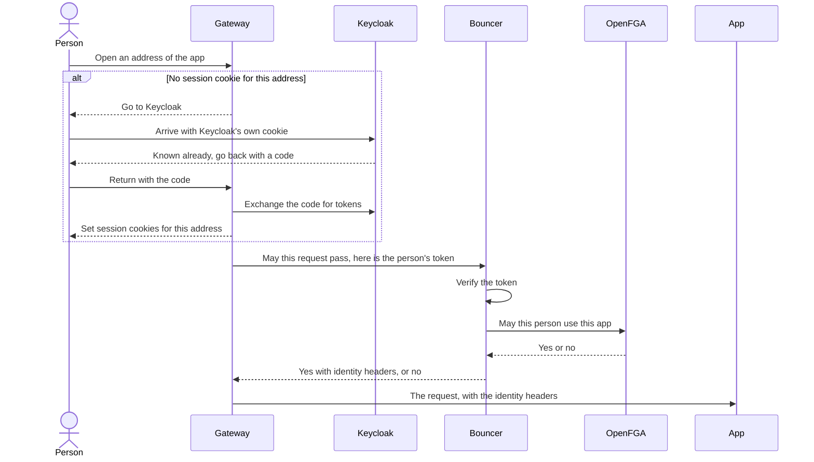
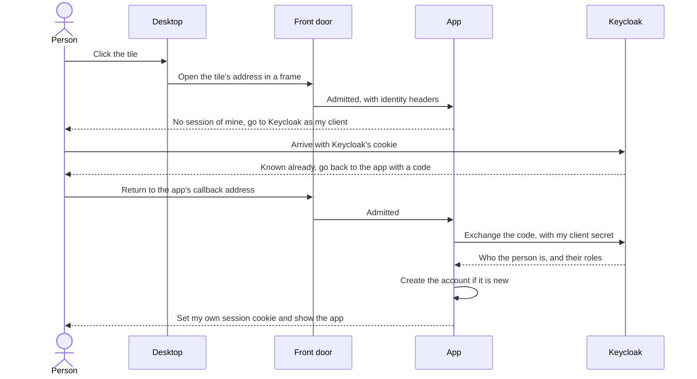
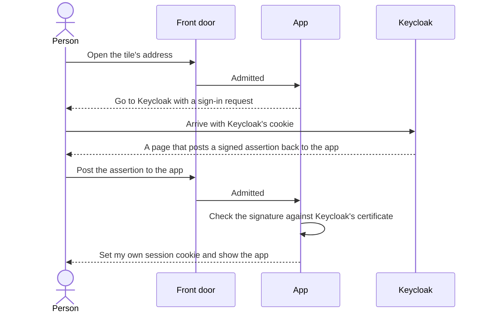
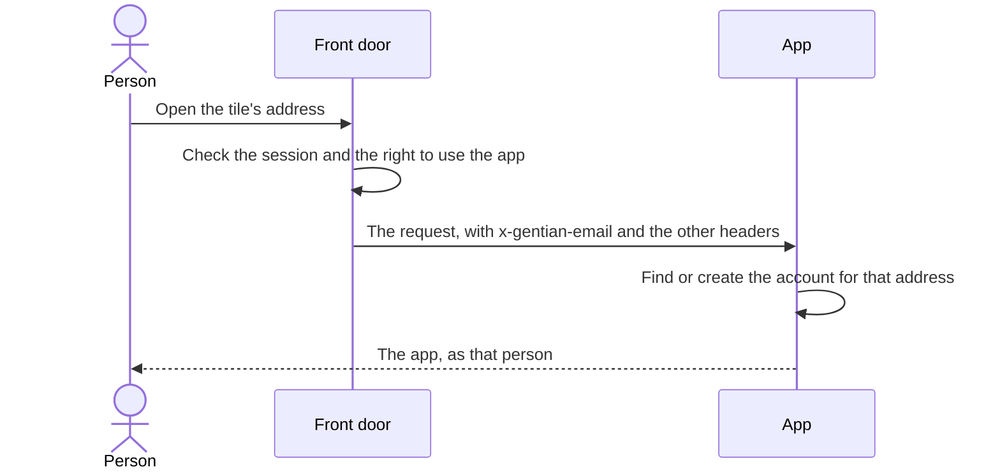
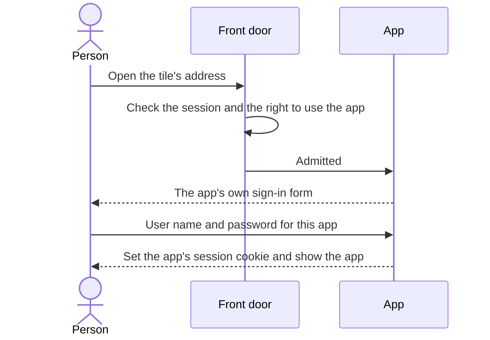
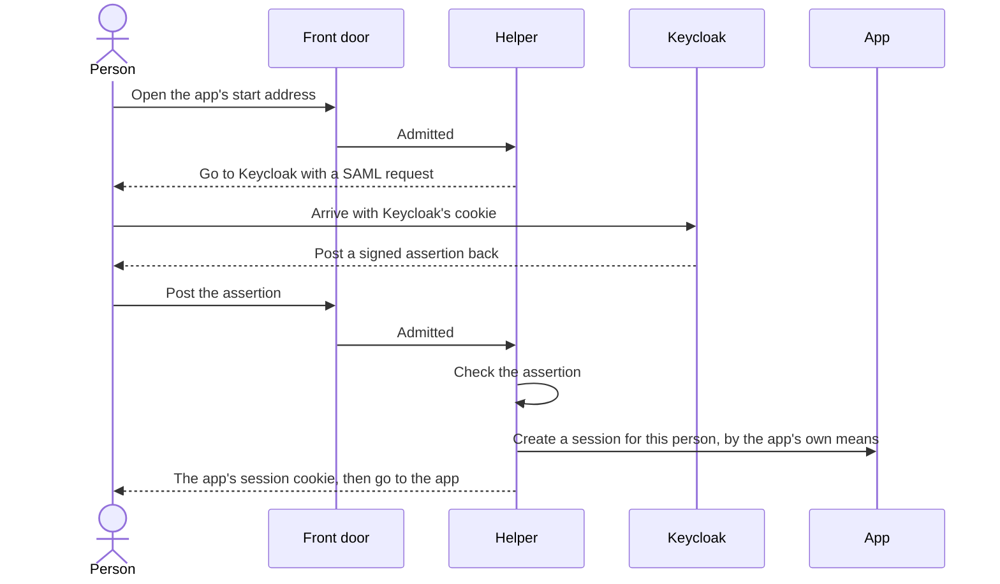
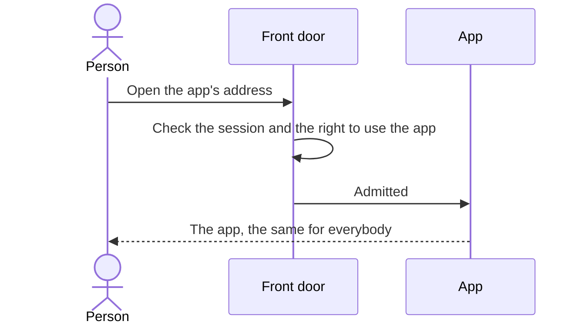
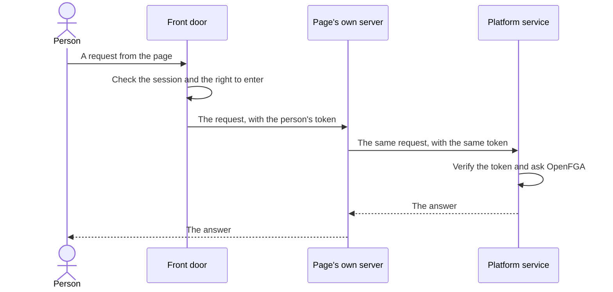
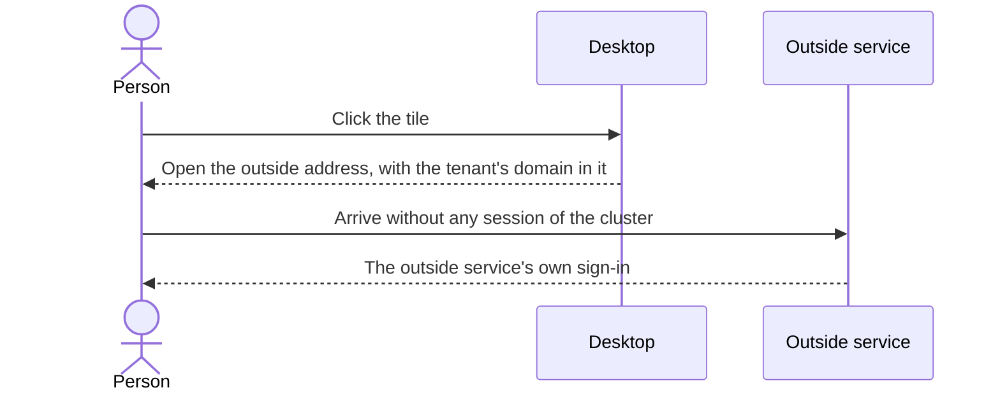

# How a person gets into an app: the sign-in procedure

## Read this first

A person signs in to their desktop once. This document says what happens
after that, when they click a tile: how the app behind the tile learns who
they are, for every kind of app the platform can carry.

- Section 1 explains the words used.
- Section 2 describes the front door, which every app sits behind.
- Section 3 is one table: which case is my app?
- Section 4 describes four constraints that come up in several cases.
- Sections 5 to 12 describe the cases, all in the same shape.
- Section 13 answers "is it more secure now than before?".
- Section 14 proposes what replaces the old hand-over in OpenProject,
  Nextcloud and Element.
- Section 15 says what the desktop should do for each case.
- Section 16 lists the decisions that are open, each with a recommendation.
- Section 17 lists what could not be verified.
- Appendix A classifies every app in the catalogue. Appendix B lists sources.

What is fact and what is proposal. Statements about the platform describe
the code on the branch `test-cb` of this repository and the catalogue on the
branch `v05` of `gentian-apps`, both as of 2026-10-08. Statements about an
app's abilities come from the vendor's documentation or source code for the
version the catalogue pins; Appendix B has the links. Anything that is a
proposal is under a heading or a sentence that says "proposal" or
"recommendation". Where a conclusion comes from reading code and was not
tried on a cluster, the text says so.

Three short answers, each explained later:

- **Does the procedure work for apps where single sign-on is a paid feature
  that is switched off?** The front door works for every app, so nobody
  reaches such an app without being signed in and entitled. What is missing
  is the last step: the app does not learn who the person is by itself. There
  are three ways to close that gap, none as good as real single sign-on.
  Section 8 lays them out and recommends one.
- **Is it more secure than the old hand-over?** Yes, clearly, for the apps
  that use single sign-on. Not yet for sign-out, for tenants on their own
  domain, and for the username-and-password apps. Section 13.
- **Do the apps in the catalogue follow this today?** Partly. Appendix A
  names the open issues per app. Two of them are general: Keycloak's
  sign-out notice does not reach any app today (section 4.1), and three
  apps still carry parts of the old hand-over (section 14).

## 1. The words used

| Word | Meaning |
| --- | --- |
| **Tenant** | One organisation on the cluster, with its own people, apps and addresses. |
| **Desktop** | The page a person lands on after signing in. It shows a tile for each thing they may open. Each tenant has its own, at `desktop.<tenant's domain>`. |
| **Tile** | One entry on the desktop. A click opens an address. |
| **Frame** | A page shown inside another page. The desktop opens an app in a frame, so the app appears as a window on the desktop. |
| **Identity provider** | The program that holds the accounts and passwords and vouches for who somebody is. Here it is Keycloak, at `id.<cluster's domain>`. |
| **Realm** | A separate set of people inside Keycloak. Every tenant has its own realm. The platform's administrators have theirs, called the kernel realm. |
| **Single sign-on** | A person signs in once, at the identity provider, and every app opens without asking again. |
| **Session** | The memory that a browser has signed in. It is kept as a cookie, a small value the browser sends with each request. |
| **OIDC** | OpenID Connect. The standard way for an app to ask an identity provider "who is at this browser?". The answer comes back as a signed *token*. |
| **SAML** | An older standard with the same purpose. The answer is a signed XML document, called an *assertion*. |
| **Client** | An app's registration at Keycloak: its name, its secret and the addresses Keycloak may send a browser back to. |
| **Front door** | The two programs every request passes before it reaches an app: the Gateway and the bouncer. Section 2. |
| **Component profile** | The file that describes an app to the platform: what to install, what it needs, which addresses it serves, which tile it shows. The *catalogue* is the collection of these files. |
| **Back-channel logout** | Keycloak tells an app, server to server, that a person's session has ended, so the app can end its own. |
| **Same site** | Two addresses are on the same site when they share the registrable domain: the part a person buys, such as `example.org`. `desktop.acme.example.org` and `files.acme.example.org` are on the same site. `desktop.acme.com` and `id.example.org` are not. Browsers treat cookies differently across sites. |

## 2. The front door, which every case shares

Every address of an app is behind the same two programs. This part is the
same for all cases; the cases differ only in what the app does afterwards.

What each part does:

- **The Gateway** keeps the sign-in session. It is the program Envoy Gateway.
  If the browser has no session for the address, the Gateway sends it to
  Keycloak. Keycloak recognises the person from the sign-in at the desktop
  and answers without showing a form. The Gateway stores the result in
  cookies. The cookies are encrypted, are valid for this one address only,
  and are marked `SameSite=Lax`, which means a browser sends them only when
  the page at the top of the window is on the same site.
- **The bouncer** decides whether this person may enter this address. It
  verifies the person's token itself and asks OpenFGA, the platform's
  authority on rights, one question: may this person use this app
  (`can_use`). The right comes from a group in Keycloak named
  `gentian:tenant:<tenant>:app:<profile>`; a tenant administrator puts
  people into it.
- **What the app receives.** On every request it lets through, the bouncer
  sets five headers and overwrites anything a browser sent under these
  names ([decider.go](../../internal/bouncer/decider.go)):

  | Header | Content |
  | --- | --- |
  | `x-gentian-subject` | The person's permanent identifier in Keycloak |
  | `x-gentian-realm` | The realm the person belongs to |
  | `x-gentian-session` | The identifier of the person's Keycloak session |
  | `x-gentian-email` | The person's e-mail address |
  | `x-gentian-name` | The person's display name |

  There is no header for groups or for a user name. The headers are not
  signed.
- **What the app does not receive.** The bouncer removes the person's token
  and the Gateway's cookies from the request. An app sees its own cookies
  and the five headers. One exception exists: an address whose profile says
  `forwardToken: true` receives the token. Only the platform's own pages
  may say that (section 10).
- **Framing.** The Gateway sets, on every app address, which pages may show
  it in a frame: the app itself, the desktop of the app's own tenant, and
  the app's other addresses. Nobody else.

So three separate sessions exist once an app with its own sign-in is open:

| Session | Kept by | Lives |
| --- | --- | --- |
| Keycloak's | Keycloak, as a cookie for `id.<cluster's domain>` | Twelve hours by default; a tenant may set its own limits |
| The front door's | The Gateway, as cookies per address | As long as Keycloak's: its token lasts five minutes and the Gateway renews it against Keycloak's session |
| The app's own | The app, as its own cookie | Whatever the app decides |

The first two end together. The third is the subject of section 4.1.

More detail: [routing.md §4](../design/routing.md),
[operator-split-plan.md §3.6 and §4.6](operator-split-plan.md).

## 3. Which case is my app?

Ask the questions in this order and stop at the first "yes". "In the edition
installed" matters: several apps can do single sign-on only in a paid
edition.

| # | Question | Case | Section |
| --- | --- | --- | --- |
| 1 | Is it a page of the platform itself that calls the platform's services (desktop, admin console, App Store app)? | The platform's own pages | 10 |
| 2 | Is the tile only a link to a service outside the cluster? | A link to an outside service | 12 |
| 3 | Can the app, in the edition installed, sign people in with OIDC? | Standard single sign-on, OIDC | 5 |
| 4 | Can it do so with SAML and not with OIDC? | SAML | 6 |
| 5 | Can it take the person from headers set by a proxy in front of it? | The app trusts the front door | 7 |
| 6 | Does it have accounts with a user name and a password, and none of the above? | User name and password only | 8 |
| 7 | Does it have no accounts at all? | No sign-in in the app | 9 |
| – | Is the caller a program and not a person at a browser? | Programs, not people | 11 |

If both 3 and 5 are true, take 3. The recommendation of this document is
OIDC wherever the app offers it.

Where the catalogue's apps fall today:

| Case | Apps |
| --- | --- |
| OIDC | Nextcloud (both editions in the catalogue) and its nine add-ons, XWiki, Mathesar, Open WebUI, Element, Odoo and its eleven add-ons; of the platform's tools, Argo CD and Headlamp |
| SAML | None directly. Docmost and Activepieces use a SAML helper in front of a password sign-in; they are listed under "user name and password only" |
| Trusts the front door | None |
| User name and password only | OpenProject (single sign-on needs the paid edition), Docmost and Activepieces (the same; both use a helper today), the LiteLLM console |
| No sign-in in the app | The document editor Collabora, which Nextcloud opens |
| The platform's own pages | Desktop, admin console, App Store app, Keycloak's administration console |
| Link to an outside service | Subscriptions |

Appendix A has the full table.

## 4. Four constraints that come up in several cases

### 4.1 An app's own session can outlive the desktop's sign-out

When a person signs out at the desktop, the Gateway removes its cookies and
Keycloak ends its session. Within five minutes no address of the tenant
admits that browser any more. The app's own cookie is still in the browser,
and the app still considers it valid.

What this means in practice:

- **Nobody gets in without the front door.** The app is reachable only
  through the Gateway (section 7 explains how that is enforced), and the
  Gateway demands a live session. A person whose account was disabled is
  shut out within five minutes, whatever the app remembers.
- **The wrong person can appear in the app.** Anna signs out. Ben signs in
  on the same browser and opens the app. The front door admits Ben, as Ben.
  The app sees its old cookie and shows Anna's account. This is the real
  risk, and it exists on shared computers.
- **Anything that reaches the app another way is not covered.** A password
  the app issued itself, a token for its programming interface, a mobile
  client: these do not pass through the desktop's session and do not end
  with it.

The standard remedy is back-channel logout: Keycloak sends the app a signed
notice, and the app ends the sessions that belong to it. It is defined in
OpenID Connect Back-Channel Logout 1.0.

**State today: the notice does not arrive.** Six profiles declare an address
for it, and the platform registers that address on the app's Keycloak client
(`backchannelLogoutUrl` in
[app-default.yaml](../../crossplane/compositions/app-default.yaml)). The
address is the app's public address. A request to it passes the Gateway,
which finds no session, because Keycloak is not a browser and has no cookie,
and answers with a redirect to the sign-in page. The operator's code makes
no exception for these addresses, and [routing.md §4.2](../design/routing.md)
says so in one sentence: there is no back-channel logout. This conclusion
comes from reading the code; it was not tried on a cluster.

One half of the path already exists: the network rules of a tenant's
namespace admit Keycloak's namespace, with the comment that Keycloak calls
an app's back-channel logout address
([baseline.go](../../internal/kernel/netpolicy/baseline.go)). What is
missing is an address that leads there without the Gateway. Decision 5 in
section 16 proposes one.

Two limits of the notice itself, from Keycloak's documentation and code for
26.0.7, the version installed when this was read (the platform now runs
26.8.0): Keycloak sends it when a person signs out,
not when a session simply runs out; and it sends it once, without trying
again if the app does not answer.

Which apps could act on the notice, according to their vendors:

| App and version | Back-channel logout | Note |
| --- | --- | --- |
| Nextcloud 33 with `user_oidc` 8.10.1 | Yes | Keycloak must send the session identifier |
| Open WebUI 0.10 | Yes, when `ENABLE_OAUTH_BACKCHANNEL_LOGOUT` is on | Off by default; the profile does not set it |
| Synapse 1.115 (behind Element) | Yes, when `backchannel_logout_enabled` is on | Off by default; the profile does not set it |
| XWiki, OIDC authenticator 2.20.2 | Yes | The endpoint exists in the source at this version |
| OpenProject 16 | Yes | Only where OIDC itself is available, which needs the paid edition |
| Mathesar 0.12 | None found | |
| Odoo 19 (`auth_oauth`) | No | The module has no sign-out handling |
| Argo CD 3.5, Headlamp 0.45 | No | |
| Docmost, Activepieces (free editions) | No | They have no single sign-on at all |

### 4.2 A frame, and a tenant on its own domain

The desktop shows an app in a frame. The first time an app's address is
opened, the frame is sent to Keycloak and back (section 2), and a second
time when the app starts its own sign-in (section 5). Both trips are silent
only if the browser sends Keycloak's cookie from inside the frame.

- **Tenant under the cluster's domain.** The desktop is
  `desktop.acme.example.org`, the app is `files.acme.example.org`, Keycloak
  is `id.example.org`. All three are on the same site. Every browser sends
  the cookie. This works.
- **Tenant on its own domain.** The desktop is `desktop.acme.com`, the app
  is `files.acme.com`, Keycloak is still `id.example.org`. Inside the frame,
  Keycloak is now a *third party*: a site other than the one in the address
  bar. Browsers restrict cookies for third parties, to stop tracking across
  sites. Keycloak's cookie is exactly such a cookie.

What the browsers do with a third-party cookie in a frame, by default:

| Browser | Default behaviour | Result for a framed sign-in on a tenant's own domain |
| --- | --- | --- |
| Chrome | Third-party cookies are allowed. Google announced in July 2024 that it would not remove them and in April 2025 that it would not add a prompt. They are blocked in Incognito windows, and where the person or their employer's policy blocks them | Works, except in those situations |
| Edge | Blocks third-party cookies only for sites on its list of trackers | Works, as long as the identity provider is not on such a list |
| Firefox | Since June 2022 every site gets a separate cookie store per site in the address bar (Total Cookie Protection) | Keycloak's cookie from the desktop's sign-in is not visible in the frame. Keycloak shows its sign-in form inside the window |
| Safari | Blocks all third-party cookies, since March 2020, without exception | Keycloak cannot keep any cookie in the frame. Its form appears and the sign-in cannot be completed there |
| Brave | Blocks third-party cookies and storage | As Safari |

The last column is what follows from each vendor's documented rule. It was
not tested against this platform.

Two mechanisms exist that could lift the restriction, and neither helps
here without new work. The *Storage Access API* lets a framed page ask the
browser for its cookies; it needs a click inside the frame, in Safari also a
prompt, and Keycloak's pages do not call it. *Partitioned cookies* (CHIPS)
are kept per site in the address bar by design, so they cannot carry the
desktop's sign-in into the frame; Keycloak 26.0 does not set them anyway.

The same trips made in a browser tab of their own are not affected: there
Keycloak is the page in the address bar for a moment, which makes it a first
party, and every browser sends its cookie.

So, on a tenant with its own domain, an app in a frame cannot be relied on
to sign in silently. Opened in a new tab, it can. Decision 2 in section 16
recommends the new tab as the rule for such tenants. A cluster whose own
domain is a public suffix (a name under which anybody can register, such as
`github.io`) has the same problem for every tenant;
[routing.md §4.3](../design/routing.md) already says to avoid that.

### 4.3 Keycloak's own pages in a frame

Keycloak, as delivered, refuses to be shown in a frame of another site. It
sends `X-Frame-Options: SAMEORIGIN` and a matching content security policy,
as a protection against a page that overlays the sign-in form with something
else.

This platform relaxes that. The realm's own headers are cleared
([tenant-default.yaml](../../crossplane/compositions/tenant-default.yaml)),
and the Gateway sets a list instead: the platform's desktop, every address
under the cluster's domain, and every address under each tenant's domain
([frame_ancestors.go](../../internal/controller/frame_ancestors.go)). The
reason given in the code is that a sign-in inside a desktop window must be
able to finish.

Two consequences:

- A silent trip through Keycloak needs none of this. Keycloak answers such a
  trip with a redirect, not with a page, and a redirect is not subject to
  framing rules. The relaxation matters only when Keycloak has to show its
  form inside a frame, for example after its session ran out while the
  desktop stayed open.
- The list is wide. On a cluster with several tenants, a page of any app of
  any tenant may frame the sign-in form of any realm. Decision 8 in section
  16 proposes to narrow it.

### 4.4 A "continue" page in the middle

Some apps do not start their sign-in on a plain link. They show a page with
a button first, as a protection against other sites starting a sign-in
behind the person's back. The widely used Django library `django-allauth`
does this unless its setting `SOCIALACCOUNT_LOGIN_ON_GET` is on, and
Synapse shows a "continue to your account" page unless the client's address
is on its `sso.client_whitelist`. Where such a page exists, a tile that
points at the sign-in address still costs a click. Each case below says
which setting removes it.

## 5. Case 1: standard single sign-on with OIDC

This is the default and the recommendation.

**When it applies**

The app can act as an OIDC client in the edition that is installed. It does
the sign-in itself and keeps its own session.

**What the person experiences**

They click the tile. The app opens in a window on the desktop, already
signed in as them. No form, no button. The very first time, the app creates
their account from what Keycloak says about them. The first opening of an
app after signing in can take a second longer, because the browser makes two
silent trips to Keycloak.

**What happens, step by step**

1. The desktop opens the tile's address in a frame.
2. The front door admits the request (section 2).
3. The app has no session for this browser. It sends the browser to
   Keycloak, naming its own client.
4. Keycloak recognises the person from its cookie and sends the browser
   back with a one-time code. It shows nothing.
5. The app exchanges the code at Keycloak, server to server, using its
   client secret. It receives a token that says who the person is.
6. The app finds or creates the person's account, maps their roles, sets its
   own cookie and shows its first page.

Step 3 is where apps differ. An app whose front page is a sign-in form with
a "sign in with …" button does not send the browser on by itself. Two ways
to remove the click:

- **A setting in the app** that skips its own form. This is the better way,
  because it also covers a person who opens the app's address directly.
- **The tile's address** points at the app's "start sign-in" address
  instead of its front page.

| App | What removes the click | Set today |
| --- | --- | --- |
| Nextcloud, `user_oidc` 8.10.1 | `allow_multiple_user_backends` set to `0`: the sign-in page forwards to the one provider. `/login?direct=1` still shows the form, for an administrator | No. It is set to `1` |
| XWiki, OIDC authenticator | `oidc.skipped: false`: a visitor without a session is sent on | Yes |
| Open WebUI | `ENABLE_LOGIN_FORM=false` and `OAUTH_AUTO_REDIRECT=true` | Yes |
| Mathesar 0.12 | Tile address `/auth/oidc/keycloak/login/`. Mathesar replaces allauth's "continue" page with one that submits itself | Yes |
| Element with Synapse | In Element's `config.json`: `sso_redirect_options` with `immediate: true`. In Synapse: the Element address on `sso.client_whitelist` | No |
| Odoo 19 | Nothing in Odoo itself. The catalogue's own Odoo module forwards a framed sign-in page to Keycloak | Yes, by that module |
| OpenProject 16 | `OPENPROJECT_OMNIAUTH__DIRECT__LOGIN__PROVIDER` | Only with the paid edition; see section 8 |

**What the platform sets up, and which program does it**

| What | Who |
| --- | --- |
| The app's client in the tenant's realm: client ID, secret, the addresses Keycloak may return to, the addresses allowed after sign-out, the back-channel logout address | The operator, through the composition [app-default.yaml](../../crossplane/compositions/app-default.yaml), from the profile's `requires.services.identity.oidc` |
| The client secret, in the vault under the tenant's path, and delivered into the app's settings | The same composition, from `package.valueMapping.oidc` |
| The scopes, the claims in the token and the client roles the app needs | The same composition, from the app's *OIDC pack* (a companion file, kind `OIDCPackCatalog`, shipped with the profile) |
| The app's entitlement group `gentian:tenant:<tenant>:app:<profile>` | The same composition |
| The route, the session in front of it, the bouncer's question, the frame rule | The operator ([component_reconciler.go](../../internal/controller/component_reconciler.go)) |
| The tile | The operator writes the list; the usher serves it to the desktop |
| Who is in the group | A tenant administrator, in the admin console; the registrar writes it to Keycloak |

**Accounts.** Most apps create the account at the first sign-in. That has
one weakness: a person cannot be given anything in the app (a share, a
task, administrator rights) before they have opened it once. Mathesar's
profile shows the remedy: a job of the profile creates the accounts of the
app's administrators ahead of time, through the app's own interface, and
keeps their rights in step with a Keycloak group.

**Roles.** A role in the app follows from a group in Keycloak. The pack
turns the group into a claim in the token, and a setting of the app maps the
claim to a role. Open WebUI's profile is the clearest example: the app's
entitlement group is the role that may enter, and the tenant's
administrators group is the role that administers.

**What the app's profile must state**

- `requires.services.identity.oidc`: `clientId`, `accessType: CONFIDENTIAL`
  for an app with a server, `redirectUris`, `postLogoutRedirectUris`, and
  `backchannelLogoutUrl` if the app supports it.
- `package.valueMapping.oidc`: under which chart values the issuer, the
  client ID and the client secret are delivered.
- `expose`: an entry with `surface: gateway` and `authMode: oidc`, and a
  `tile` with the permission that shows it (`relation`).
- The setting that skips the app's own sign-in form, in the chart values;
  or, failing that, `tile.path` set to the app's "start sign-in" address.
- An OIDC pack, if the app needs scopes, claims or roles of its own.

Note on a name: `authMode: oidc` on an exposure describes the front door,
not the app. Every address on the Gateway says `oidc`, including the ones
of apps without any single sign-on. The profile has no field that says how
the *app* signs people in (section 8.5).

**Signing out**

- **At the desktop.** The front door and Keycloak end their sessions. The
  app's session stays (section 4.1) until back-channel logout is delivered.
- **Inside the app.** Most apps end their own session and then send the
  browser to Keycloak's sign-out address, which ends Keycloak's session too.
  That signs the person out of the desktop as well. The addresses Keycloak
  may return to afterwards must be listed in `postLogoutRedirectUris`.
  Several profiles still list `https://portal.<cluster's domain>/` there,
  an address of the old portal that no longer exists.

**How secure it is, and what it does not protect**

- The protocol is a published standard and the apps use maintained
  libraries for it. Nothing in the path was written for this platform.
- The person's password is typed at Keycloak only. The app never sees it.
- The app holds one secret, for its own client. With it, somebody can
  complete sign-ins for this app. They cannot use it for another app,
  because Keycloak returns a code only to the addresses registered for this
  client.
- The app's token is issued to the app's client. The person's token for the
  platform never reaches the app.
- Not protected: the app's own session after sign-out (section 4.1), and
  whatever the app offers besides the browser, such as its own passwords
  and tokens.

**Known limits**

- Two silent trips to Keycloak on the first opening of each app.
- Does not work reliably in a frame for a tenant on its own domain
  (section 4.2).
- Odoo's module is OAuth2, not OIDC. It receives the token in the address
  of the page (the *implicit flow*), which newer guidance advises against,
  and it cannot receive a sign-out notice.

**In short:** the app asks Keycloak, Keycloak already knows the person, and
the app keeps its own session. One setting per app removes the last click.
Sign-out does not reach the app yet.

## 6. Case 2: SAML

**When it applies**

The app can sign people in with SAML and not with OIDC. Keycloak can act as
a SAML identity provider beside its OIDC role, for the same people, in the
same realm.

No app in the catalogue speaks SAML itself today. Two profiles declare a
SAML client, but the party that speaks SAML is a helper program in front of
the app, not the app. That arrangement is described in section 8.2.

**What the person experiences**

The same as with OIDC: click, the app opens signed in.

**What happens, step by step**

**What differs from OIDC**

- **No call from the app to Keycloak.** The signed assertion travels through
  the browser. The app trusts it because of the signature. With OIDC the
  app fetches the answer itself.
- **A certificate instead of a secret.** The app must know the certificate
  Keycloak signs with. If the app reads it from Keycloak's metadata address
  (`/realms/<realm>/protocol/saml/descriptor`), a change of the realm's key
  is picked up. If the certificate was copied into the app's settings, every
  such app must be reconfigured when the key changes, or sign-in stops.
- **Who starts.** *SP-initiated*: the app sends the browser to Keycloak
  with a request, as in the diagram. *IdP-initiated*: the browser goes to
  an address at Keycloak, which posts an assertion to the app unasked. The
  second needs no "start sign-in" address in the app and suits a tile. It
  is also weaker, because the app cannot tie the answer to a request it
  made. Use SP-initiated where the app supports it.
- **Signing out.** SAML has its own *single logout*: Keycloak tells the app
  through the browser or directly. It must be configured on both sides, and
  through the browser it has the same limit as section 4.2.

**What the platform sets up, and which program does it**

The operator creates the SAML client when the tenant's identity is set up,
with a job that calls Keycloak's administration interface
([identity_reconciler.go](../../internal/controller/identity_reconciler.go),
`buildSAMLClientScript`). It sets the client's name, the one address the
assertion may be posted to, and three attributes: `email`, `firstName`,
`lastName`.

What it does not set today: an address for single logout, a name for an
IdP-initiated start, an attribute for groups or roles, and any delivery of
Keycloak's certificate or metadata address into the app's settings. There is
no `valueMapping` for SAML. A real SAML app would need these, so this case
is partly built.

**What the app's profile must state**

`requires.services.identity.saml` with `entityId` (the app's name as a SAML
party) and `acsUrl` (the address the assertion is posted to). Beyond that,
the same exposure and tile as in section 5.

**Signing out**

As with OIDC, the app's session is its own (section 4.1). The remedy here is
SAML's single logout, which the platform does not configure.

**How secure it is, and what it does not protect**

Comparable to OIDC when the app checks the signature, the addressee, the
validity period and that it asked for this answer. SAML libraries have a
history of mistakes in exactly these checks, which is one reason to prefer
OIDC. The certificate question above is an operating risk: a forgotten app
stops working on the day the key changes.

**Known limits**

Partly built, as said. No sign-out notice. In a frame on a tenant's own
domain, the same limit as section 4.2.

**In short:** the same experience by an older protocol. Use it only for an
app that offers nothing else, and expect to add platform work first.

## 7. Case 3: the app trusts the front door

**When it applies**

The app can be told who the person is by request headers, set by a proxy in
front of it. Vendors call this "trusted header", "reverse proxy" or "remote
user" authentication. The front door already sets such headers on every
request (section 2).

No app in the catalogue uses this today. Which ones could:

| App | Support | Setting |
| --- | --- | --- |
| Open WebUI 0.10 | Yes | `WEBUI_AUTH_TRUSTED_EMAIL_HEADER`, and optionally headers for name, groups and role |
| OpenProject 16 | A header with a shared secret exists (`OPENPROJECT_AUTH__SOURCE__SSO`). The vendor documents it under a paid feature; the code path itself shows no licence check. Not verified which holds | |
| XWiki | Through an extension for header authentication. Seen in search results only, not verified | |
| LiteLLM console | Only with the vendor's paid licence | |
| Odoo 19, Mathesar, Docmost, Activepieces | None found | |

**What the person experiences**

The simplest of all cases. They click the tile and the app shows their
account. There is no trip to Keycloak for the app, so nothing flickers and
nothing depends on cookies in a frame beyond the front door's own.

**What happens, step by step**

**What it requires**

**The app must be reachable only through the front door.** An app in this
mode believes whoever sends the header. Anybody who can send it a request
directly can be anybody.

How the platform keeps others out:

- A tenant's namespace is closed by default. The rule
  ([baseline.go](../../internal/kernel/netpolicy/baseline.go)) admits
  three sources to an app's programs: the Gateway's namespace, Keycloak's
  namespace, and the operator's namespace.
- Programs of the same app may talk to each other.
- Another app of the same tenant may reach it only where an integration
  between the two has been granted.
- The bouncer overwrites the five headers on every request it admits, so a
  browser cannot send its own.

What remains open, and must be checked for each app before it uses this
mode:

- An app with a granted integration to this one can send it requests
  directly, with any header it likes.
- An address published to the internet without sign-in (a *perimeter*
  entry) does not pass the bouncer. Whether the proxy there removes
  `x-gentian-` headers was not verified.
- Network rules work only on a cluster whose network enforces them.
- The header carries the e-mail address. An app that keys accounts on it
  hands an old account to whoever is given that address later. The
  permanent identifier in `x-gentian-subject` does not have this problem,
  but apps rarely accept it.

**What the platform sets up, and which program does it**

Nothing beyond the front door. No client at Keycloak, no secret.

**What the app's profile must state**

The app's setting that names the header, in the chart values. An exposure
with `authMode: oidc` and a tile. No `requires.services.identity`. Today
nothing in the profile says "this app trusts the headers"; section 8.5
proposes a field for it.

**Signing out**

There is no session of the app to end, if the app reads the header on every
request. The front door's session is the only one. This is the one case in
which section 4.1 does not apply. Some apps read the header once and then
keep a cookie of their own; for those it applies again.

**How secure it is, and what it does not protect**

Strong at the front door, and nothing behind it. With OIDC, a stranger who
reaches the app directly still has to pass the app's own sign-in. Here they
do not. The whole protection is the network rule.

**Known limits**

Few apps support it. Roles need a header for groups, which the bouncer does
not set.

**In short:** the best experience and the least to operate, at the price
that the network rule is the only lock. Acceptable for an app that has
nothing else, after the checks above.

## 8. Case 4: user name and password only

This section answers the question: *will this sign-in procedure also work
for apps where single sign-on is deactivated because it is a paid feature?*

### 8.0 The answer

Half of it works unchanged, and that is the important half. The front door
does not depend on the app. Nobody reaches the app without having signed in
at Keycloak and without the right to use this app. An app without single
sign-on is exactly as well guarded from outside as one with it.

The other half does not come for free. The app has its own accounts and its
own sign-in form, and it does not know that the person was just checked. The
person is asked again unless something is built to prevent it. There are
three ways to deal with that, 8.1 to 8.3, plus standards that help with
accounts but not with sign-in, 8.4.

Apps in the catalogue where this applies:

| App | Why |
| --- | --- |
| OpenProject 16 | OIDC and SAML are an add-on of the paid edition. Without its token the app ignores every configured provider |
| Docmost 0.95 | SAML, OIDC and LDAP are in the paid tiers. The free edition has e-mail and password |
| Activepieces | Single sign-on is a paid feature. The free edition has e-mail and password |
| LiteLLM console | Single sign-on is free for up to five users and paid beyond. The platform configures a user name and password |

### 8.1 Option a: the front door, then the app's own sign-in

**What the person experiences.** They click the tile. The app shows its own
sign-in form. They type the user name and password they have for this app.
The browser can remember them.

**How the account comes to exist.** Either a person creates it by hand in
the app, or the platform creates it when the tenant administrator grants the
app to a person. The second needs the app to have an interface for creating
users, and a job in the profile that calls it. The profile kind already has
a place for such a job (`provisioning.syncJob`); Mathesar's profile uses it.

**Where the password lives.** With the person, and as a hash in the app. The
platform does not know it. The person sets it through the app's own
"set your password" mail or page.

**How secure it is.** Sound. Two independent locks: Keycloak with its second
factor at the door, the app's password behind it. A stolen app password is
useless without a session at the front door. The weak point is ordinary: a
second password for people to manage, and an account that stays in the app
when the person leaves, unless the platform also removes it.

**Signing out.** The app's session is its own, as in section 4.1, and no
notice can end it.

This is the case of the LiteLLM console today.

### 8.2 Option b: a helper in front of the app that signs the person in

A small program, written for this one app, stands beside it. It finds out
who the person is the standard way and then creates a session in the app on
their behalf, by a means the app was not designed to offer.

Two apps in the catalogue do this today, in two different ways. Both use the
same helper for the first half: a program that acts as a SAML party towards
Keycloak (`gentian-sidecar-sso-saml` in the catalogue). It sends the browser
to Keycloak, receives the signed assertion, checks the signature, the
addressee, the audience and the validity period, and then calls a piece of
code that belongs to the app's profile. It does not check that the
assertion answers a request it sent itself.

**Activepieces.** The profile's code connects to the app's database, inserts
the person as a user if they are new, and signs a session token itself with
the app's signing key. It hands the token to the browser as a cookie and in
the browser's storage. What stands out:

- The helper holds the database login and the signing key of the app.
- Every person it creates gets the role of administrator of the whole
  Activepieces installation.
- The token is valid for seven days and nothing ends it earlier.
- It writes rows into tables of the app directly. A new version of the app
  that changes those tables breaks it.

**Docmost.** The helper is kept free of secrets. It passes the person's
e-mail address to a second small program, which runs beside Docmost itself.
That program holds a secret, derives a password for the person from the
secret and the address, and signs in at Docmost's ordinary sign-in
interface with it. The first time, it creates the account through
Docmost's invitation interface. It returns Docmost's session cookie, and
the helper passes it to the browser. What stands out:

- Nobody knows the person's password, the person included. The sign-in form
  of Docmost is of no use to them.
- The second program answers anybody who can reach it and names an e-mail
  address. It asks for no proof. What protects it is the network rule that
  only programs of the same app may reach it.
- If the secret changes, every derived password changes. The program
  repairs that by writing new password hashes into Docmost's database.
- The route that leads to the helper, and the redirect that sends the
  front page there, are declared by two annotations on the profile. The
  operator on this branch has the code that would read them, and nothing
  calls it. If that reading is right, the Docmost tile ends at a sign-in
  form nobody can pass. Not tried on a cluster.

**What this option costs.**

- One helper per app, written and maintained by whoever maintains the
  catalogue, against parts of the app the vendor does not promise to keep
  stable.
- **The helper can become any user of the app.** That is its job. A
  break-in at the helper, or at anything that may call it, is a break-in at
  every account in the app. With real single sign-on no such program
  exists.
- The app's own protections for sign-in do not apply: its second factor,
  its lock after failed attempts, its record of sign-ins.
- A vendor may see it as going around the paid feature. The platform's own
  rule is not to bypass licensing. Both profiles argue that they use only
  what the free edition offers. That is a judgement for the owner
  (decision 3).

**How secure it is.** The first half is as good as SAML. The second half is
only as good as the helper and the network rule around it.

### 8.3 Option c: the platform keeps a password per person and types it

The platform stores, for each person and app, a user name and a password.
When the person opens the app, something fills in the app's sign-in form
with them: a helper as in 8.2, or a browser extension. The industry calls
this password vaulting or form filling. Okta's "Secure Web Authentication"
and Microsoft Entra's "password-based single sign-on" are this.

This is not built, and the platform has no place for it today. The
custodian, the program that puts secrets into the vault, can write a secret
and never reads one back, on purpose. Something would have to be allowed to
read a person's app password every time they open the app.

Why it is weaker than real single sign-on:

- A password is replayed. Whoever reads it once can use it until it is
  changed. A token from Keycloak is valid for one app and for minutes.
- The store of all people's passwords for an app is a target that does not
  exist otherwise.
- The password works without the platform. If the app has any way in beside
  the front door, the password opens it.
- Sign-out and removal of a person do not touch it.

When it is acceptable: for an app that cannot do anything else and where
option a is too unpleasant, when the password is generated and rotated by
the platform, never shown to the person, and the app has no way in except
the front door. Docmost's arrangement is close to this, with the difference
that it derives the password instead of storing it.

The old hand-over was a form of this option. For OpenProject, the old
portal answered the app's helper with a user name and a password
(section 13).

### 8.4 Standards that help with accounts, not with sign-in

These create and remove accounts in an app. They make option a tolerable,
and they are useful beside single sign-on too. None of them signs anybody
in.

- **SCIM** (System for Cross-domain Identity Management, RFC 7643 and 7644)
  is a standard interface for creating, changing and removing users and
  groups. The identity side calls the app.

  | App | SCIM |
  | --- | --- |
  | Open WebUI 0.10 | Yes (`ENABLE_SCIM`, `SCIM_TOKEN`); the vendor states no licence requirement |
  | OpenProject 16.2 and later | Yes, in the top paid plan only |
  | Activepieces, Docmost, LiteLLM | Paid editions only |
  | Nextcloud | No server found. Its `scim_client` app goes the other way |
  | Odoo, Mathesar, XWiki | None found |

  On the platform's side, something must send the SCIM calls.
  [iam.md §1.8](../design/iam.md) describes a "provisioning bus" that would;
  no program in this repository sends SCIM today.
  Keycloak itself gained a SCIM interface in version 26.6 as an experiment
  and supports it from 26.8; that interface lets others manage Keycloak's
  people and does not make Keycloak call apps. The cluster's Keycloak is
  26.8.0, and the interface is off in every realm the platform creates.

- **LDAP** is the older directory protocol. Many apps can check a user name
  and password against an LDAP server, often in the free edition where
  OIDC is paid (Odoo's `auth_ldap` is in the free edition; Docmost's LDAP
  is paid). **Keycloak is not an LDAP server.** It can read people *from*
  an LDAP directory. It does not offer its own people over LDAP. To use
  this path, the platform would have to run a separate directory server,
  keep it in step with Keycloak, and accept that people type their
  password into the app, which then sends it to the directory. That gives
  one password instead of two, and loses the second factor and the rule
  that the password is typed at Keycloak only. Not recommended.

- **The app's own interface with a service token.** Most apps have an
  interface for creating users, guarded by an administrator's token or
  password. A job in the profile can call it when a person is granted the
  app. This is what makes option a workable without SCIM. The token lives
  in the vault, under the app's path, like the app's other secrets.

### 8.5 Recommendation, and a rule for the catalogue

**Recommendation.**

1. If the app has OIDC in the installed edition, use it. If single sign-on
   can be had by a licence the tenant is willing to hold, that is a normal
   and clean answer.
2. Otherwise option a, with accounts created by the platform at grant time
   through the app's interface, and removed when the grant is withdrawn.
   The person sets their own password in the app.
3. Option b only per app, after a review, recorded as a customization of
   that app with an owner and a review date, and only if the helper is not
   reachable from anywhere but the front door.
4. Option c is not offered.
5. Never a shared account. Every session in an app belongs to one person.

**A rule for the catalogue: every profile says how the app signs people
in.** Today no field does. The profile kind
([api/v1alpha1](../../api/v1alpha1/componentprofile_types.go)) has:

- `authMode` on an exposure, which describes the front door and is `oidc`
  for every app address on the Gateway;
- `requires.services.identity`, which says which client to create at
  Keycloak, and is misleading for the two apps whose helper is the SAML
  party;
- `tile.path`, an address without a meaning attached;
- an annotation from the old portal, `gentianos.io/portal-auth-mode`,
  still on the profiles of four app families. No program in this repository
  reads it.

The desktop therefore opens every tile the same way and cannot warn anybody
of anything.

Proposal: a new field on the profile, `signIn.mode`, with one of five
values.

| Value | Meaning | Case |
| --- | --- | --- |
| `oidc` | The app signs the person in at Keycloak with OIDC | 5 |
| `saml` | The same with SAML | 6 |
| `front-door` | The app takes the person from the front door's headers | 7 |
| `app-password` | The app has its own accounts and passwords | 8 |
| `none` | The app has no accounts | 9 |

Two cases need no value: the platform's own pages are recognised by
`forwardToken`, and a link to an outside service by its package kind. For
`app-password`, a second field should say whether the person will meet a
form (`signIn.prompt: true`) or a helper signs them in. The field would be
new work in this repository, in the catalogue and in the desktop. Decision 1.

**In short:** such an app is as well guarded at the door as any other. It
asks the person a second time unless a helper is built for it, and a helper
is a program that can become anybody in that app. Prefer the second
sign-in with accounts the platform creates.

### 8.6 Added 2026-10-08: the helper is now the platform's, as a third tier

Option b (8.2) was approved for apps that can do neither OIDC nor SAML, and
built as an option any profile can declare:
`requires.services.identity.sidecar`. The platform runs the helper, registers
it at the realm and routes it; the profile brings only the code for its own
app. Docmost and Activepieces use it. What 8.2 describes of those two is how
they were before: nobody has a password in either now, nobody is made an
administrator, and the second program in Docmost's pod is gone.

One correction to the diagram in 8.2: the assertion is not posted through the
front door's session. That post comes from Keycloak's address, and for a
tenant on its own domain the browser sends no session cookie with it, so the
path it goes to takes no session and the helper itself is what checks it.

Where it is described: how it works and when to use it,
[iam.md §1.11](../design/iam.md); what guards it and what remains weak,
[security.md §2.12](../design/security.md); how a profile declares it,
[app-customization.md §2.3a](../app-customization.md). Decisions 3 and 7 in
section 16 are not changed by this: which apps may use it remains a decision
per app.

## 9. Case 5: no sign-in in the app

**When it applies**

The app has no accounts. Whoever reaches it may use it.

The example in the catalogue is Collabora, the document editor that
Nextcloud opens. It has an address of its own and no users. Which document a
browser may open is decided by a short-lived token that Nextcloud issues,
not by the editor.

**What the person experiences**

The app opens. Everybody sees the same thing.

**What happens, step by step**

**What the platform sets up, and which program does it**

The front door only. The operator writes the route, the session in front of
it and the bouncer's question.

**What the app's profile must state**

An exposure with `authMode: oidc`, and a tile if people open it directly.
An address on the Gateway without a session is not possible: the operator
does not route an entry with any other mode
(`routableExposures` in
[component_reconciler.go](../../internal/controller/component_reconciler.go)).

**Signing out**

The front door's session is the only one.

**How secure it is, and what it does not protect**

The front door decides who gets in, by the entitlement group. Inside,
everybody is the same person to the app: no personal data, no record of who
did what, no rights that differ between people.

**Known limits**

The app cannot show a person their own things, and cannot say afterwards
who did what.

**When that is acceptable**

For a tool without stored content of its own: an editor that works on
somebody else's files, a converter, a viewer, a status page. Not for
anything that stores what people enter, unless everybody who is admitted may
see and change all of it. If the app has an administration page, the profile
must close it with `denyPaths`, because the app will not.

**In short:** the front door is the only lock, and the app cannot tell
people apart. Fine for tools, wrong for anything that keeps personal data.

## 10. Case 6: the platform's own pages

**When it applies**

The desktop, the admin console and the App Store app. They are part of the
platform. They show the person what the platform's services answer, and
pass the person's requests on to those services.

**What the person experiences**

They are simply signed in. There is no second step of any kind.

**What happens, step by step**

The page's own server keeps no session and holds no credential. It receives
the person's token from the front door on every request and passes it on.
Each platform service (director, usher, custodian, registrar) verifies the
token itself and asks OpenFGA whether this person may do this.

**What the platform sets up, and which program does it**

The profiles of the desktop and the admin console are part of this
repository's chart. Their entry for the page's server says
`forwardToken: true`; the entry for the page's files does not.

**What the app's profile must state**

`forwardToken: true` on the exposure that needs the token. The profile kind
allows that only for profiles of the highest trust tier, `platform`. The
reason is in the field's description: the token is valid at every platform
service.

**Signing out**

`/oauth2/logout` on the page's address ends the front door's session and
Keycloak's. There is no third session.

**How secure it is, and what it does not protect**

There is nothing to keep in step, which is the strength. The weakness is
known and recorded in
[operator-split-plan.md §6](operator-split-plan.md): one token is accepted
by all platform services, so a break-in at a page's server can use each
passing token at all of them while it is valid, which is five minutes.

**Related: tools that came with the platform**

| Tool | How it signs in |
| --- | --- |
| Keycloak's administration console | The page runs its own OIDC sign-in in the browser and calls Keycloak with its own token. The front door leaves that token alone on this one route and proves the session by a second token the Gateway hands it (`keepClientToken`, a setting of the operator's route, not of a profile) |
| Argo CD, Headlamp | Case 1, against the kernel realm |
| LiteLLM console | Case 4, option a: a user name and password from the vault |

**Known limits**

The App Store app exists; placing it on tenants is not built yet
([operator-split-plan.md §8](operator-split-plan.md)).

**In short:** the front door hands the person's token to the page's server,
which passes it to the platform's services. No second sign-in exists.

## 11. Case 7: programs, not people

Everything above is about a person at a browser. It does not apply to a
command line tool, a script or an agent. Those do not pass the Gateway's
session at all. The command line tool signs in as the person and reaches
the platform's services another way; see [commands.md](../commands.md). How
an agent gets an identity and rights of its own is the subject of
[agents.md](agents.md), which is being written.

**In short:** browser sign-in does not apply to programs.

## 12. Case 8: a link to a service outside the cluster

**When it applies**

The tile leads to a service that does not run on the cluster. The catalogue
has one: Subscriptions.

**What the person experiences**

A click opens the outside service. That service asks them to sign in, by
its own means.

**What happens, step by step**

**What the platform sets up, and which program does it**

Only the tile. No route, no session, no client. The usher shows the tile to
people who hold the permission the tile names.

**What the app's profile must state**

`package.api` with `runtime: redirect`, the outside address, and a tile.

**Signing out**

Not the platform's. The outside service has its own session.

**How secure it is, and what it does not protect**

The cluster hands nothing over: no token, no header. The tile is a
bookmark. Who may enter is the outside service's decision alone. The
address carries the tenant's domain, which is not a secret.

**Known limits**

It must open in a new tab: an outside site is never on the same site as the
desktop, and most refuse to be framed.

**In short:** a bookmark. The platform vouches for nothing.

## 13. Is it more secure now than before?

### What the old hand-over was

The old portal signed a person into three apps with a mechanism of its own,
called the portal session bridge. The portal's part no longer exists. What
follows is read from the parts that are still in the three apps' profiles.

1. The portal created a one-time *ticket* and opened the app with the ticket
   in the address (`?t=…`).
2. A page or a small program inside the app took the ticket and redeemed it
   at the portal, by a call from the app to the portal.
3. What came back depended on the app. For OpenProject: a user name and a
   password, which the program typed into OpenProject's sign-in form. For
   Element: a ready-made access token for the chat server, which the page
   wrote into the browser's storage. For Nextcloud: a session set up on the
   server side, with a password set for the person on the way.

So the portal could produce a working credential for any person in each of
these apps, and handed it out against a ticket that travelled in an address.

### What is better now

Compared with the old hand-over itself:

| Then | Now |
| --- | --- |
| A mechanism written for this platform | A published standard, carried out by the apps' own, maintained code |
| The portal could mint a session or a password for anybody in an app | No program of the platform can. The app asks Keycloak, and Keycloak answers only for the person at the browser |
| The app called the platform to redeem the ticket | The app calls nothing of the platform. It talks to Keycloak, with a secret that is valid for its own client only |
| A ticket in the address, which ends up in browser history and logs | A one-time code, bound to the app's client and useless without the app's secret |
| OpenProject's second factor was switched off so the bridge could sign in | Not needed any more. The setting is still off and should be turned on again (section 14) |

What the front door adds around it. The old profiles describe a plain
public address per app, with nothing in front of the app; the last three
rows were weaknesses of earlier states of the front door and are closed:

| Then | Now |
| --- | --- |
| The app's own sign-in was the only check on who reached it | The front door checks the session and the right to use this app before the app sees the request |
| An app found the person's platform tokens in the request's cookies | The bouncer removes them. The app gets five headers |
| The session's tokens were kept in the browser unencrypted | The Gateway encrypts them |
| The platform's desktop could frame every tenant's app | Only the tenant's own desktop may |

### What is not better yet

- **Sign-out does not reach the apps** (section 4.1). This was so before as
  well. The front door now bounds it: a browser without a live session
  reaches no app.
- **Tenants on their own domain** cannot rely on silent sign-in in a frame
  (section 4.2). The old hand-over was built to get around exactly this. The
  answer now is a new tab.
- **The user-name-and-password apps** (section 8). Two of them use a helper
  that can become any user of its app, as the old portal could, though only
  for that one app.
- **Keycloak's sign-in pages may be framed** by any address of any tenant
  (section 4.3).

### What a break-in at an app can and cannot reach now

Somebody who takes over an app, meaning they run their own code as the app:

| Can | Cannot |
| --- | --- |
| Read and change everything in that app | Reach another app of the tenant, unless an integration between the two was granted |
| See the name, e-mail address and identifier of everybody who uses it | Obtain anybody's password. It is typed at Keycloak only |
| Use the app's client secret to complete sign-ins for this app | Sign in to any other app or to the platform with that secret |
| Keep people's sessions in this app alive | Obtain a person's token for the platform's services, or the front door's cookies |
| Show false content to its users | Be shown inside any page but its own tenant's desktop, or frame other apps |
| | Reach another tenant, the vault, or Keycloak's administration |

One qualification: the app's pages run in the person's browser under the
tenant's domain, beside the desktop. A hostile page can try to mislead the
person. It cannot read the desktop's or another app's pages or cookies;
browsers keep addresses apart, and the front door's cookies are valid for
one address each.

**In short:** the old way made the portal a maker of credentials and left
each app alone at its own door. The new way has no such maker and puts a
checked door in front of every app. Sign-out, tenants on their own domain
and the apps without single sign-on are the three places where work remains.

## 14. Proposal for OpenProject, Nextcloud and Element

All three profiles still carry parts of the old hand-over. The portal those
parts call is gone, so they do nothing useful. This section proposes, per
app, what takes their place. Everything here is a proposal for the
catalogue; nothing in this repository changes.

### 14.1 Nextcloud

Checked against Nextcloud 33 and its sign-in app `user_oidc` 8.10.1, the
versions the catalogue pins.

- **Case:** standard single sign-on, section 5. Already in place: the
  profile configures `user_oidc` with the tenant's realm.
- **Tile address:** the front page, as now.
- **Setting that makes the redirect automatic:**
  `occ config:app:set --type=string --value=0 user_oidc allow_multiple_user_backends`.
  With one provider configured, Nextcloud's sign-in page then forwards to
  Keycloak. The profile sets the value to `1` today, which shows the form
  with a button. An administrator can still reach the form at
  `/login?direct=1`.
- **Add-on tiles:** the nine add-ons (Calendar, Contacts, Mail, …) open
  `/?app=<name>` and `/?open=<kind>`. Those forms were read by the old
  hand-over page, not by Nextcloud. Nextcloud's own address for an add-on is
  `/apps/<name>/`. The tiles should use it. For the three tiles that start
  a new document, spreadsheet or presentation no plain address was found that
  does so; that needs a decision in the catalogue.
- **Back-channel logout:** supported. The address in the profile,
  `/apps/user_oidc/backchannel-logout/gentian`, matches the provider name
  the profile registers. It will work once the notice can reach the app
  (decision 5).
- **Deleted from the bundle:** the file `assets/nextcloud-portal-sso.html`
  and the entry in `kustomization.yaml` that packs it; in both start-up
  scripts of the profile, the two downloads from the old portal
  (`portal-sso.html`, `portal-bridge.php`), the line that edits the
  downloaded file, and the function that patches `.htaccess` for it; the
  annotation `gentianos.io/portal-auth-mode`; and the old portal's address
  in `postLogoutRedirectUris`.
- **On a tenant with its own domain:** open in a new tab. Nextcloud's own
  cookies are restricted to the same site as well, so a frame would only
  ever work under the tenant's own desktop, which is the case.

### 14.2 Element

Checked against Element Web 1.11.90 and Synapse 1.115.0. Synapse is the chat
server; Element is the page. Synapse is the party that signs in at Keycloak.

- **Case:** standard single sign-on, section 5.
- **Tile address:** the front page of Element, as now.
- **Settings that make it automatic:**
  - in Element's `config.json`: `"sso_redirect_options": {"immediate": true}`.
    Every visit without a session then goes straight to single sign-on;
  - in Synapse: the Element address, ending in a slash, on
    `sso.client_whitelist`, which removes Synapse's "continue to your
    account" page;
  - in Synapse: `password_config.enabled: false`, so no password form is
    offered beside single sign-on.
- **Back-channel logout:** supported since Synapse 1.71, and off unless the
  provider's settings say `backchannel_logout_enabled: true`. The profile
  registers the address at Keycloak and does not set the flag; its own
  comment says so. Synapse then ends the devices that were signed in
  through the Keycloak session named in the notice.
- **Deleted from the bundle:** the file `assets/gentian-portal-sso.html`,
  the entry in `kustomization.yaml`, the part of the profile's composition
  that mounts it into Element, the annotation, and the old portal's address
  in `postLogoutRedirectUris`.
- **A blocker that is not about the old hand-over.** Element, running in the
  browser, calls the chat server at `matrix.<tenant's domain>` with its own
  token in the `Authorization` header. The profile puts that address behind
  the front door's session. On such an address the Gateway replaces the
  `Authorization` header with the person's platform token, and the bouncer
  then removes it (section 2). As the front door is built, Synapse would
  never see Element's token. Other chat clients and other chat servers
  cannot pass the session at all. This is read from the code and was not
  tried. The chat server's address needs a different arrangement, which is
  a decision about the front door (decision 6). The profile's trust tier is
  `experimental`.
- **On a tenant with its own domain:** open in a new tab.
- **Later:** the vendor's newer way is a separate sign-in service beside
  Synapse (Matrix Authentication Service). Synapse's built-in OIDC is still
  supported and the two cannot be combined. Not needed now.

### 14.3 OpenProject

Checked against OpenProject 16, the version the catalogue pins.

- **The finding that decides everything:** in OpenProject 16, single
  sign-on with OIDC or SAML is an add-on of the paid edition. Without a
  token for that edition, the app ignores every provider that is
  configured. The profile configures one; it has no effect. That is why the
  old hand-over existed for this app.
- **With a token for the paid edition:** standard single sign-on,
  section 5. The profile's composition already sets
  `OPENPROJECT_OMNIAUTH__DIRECT__LOGIN__PROVIDER` to `keycloak` when a token
  is present, which sends the sign-in page straight to Keycloak. The tile
  stays on the front page. Back-channel logout is supported at
  `/auth/keycloak/backchannel-logout`, the address the profile declares.
  One thing to correct: the profile's addresses for Keycloak lack the
  `/auth` part that this cluster's Keycloak is served under, so they lead
  nowhere.
- **Without a token:** user name and password, section 8. Recommended is
  option a: the tile opens OpenProject, which shows its sign-in form. The
  account is created by the platform when the person is granted the app,
  through OpenProject's programming interface, with the service account the
  profile already has. The person sets their password through OpenProject's
  own mail. The alternative is a helper as in option b; the old bridge was
  one, and a new one would have to be written without the portal. That
  choice is decision 7.
- **Not recommended:** OpenProject can take the person from a header with a
  shared secret. The vendor documents it under the paid feature. Using it
  without a token would be going around a paid feature unless the vendor
  says otherwise.
- **Deleted from the bundle, in either case:** the files
  `assets/portal_bridge.py` and `assets/openproject-portal-sso.html`; the
  entry in `kustomization.yaml`; in the profile's composition, the three
  objects that run the bridge (its settings, its program and its network
  name) and the input that reads the files; the annotation; and the two
  settings that switch OpenProject's second factor off
  (`OPENPROJECT_2FA_DISABLED`, `OPENPROJECT_2FA_ACTIVE__STRATEGIES`), which
  were there only for the bridge.
- **On a tenant with its own domain:** with single sign-on, a new tab.
  With the app's own form, a frame works: the form needs no trip to
  Keycloak beyond the front door's.

## 15. What the desktop should do, per case

Today the desktop opens every catalogue tile in a frame. The list of tiles
it receives from the usher carries a name, a label, a description, an
address and an icon, and nothing about sign-in. The desktop's code even
has the fields for more (`linkTarget`, `authMode`) and fills them with one
fixed value for all tiles.

**How it should learn the case.** From the profile's proposed field
`signIn.mode` (section 8.5). The operator already writes the list of tiles
from the profiles; it would add the mode to each tile, and whether the
tenant's domain is on the same site as Keycloak. The usher passes both on.
The desktop decides nothing about rights; it only chooses how to open.

| Case | Tenant under the cluster's domain | Tenant on its own domain | Hint to the person |
| --- | --- | --- | --- |
| OIDC, SAML | Frame | New tab | None |
| Trusts the front door | Frame | New tab | None |
| User name and password, with a form | Frame | New tab | "This app asks for its own password" on first opening |
| User name and password, with a helper | Frame | New tab | None |
| No sign-in in the app | Frame | New tab | None |
| The platform's own pages | Frame | New tab | None |
| Link to an outside service | New tab | New tab | "Opens outside" mark on the tile |

Why "new tab" for everything on a tenant's own domain: even an app without
any sign-in of its own needs the front door's trip to Keycloak the first
time its address is opened, and that trip is what fails in a frame there
(section 4.2).

Two more rules:

- **When Keycloak's session has run out** while the desktop stayed open,
  an app in a frame shows Keycloak's sign-in form inside its window. The
  desktop should notice that its own session has ended and send the whole
  page to sign in, instead of letting a person type a password into a
  window.
- **Signing out** at the desktop should say plainly, until back-channel
  logout works, that apps opened in this browser may stay signed in until
  the browser is closed, on a shared computer.

## 16. Open decisions

Each is a question for the owner, with a recommendation.

1. **Should every profile state how its app signs people in, in a new field
   `signIn.mode` with the values `oidc`, `saml`, `front-door`,
   `app-password` and `none`?** The field does not exist. It would be added
   to the profile kind in this repository, filled in for every profile in
   the catalogue, and passed to the desktop with the tile.
   *Recommendation: yes.* Without it the desktop cannot behave differently
   per case, and nobody reviewing a profile can see what it claims.

2. **On a tenant with its own domain, should every app open in a new tab by
   default?** In a frame, silent sign-in fails in Safari, Firefox and Brave
   and in Chrome's private windows.
   *Recommendation: yes, new tab.* Later, examine serving Keycloak under
   the tenant's own domain as well, which would make frames work again; it
   is a change to how Keycloak is addressed and needs its own design.

3. **For apps with only a user name and password, which is the platform's
   rule: a second sign-in (8.1), a helper per app (8.2), or stored
   passwords (8.3)?**
   *Recommendation: the second sign-in, with accounts created and removed
   by the platform. A helper only per app after review, recorded as a
   customization. Stored passwords not at all.* This also decides whether
   the two existing helpers (Activepieces, Docmost) stay; if they do, their
   open issues in Appendix A should be fixed first.

4. **May an app that cannot tie a session to a person be in the
   catalogue?** That is case 5, and any app run with a shared account.
   *Recommendation: yes for tools that keep no content of their own, marked
   `none`; no shared accounts, ever.*

5. **How should Keycloak's sign-out notice reach an app?** Today it is
   stopped at the Gateway (section 4.1). Two ways: register an address
   inside the cluster for it, which the tenant's network rules already
   admit from Keycloak; or let the Gateway pass these exact addresses
   without a session, from Keycloak only.
   *Recommendation: the address inside the cluster.* It opens nothing at
   the front door. It needs a way to write such an address in a profile,
   and a test per app that the app accepts the notice on its internal name.
   This touches the front door and the network rules, so it is put here as
   a question and not decided.

6. **How should an address be published whose callers carry the app's own
   token, such as Element's chat server?** The front door has such a mode
   for one of the platform's own routes and none for a profile.
   *Recommendation: decide together with decision 5, as one question about
   which addresses of an app may bypass the session, and on what proof.*
   Until then Element stays `experimental`.

7. **OpenProject: a token for the paid edition, the second sign-in, or a
   new helper?**
   *Recommendation: the second sign-in in the catalogue's free profile, and
   single sign-on wherever a tenant holds a token. No use of the header
   sign-in without the vendor's word that it is part of the free edition.*

8. **Should the list of pages that may frame Keycloak's sign-in form be
   narrowed?** Today it names every address under the cluster's domain and
   under each tenant's domain.
   *Recommendation: yes, to each tenant's desktop and the platform's
   desktop, or to nobody once the desktop handles an ended session itself
   (section 15).* Silent sign-in does not need the list.

9. **Should an app be allowed to trust the front door's headers
   (case 3)?** It is the simplest experience and rests on the network rule
   alone.
   *Recommendation: yes, for profiles that state it (`front-door`), under
   three conditions: no integration grants access to the app's web port,
   the app has no address published without sign-in, and the cluster's
   network enforces the rules.*

10. **Should the platform create and remove accounts in apps when a person
    is granted or loses an app?** Today most apps create the account at the
    first sign-in and never remove it.
    *Recommendation: yes, through the job the profile kind already allows,
    starting with the user-name-and-password apps, where it is needed
    most.*

## 17. What could not be verified

- Nothing in this document was tried on a running cluster. Conclusions
  marked "read from the code" are: that the sign-out notice is stopped at
  the Gateway; that Element's calls to its chat server would lose their
  token; that Docmost's route to its helper and its front-page redirect are
  not acted on; that OpenProject's Keycloak addresses lack `/auth`.
- The browser table in section 4.2 follows the vendors' documented rules.
  It was not tested with this platform's pages.
- Whether the proxy for addresses published without sign-in removes
  `x-gentian-` headers a client sends.
- Whether Keycloak accepts a plain in-cluster address for back-channel
  logout, and whether each app accepts the notice on a name other than its
  public one.
- Whether Keycloak sends the notice when an administrator ends a session.
  Its documentation is clear for a person's own sign-out and says it is not
  sent when a session simply expires. It sends each notice once and does
  not retry.
- OpenProject: whether the header sign-in works without a paid token (the
  documentation says paid; the code path shows no check), and since which
  version back-channel logout exists.
- XWiki: the values of `oidc.logoutMechanism`, how `oidc.skipped` takes
  effect, and the header and SCIM extensions (seen in search results only).
  The profile spells two settings `xwiki-ce.authentication.authclass` and
  `org.xwiki-ce.contrib.oidc…`; the vendor's names have no `-ce`. Whether
  the image tolerates that was not checked.
- Nextcloud: that `user_oidc` returns the person to an add-on's address
  after signing in; the exact settings of `user_saml`'s sign-in by
  environment variable.
- Activepieces was checked on the vendor's current source, not on the old
  version the catalogue's record names (0.28).
- Docmost, Mathesar, Odoo, XWiki: "none found" for back-channel logout,
  header sign-in or SCIM means the files and pages read did not show one,
  not that the whole code was searched.
- Open WebUI: a weakness in its back-channel logout endpoint for versions
  0.9.0 to 0.11.0 is reported by a secondary source only.
- The old hand-over is described from what remains in the three apps. The
  portal's side of it is not in the repositories read.
- The versions of the opendesk edition of Nextcloud in the catalogue were
  not checked separately.

## Appendix A: every app in the catalogue

The catalogue holds 33 profiles. Add-ons of one app share a row.
"Declared, not delivered" in the sign-out column means: the profile names a
back-channel logout address, Keycloak has it, and the notice does not arrive
(section 4.1).

| App (profile) | Case | The tile opens | How the app learns who the person is | Sign-out | Open issues |
| --- | --- | --- | --- | --- | --- |
| Nextcloud (`nextcloud-base-ce`), 33.0.6 | OIDC | The front page of `cloud.` | Its own OIDC sign-in (`user_oidc`). Account created at first sign-in | Declared, not delivered. Sign-out in the app also ends Keycloak's session | Shows a form with a button (`allow_multiple_user_backends` is `1`). Parts of the old hand-over remain. The old portal's address is among the sign-out addresses |
| Nextcloud, opendesk edition (`nextcloud-base-od`) | OIDC | The front page of `files.` | As above | Declared, not delivered | The old portal's address is among the sign-out addresses. Whether it forwards to Keycloak by itself was not checked |
| Nextcloud add-ons, nine profiles: Calendar, Collectives, Contacts, Deck, Forms, Mail, Office (three tiles), Talk, Tasks | As Nextcloud | `cloud.` with `/?app=…` or `/?open=…` | Nextcloud's session | As Nextcloud | These address forms were read by the old hand-over page. Nextcloud's own form is `/apps/<name>/` |
| Collabora (part of `nextcloud-base-ce`) | No sign-in | No tile. Nextcloud opens it | It does not. Nextcloud issues a token per document | None of its own | None |
| Element (`element-ce`), Element Web 1.11.90, Synapse 1.115.0 | OIDC, done by Synapse | The front page of `chat.` | Synapse's own OIDC sign-in | Declared, not delivered, and Synapse's flag for it is off | No automatic redirect, no entry on Synapse's whitelist. The old hand-over page remains. The chat server's address is behind the session, which Element's own calls cannot pass (section 14.2). Trust tier `experimental` |
| OpenProject (`openproject-ce`), 16 | User name and password. OIDC needs the paid edition | The front page of `projects.` | Its own sign-in form | None. The declared address has no effect without OIDC | The OIDC settings have no effect without a paid token. The old bridge is still deployed and calls a portal that is gone. The second factor is switched off. Keycloak's addresses lack `/auth` |
| Odoo (`odoo-base-ce`), 19.0, and eleven add-on profiles | OIDC family (OAuth2) | A page of `erp.` per module, marked `?gentian_embed=1` | Odoo's `auth_oauth` with the catalogue's own module, which forwards a framed sign-in to Keycloak | None possible | The token travels in the page's address (implicit flow). No sign-out notice can be received |
| XWiki (`xwiki-ce`), 17.10.9, OIDC authenticator 2.20.2 | OIDC | The front page of `wiki.` | Its own OIDC sign-in, started automatically | Declared, not delivered | Two setting names look misspelt (section 17). The old portal's address is among the sign-out addresses |
| Mathesar (`mathesar-ce`), 0.12.0 | OIDC | `/auth/oidc/keycloak/login/` on `data.` | Its own OIDC sign-in. Administrators' accounts are created ahead by a job of the profile | None found in the app | The password form stays available beside single sign-on |
| Open WebUI (`open-webui`), 0.10.2 | OIDC | The front page of `ai-chat.` (two tiles, same address) | Its own OIDC sign-in, started automatically. Roles from Keycloak groups | Declared, not delivered, and the app's switch for it (`ENABLE_OAUTH_BACKCHANNEL_LOGOUT`) is not set | The switch. Both tiles lead to the same page |
| Docmost (`docmost-ce`), 0.95.0 | User name and password, with a helper | The front page of `docs.` | A helper signs in at Keycloak by SAML; a second program signs in at Docmost with a password derived for the person | None | The route to the helper and the front-page redirect are not acted on by the operator on this branch (read from the code). The second program asks its caller for no proof |
| Activepieces (`activepieces-me`) | User name and password, with a helper | The front page of `auto.` | A helper signs in at Keycloak by SAML, writes the user into the app's database and signs a session token itself | None. The token lasts seven days | Everybody becomes an administrator of the installation. The helper holds the database login and the signing key |
| LiteLLM console (`litellm-me`) | User name and password, with a form | No tile from the profile. The console is at `llm.<cluster's domain>`, for platform administrators | Its own form, with a user name and password from the vault | None | The profile's exposure names a placeholder as its backend |
| Subscriptions (`gentian-subscriptions-me`) | Link to an outside service | An address outside the cluster, with the tenant's domain in it | The outside service's own sign-in | Not the platform's | None |

The platform's own pages and tools, which are not in the catalogue:

| Page or tool | Case | How it learns who the person is | Sign-out |
| --- | --- | --- | --- |
| Desktop, admin console | The platform's own pages | The front door hands the person's token to the page's server | With the front door's |
| App Store app | The platform's own pages | The same; not placed on tenants yet | With the front door's |
| Keycloak's administration console | Its own OIDC sign-in in the browser | A token it obtains itself, which the front door leaves alone on this route | Its own, at Keycloak |
| Argo CD 3.5 | OIDC, kernel realm | Its own OIDC sign-in | No notice possible. Its own session runs on |
| Headlamp 0.45 | OIDC, kernel realm | Its own OIDC sign-in. A proxy turns the person's token into requests to the cluster in the person's name | No notice possible |

## Appendix B: sources

Read on 2026-10-08. For source code the link names the version.

Browsers and cookies:

- Google, "A new path for Privacy Sandbox on the web", 2024-07-22:
  <https://privacysandbox.google.com/blog/privacy-sandbox-update>
- Google, "Next steps for Privacy Sandbox and tracking protections in
  Chrome", 2025-04-22:
  <https://privacysandbox.google.com/blog/privacy-sandbox-next-steps>
- MDN, "Third-party cookies":
  <https://developer.mozilla.org/en-US/docs/Web/Privacy/Guides/Third-party_cookies>
- Mozilla, "Firefox rolls out Total Cookie Protection by default",
  2022-06-14:
  <https://blog.mozilla.org/en/products/firefox/firefox-rolls-out-total-cookie-protection-by-default-to-all-users-worldwide/>
- MDN, "State Partitioning":
  <https://developer.mozilla.org/en-US/docs/Web/Privacy/Guides/State_Partitioning>
- WebKit, "Full Third-Party Cookie Blocking and More", 2020-03-24:
  <https://webkit.org/blog/10218/full-third-party-cookie-blocking-and-more/>
- WebKit, "Tracking Prevention in WebKit":
  <https://webkit.org/tracking-prevention/>
- Microsoft, "Tracking prevention in Microsoft Edge":
  <https://learn.microsoft.com/en-us/microsoft-edge/web-platform/tracking-prevention>
- Brave, "Ephemeral third-party site storage", 2021-02-01:
  <https://brave.com/privacy-updates/7-ephemeral-storage/>
- MDN, "Site" (what "same site" means):
  <https://developer.mozilla.org/en-US/docs/Glossary/Site>
- MDN, `Set-Cookie`, the `SameSite` attribute:
  <https://developer.mozilla.org/en-US/docs/Web/HTTP/Reference/Headers/Set-Cookie>
- Google, Storage Access API and CHIPS:
  <https://privacysandbox.google.com/cookies/storage-access-api>,
  <https://privacysandbox.google.com/cookies/chips>

Standards:

- OpenID Connect Core 1.0: <https://openid.net/specs/openid-connect-core-1_0.html>
- OpenID Connect Back-Channel Logout 1.0:
  <https://openid.net/specs/openid-connect-backchannel-1_0.html>
- OpenID Connect RP-Initiated Logout 1.0:
  <https://openid.net/specs/openid-connect-rpinitiated-1_0.html>
- SCIM: <https://www.rfc-editor.org/rfc/rfc7643>,
  <https://www.rfc-editor.org/rfc/rfc7644>
- LDAP: <https://www.rfc-editor.org/rfc/rfc4511>
- NIST SP 800-63C-4, on federation:
  <https://pages.nist.gov/800-63-4/sp800-63c/introduction/>

Keycloak 26.0.7 (the version these were read against; the cluster now runs
26.8.0, installed by the `keycloakx` chart 7.3.2 with the image tag set):

- Cookies and their `SameSite` setting:
  <https://github.com/keycloak/keycloak/blob/26.0.7/server-spi-private/src/main/java/org/keycloak/cookie/CookieType.java>
- Framing protection:
  <https://github.com/keycloak/keycloak/blob/26.0.7/docs/documentation/server_admin/topics/threat/clickjacking.adoc>
- Client settings, including back-channel logout:
  <https://github.com/keycloak/keycloak/blob/26.0.7/docs/documentation/server_admin/topics/clients/oidc/con-basic-settings.adoc>
- No notice when a session expires:
  <https://github.com/keycloak/keycloak/issues/25171>
- SAML clients, IdP-initiated sign-in, keys:
  <https://github.com/keycloak/keycloak/blob/26.0.7/docs/documentation/server_admin/topics/clients/saml/proc-creating-saml-client.adoc>,
  <https://github.com/keycloak/keycloak/blob/26.0.7/docs/documentation/server_admin/topics/clients/saml/idp-initiated-login.adoc>,
  <https://github.com/keycloak/keycloak/blob/26.0.7/docs/documentation/server_admin/topics/realms/keys.adoc>
- LDAP as a source of users:
  <https://github.com/keycloak/keycloak/blob/26.0.7/docs/documentation/server_admin/topics/user-federation/ldap.adoc>
- SCIM in later versions:
  <https://www.keycloak.org/2026/04/scim-as-experimental-feature>
- The administration console's client:
  <https://github.com/keycloak/keycloak/blob/main/services/src/main/java/org/keycloak/services/managers/RealmManager.java>

Envoy Gateway 1.9:

- OIDC settings of a security policy:
  <https://github.com/envoyproxy/gateway/blob/release/v1.9/api/v1alpha1/oidc_types.go>

Apps:

- OpenProject 16, single sign-on only with the paid edition:
  <https://github.com/opf/openproject/blob/release/16.6/modules/auth_plugins/lib/open_project/plugins/auth_plugin.rb>,
  <https://github.com/opf/openproject/blob/release/16.6/docs/system-admin-guide/authentication/openid-providers/README.md>
- OpenProject 16, direct sign-in and configuration:
  <https://github.com/opf/openproject/blob/release/16.6/docs/installation-and-operations/configuration/README.md>
- OpenProject 16, back-channel logout address:
  <https://github.com/opf/openproject/blob/release/16.6/modules/openid_connect/app/models/openid_connect/provider.rb>
- OpenProject 16, header sign-in:
  <https://github.com/opf/openproject/blob/release/16.6/app/controllers/concerns/auth_source_sso.rb>
- OpenProject 16.2, SCIM:
  <https://www.openproject.org/docs/release-notes/16/16-2-0/>
- Nextcloud `user_oidc` 8.10.1:
  <https://github.com/nextcloud/user_oidc/blob/v8.10.1/README.md>,
  <https://github.com/nextcloud/user_oidc/blob/v8.10.1/appinfo/routes.php>
- Nextcloud 33, framing and cookies:
  <https://github.com/nextcloud/server/blob/stable33/lib/base.php>
- Synapse 1.115.0, configuration and OIDC:
  <https://github.com/element-hq/synapse/blob/v1.115.0/docs/usage/configuration/config_documentation.md>,
  <https://github.com/element-hq/synapse/blob/v1.115.0/docs/openid.md>
- Element Web 1.11.90, configuration:
  <https://github.com/element-hq/element-web/blob/v1.11.90/docs/config.md>
- Open WebUI 0.10.0, settings:
  <https://github.com/open-webui/open-webui/blob/v0.10.0/backend/open_webui/env.py>,
  <https://github.com/open-webui/open-webui/blob/v0.10.0/backend/open_webui/config.py>;
  single sign-on and SCIM:
  <https://docs.openwebui.com/features/authentication-access/auth/sso/>
- Mathesar, single sign-on:
  <https://docs.mathesar.org/latest/administration/single-sign-on/>;
  its self-submitting page at 0.12.0:
  <https://github.com/mathesar-foundation/mathesar/blob/0.12.0/mathesar/templates/socialaccount/login.html>
- django-allauth, `SOCIALACCOUNT_LOGIN_ON_GET`:
  <https://docs.allauth.org/en/latest/socialaccount/configuration.html>
- Odoo 19.0, `auth_oauth`:
  <https://github.com/odoo/odoo/blob/19.0/addons/auth_oauth/controllers/main.py>
- XWiki OIDC authenticator 2.20.2:
  <https://github.com/xwiki-contrib/oidc/blob/oidc-2.20.2/oidc-authenticator/src/main/java/org/xwiki/contrib/oidc/auth/internal/OIDCClientConfiguration.java>,
  <https://github.com/xwiki-contrib/oidc/blob/oidc-2.20.2/oidc-authenticator/src/main/java/org/xwiki/contrib/oidc/auth/internal/endpoint/BackChannelLogoutOIDCEndpoint.java>
- Docmost 0.95.0, sign-in of the free edition:
  <https://github.com/docmost/docmost/blob/v0.95.0/apps/server/src/core/auth/auth.controller.ts>;
  editions: <https://docmost.com/pricing>
- Activepieces, single sign-on and its editions:
  <https://www.activepieces.com/docs/admin-guide/guides/sso>,
  <https://github.com/activepieces/activepieces/blob/main/packages/server/api/src/app/app.ts>
- LiteLLM, console sign-in:
  <https://docs.litellm.ai/docs/proxy/admin_ui_sso>,
  <https://docs.litellm.ai/docs/proxy/ui>
- Argo CD, users and sign-out:
  <https://argo-cd.readthedocs.io/en/latest/operator-manual/user-management/>;
  request for back-channel logout:
  <https://github.com/argoproj/argo-cd/issues/26764>
- Headlamp, OIDC:
  <https://headlamp.dev/docs/latest/installation/in-cluster/oidc/>

Practice elsewhere:

- Okta, Secure Web Authentication:
  <https://help.okta.com/en-us/content/topics/apps/apps-about-swa.htm>
- Microsoft Entra, password-based single sign-on:
  <https://learn.microsoft.com/en-us/entra/identity/enterprise-apps/configure-password-single-sign-on-non-gallery-applications>
- Microsoft Entra, header-based single sign-on, with the rule that the app
  accept traffic from the proxy only:
  <https://learn.microsoft.com/en-us/entra/identity/app-proxy/application-proxy-configure-single-sign-on-with-headers>
- Authelia, trusted headers:
  <https://www.authelia.com/integration/trusted-header-sso/introduction/>
- Open WebUI's own warning on trusted headers is in its `env.py`, linked
  above.
