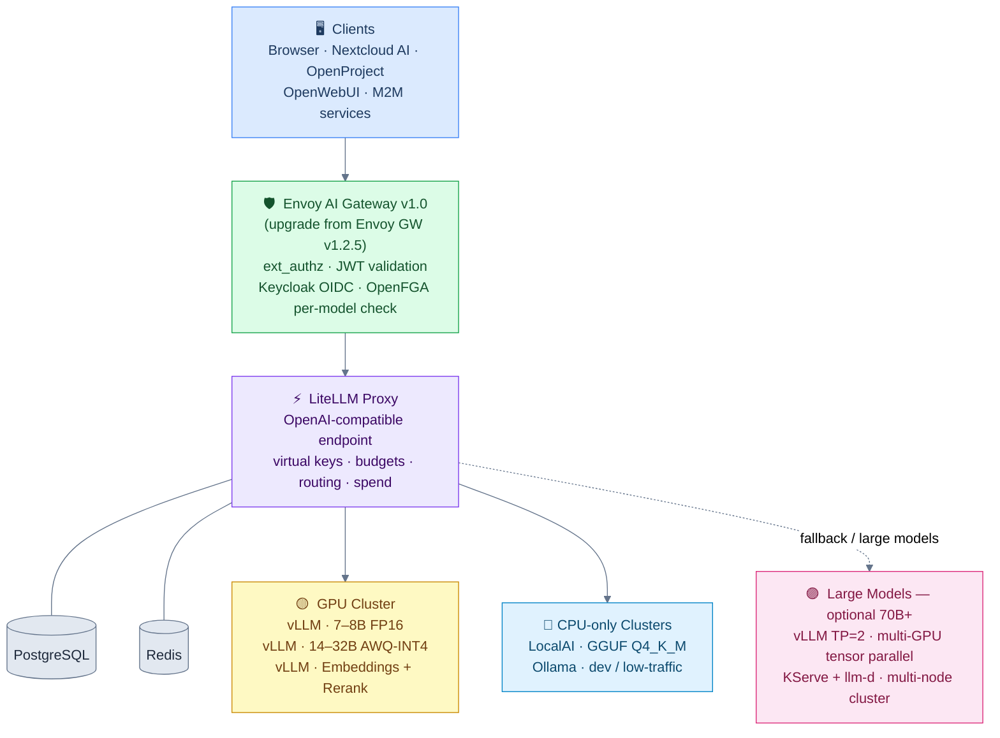
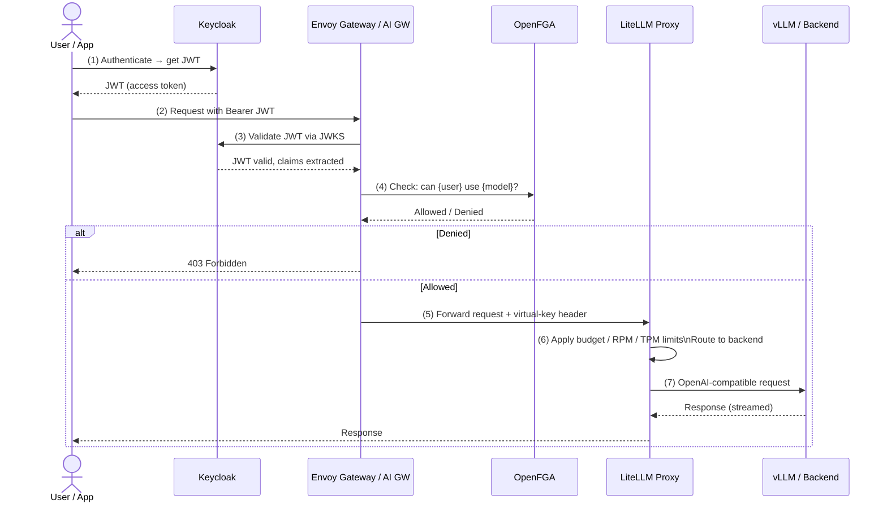
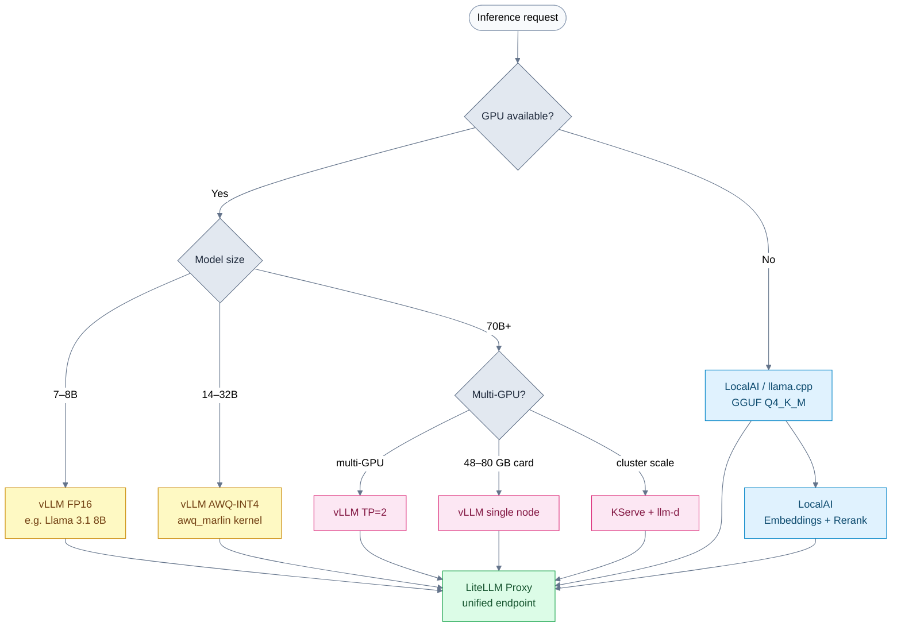
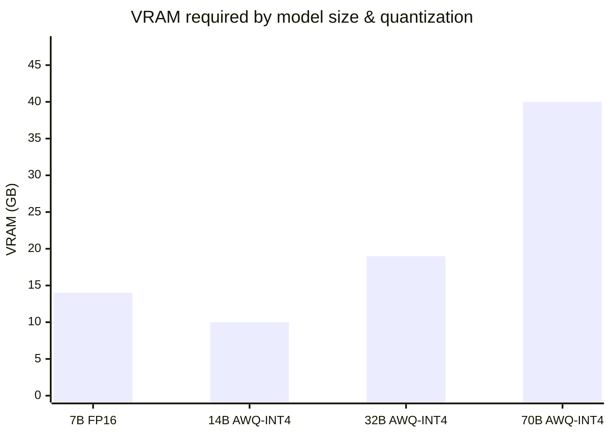
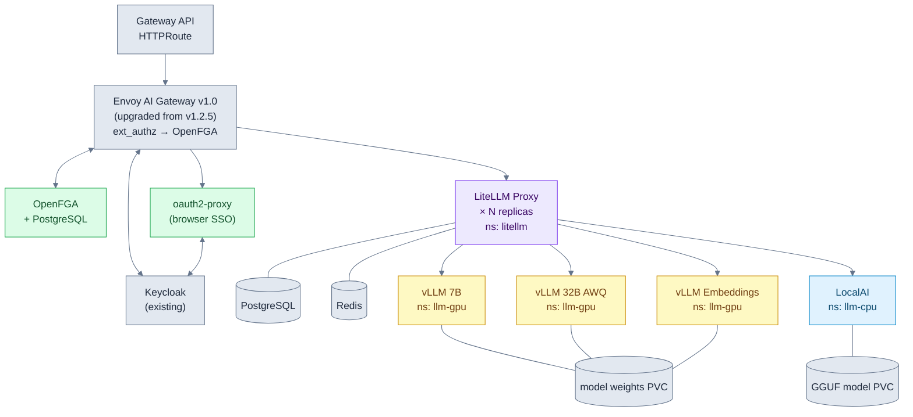
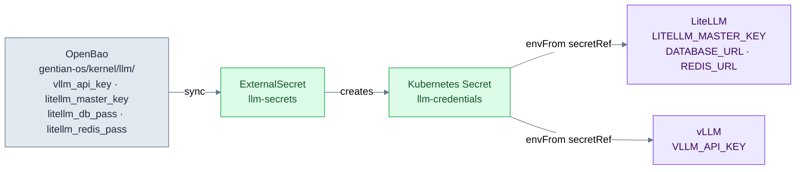
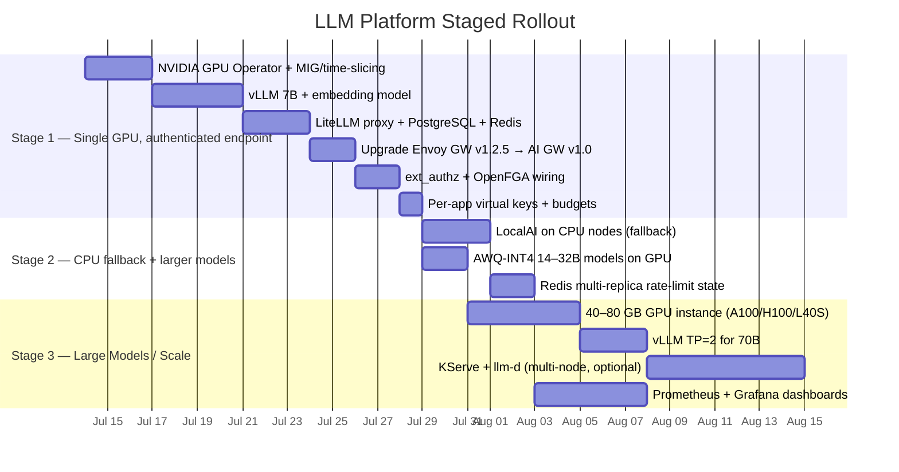

# Open-Source LLM Serving on Kubernetes with an Authenticated Gateway

## TL;DR

- **Build a two-layer stack: vLLM (GPU) + LocalAI (CPU) as OpenAI-compatible inference backends, fronted by a single LiteLLM proxy as the unified gateway.** This gives one authenticated OpenAI-compatible endpoint serving unlimited downstream apps.
- **For your Keycloak + OpenFGA stack, do NOT rely on LiteLLM's built-in JWT/OIDC auth — it is an Enterprise (paid) feature.** Instead, upgrade the existing Envoy Gateway v1.2.5 to Envoy AI Gateway v1.0 in Stage 1 and wire its ext_authz filter to Keycloak OIDC + OpenFGA for per-model access control, while using LiteLLM's free virtual keys for per-app budgets, rate limits, and model allowlists.
- **Small models (7B–32B) run on a single GPU node (FP16 for 7–8B, AWQ-INT4 for 14–32B). 70B+ requires either tensor parallelism across multiple GPUs or a high-VRAM single card (48–80 GB).**

---

## Overall Architecture

**Why this shape:** Gentian OS already runs Envoy Gateway v1.2.5. Stage 1 upgrades it to Envoy AI Gateway v1.0, which builds on the same CNCF Envoy Gateway foundation and adds LLM-specific features: token-aware rate limiting, per-model routing policies, and a clean ext_authz integration for Keycloak OIDC + OpenFGA. No new ingress component is introduced — it is a drop-in upgrade. LiteLLM then handles routing to the right backend and applies per-app virtual-key budgets.

---

## Key Findings

### Inference Backends

**vLLM is the clear production default** for GPU serving. It is OpenAI-compatible (chat, completions, embeddings, plus `/rerank` and `/score` endpoints), delivers the highest throughput via PagedAttention + continuous batching, and supports tensor parallelism for 70B+ models. Independent benchmarks measured vLLM at ~793 tokens/s peak vs Ollama's ~41 tokens/s on identical hardware, with vLLM's throughput scaling smoothly with concurrency while Ollama's flattens almost immediately.

**Hugging Face TGI entered maintenance mode on December 11, 2025.** HF's Lysandre Debut announced: "text-generation-inference is now in maintenance mode… we contribute to and recommend using going forward: @vllm_project, @sgl_project, as well as local engines such as llama.cpp or MLX." **Do not build new infrastructure on TGI.**

| Backend | GPU | CPU | Concurrency | Best for |
|---------|-----|-----|-------------|----------|
| **vLLM** | ✅ primary | ❌ | Excellent (PagedAttention) | Production GPU serving |
| **LocalAI** | ✅ | ✅ | Moderate | CPU clusters, multi-modal |
| **Ollama** | ✅ | ✅ | Poor (sequential) | Dev / low-traffic |
| **llama.cpp server** | ✅ | ✅ | Poor | Lean CPU/GPU GGUF |
| **SGLang** | ✅ | ❌ | Excellent | Prefix-heavy / agentic workloads |
| **TGI** | ⚠️ | ❌ | — | **Deprecated Dec 2025** |

### Gateway / Orchestration

**LiteLLM proxy** (MIT-licensed) is the recommended gateway: one OpenAI-compatible endpoint routing to 100+ backends, with free virtual keys, per-key/team budgets, rate limits, model allowlists, spend tracking, and load balancing/fallbacks. Handles 1,500+ requests/second in load tests.

**Envoy Gateway v1.2.5** is already the ingress layer in Gentian OS. Stage 1 upgrades it to **Envoy AI Gateway v1.0** (GA June 23, 2026, same CNCF Envoy Gateway base, maintainers include Bloomberg, Tetrate, Tencent, Netflix, and Nutanix), which adds native LLM features: token-aware rate limiting, per-model routing policies, and a clean ext_authz integration for Keycloak + OpenFGA. The upgrade is drop-in — same CRDs, same Gateway API compatibility, no new ingress component.

**KServe + llm-d** is the Kubernetes-native heavyweight (CNCF incubating) for distributed, KV-cache-aware serving of very large models. Appropriate at multi-GPU cluster scale; overkill below that.

### Authentication Integration (the key constraint)

**LiteLLM's virtual API keys are free/open-source** — per-key budgets, RPM/TPM limits, model allowlists, spend tracking, per-team isolation.

**LiteLLM's JWT/OIDC auth (`enable_jwt_auth`), SCIM, and `enforce_rbac` are Enterprise-only.** LiteLLM's marketing ambiguously claims these are "all available on open-source," which contradicts the technical docs. **Trust the docs, not the marketing page.** Since Gentian OS already runs Envoy AI Gateway, enforce Keycloak + OpenFGA there — this is strictly additive to what you already have.

**Recommended fully-OSS auth pattern (fits Gentian OS):**
- **Envoy AI Gateway v1.0 ext_authz → OpenFGA** via `openfga/openfga-envoy`: upgrade Envoy Gateway v1.2.5 to Envoy AI Gateway v1.0 in Stage 1, then add an `EnvoyExtensionPolicy` ext_authz gRPC backend that validates Keycloak JWTs and calls OpenFGA Check per request. LiteLLM virtual keys then apply per-app budgets downstream.

### Authentication & Authorization Flow

---

## Inference Backend Selection

---

## Model Sizing Guide

> Typical cloud GPU tiers: 16–24 GB (T4/A10G on AWS g4dn/g5), 40 GB (A100 40 GB), 48 GB (L40S/A6000), 80 GB (A100 80 GB / H100). 70B AWQ-INT4 (~40 GB) requires a 40 GB+ card or tensor parallelism across smaller GPUs.

- **7–8B FP16** (~14 GB): fits any A10G or larger; ~146 tok/s on a 24 GB node.
- **14B AWQ-INT4** (`awq_marlin` kernel, ~10 GB): ~135 tok/s, 1.7–2.4× faster than legacy `awq`.
- **32B AWQ-INT4** (~19 GB): ~65 tok/s, constrained to ~8 concurrent sequences on a 24 GB node.
- **70B AWQ-INT4** (~40 GB): requires a 40 GB A100, 48 GB L40S/A6000, or 80 GB A100/H100 — or TP=2 across two smaller GPUs.

Always pair AWQ-INT4 with FP8 KV cache (`--kv-cache-dtype fp8`) to fit more concurrent sequences.

---

## Kubernetes Deployment Topology

**Helm charts available for every component:** LiteLLM (`deploy/charts/litellm-helm`, Kubernetes 1.21+ / Helm 3.8.0+, optional PostgreSQL + Redis subcharts), Ollama (`otwld/ollama-helm`, GPU/MIG/DRA + model pre-pull), vLLM Production Stack (`vllm/vllm-stack`), NVIDIA GPU Operator, oauth2-proxy, OpenFGA, KServe.

**GPU sharing:** On MIG-capable instances (A100, H100), prefer MIG for hardware-level VRAM isolation between models. On non-MIG instances (A10G, T4, L4), use NVIDIA GPU Operator time-slicing — cap per-pod VRAM with `--gpu-memory-utilization` to avoid OOM between slices.

---

## OpenBao / Secret Flow (Gentian OS Integration)

This fits the existing ESO pattern used throughout Gentian OS — no new secret management approach needed.

---

## Staged Rollout Plan

### Stage 1 — Single GPU node, one authenticated endpoint

1. Install NVIDIA GPU Operator (Helm); enable MIG on A100/H100 or time-slicing on other instance types.
2. Deploy vLLM for a 7–8B model (e.g. Llama 3.1 8B or Qwen2.5 7B, FP16) and a bge/Qwen3 embedding model.
3. Deploy LiteLLM (Helm) with PostgreSQL; register vLLM backends under unified model names; issue per-app virtual keys.
4. Upgrade Envoy Gateway v1.2.5 to Envoy AI Gateway v1.0 (drop-in, same CRDs and Gateway API compatibility), then add an `EnvoyExtensionPolicy` ext_authz filter backed by `openfga/openfga-envoy` for Keycloak JWT validation and per-model OpenFGA access control.

### Stage 2 — CPU fallback + larger models

1. Add CPU nodes running LocalAI/llama.cpp (quantized GGUF) as fallback backends in the same LiteLLM config.
2. Graduate to AWQ-INT4 14–32B models when 7–8B quality is insufficient.
3. Add Redis for multi-replica LiteLLM routing and rate-limit coordination.

### Stage 3 — Large models / production multi-GPU

1. For 70B+, use a 40–80 GB GPU instance (A100, H100, L40S on AWS/Infomaniak) or TP=2 across two smaller GPU nodes; serve with vLLM.
2. Adopt KServe + llm-d only when you have multiple GPU nodes and need cluster-wide scheduling. Below that threshold, plain vLLM + LiteLLM is simpler and sufficient.
3. Add Prometheus/Grafana via the vLLM Production Stack dashboards.

---

## Production-Readiness Assessment

| Component | Status | Notes |
|-----------|--------|-------|
| vLLM | ✅ Production-ready | Clear GPU serving default |
| LiteLLM proxy + virtual keys | ✅ Production-ready | MIT, free key management |
| Envoy AI Gateway v1.0 | ✅ Production-ready | GA June 2026; drop-in upgrade from v1.2.5 |
| OpenFGA | ✅ Production-ready | CNCF incubating |
| oauth2-proxy | ✅ Production-ready | CNCF sandbox, browser SSO only |
| NVIDIA GPU Operator | ✅ Production-ready | MIG (A100/H100) preferred; time-slicing for others |
| LocalAI | ✅ Production-ready | CPU clusters, multi-modal |
| Ollama | ⚠️ Dev/low-traffic only | No concurrent batching |
| KServe + llm-d | ✅ Production-ready (complex) | Multi-GPU cluster scale only |
| vLLM Production Stack | ✅ Production-ready | Heavier reference deployment |
| LiteLLM JWT/OIDC / SSO (>5) / SCIM | ❌ Enterprise (paid) | Handled at Envoy layer instead |
| TGI | ❌ Deprecated Dec 2025 | Do not use for new builds |

---

## Caveats

- **LiteLLM auth licensing is the crux:** virtual keys are free, but JWT/OIDC / SSO (>5 users) / SCIM / `enforce_rbac` are paid. Upgrading Envoy Gateway v1.2.5 to Envoy AI Gateway v1.0 and enforcing auth via ext_authz → OpenFGA avoids this constraint entirely with no new ingress component.
- **Time-slicing has no memory isolation** — a misconfigured pod can OOM its neighbours. Prefer MIG on A100/H100 instances.
- **Ollama does not scale under concurrency** — keep it for dev/CPU/low-traffic only.
- **OpenFGA integration is DIY** — there is no turnkey LiteLLM+OpenFGA product; you build the Check call into the Envoy ext_authz filter via `openfga/openfga-envoy`.
- **Benchmark numbers** vary widely by hardware, quantization, context length, and concurrency; validate on your own workload before committing.
