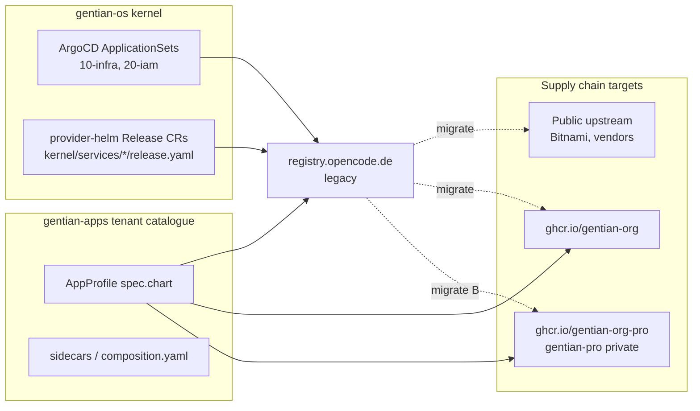
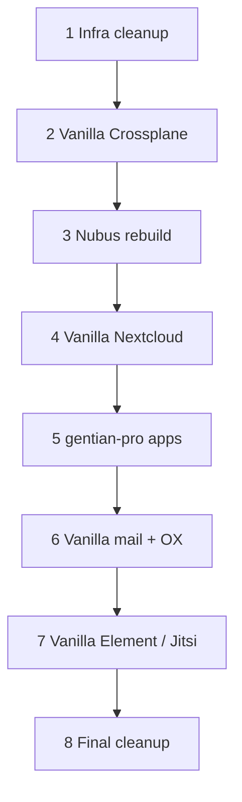

# Upstream cleanup — removing `registry.opencode.de` dependencies

**Status:** Plan  
**Context:** Gentian OS was bootstrapped on the ZenDiS OpenDesk supply chain. Charts
and container images are pulled from the private OCI registry
`registry.opencode.de`. Without access to that registry, fresh installs and
upgrades will fail even though the Git repos are self-contained.

This document inventories every known dependency, records the intended cleanup
strategy per component (A–D), and tracks progress against the **kernel rebuild
roadmap** (§8). The goal is to rebuild the kernel from the inside with vanilla
upstream where possible — not to mirror OpenDesk charts into `gentian-os`.

---

## Cleanup strategy legend

Each component below has a checkbox (`[ ]` = not done, `[x]` = done) and a
**strategy** letter describing the intended end state:

| Strategy | Meaning | Target location |
|---|---|---|
| **A** | **Replaced with open charts / images** — use public upstream directly (no OpenDesk mirror) | Public chart repos + `docker.io` / vendor registries; Gentian values only |
| **B** | **Moved to private paid-for repo** — OpenDesk-derived charts/images customers pay for | [`gentian-pro`](https://github.com/gentian-org/gentian-pro) (private) → `ghcr.io/gentian-org-pro/...` |
| **C** | **Re-wrapped based on public image** — Gentian-owned Helm chart; public or rebuilt container image | `gentian-os/charts/upstream/` + `ghcr.io/gentian-org/mirror/` or public image refs |
| **D** | **Rebuilt** — replace with Gentian-native implementation (not a mirror of OpenDesk) | Gentian code + public deps (see Nubus replacement doc) |

**Progress summary:** check boxes in §4–§6 as each component completes its
**§8 roadmap step**.

---

## 1. Executive summary

| Question | Answer |
|---|---|
| Do we have local copies of the OpenDesk charts? | **Almost none in Git.** Phase 0 rescue artefacts live in `upstream-rescue/` (local, not committed). Only `gentian-apps/charts/odoo/` is vendored to `ghcr.io/gentian-org/charts`. |
| Is `gentian-apps/apps/...` the right place for migrated charts? | **Not for upstream Helm charts.** `apps/<name>/` is the first-party app scaffold. Use **`gentian-apps/charts/<name>/`** for **free/public** tenant charts. **Premium OpenDesk charts → `gentian-pro`.** Kernel infra → **`gentian-os/charts/upstream/`** (or public upstream). |
| What else breaks besides charts? | **Container images.** Many values files pin images under `registry.opencode.de/bmi/opendesk/...` with digest pins. Charts alone are not enough. |
| Where do paid OpenDesk artefacts go? | **`gentian-pro`** (private repo) — charts + images for premium catalogue apps (Element/Jitsi, OX). Kernel and free tier stay in public `gentian-org` repos. |
| Migration approach? | **Inside-out kernel rebuild** — infra first, strip OpenDesk wrappers, then IAM, then apps (see §8). |
| Rescue artefacts? | `upstream-rescue/` (local) — reference only; not the end-state delivery path. |

---

## 2. Gentian-pro private supply chain (premium / paid-for)

OpenDesk-derived charts and images that are part of the **premium catalogue** will
not be republished to the public `ghcr.io/gentian-org` org. They move to a
separate private repository so access can be tied to subscription or entitlement.

### 2.1 Repository and registry

| Item | Target |
|---|---|
| Git repo | **`gentian-org/gentian-pro`** (private) |
| Helm OCI | `oci://ghcr.io/gentian-org-pro/charts` (or equivalent private GHCR org) |
| Container images | `ghcr.io/gentian-org-pro/mirror/...` |
| CI | Package charts + mirror images on release; publish only from protected branches |
| Auth | Cluster `imagePullSecrets` + Helm `pullSecretRef` provisioned per customer entitlement (not shared opencode PAT) |

### 2.2 What belongs in gentian-pro (strategy **B**)

| Component | Charts | Images | gentian-apps profile |
|---|---|---|---|
| Element (Matrix) | `opendesk-element`, `opendesk-synapse` | `opendesk-element-web`, Synapse-related mirrors | `profiles/element/` |
| Jitsi (Element sidecar) | `opendesk-jitsi` | Jitsi stack mirrors + Keycloak adapter sidecar | `profiles/element/composition.yaml` |
| OX App Suite | `appsuite-public-sector` (+ subcharts) | OX public-sector image set | `profiles/ox-appsuite/` |

Reference copies (if needed): `upstream-rescue/charts/` and `upstream-rescue/images/`.
Moved to gentian-pro in roadmap **step 5** — not before Nubus/Nextcloud kernel work.

### 2.3 What stays public (strategies **A**, **C**, **D**)

| Strategy | Repo | Examples |
|---|---|---|
| **A** | `gentian-os` / public upstream — no vendoring | Redis, MinIO, OpenProject |
| **C** | `gentian-os/charts/upstream/` → `ghcr.io/gentian-org/charts` | Nextcloud, Postfix, Dovecot, Collabora, CryptPad, XWiki |
| **D** | `gentian-os` (code, not OpenDesk mirror) | Nubus replacement (Keycloak + Gentian directory + ReBAC) |

### 2.4 Wiring premium profiles

1. **`AppProfile.spec.license: proprietary`** and `trustTier` gate install (see
   `docs/design/app-catalogue-security.md`).
2. **`spec.chart.repository`** on premium profiles points at
   `oci://ghcr.io/gentian-org-pro/charts` (not `gentian-org`).
3. **`gentian-os` kernel** does not depend on gentian-pro; only tenant namespaces
   pull premium charts when a entitled tenant installs a premium app.
4. Document customer onboarding: entitlement → GHCR robot creds → tenant namespace
   `registry-credentials` (separate from kernel pull secrets).

See **§8 step 5** for when gentian-pro work happens in the kernel rebuild sequence.

---

## 3. Dependency map

Two distinct pull paths exist today:



- **Kernel** (`gentian-os`): cluster-wide infra — databases, IAM, mail, Nextcloud, etc.
- **Catalogue** (`gentian-apps/profiles/*`): per-tenant installable apps.
- **Already migrated:** `app-store`, `odoo-free-base` → `oci://ghcr.io/gentian-org/charts`.

---

## 4. Chart inventory

### 4.1 Kernel charts (gentian-os)

Pulled via ArgoCD ApplicationSet or Crossplane `Release` CR.

| Done | Strategy | Component | Chart name | OCI repository (current) | Pinned version | Target | Referenced in |
|:---:|---|---|---|---|---|---|---|
| [ ] | **A** | Redis | `redis` | `.../external/charts/bitnami-charts` | 18.6.1 | `oci://registry-1.docker.io/bitnamicharts/redis` | `kernel/appsets/10-infra.yaml` |
| [ ] | **A** | MinIO | `minio` | `.../external/charts/bitnami-charts` | 16.0.10 | Public Bitnami chart + `bitnamilegacy/*` images | `kernel/appsets/10-infra.yaml` |
| [ ] | **A**† | Intercom | `intercom-service` | `.../supplier/univention/charts-mirror` | 2.19.5 | Univention chart @ `artifacts.software-univention.de` | `kernel/appsets/20-iam.yaml` |
| [ ] | **D** | Nubus | `nubus` | `.../supplier/univention/charts-mirror` | 1.16.0 | Rebuilt IAM stack; interim: Univention registry | `kernel/services/nubus/manifests/dev/release.yaml` |
| [ ] | **A** | PostgreSQL | `opendesk-postgresql` | `.../platform-development/charts/opendesk-postgresql` | 2.1.2 | Public CNPG / Bitnami PG or Gentian chart on public image | `kernel/services/opendesk-postgresql/...` |
| [ ] | **A** | MariaDB | `opendesk-mariadb` | `.../platform-development/charts/opendesk-mariadb` | 3.0.3 | Public MariaDB chart / operator | `kernel/services/opendesk-mariadb/...` |
| [ ] | **C** | Nextcloud (umbrella) | `opendesk-nextcloud` | `.../platform-development/charts/opendesk-nextcloud` | 4.7.2 | Gentian chart + `library/nextcloud` or rebuilt image | `kernel/services/nextcloud/...` |
| [ ] | **C** | Nextcloud management | `opendesk-nextcloud-management` | same repo | 4.7.2 | Gentian init Job + public NC base | `kernel/services/nextcloud-management/...` |
| [ ] | **C** | Nextcloud notifypush | `opendesk-nextcloud-notifypush` | same repo | 4.7.2 | Gentian subchart + public notify_push | `kernel/services/nextcloud-notifypush/...` |
| [ ] | **C** | Postfix | `opendesk-postfix` | `.../platform-development/charts/opendesk-postfix` | 5.2.0 | Gentian chart + public/vendor postfix image | `kernel/services/postfix/...` |
| [ ] | **C** | Dovecot | `opendesk-dovecot` | `.../platform-development/charts/opendesk-dovecot` | 3.4.1 | Gentian chart + public dovecot image | `kernel/services/dovecot/...` |
| [ ] | **C** | Collabora | `collabora-online` | `.../supplier/collabora/charts-mirror` | 1.1.45 | Collabora upstream chart + CODE image | `kernel/services/collabora/...` |
| [ ] | **C** | CryptPad | `cryptpad` | `.../supplier/xwiki/charts-mirror` | 0.0.21 | xwiki-labs chart + `docker.io/cryptpad/cryptpad` | `kernel/services/cryptpad/...` |

† Intercom: not OpenDesk-authored; strategy is **drop opencode mirror**, use Univention
registry directly (see `upstream-rescue/UNIVENTION-IMAGES.md`). Grouped under **A**
(non-opencode public supplier path).

Also referenced in install/ArgoCD plumbing but not in an active `release.yaml` in-tree:

| Done | Strategy | Chart | OCI repository (current) | Notes |
|:---:|---|---|---|---|
| [x] | — | `opendesk-keycloak-bootstrap` | `.../platform-development/charts/opendesk-keycloak-bootstrap` | Superseded by operator + `keycloak-config` manifests |

### 4.2 Tenant catalogue charts (gentian-apps)

| Done | Strategy | Profile | Chart(s) | OCI repository (current) | Version | Target | Local copy? |
|:---:|---|---|---|---|---|---|---|
| [ ] | **B** | `element` | `opendesk-element` | `.../platform-development/charts/opendesk-element` | 6.1.9 | `gentian-pro` | Rescue only |
| [ ] | **B** | `element` (sidecar) | `opendesk-jitsi` | `.../platform-development/charts/opendesk-jitsi` | 3.5.1 | `gentian-pro` | Rescue only |
| [ ] | **A** | `openproject` | `openproject` | `.../supplier/openproject/charts-mirror` | 10.1.0 | `charts.openproject.org` | Rescue only |
| [ ] | **B** | `ox-appsuite` | `open-xchange` / `appsuite-public-sector` | `.../supplier/open-xchange/charts-mirror` | 2.26.32 | `gentian-pro` | Rescue only |
| [ ] | **B** | `ox-appsuite` (composition) | `nubus` sub-chart ref | `.../supplier/univention/charts-mirror` | — | Drop when OX uses Gentian IAM (**D**) | — |
| [ ] | **C** | `xwiki` | `xwiki` | `.../supplier/xwiki/charts-mirror` | 1.4.4 | Gentian chart + public XWiki image | Rescue only |
| [x] | — | `odoo-free-base` | `odoo` | `oci://ghcr.io/gentian-org/charts` | 0.1.0 | **Done** — `gentian-apps/charts/odoo/` |
| [x] | — | `app-store` | `app-store` | `oci://ghcr.io/gentian-org/charts` | 0.2.5 | **Done** — first-party |

Stale duplicate profiles under `gentian-os/export/gentian-apps/` should be deleted once migration is tracked in `gentian-apps` only.

---

## 5. Container image inventory (not just charts)

Even after charts are migrated, pods will fail if images still point at opencode.
**Treat chart migration and image migration as one work item per component.**

### 5.1 Kernel image groups

| Done | Strategy | Service / group | Example image path | File |
|:---:|---|---|---|---|
| [ ] | **D** | Nubus — OpenDesk extensions | `opendesk-nubus`, `opendesk-nubus-a2g-mapper` | `kernel/services/nubus/.../values/_base.yaml` |
| [ ] | **A**† | Nubus — Univention extensions | `ox-extension`, `portal-extension` | same (→ `artifacts.software-univention.de`) |
| [ ] | **D** | Nubus — runtime (~36 images) | `nubus/images/*` | Chart defaults / Univention registry until rebuild |
| [ ] | **A** | MinIO | `images-mirror/minio`, `os-shell` | `kernel/services/minio/values/_base.yaml` |
| [ ] | **A** | Redis | `images-mirror/redis` | `kernel/services/redis/values/_base.yaml` |
| [ ] | **A**† | Intercom | `images-mirror/intercom-service` | `kernel/services/intercom-service/values/_base.yaml` |
| [ ] | **C** | Nextcloud AIO + mgmt + exporter | `opendesk-nextcloud*` | `nextcloud*`, `nextcloud-management/` |
| [ ] | **C** | Dovecot | `dovecot-public-sector` | `kernel/services/dovecot/values/_base.yaml` |
| [ ] | **C** | CryptPad | `images-mirror/cryptpad` | `kernel/services/cryptpad/...` |
| [ ] | **C** | Collabora | Collabora CODE image via chart | `kernel/services/collabora/...` |
| [ ] | **C** | Postfix | OpenDesk postfix image | `kernel/services/postfix/...` |

### 5.2 Tenant app image groups

| Done | Strategy | Profile | Example | File |
|:---:|---|---|---|---|
| [ ] | **B** | Element | `opendesk-element-web` | `profiles/element/profile.yaml` |
| [ ] | **B** | Element | `matrixdotorg/synapse` or opendesk mirror | `profiles/element/profile.yaml` |
| [ ] | **B** | Element composition | `matrix-user-verification-service`, Jitsi images | `profiles/element/composition.yaml` |
| [ ] | **A** | OpenProject | `open_desk` → public `openproject/openproject` image | `profiles/openproject/profile.yaml` |
| [ ] | **B** | OX App Suite | OX public-sector image set | `profiles/ox-appsuite/profile.yaml` |
| [ ] | **C** | XWiki | `xwiki` public image | `profiles/xwiki/profile.yaml` |

---

## 6. Non-chart opencode plumbing to remove

After charts and images are self-hosted, delete or replace:

| Done | Area | Files / symbols |
|:---:|---|---|
| [ ] | Install credentials | `OD_PRIVATE_REGISTRY_USERNAME`, `OD_PRIVATE_REGISTRY_PASSWORD` in `install.sh`, `scripts/install-lib.sh`, `getting-started.md` |
| [ ] | Docker pull secret bootstrap | `install.sh` (`registry.opencode.de` docker secret), `kernel/services/_globals/secrets/dev/registry-credentials.yaml` |
| [ ] | ArgoCD OCI repo secrets | `scripts/create-argocd-oci-secrets.sh` |
| [ ] | ArgoCD project allowlist | `kernel/argocd/projects/gentian.yaml` (`registry.opencode.de/*` entries) |
| [ ] | Crossplane cluster bootstrap | `crossplane/compositions/cluster-default.yaml` (ArgoCD source allowlist) |
| [ ] | ESO comment / dev values | `kernel/values/env/dev.yaml` |
| [ ] | gentian-pro pull secrets | New: entitlement-scoped GHCR creds for premium tenant installs |

OpenDesk **semantic** dependencies (OIDC pack client IDs, LDAP attribute names, Keycloak
scope YAML copied from upstream) can stay initially — they describe behaviour, not registry
access. Longer-term rename is optional (see §9).

---

## 7. Target repo layout

After the rebuild, artefacts land by **role** — not by “mirror everything to
`gentian-os/charts/upstream`”.

```
gentian-os/                             # Kernel — rebuilt from inside
├── crossplane/                         # Vanilla infra + app XRs (step 2+)
├── kernel/services/                    # Values + Release CRs → public charts or Gentian code
├── charts/gentian-os/                  # Operator
└── charts/upstream/                    # Optional thin wrappers only (e.g. Nextcloud step 4)

gentian-pro/                            # PRIVATE — step 5 (strategy B)
├── charts/                             # OX, Element, Jitsi (OpenDesk baseline → entitlement)
└── mirror/

gentian-apps/                           # PUBLIC catalogue
├── charts/                             # Free apps (Odoo, OpenProject, …)
├── apps/                               # First-party only (app-store, …)
└── profiles/                           # → gentian-org or gentian-org-pro
```

**Publishing targets:**

| Tier | Helm OCI | When (§8) |
|---|---|---|
| Public upstream direct (**A**) | Bitnami, CNPG, Docker Hub, … | Steps 1–4, 6–7 |
| `ghcr.io/gentian-org` | Gentian-owned kernel/catalogue charts | Steps 2, 4, 8 |
| `ghcr.io/gentian-org-pro` (**B**) | Premium tenant apps | Step 5 |

---

## 8. Kernel rebuild roadmap

Rebuild the kernel **from the inside out**. Each step removes OpenDesk/opencode
coupling before the next layer depends on it. Check boxes when the step is done
in dev (and inventory rows in §4–§6 are updated).

This is **not** a “mirror everything to GHCR” plan. Prefer **A** (public upstream
direct) and **D** (Gentian-native rebuild) over vendoring OpenDesk charts into
`gentian-os`.



### Step 1 — Clean up infra (strategy **A**)

Replace OpenDesk-mirrored **data plane** with public upstream. No Gentian chart
forks unless Crossplane needs a thin values wrapper.

```
[ ] PostgreSQL — drop opendesk-postgresql; public CNPG or Bitnami + vanilla bootstrap
[ ] MariaDB — drop opendesk-mariadb; public chart / operator
[ ] Redis — public Bitnami chart + bitnamilegacy image
[ ] MinIO — public Bitnami chart + bitnamilegacy image
[ ] Intercom — Univention registry direct (drop opencode mirror) or defer until step 3
```

**Inventory:** §4.1 Redis, MinIO, PostgreSQL, MariaDB; §5.1 Redis, MinIO.

### Step 2 — Strip wrappers; vanilla Crossplane provisioning

Remove OpenDesk-specific Helm glue, install.sh special cases, and provider-helm
complexity around infra that step 1 already made vanilla.

```
[ ] Delete or replace opendesk-postgresql / opendesk-mariadb Release CRs and service trees
[ ] Simplify kernel/appsets/10-infra.yaml to public chart repos only
[ ] Infra provisioning via Crossplane compositions / XRs — no OpenDesk bootstrap Jobs
[ ] Remove opendesk image overrides from redis/minio/postgres values
[ ] Tenant DB provisioning stays operator-driven; no LDAP/UDM dependency for infra wave
```

**Principle:** kernel infra = Crossplane + public charts + Gentian values. Nothing
from `registry.opencode.de` at this layer.

### Step 3 — Rebuild Nubus (strategy **D**)

Replace the Univention/OpenDesk IAM stack — do **not** permanently vend the Nubus
umbrella chart to GHCR. Track design in the Nubus replacement doc (Keycloak +
Gentian directory + ReBAC; LDAP/SCIM as optional bridges).

```
[ ] Nubus replacement architecture signed off
[ ] Interim: keep running Nubus only as long as needed for dev parity
[ ] Remove opendesk-nubus / a2g-mapper extensions from values (Gentian bootstrap)
[ ] Point Univention images at artifacts.software-univention.de (drop opencode mirror)
[ ] Migrate operator off UDM REST where possible; cut portal-server dependency
[ ] Decommission Nubus chart from kernel when replacement IAM path is green
```

**Inventory:** §4.1 Nubus; §5.1 Nubus rows; §9 longer-term LDAP/OIDC items.

### Step 4 — Vanilla Nextcloud in kernel (strategy **C** → public image)

Integrate **`docker.io/library/nextcloud`** (or equivalent public image) — not
`opendesk-nextcloud*`. Gentian-owned Helm/Crossplane release; init via operator Job
or `occ`, Keycloak `user_oidc`.

```
[ ] Drop opendesk-nextcloud, -management, -notifypush Release CRs
[ ] New kernel service: public Nextcloud + Postgres + Redis + ingress
[ ] WebDAV/CardDAV + .well-known redirects on gateway
[ ] OIDC via kernel IdP; drop opendesk LDAP object classes for Files
[ ] Collabora/CryptPad: defer or minimal public chart if still kernel apps
```

**Inventory:** §4.1 Nextcloud (×3); §5.1 Nextcloud images.

### Step 5 — Move OpenDesk apps to gentian-pro (strategy **B**)

**After** kernel infra and IAM are on Gentian rails, **quarantine** remaining
OpenDesk-derived **tenant** charts/images in the private repo. Kernel must not
depend on gentian-pro.

```
[ ] Create gentian-org/gentian-pro (private) + ghcr.io/gentian-org-pro
[ ] Import rescued OX / Element / Jitsi charts + images (reference: upstream-rescue/)
[ ] CI publish to gentian-org-pro only
[ ] Update gentian-apps premium profiles (ox-appsuite, element) chart.repository
[ ] Entitlement → tenant namespace pull secrets
[ ] Kernel install succeeds with zero gentian-pro references
```

**Inventory:** §4.2 Element, Jitsi, OX; §5.2 **B** rows; §2 gentian-pro wiring.

### Step 6 — Vanilla Postfix + Dovecot; trial with vanilla OX

Implement **public/vendor** mail stack in kernel (**C**). Experiment whether
**vanilla OX** (from gentian-pro or public OX paths) works without OpenDesk
mail integration.

```
[ ] Drop opendesk-postfix / opendesk-dovecot charts
[ ] Vanilla Postfix + Dovecot (Gentian Helm or Crossplane)
[ ] LDAP/OIDC integration against step 3 IAM (not Nubus UDM)
[ ] Spike: OX from gentian-pro + vanilla mail — document blockers
```

**Inventory:** §4.1 Postfix, Dovecot; §5.1 mail images.

### Step 7 — Vanilla Element / Jitsi spike

Validate **public** Element Web + Synapse + Jitsi charts/images (not OpenDesk
wrappers). If vanilla works, gentian-pro ships thin Gentian values only; if not,
keep mirrored OpenDesk charts in gentian-pro temporarily.

```
[ ] Spike: vectorim/element-web + matrixdotorg/synapse + jitsi/jitsi-helm-chart
[ ] Keycloak OIDC packs updated for vanilla client IDs
[ ] Decision: gentian-pro mirrors vs public-only profiles in gentian-apps
```

**Inventory:** §4.2 Element/Jitsi; §5.2 Element rows.

### Step 8 — Final cleanup

Remove all remaining opencode plumbing and OpenDesk semantic debt where safe.

```
[ ] Drop OD_PRIVATE_* from install.sh / install-lib.sh
[ ] Remove registry.opencode.de from ArgoCD allowlists and pull secrets
[ ] CI gate: fail on registry.opencode.de in gentian-os / gentian-apps
[ ] Delete gentian-os/export/gentian-apps/ duplicate tree
[ ] OpenProject / XWiki / CryptPad: public upstream (A/C) as catalogue work allows
[ ] Update getting-started.md, deployment.md, app-profile-guide.md
```

**Inventory:** §6 plumbing table; §9 optional decoupling.

### Reference artefacts (not a roadmap step)

`upstream-rescue/` holds charts/images pulled from opencode for **comparison and
gentian-pro import** — it is not the target architecture. See
[UPSTREAM-COMPARISON.md](../../upstream-rescue/UPSTREAM-COMPARISON.md). If access
is lost before step 5, recovery options are in §12.

---

## 9. Longer-term decoupling (optional)

These are **not** registry blockers but reduce OpenDesk coupling:

| Topic | Current state | Direction |
|---|---|---|
| OIDC client IDs (`opendesk-synapse`, etc.) | Required by upstream chart templates | Rename when **B** charts forked in gentian-pro |
| `opendesk-oidc-catalog` profile | Ships OpenDesk scope pack | Gentian-native `OIDCPackCatalog` |
| Nubus LDAP extensions | OpenDesk-specific schema objects | **D** — Gentian directory + ReBAC |
| Keycloak scopes YAML | Copied from `opendesk/helmfile/...` | Gentian scope definitions |
| Service aliases (`ums-*`) | `kernel/services/nubus/manifests/dev/service-aliases.yaml` | Remove with **D** |

---

## 10. Per-component checklist template

Copy for each chart/image group; set **Strategy** to A/B/C/D:

```
Strategy: __   Roadmap step: __
[ ] Public upstream or Gentian-native path chosen (prefer A/D over OpenDesk vendoring)
[ ] OpenDesk wrapper / Release CR removed from kernel where applicable
[ ] Crossplane or operator provisioning updated (vanilla path)
[ ] Chart/image refs off registry.opencode.de
[ ] Dev cluster sync green for this component
[ ] Inventory row(s) in §4–§6 checked off
```

For **step 5 (gentian-pro)** only: `[ ] Artefact copied from upstream-rescue/ into gentian-pro`

---

## 11. Verification commands

```bash
# Find remaining opencode references
rg -n 'registry\.opencode\.de' gentian-os gentian-apps

# Validate gentian-apps profiles after edits
cd gentian-apps && python3 scripts/validate-profile-tiles.py

# Dry-run helm template against new local chart
helm template test gentian-apps/charts/odoo -f profiles/odoo-free-base/profile.yaml
```

---

## 12. Risk register

| Risk | Mitigation |
|---|---|
| Charts lost with no rescue pull | Needed only for **step 5** gentian-pro import; kernel path uses public upstream + **D** rebuild |
| OpenDesk charts embed opencode image defaults | Remove chart entirely (steps 1–4, 6–7); do not vend to gentian-os |
| Premium images in public GHCR by mistake | **gentian-pro** only for **B**; CI policy on org separation |
| Licence / redistribution | **B** = proprietary catalogue; **A/C** record provenance in `UPSTREAM.md` |
| gentian-pro access without payment | Entitlement webhook → short-lived pull tokens; no shared PAT in install.sh |
| Large fork maintenance | Avoid — **A** direct public; **D** rebuild; **B** isolated in gentian-pro only |

---

## 13. Related docs

- [upstream-rescue/UPSTREAM-COMPARISON.md](../../upstream-rescue/UPSTREAM-COMPARISON.md) — chart/image diff vs public upstream
- [upstream-rescue/UNIVENTION-IMAGES.md](../../upstream-rescue/UNIVENTION-IMAGES.md) — Univention registry (Intercom, interim Nubus)
- [architecture.md](architecture.md) — three-repo model (`gentian-os`, `gentian-apps`, `gentian-deployments`); add **gentian-pro** as fourth private repo
- [deployment.md](deployment.md) — environment promotion; entitlement / pull secrets
- [design/app-catalogue-security.md](design/app-catalogue-security.md) — `license: proprietary`, trust tiers
- Nubus replacement doc (draft) — strategy **D**
- Odoo precedent: `gentian-apps/charts/odoo/` + `profiles/odoo-free-base/profile.yaml`
