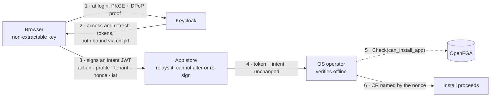

# App store — proving who asked for an install

Companion to [`authz-redesign.md`](authz-redesign.md). The app store acts on a user's token and asks the OS operator, which is privileged, to install, modify or remove apps. The operator must be able to attribute each request to a real user, and the app store must not be able to invent one. The app store is trusted only to have attached the correct app profile to the user's request — nothing more.

## Requirements

- The request is unforgeably tied to a user the identity provider vouched for.
- The proof covers *this* request and cannot be reused for a different one.
- Replay is bounded — a timestamp at minimum, single use ideally.
- The operator can verify all of the above without trusting the app store.

## The flow

Steps 1–2 happen once per session, steps 3–6 per request. Keycloak is not on the request path: the browser signs each intent with its own key, and the operator checks signature, `cnf.jkt`, issuer and expiry offline against cached JWKS. A Keycloak outage therefore stops new logins but not work already in flight, and OpenFGA is the only live dependency.

**Binding at login rather than on demand is deliberate.** Acquiring the bound token later — a silent re-auth at the first privileged action — is less invasive, since the login path never changes. But it leaves the *refresh* token unbound, and an unbound refresh token is a bearer credential: whoever holds it can present it with their own key and receive a bound token, with the same `azp` and no delegation marker to give it away. Binding at login binds the refresh token too, so a leaked one is inert without the private key. Given that the app store is precisely the component this design declines to trust, that is worth the extra reach into the login flow.

## Options compared

| Approach | Binds to the request | What the operator must do | Verdict |
|---|---|---|---|
| Forward the user's token unchanged | No | Validate against Keycloak's JWKS, read `sub`, check OpenFGA | Attribution only — the app store can fabricate any request |
| Token exchange (RFC 8693), `act` claim naming the app store | No | Validate the exchanged token and its `aud`, cache `jti`, check OpenFGA | Accountable but forgeable: the token says the app store may act for the user, not what for |
| Keycloak signs a hash of the request | Yes, but | As above, plus compare the hash | Needs a custom Keycloak SPI — RFC 8693 cannot inject arbitrary claims — and still only proves the app store asked, never that the user did |
| **Browser signs an intent JWT, token DPoP-bound** | **Yes** | Validate token, verify the intent signature against the token's `cnf.jkt`, enforce single-use nonce, re-derive the tenant, check OpenFGA | **Chosen** — the signing key never reaches the app store, so it can only relay or refuse |

Staging through token exchange was considered and dropped. It fails the stated trust model, and there is no running app store to migrate, so the usual argument for an intermediate step does not apply. Only the nonce cache and the OpenFGA check would have survived into the target anyway.

## What DPoP contributes, and what it does not

DPoP ([RFC 9449](https://www.keycloak.org/securing-apps/dpop)) makes a token sender-constrained: the client proves possession of a private key, and Keycloak binds the issued token to it through a `cnf: { jkt }` thumbprint claim. Two consequences matter here.

**It binds method and URI, not the body.** A proof for `POST /installs` is valid for any payload sent there, so DPoP alone does not satisfy the second requirement. The request content is carried in a separate intent JWT signed with the same key and verified against `cnf.jkt`.

**A DPoP-bound token is unusable by the app store** — it cannot mint valid proofs. That is precisely the property wanted: the app store degrades to a relay that forwards token and intent unchanged, authenticating itself separately with its own service credential.

DPoP is not the only way to bind a key to a user. The browser could instead register its public key with the operator directly, presenting its own Keycloak token — no DPoP needed, but it means exposing an operator endpoint to browsers. Registering *through* the app store does not work, since it could substitute its own key.

## Operator, in detail

- Verify the access token against Keycloak's cached JWKS, then verify the intent JWT's signature against the key named by that token's `cnf.jkt`. Identity and intent are checked separately and must agree. Both are offline checks; refresh the key set on rotation or an unknown `kid`, never per request.
- **Reject any token the app store could have minted for itself.** Holding the user's access token, the app store can attach its own DPoP proof at the token endpoint and receive a token bound to a key it controls — via token exchange, or via the refresh grant if it ever sees a refresh token. Two checks close this: the token's `azp` must be the browser-facing public client, and it must carry no `act` claim, since RFC 8693 delegation marks an exchanged token with `act.sub`.
- **Re-derive the tenant from the token**, never from the request body. The app store is trusted for the profile, not for the scope.
- **Still run the OpenFGA check** — `Check(can_install_app, tenant:<t>)`. The proof establishes *who*; OpenFGA decides *may they*. Same split as everywhere else in the redesign.
- **Let the API server be the replay cache.** Name the CR after the nonce, or enforce it through a uniqueness annotation at admission — a replayed request then fails as a duplicate create, with no extra state to keep.
- Record `sub` on the CR as the `requested-by` annotation, giving the audit trail the main plan calls for.

## Browser side

WebCrypto with ES256, `generateKey(..., extractable: false)`, the key object persisted in IndexedDB — the standard pattern, supported across current browsers in secure contexts. Safari's tracking prevention can evict IndexedDB after about a week of inactivity, private windows start empty, and clearing site data drops the key; all are handled by generating a new key and rebinding at the next login, since the key is per-session rather than an identity.

Non-extractability defeats exfiltration: a copied token or stolen storage cannot be replayed elsewhere. It does not stop an XSS payload from signing while it is resident in the page.

Implementation sits alongside the hand-written PKCE flow already in `oidc.ts` — generate a key, build and sign a small JWT, attach a header. No new dependency.

## Implementation requirements

Each of these is checkable, and the scheme's guarantees fail if any is skipped.

| # | Requirement | Fails if skipped |
|---|---|---|
| 1 | The refresh token never leaves the browser — not to the app store, not into storage the app store can read | The app store presents it with its own key and receives a bound token that is indistinguishable from the browser's |
| 2 | Tokens are DPoP-bound at login, so access *and* refresh carry `cnf.jkt` | An unbound refresh token remains a bearer credential upgradeable by whoever holds it |
| 3 | The operator rejects any token without `cnf.jkt` | An ordinary bearer token is enough to install, and the intent signature proves nothing |
| 4 | The operator rejects any token whose `azp` is not the browser-facing public client | A token minted for the app store's own client passes as the user's |
| 5 | The operator rejects any token carrying an `act` claim | An exchanged token — the app store acting for the user — passes as the user acting directly |
| 6 | Token exchange is not enabled for the app store's client toward the operator's audience | Relies on checks 4 and 5 alone, rather than removing the capability |
| 7 | The intent JWT's `iat` is within a short window — a minute, allowing for skew | A captured intent stays replayable for as long as the token lives |
| 8 | Each nonce is accepted once, enforced by the CR name or a uniqueness annotation at admission | A relayed intent can be submitted repeatedly |
| 9 | The tenant is re-derived from the token, never read from the request body | The app store chooses the scope, having been trusted only for the profile |
| 10 | The OpenFGA check still runs — the proof establishes *who*, not *whether* | Anyone who can authenticate can install |
| 11 | The app store authenticates itself separately, with its own service credential | No record of which component relayed the request |

Requirement 1 is the load-bearing one. Token exchange is detectable after the fact through `act`; a refresh is not.

## Prerequisite

Keycloak is on **26.0.7**; DPoP has been a preview feature since 23.0.0 and became [officially supported in 26.4](https://www.keycloak.org/2025/10/dpop-support-26-4). Building on it means upgrading first, or taking the direct key-registration route instead.
