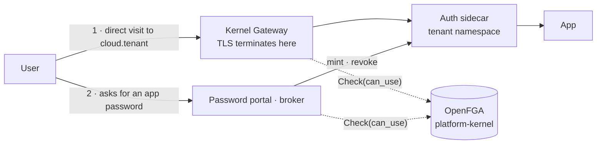

# Auth sidecars — direct app access and app passwords

**Under construction — not ready for review.**

Companion to [`authz-redesign.md`](authz-redesign.md), covering two things it defers: gating people who reach an app without going through the portal, and giving SSO users credentials for protocols that cannot do OIDC.

## Proposed mechanism

Two entry paths, one relation gating both.

**The gate sits at the gateway, not in the app or the sidecar.** It already terminates TLS for `cloud.<tenant>`, so it sees every request including those that never touch the portal — and it sits in kernel space, so no tenant workload ever holds an OpenFGA credential. That matters because there is a single store holding every tenant's tuples and reads against it are not scoped: a read-only credential in one tenant could still enumerate every other tenant's installs and users. (If app-internal decisions ever need OpenFGA — which folder, not just which app — front it with a kernel-space proxy that answers only `Check`, and only for that tenant's own objects. Nothing needs that today.)

**The sidecar keeps the jobs only it can do:** turning an assertion into a local account with the right role, and minting app passwords using admin rights the user must not have. Both happen after the gateway has already refused anyone unentitled.

## From today to the target

| Function | Today | Target state |
|---|---|---|
| **Direct app access** | Unchecked — reaching `cloud.<tenant>` is enough, the portal's gate never sees it | Gateway `ext_authz` runs `Check(can_use)` before the request reaches the app |
| **OpenFGA credentials in tenant space** | None issued, and none could be made safe: one store, reads unscoped across tenants | Stays that way — the gate lives in kernel space |
| **Identity in the SAML bridge** | Profile is `{ email, firstName, lastName }` — no groups, no Keycloak user id | Keycloak SAML mappers add both; the bridge keys subjects by UUID, never email |
| **Account provisioning** | `onLogin` provisions anyone who can authenticate to the realm | Provisions only those the gateway already let through; role comes from the assertion's group attributes |
| **App passwords** | No path — SSO users cannot produce one, so non-browser clients cannot connect | Brokered by the portal, minted through the sidecar where the app has no browser flow of its own |
| **Credential revocation** | Nothing knows which credentials exist | Inventory per user per app, revoked when entitlement goes away |
| **App declaration** | No way for an app to say it has app passwords, or where to mint and revoke them | Declared on the `AppProfile`, beside `spec.sidecars` — mechanism, sidecar service and port, revocation support, credential labelling |

The last row is the one with no precedent to lean on, and it blocks the revocation cascade rather than merely the UI. Note `spec.automationHooks`: a schema-only field nothing consumes yet — this needs to avoid stopping there.

## App passwords & password portal

WebDAV, CalDAV, IMAP and SMTP cannot do OIDC, and an SSO user has no in-app password to create an app password with — the bridge set a random one, or there is none. Live today, not hypothetical: mail runs Dovecot and IMAP clients need credentials.

The portal **brokers** credentials — request, list, revoke — and never stores or knows one. A central place to *set* a password pushed into each app would be password sync, which is what SSO exists to remove: one secret across many apps, a breach in the weakest yielding a credential that works elsewhere.

Per app, in order of preference: the app's own browser-based flow where it has one (Nextcloud's Login Flow v2 mints an app password after SSO — nothing to build); OAuth-native protocol auth where the client supports it (Dovecot speaks SASL `XOAUTH2`, so no password exists at all); otherwise the broker mints through the sidecar and displays the secret once.

Two rules come with it:

- **Minting is an authorization decision** — `Check(can_use, installed_app:<x>)` before issuing, or the credential path becomes the way around the entitlement path.
- **Revocation must cascade.** An app password is a long-lived bearer secret that bypasses tokens, DPoP and contextual tuples alike, so losing entitlement must revoke it, or the ten-minute bound in [`authz-redesign.md`](authz-redesign.md) is decorative. That needs an inventory per user per app, which only holds if every credential went through the broker — anything minted out of band is invisible and stays valid.

## Open questions

### The gate

- **How does the gateway learn who is calling?** A direct visit arrives anonymous — the user authenticates *inside* the sidecar flow, and afterwards carries the app's own session cookie, which is opaque to the gateway. So `ext_authz` has nothing to evaluate at either point unless the gateway terminates authentication itself. Envoy Gateway's `SecurityPolicy` can do OIDC, which would make it an authenticating proxy that knows the user and can then check `can_use` — but that leaves two session layers, the gateway's and the app's, and the interaction between them is unexamined. This is the largest open item: without it, the gateway cannot carry the gate at all.
- **How does a hostname map to an `installed_app` object?** To check `can_use`, the gateway must know that `cloud.demo.<domain>` is `installed_app:nextcloud-demo`. Something has to derive and publish that mapping — presumably from the `AppProfile` and the HTTPRoute that already exist — and keep it current as apps are installed and removed.
- **Credential-based requests bypass the gate entirely.** The gateway cannot validate an app password, since it is hashed inside the app, and IMAP and SMTP are raw TCP that never reach an HTTP filter. So for that path, issuance and revocation *are* the enforcement — there is no second check, ever.

### Credentials

- **Default lifetime for a minted credential.** Bounded expiry — thirty or ninety days — bounds the damage when a cascade fails, at the cost of periodic re-entry in the user's client. Cheap and worth doing whatever else is chosen; the number is unsettled.
- **The cascade needs to be a controller, not a hope.** Watch entitlement changes, revoke through the sidecar, retry, and *alert* on failure rather than logging it, with an inventory a tenant admin can inspect.
- **Mail deserves better than an app password**, and is the one protocol whose server we control. Dovecot's passdb is pluggable: either `XOAUTH2`, where the client presents a token and access is genuinely re-evaluated per connection, or a passdb pointing at the broker's store, where deleting the row *is* the revocation. Which of the two depends on client support across the tenant's users.
- **Forward-auth for HTTP protocols, per app.** The gateway could validate a Basic credential by calling the sidecar, resolve the user and then check `can_use`, with a short cache — real per-request enforcement at the cost of a round trip. Worth building when a specific app justifies it, not generically.
- **Terminating protocol authentication at the platform** — the sidecar fronting the app, the app trusting it — is the correct end state and too much per-app work to be the default. Open as a direction for high-value apps, not as a plan.

### Templates and scope

- **`templates/sso` is empty.** No OIDC auth-bridge template exists; the only instance is OpenProject's `portal-bridge`, which predates `spec.sidecars` and is a bespoke inline Deployment. Whether to migrate it and extract the template from two working examples, or leave it, is undecided.
- **`templates/sso-saml` is an early extraction**, validated against one app only. Its shape may not survive a second.
- **MCP sidecars are a `service_principal` consumer that already exists.** `nextcloud-mcp` runs against the app with a dedicated account, which is exactly the machine identity the model introduces — while [`authz-redesign.md`](authz-redesign.md) still marks service principals "lowest priority — build when a concrete consumer exists". That priority should be revisited.
