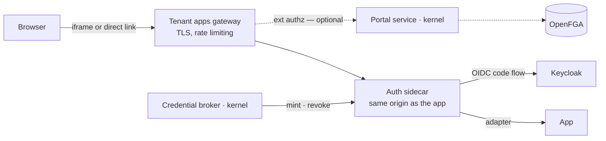

# Auth sidecars — bridging apps that cannot federate

Defining the role and capabilitites of app sidecars. They translate OICD tokens to the apps native authentication flow. They also might provide additional services, e.g. setting passwords for subservices (nextcloud's service specific app password).  

## Proposed mechanism

> **The sidecar is an effector, never a decider. Decisions flow inward.** It acts on a token it has validated and on instructions from kernel-side callers. It never asks the kernel anything, which is what lets it live in tenant space with no OpenFGA credential.

The sidecar terminates the OIDC code flow as a confidential client of the tenant realm, then hands the session to the app through an adapter:

| Adapter | What the app must offer | What the sidecar holds |
|---|---|---|
| **Session API** | An admin API that mints a session — Nextcloud's `createSessionToken`, ActivePieces' session JWT, Matrix login | the app's admin credential or similar privilege, e.g. database access |
| **Form login** | Only a password form | **a per-user password it manages** |
| **Credential operations** *(optional, independent of the above)* | An API to mint, list and revoke secondary credentials — Nextcloud's OCS endpoint for per-service app passwords, API keys elsewhere | whatever rights that API requires |

## Assumptions

1. Apps that can federate do so themselves. A sidecar is a fallback, never a uniform layer.
2. **Entitlement is decided at login, not on the request path** — by the sidecar reading the token's entitlement group, or by Keycloak declining to issue a token for that client. The sidecar sees the token's group claims and may refuse on them as defence in depth, but it cannot consult OpenFGA and must never be the only gate.
3. The sidecar is **same-origin with the app** (same hostname), fronted at the app's own hostname under a path.
4. App hostnames sit under the kernel domain, so the portal and the app are same-site. Custom tenant domains are out of scope here.
5. The portal service is the only OpenFGA caller. Tenant space holds no OpenFGA credential.
6. The sidecar uses the token's groups to provision and to set in-app roles, not to decide platform access — an app's own authorization model is its own business, while platform decisions stay with OpenFGA.

## From today to the target

| Function | Today | Target state |
|---|---|---|
| **Bridge protocol** | SAML — not a protocol choice: Docmost and ActivePieces have *all* SSO behind a licence, and SAML was simply what the generic sidecar was built around | OIDC, as a confidential client of the tenant realm |
| **Bridge scope** | Bespoke bridges for Nextcloud, Element and OpenProject; SAML sidecars for Docmost and ActivePieces | Only where the app cannot federate — docmost-ce, activepieces-me, openproject-ce |
| **How it is deployed** | Two on `spec.sidecars`; OpenProject's is inline in its own composition, Nextcloud's and Element's are assets shipped inside the app | All on `spec.sidecars`, from one template |
| **Session handoff** | Hand-written per app — a PHP file, a Python script, an nginx patch | A declared adapter: session API or form login, plus optional credential operations |
| **Identity in the bridge** | Profile is `{ email, firstName, lastName }` — no groups, no user id | The token's `sub` and claims, with subjects keyed by UUID |
| **Account provisioning** | Provisions anyone who can authenticate to the realm | Provisions only those the gateway let through; role from the token's groups |
| **Who can forge a session** | The portal — for every bridged app, in every tenant | The sidecar — for one app in one tenant, and only for the three that need one |
| **App passwords** | No path — SSO users cannot produce one | Brokered; minted through the sidecar only where the app has no browser flow of its own |
| **Credential revocation** | Nothing knows which credentials exist | Inventory per user per app, with expiry, revoked when entitlement goes |
| **App declaration** | No way for an app to state its adapter or credential capabilities | Declared on the `AppProfile`, beside `spec.sidecars` |

The last row has no precedent to lean on and it blocks the revocation cascade, not merely the UI. Note `spec.automationHooks`: a schema-only field nothing consumes — this needs to avoid stopping there.

## App passwords & the credential broker

WebDAV, CalDAV, IMAP and SMTP cannot do OIDC, and an SSO user has no in-app password to make an app password with. Live today: mail runs Dovecot.

The broker is kernel-side and does three things — **request, list, revoke**. It never stores or knows a secret. A central place to *set* one password pushed into every app would be password sync, which is precisely what SSO removes.

Per app, in order of preference:

1. **The app's own browser flow** — Nextcloud's Login Flow v2 mints one after SSO, with no admin rights and no stored password. Nothing to build.
2. **OAuth-native protocol auth** — Dovecot's SASL `XOAUTH2`: no credential exists at all, and access is re-evaluated per connection.
3. **The broker instructs the sidecar to mint** (the third adapter row) and shows the secret once.

API keys work identically. An inbound Basic credential can be validated by the sidecar and translated into a session — HTTP only, since IMAP and SMTP never reach it.

These are bearer secrets that bypass tokens, DPoP and contextual tuples alike, so **issuance and revocation are the only enforcement there will ever be**: `Check(can_use)` at the broker before minting, an inventory with expiry, and a cascade when entitlement lapses — or the ten-minute bound in [`authz-redesign-kernel-openfga-keycloak.md`](authz-redesign-kernel-openfga-keycloak.md) is decorative.

## Driving implementation questions

| Question | Current state | Caveat |
|---|---|---|
| Does every app in `gentian-apps` work with this? | Yes, across all 31 profiles. Most already do plain OIDC and need no sidecar — odoo and its addons, xwiki, mathesar, open-webui, nextcloud-base-od, app-store. Two use a bridge despite having a working OIDC client (nextcloud-base-ce, element) and can simply stop. Three need the sidecar because they cannot federate: docmost-ce and activepieces-me have all SSO behind a licence, openproject-ce has its Keycloak redirect path EE-gated. Addon profiles have no ingress and ride the base app's session; litellm and subscriptions are API-only behind the portal proxy. | The sidecar is claim-opaque, so an app needing claim-driven in-app roles cannot be moved behind one — none of the three do today, but it constrains which apps may be added later. Unverified: the iOS and ITP concern in `odoo/base/base-ce/backlog.md` would affect every embedded OIDC app at once. |
| Does it support direct API access with an API key or password — CalDAV, IMAP and the like? | Yes, through the broker, in three routes per app: the app's own browser flow where it has one (Nextcloud's Login Flow v2 covers CalDAV and WebDAV clients with no admin rights), OAuth-native protocol auth where the client supports it (Dovecot's `XOAUTH2` removes the credential entirely), otherwise sidecar-minted. | A different enforcement model, not the same one: these bypass the gate completely, so issuance and revocation are all there is. IMAP and SMTP never reach an HTTP filter at all. Both depend on the `AppProfile` declaration that does not exist yet, and on the cascade being a real controller. |