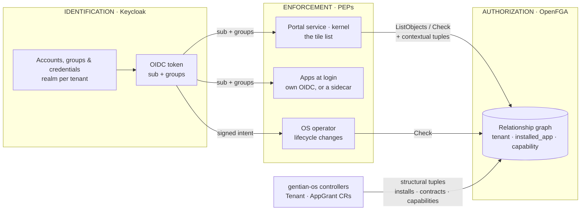
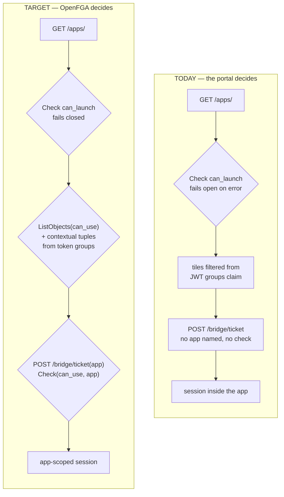

# Authorization redesign — separating identification from authorization

Working plan for moving Gentian from "Keycloak decides most things, OpenFGA decides one thing" to a clean split: **Keycloak answers *who is this*, OpenFGA answers *may they*.** Spans `gentian-os` (controllers, model), `gentian-ui` (portal, PEPs) and `gentian-apps` (app profiles).

## Target principles

- **Keycloak is the only identity provider.** It holds the accounts, authenticates them, and as OIDC issuer hands out tokens carrying the user's `sub` and their group memberships.
- **OpenFGA is the only authority on authorization** — and owns the structure that gives those groups meaning. A caller presents `sub` and groups; OpenFGA answers allowed or not.
- **Groups are carried, never interpreted — in the kernel.** No platform component reaches a verdict by reading the claim: it forwards the groups and asks OpenFGA. Inside an app the rule inverts — an app may build its own authorization model from those groups, as Odoo does, because what a role means inside an app is the app's business.
- **Service principals are Kubernetes CRs** synced into Keycloak — machine identities with no person behind them.
- **Only the user's browser requests tokens.** An app may at most exchange a valid token for one no more privileged than the original, and an exchanged token — one bearing `act` — is never sufficient for a privileged request to the operator.

## Target shape



Keycloak never answers "may they." OpenFGA never stores who anyone is. The token carries identity *and* the group memberships that identity implies — OpenFGA is what interprets them.


## Function-by-function

| Function | Today | Target state & change required |
|---|---|---|
| **User directory** | Keycloak realms are the only place accounts exist; no Kubernetes object represents a user. OpenFGA holds no user records — `user:<uuid>` is an opaque reference to a Keycloak UUID. | Unchanged, deliberately. Keycloak stays the directory. **No change** — recorded so it is not "fixed" later. |
| **Authentication & tokens** | Keycloak issues OIDC tokens; the browser performs the PKCE exchange directly. Tokens carry a `groups` claim, which apps read and interpret themselves to decide what a user may see. | Same mechanism, no custom SPI. The token still carries `groups`, but it becomes a *carrier*, not a decision: no app interprets the claim, it is forwarded to OpenFGA as contextual tuples and OpenFGA decides. **Change:** remove every place that reads `groups` to reach a verdict; keep the mapper that mints it, and add the equivalent SAML attribute mappers, since an assertion is the other carrier and today carries no groups at all. |
| **Administrative roles** | Keycloak already carries the role taxonomy per tenant — `:members`, `:admins`, `:app-admins`, and per-app `:app:<profile>` groups with a default-grant attribute. Only `:members` reaches OpenFGA. Promoting someone to tenant admin is two disconnected manual operations — group membership *plus* a per-user `realm-admin` grant, because the group carries no role mappings. No platform-level admin role exists at all. | Four principals, all expressed as Keycloak groups: tenant-user, tenant-admin, shared-admin, cluster-admin. **Change:** invert `admin: [user] or member` (today every member is an admin); add `platform` with `shared_admin` / `cluster_admin` and matching kernel-realm groups; decouple Keycloak's `realm-admin` ("may administer the realm") from Gentian's tenant admin ("may install and wire apps"). Promotion becomes a single group change, effective at the next token refresh. Note that "who are the admins?" is then a Keycloak question — OpenFGA cannot answer it. |
| **Entry gate (portal shell)** | A real `Check(can_launch, shell_app:gentian-ui)` runs on the app-list endpoint — the only genuine OpenFGA call in the live flow. It fails open when unconfigured or on error. The gate moves out of the shell, which under the new topology holds no OpenFGA credential: the browser asks the kernel portal service for it, or the shell decides from the token like any other app. Fail-closed either way. **Change:** `can_launch` becomes an API call to the portal service; missing configuration is a startup error in production, with fail-open kept as a local-dev affordance. |
| **App entitlement** | Two places decide whether a person may use an app, and neither asks OpenFGA: tile visibility is filtered from the JWT `groups` claim, and the bridge-ticket endpoint mints a session for any authenticated tenant member without naming or checking an app. The per-app entitlement groups above hold the answer already; it just never reaches OpenFGA. | One relation — `installed_app#can_use` — decides both. **Change:** add `can_use` to the model; replace group filtering with `ListObjects` (which accepts contextual tuples); add an app parameter plus a `Check` to ticket minting. |
| **App lifecycle permissions** | Nothing is checked. Whoever can create the CR can install, reconfigure or remove an app, and can wire integrations between apps; the controller performs no authorization at all. | Distinct verbs gated on the *container* rather than the app, which does not exist yet at install time: `can_install_app`, `can_configure_app`, `can_uninstall_app`, `can_grant_integration` on `tenant`; `can_install_shared`, `can_install_kernel_extension` and `can_edit_catalogue` on `platform`. A kernel extension takes two checks (scope, then class) rather than a cross-product relation. **Change:** add the relations; decide whether uninstall (destructive) and cross-tenant integrations warrant a stricter gate than install. |
| **Session handoff into apps** | Apps that cannot complete OIDC inside a cross-origin iframe (Nextcloud, Element, OpenProject) use a portal-minted ticket redeemed server-to-server; the rest use silent OIDC. The bridge exists for browser cookie/CSRF reasons, not authorization ones. The ticket goes away. Each app does its own OIDC, so the iframe and a direct link become the same request — see [`portal-redesign.md`](portal-redesign.md), which also shows the browser constraint does not exist under same-site hostnames. Only apps that cannot federate keep a handoff, and that is their sidecar's adapter rather than anything the portal mints. **Change:** delete the ticket machinery; the portal mints nothing. |
| **Machine & agent identity** | No representation. Every subject is `user:`, so an automation would need a human-shaped Keycloak account to be granted anything. | A `service_principal` type owned by a tenant, authenticated by a Keycloak confidential client using the client-credentials grant (precedent: the per-tenant Dovecot client). **Change:** new type, CRD and reconciler; PEPs map service-account tokens to `service_principal:<sub>`. A consumer already exists — `nextcloud-mcp` runs against its app with a dedicated account, which is precisely this. |
| **App install scopes** | An installed app belongs to exactly one tenant; platform-wide and machine-facing installs cannot be expressed. | Two scopes: tenant and shared (platform), plus direct grants to an individual user or service principal. A machine-only scope was considered and dropped: a service principal needing an ordinary app is just a direct `can_use` grant. **Change:** add `platform` and `service_principal` types and a `shared_scope` relation *alongside* the existing `tenant` relation; a shared install reaches users through one controller-written `tenant` tuple per tenant it serves, not through a platform-wide membership. |
| **Identity → tuple sync** | The authz bridge pulls enabled users per realm and writes tenant membership plus the shell `parent` tuple, event-driven on admin-secret and `Tenant` changes. It ignores the `:admins`, `:app-admins` and per-app groups that exist beside `:members`. | Largely removed: with memberships riding in the token, no user-derived tuple needs storing, and the reconcile-latency gap goes with it. **Change:** reduce the bridge to bootstrap only (create the store, write the model); delete `SyncRealmUsers` once PEPs supply contextual tuples. Migration can be incremental — OpenFGA gives contextual tuples precedence over stored ones, so both can run side by side. |
| **Grant & resource tuples** | `AppGrantReconciler` writes app, contract and capability tuples directly from CRs, never derived from Keycloak — already the correct pattern. | Unchanged pattern, extended for the new scopes. **Change:** add a `scope` field to `AppGrant` and emit the matching scope relation. |
| **Attributing a privileged request** | Nothing attributes one. A component holding a user's token can ask the operator for anything, and the operator cannot tell a real request from an invented one. | The browser signs an intent naming the action, app, tenant and a nonce, with a key the app store cannot use; the operator verifies it against the token's `cnf.jkt` and accepts each nonce once. **Change:** see [`app-store-authz-redesign.md`](app-store-authz-redesign.md) — DPoP-bound tokens, an intent JWT, and rejection of any token bearing `act`. |
| **Where decisions are enforced** | The portal's shell gate is the only PEP, and it only covers people who arrive through the portal — a direct visit to the app's own hostname passes nothing. Controllers check nothing, and cannot: by reconcile time the requesting user is gone, since reconcilers run under the operator's own service account. Three PEPs: the portal service for the tile list, **the app's own login** for reaching an app at all — the app or its sidecar holds the token there, whereas a gateway sees only an opaque session cookie — and the operator for lifecycle actions, which it can now do because the request arrives carrying a browser-signed intent naming the user. **Change:** `ListObjects(can_use)` at the portal service; login-time enforcement in the app; operator-side verification per [`app-store-authz-redesign.md`](app-store-authz-redesign.md), with `sub` recorded on the CR as `requested-by` for audit. |
| **Revocation** | Undefined. Nothing is enforced per request, a session inside a bridged app outlives everything, and an app password outlives even that. | Bounded by the access-token lifespan (see the ten-minute question below). **Change:** pin that lifespan as realm policy rather than leaving it to per-realm drift; bound app session lifetimes, or have bridged apps re-check, so a native app session cannot outlive the right that created it. App passwords escape the bound entirely — they are enforced at issuance and revocation only, which is why the cascade in [`authz-redesign-app-sidecar-and-password-portal.md`](authz-redesign-app-sidecar-and-password-portal.md) is load-bearing rather than tidy. |
| **OpenFGA API least privilege** | Preshared keys are a flat list — every valid key may write tuples and models. The portal, which only reads, holds the same class of credential as the controller, which writes. | The portal can only read, and tenant workloads hold no credential at all — one store, unscoped reads, so a read-only key in one tenant still enumerates every other. **Change:** separate keys per caller plus a path allow-list in front of OpenFGA (Envoy Gateway is already in the stack). OpenFGA's native per-client access control is the eventual answer but is still marked experimental upstream. |

## Driving implementation questions

| Question | Answer | Caveat |
|---|---|---|
| Does the target design work with the portal — can we identify inside iframes without a full page reload and the loss of desktop state? | Yes. Each embedded app runs its own OIDC inside its own iframe, and the redirect chain stays within that frame — the desktop shell and every other open window are untouched. The Keycloak SSO cookie is same-site with the portal, so the re-authentication is silent and nothing is re-rendered. | Depends on app hostnames staying under the kernel domain: a custom tenant domain makes the SSO cookie third-party and the silent step fails. And browser login is not the only path — protocols that cannot do OIDC at all, such as CalDAV, WebDAV and IMAP, still need a credential, issued by the broker rather than by this flow. |
| Are authorization and identity attestation completely separated? | For decisions, yes: no app interprets an entitlement itself, every verdict comes from OpenFGA. For data, deliberately not — the token carries the group memberships OpenFGA reasons over, and subjects are Keycloak UUIDs, so identity remains the join key. | The rule governs who *decides*, not what travels. Groups ride in the token by design; an app reaching its own verdict from them is the thing that must never happen. |
| Does a revoked right take effect within 10 minutes — reached by access-token renewal, not by forcing re-authentication? | For anything decided per request, yes. A refresh re-mints claims from Keycloak's current group state with no user interaction, so the bound is the access-token lifespan (Keycloak's default is 5 minutes), and stored tuples deleted by a controller take effect on the very next call. Requires pinning that lifespan as realm policy rather than leaving it to drift. | Not true inside bridged apps. Once Nextcloud or Element has established its own native session, that session's lifetime is detached from token refresh and revoking a group does not end it. Closing this needs bounded app-session lifetimes or a periodic re-check against the portal. Long-running service principals that hold a token until expiry have the same exposure. |
| Applications still expecting groups in the token — can we set them? | Yes, unchanged: Keycloak keeps its standard group-membership mapper, so those apps keep working. This is the normal path rather than an exception — every PEP forwards those same groups to OpenFGA. | Only an app that cannot be changed to call OpenFGA *and* needs a claim reflecting OpenFGA-derived rights would need a custom protocol mapper minting it at token time. That needs a Keycloak SPI and puts OpenFGA on the login critical path, where an outage blocks login rather than just authorization. |

## Portal authentication — required changes

Today the portal makes most of these calls itself: it reads the token's `groups` claim to decide which tiles to show, and it hands a session ticket to any authenticated tenant member who asks. In the target it decides nothing on its own — it passes the token's groups to OpenFGA as contextual tuples and enforces the answer it gets back.

The changes below are all in `gentian-ui` except where noted. Login itself — browser-direct PKCE against Keycloak — is unchanged.



Diamonds are OpenFGA decisions, boxes are steps the portal takes alone — one diamond today, three in the target.

| Change | Where | Why |
|---|---|---|
| Build contextual tuples from the verified token's `groups` and send them with every `Check` / `ListObjects` | `core/openfga_client.py` · `core/authz.py` | This is what lets OpenFGA decide without storing a copy of Keycloak's group data. Mind the ceiling of 100 contextual tuples per request. |
| Bridge-ticket minting takes an app identifier and runs `Check(can_use)` before issuing | `api/routes/session.py` · `services/portal_session_bridge.py` | Today any authenticated tenant member can mint a session ticket for any bridged app; this is the single largest gap. |
| Ticket payload names the app, and redemption rejects a mismatch | `services/portal_session_bridge.py` | A ticket minted for one app must not be redeemable against another. |
| Tile list comes from `ListObjects(can_use)` instead of the `groups` claim | `core/shell_apps.py` · new method on `core/openfga_client.py` | Moves entitlement decisions from Keycloak's claim to OpenFGA. |
| Fail closed when OpenFGA is configured but unreachable | `core/openfga_client.py` | Errors currently return "allowed", so an outage silently disables authorization. |
| Drop `groups` from the ticket payload once tiles no longer depend on it | `services/portal_session_bridge.py` | Stops handing apps an entitlement signal they should obtain from OpenFGA. Coordinate with the redeeming side in `gentian-apps` before removing. |
| Portal runs with a read-only OpenFGA credential | chart values · gateway allow-list | The portal only ever reads; it should not hold a key that can write tuples or models. |

## Auth sidecars (SAML) — required changes

A direct visit to `cloud.<tenant>` never touches the portal, so the portal's gate does not see it. That second path is gated at the **kernel gateway**, not in the sidecar — [`authz-redesign-app-sidecar-and-password-portal.md`](authz-redesign-app-sidecar-and-password-portal.md) works out why, along with app passwords and the open questions around both.

What remains here is the `gentian-os` and `gentian-sidecars` work that holds regardless of where the check runs: a SAML assertion carries neither groups nor a Keycloak user id today, so a bridge built on it can neither forward contextual tuples nor name a subject correctly.

| Change | Where | Why |
|---|---|---|
| Keycloak emits group membership and the Keycloak user id as SAML attributes | realm SAML client mappers, `gentian-os` | The bridge's profile is `{ email, firstName, lastName }`. Keycloak maps groups into SAML attributes the same way it does into the OIDC claim. |
| Bridge parses those attributes into the profile it passes to `onLogin` | `templates/sso-saml/bridge.js` | The handler cannot act on what the bridge never extracted. |
| Subjects are the Keycloak UUID, never the email address | `bridge.js` · per-app `handlerScript` | Email-keyed subjects fail to match every tuple, silently — the same trap as the portal's ticket path. |
| Provisioning uses the assertion's groups to set the local role | per-app `handlerScript` | The gateway has already refused anyone unentitled; what the sidecar still owns is which role the account gets inside the app. |
| Extract the OIDC auth-bridge template | `templates/sso/`, empty today | Only OpenProject's pre-`spec.sidecars` portal-bridge exists in this category, as a bespoke inline Deployment. |

## Invariants to hold while doing this

- **No identity-derived fact is stored in OpenFGA.** Memberships and roles arrive per request as contextual tuples built from the token; a subject exists in the store only for as long as some tuple mentions it, and that is intended. Only structure — installs, scopes, contracts, capabilities — is written, and only by controllers from CRs.
- **Never rename or drop a relation in one step.** Add alongside, migrate tuples write-before-delete, then remove — see the migration rules in [`CLAUDE.md`](../CLAUDE.md).
- **Contextual tuples come only from verified token claims.** They are premises the caller asserts, and OpenFGA trusts them completely. Deriving one from a request parameter, a header or a client-supplied field hands the caller its own privileges.
- **Subjects are always Keycloak UUIDs.** Tuples and `Check` calls must use the same identifier space — the `sub` claim. Both the bridge-ticket path and the SAML bridge build identities from `preferred_username`/`email` today; nothing may derive a `user:` subject from those, or checks will silently fail to match.

## Proposed model

The specific roles below — `member`, `app_admin`, `admin`, `shared_admin`, `cluster_admin` — are provisional, and the Keycloak groups they correspond to are expected to change as the taxonomy settles. What the model commits to is the shape: permissions hang off containers (`tenant`, `platform`) rather than off objects that do not exist yet at decision time.

A shared app reaches its users through the same `member from tenant` path as any other install — the controller writes one `tenant` tuple per tenant the shared app serves, and `shared_scope` records which platform owns it for lifecycle and administration. There is deliberately no platform-wide membership relation: nothing in the token could assert it, since no Keycloak group spans every tenant.

```fga
model
  schema 1.1

type user

type platform
  relations
    define cluster_admin: [user]
    define shared_admin: [user] or cluster_admin
    define can_install_kernel_extension: cluster_admin
    define can_install_shared: shared_admin
    define can_edit_catalogue: cluster_admin

type tenant
  relations
    define platform: [platform]
    define admin: [user]
    define app_admin: [user] or admin
    define member: [user] or app_admin
    define can_install_app: app_admin or shared_admin from platform
    define can_configure_app: app_admin or shared_admin from platform
    define can_uninstall_app: admin or shared_admin from platform
    define can_grant_integration: admin or shared_admin from platform

type service_principal
  relations
    define owner: [tenant]

type group
  relations
    define member: [user]

type shell_app
  relations
    define parent: [tenant]
    define can_launch: [user] or member from parent

type installed_app
  relations
    define tenant: [tenant]
    define shared_scope: [platform]
    define can_use: [user, service_principal] or member from tenant

type app_contract
  relations
    define tenant: [tenant]
    define provider: [installed_app]
    define consumer: [installed_app]

type capability
  relations
    define link: [app_contract]
    define granted: [installed_app]

type document
  relations
    define parent: [tenant]
    define owner: [user]
    define reader: [user] or member from parent or owner
    define acting_for: [user]
    define can_read: reader or (acting_for and member from parent)
```

Against today's model: `platform` and `service_principal` are new; `tenant` gains the inverted admin hierarchy (`admin ⊆ app_admin ⊆ member`) and the four lifecycle verbs; `installed_app` gains `shared_scope` and `can_use`; `shell_app#can_launch` drops its now-redundant admin term. `group`, `app_contract`, `capability` and `document` are unchanged — `group` still has no producer and can be dropped outright if no within-tenant slices are wanted.
