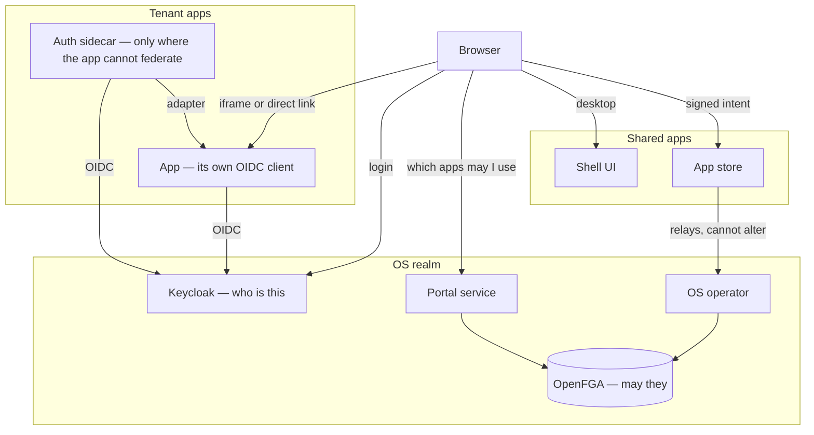

# Authorization redesign — overview

Index to the plan files in this directory. The work splits identification from authorization: **Keycloak answers *who is this*, OpenFGA answers *may they*,** and no component the browser talks to holds anything that can forge either answer.

## How the pieces connect

## Principles

- **Keycloak is the only identity provider; OpenFGA is the only authority on authorization** — for platform decisions: may this person reach this app, install one, wire two together. Neither answers the other's question.
- **Groups are carried, never interpreted — in the kernel.** No platform component reaches a verdict by reading the claim; it forwards the groups to OpenFGA as contextual tuples. **Inside an app the rule inverts:** an app may drive its own authorization model from the token's groups, as Odoo does by mapping `gentianOdooGroupRoles` onto its own security groups. What a role means inside an app is the app's business.
- **No identity-derived fact is stored in OpenFGA.** Memberships and roles arrive per request. Only structure — installs, scopes, contracts, capabilities — is written, and only by controllers from CRs.
- **Subjects are always Keycloak UUIDs**, never an email or a username.
- **Nothing forgeable in the browser-facing components.** The shell and the app store can relay or refuse; neither can invent a session or a request. Auth sidecars are the exception, in two unavoidable cases: standing in for an app that cannot federate, where establishing a session requires admin rights over it, and serving protocols that circumvent OIDC entirely — Basic auth, API tokens and the like — where something must hold or mint a credential. Both are confined to one app in one tenant.
- **Every change to a kernel resource is attributed and checked.** Nothing may ask the OS operator to create, alter or remove a `Tenant`, an `AppGrant` or any other kernel object on its own authority. The request carries a signed intent bound to the caller's token — the mechanism in [`app-store-authz-redesign.md`](app-store-authz-redesign.md), generalised beyond installs. The operator verifies that intent offline, then asks OpenFGA whether the named user may make that change. Relaying is the most any browser-facing component ever does.
- **Decisions flow inward.** Tenant space holds no kernel credential; the kernel decides and instructs.

## Drawbacks / discussion points

- **Enforcement sits with the apps, and the kernel can only support it.** Almost every app exchanges the token for its own session cookie at login and never consults it again — the ecosystem default, not a Gentian quirk. So a gateway sees an opaque cookie it cannot validate, and OIDC is a control at login time rather than per request. Kernel-side measures stay supportive; see [`gateway-access-enforcement.md`](gateway-access-enforcement.md).
- **`can_use` must stay reducible to group membership.** Apps and sidecars hold no OpenFGA credential, so they decide from the token's entitlement group instead of asking. That only agrees with OpenFGA while every grant path is expressible as one group. Paths that are not — a shared app reached through a per-tenant tuple, a direct grant to a single user or service principal — are invisible to the app, and the two views drift apart silently.
- **Logout does not propagate, and short token lifetimes do not fix it.** Each app issues its own session cookie at login and then stops consulting the token, so a five-minute access token expiring changes nothing about a session the app will honour for its own configured lifetime — often days. What bounds access is the *app session's* lifetime. This is not peculiar to the design: it is how every server-rendered OIDC app behaves, because a browser navigation cannot carry an `Authorization` header.

## Summaries: what each file says

**[`system-boundaries.md`](system-boundaries.md)** maps the four kinds of thing the platform runs — the OS, tenants, shared apps and core systems — and the boundaries between them. The other files place components within that map; read it first if the words "shared app" or "kernel extension" are unfamiliar.

**[`authz-redesign-kernel-openfga-keycloak.md`](authz-redesign-kernel-openfga-keycloak.md)** is the kernel half. Today OpenFGA gates exactly one thing (shell entry, failing open) while Keycloak's `groups` claim decides everything else, and the authz bridge keeps a stale copy of Keycloak's membership in the store. The target: a model with `can_use` and the app-lifecycle verbs hung off containers rather than objects that do not exist yet, memberships arriving as contextual tuples instead of stored tuples — which removes the bridge and its reconcile latency — and the inverted admin hierarchy, since today every tenant member is also a tenant admin. It also carries the proposed `model.fga`.

**[`portal-redesign.md`](portal-redesign.md)** deals with how a person actually reaches an app. Today the portal mints a signed ticket that a PHP file inside Nextcloud redeems, so the portal can become any user in any tenant; a direct visit to the app's hostname meanwhile passes no check at all. The target is plain OIDC in both cases — the same URL whether the browser is an iframe or a fresh tab — which deletes the ticket machinery outright. It also proposes splitting the shell out of the kernel into a shared app, leaving behind a small portal service as the only OpenFGA caller, and records the audit showing which apps can take that path.

**[`authz-redesign-app-sidecar-and-password-portal.md`](authz-redesign-app-sidecar-and-password-portal.md)** covers what is left over. Three apps cannot federate at all, because their SSO is behind a licence — a sidecar terminates OIDC for them and hands the session over through a declared adapter, holding the forging capability that is unavoidable there and nowhere else. The same file handles credentials for WebDAV, CalDAV, IMAP and SMTP, which cannot do OIDC: a kernel-side broker that requests, lists and revokes but never stores a secret, with issuance and revocation as the only enforcement those credentials will ever get.

**[`gateway-access-enforcement.md`](gateway-access-enforcement.md)** explains why the gateways are not where authorization happens: once an app issues its own session cookie it stops consulting the token, so a gateway sees something opaque it cannot validate, and branching on whether a cookie is present is trivially bypassed. It sets out what the gateways are genuinely for — TLS, rate limiting, brute-force protection, header stripping — plus the two authorization-adjacent jobs they can do, and the three mechanisms available if gateway enforcement is wanted for a particular app after all.

**[`app-store-authz-redesign.md`](app-store-authz-redesign.md)** answers how the operator knows a privileged request came from a real user. The browser signs an intent with a key bound to its token via DPoP; the app store relays it and can neither alter nor re-sign it; the operator verifies offline and accepts each nonce once. It lists the checks that make that hold, the load-bearing one being that the refresh token never leaves the browser.

## Further points to discuss
- **How does logging out work across many app sessions?** Signing out of the desktop ends the shell's session and Keycloak's, but every open app keeps its own cookie and will honour it. The standard remedies are OIDC **back-channel logout**, where Keycloak pushes a logout token to each client and the client kills its session, RP-initiated logout for the one the user is looking at, and simply configuring shorter app session lifetimes. All need per-app support — a client must register a back-channel logout URI and the app must implement the endpoint — and which catalogue apps do is unaudited. At least one does not: Odoo's profile records that it has no back-channel logout, being an OAuth2 client rather than a full OIDC relying party.
- **How long should a minted credential live, and who rotates it?** These are bearer secrets sitting outside every other control, so an expiry is the only thing bounding the damage when a revocation cascade fails. Short lifetimes mean users re-entering credentials in desktop and mobile clients. Rotation has no obvious owner either — the broker must delete or mint a replacement.
- **Should a gate in front of apps reject illegitimate requests outright?** Demanding a valid token or app password before traffic reaches an app would turn away scanning and unauthenticated probing cheaply. But some apps must serve anonymous traffic — a public website, a Nextcloud share link, a `/.well-known` discovery URL — so it needs a per-route bypass, and that bypass then becomes the thing to get wrong. Same component as the question below, different job.
- **Token-only apps could have the gateway validate for them.** An app that accepts nothing but a bearer token — no session cookie, no form login — can be fronted by a gateway that verifies the signature against Keycloak's JWKS and rejects anything invalid before it lands. That is cheap defence in depth and, unlike `can_use`, something a gateway genuinely can do, since the credential is self-describing. It does not extend to apps holding their own session: there the cookie is opaque and the gateway is back to waving traffic through.
- **Is the gateway a PEP at all?** It sees only the app's own session cookie — no identity, no groups — so it can neither name the caller nor build the contextual tuples a decision needs. The app and the sidecar do hold the token at login, which makes **login the natural enforcement point** and leaves the gateway as orthogonal infrastructure: TLS, rate limiting, brute-force protection, header stripping, a reverse proxy for login and token flows. Two consequences if we take that view: the check lands in N places rather than one, which a conditional deny on the app's Keycloak client would collapse back to one; and per-request re-evaluation disappears — though it never existed, and a gateway could not have provided it either.