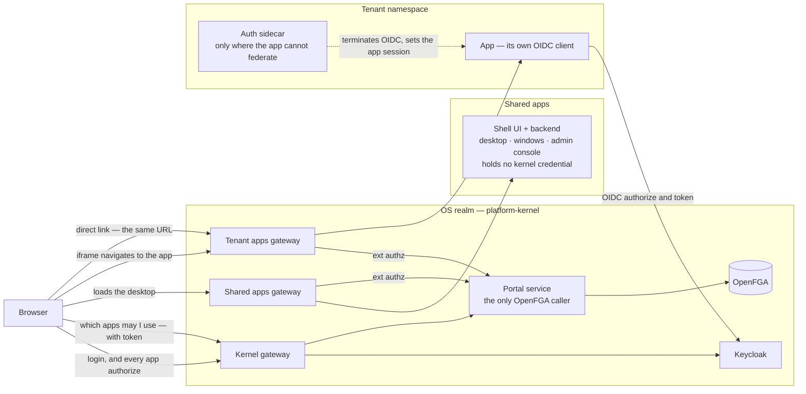
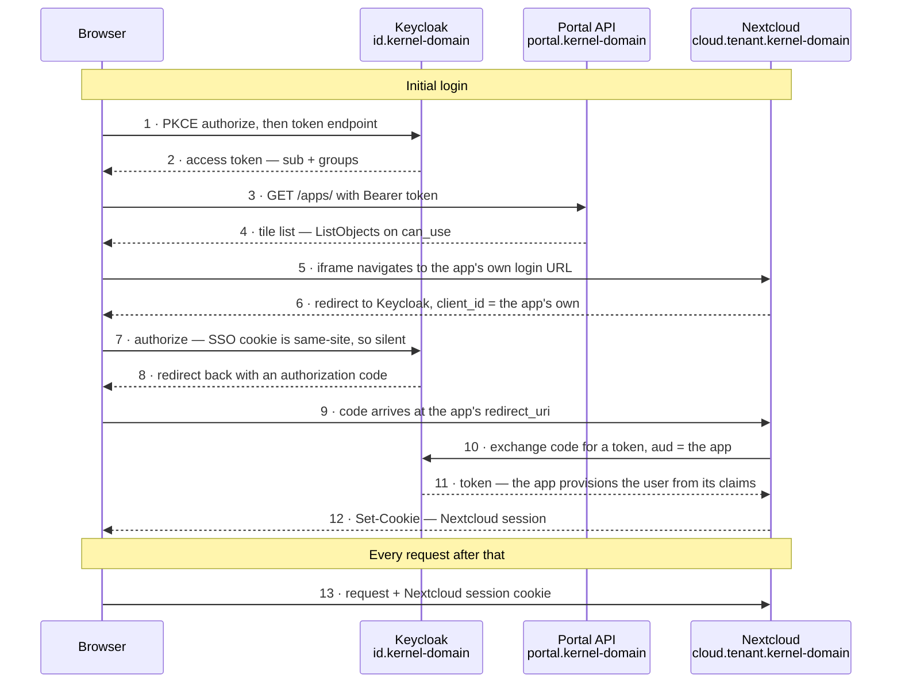
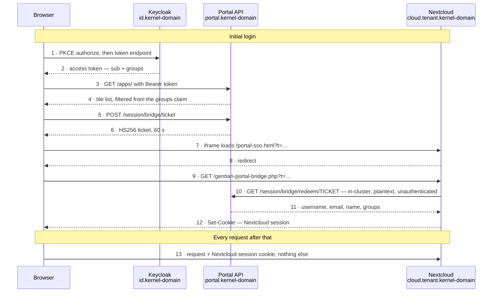

# Portal redesign — one login path for embedded and direct access

**Under construction — not ready for review.**

Companion to [`authz-redesign-kernel-openfga-keycloak.md`](authz-redesign-kernel-openfga-keycloak.md). Today an app opened from the portal and the same app opened by direct link authenticate differently, and the portal holds a secret that can mint a session as any user. The aim is one path for both, with nothing forgeable left in the portal.

## Target topology

The shell moves out of the kernel and becomes a shared app. What stays behind is a small portal service that answers only the questions requiring kernel knowledge.

- **The shell is an ordinary shared app**, and it is not in the authorization path at all — not even as a relay. No OpenFGA token, no Keycloak admin password, no signing key. The browser asks the portal service for its own entitlements and the shell simply renders them.
- **The portal service is the only component that talks to OpenFGA**, for the browser and for the gateway alike. Kernel knowledge lives in one place.
- **Both arrows into the tenant gateway are the same request.** Whether the browser is an iframe or a fresh tab, it fetches the same URL and the app does its own OIDC.
- **A sidecar appears only where the app cannot federate** — docmost-ce, activepieces-me, openproject-ce until its token is bought.

## What has to change

| Area | Today | Target |
|---|---|---|
| **Shell placement** | Kernel component — `gentian-portal` chart in `platform-kernel` | An ordinary shared app, deployed from the catalogue like any other |
| **Portal service** | Does not exist; the shell backend does the kernel work | New, small, kernel-resident — the only OpenFGA caller |
| **Gateways** | One Gateway, host-based routes for everything | Three: kernel, shared apps, tenant apps — the app ones carrying `ext_authz` |
| **App login** | Portal-minted tickets for Nextcloud, Element, OpenProject | Each app its own OIDC client; iframe and direct link identical |
| **Ticket machinery** | `portal_session_bridge.py`, the HS256 key, `/session/bridge/*`, `portal-sso.html`, `gentian-portal-bridge.php`, plus matrix and openproject variants | Deleted |
| **Sidecars** | SAML sidecars for docmost and activepieces; bespoke bridges elsewhere | OIDC-terminating sidecars, only for apps that cannot federate — docmost, activepieces, openproject-ce |
| **SAML assertions** | Carry email, firstName, lastName | Carry groups and the Keycloak user id, via realm attribute mappers |
| **Subject identity** | Username or email on every bridge path | The Keycloak UUID everywhere |
| **Entitlement source** | JWT `groups` read and interpreted in `shell_apps.py` | `ListObjects(can_use)` at the portal service, groups forwarded as contextual tuples |
| **Direct-link access** | Unchecked — reaching the hostname is enough | `ext_authz` at the tenant apps gateway before the request lands |
| **Keycloak admin privilege** | Shell backend holds `KEYCLOAK_ADMIN_USERNAME` and `PASSWORD` | Admin operations run on the caller's own token, as `credential_manager.py` already does for OpenBao |
| **Synapse admin privilege** | Shell backend holds `matrix_bridge_password` | Removed with Element's move to its existing OIDC client |
| **OpenFGA credential** | Held by the shell; preshared keys are flat and equally privileged | Held only by the portal service; separate keys per caller, path allow-list in front |
| **Session revocation** | App sessions outlive entitlement indefinitely | Back-channel logout, or bounded app-session lifetimes |
| **Non-browser clients** | No path — nobody knows the account password | Credential broker, per [`authz-redesign-app-sidecar-and-password-portal.md`](authz-redesign-app-sidecar-and-password-portal.md) |

## DETAILS: Proposed solution - the app does its own OIDC

- **The portal leaves the login path** after step 4. It navigates a frame to a URL, which is what a direct link does — so steps 5 to 13 are identical either way.
- **Keycloak vouches to the app directly**, with the code bound to `client_id`, `redirect_uri` and the PKCE verifier.
- **No forgeable secret in the portal.** No ticket, so no signing key and nothing that can mint a session as an arbitrary user.
- **Each app gets its own token and audience**, so no app holds a credential usable against another.

### Which apps can take the OIDC path

Audited across all 31 profiles in `gentian-apps`:

| Category | Apps |
|---|---|
| **Already plain OIDC** | odoo + 9 addons, xwiki, mathesar, open-webui, **nextcloud-base-od**, app-store |
| **Bridge despite having a working OIDC client** | nextcloud-base-ce, element |
| **OIDC exists but is paywalled** | openproject-ce — the Keycloak redirect path needs `OPENPROJECT_ENTERPRISE_TOKEN` |
| **No federated login at any price in CE** | docmost-ce, activepieces-me — all SSO is behind a licence |
| **Not applicable** | addon profiles (no ingress), litellm and subscriptions (`deploymentMethod: api`, portal-proxy) |

**`nextcloud-base-od` is the decisive evidence.** The OpenDesk Nextcloud profile has no `portal-auth-mode` annotation, so it defaults to `oidc`, with its own client and `linkTarget: embedded`. The same application already runs plain OIDC inside the portal iframe. `nextcloud-base-ce` is the outlier.

### Where a sidecar belongs

A purpose-built sidecar can act as the relying party for any app — it terminates OIDC and establishes the app's session by whatever app-specific means. That dissolves every blocker above. But it carries two costs, so it is a fallback rather than a layer:

- **A sidecar is claim-opaque.** It turns a claims-carrying login into a name-carrying one. Odoo's `gentian_os` module maps `gentianOdooGroupRoles` onto `res.users.groups_id` *during the `auth_oauth` sign-in* — put a sidecar in front and Odoo never sees a token, so module entitlement silently stops working. Nextcloud's `user_oidc` group mapping has the same shape.
- **A sidecar holds a forging capability by construction**, since establishing a session needs the app's admin access. Unavoidable where nothing else can log a user in; gratuitous where the app can federate on its own.

> **The rule: the app does OIDC itself wherever it can. A sidecar only where the app cannot federate at all** — docmost-ce, activepieces-me, and openproject-ce until someone buys the token.

Three apps then carry an unavoidable forging capability; the rest carry none. A uniform sidecar layer, tempting for consistency, would reintroduce the problem everywhere and break Odoo's plugins on the way.

## DETAILS: Today - the ticket bridge

| Artifact | Held by | Detail |
|---|---|---|
| **Nextcloud account password** | **Nobody** | 24 random characters at account creation, then discarded. Only Nextcloud's hash survives; no party can produce it. |
| **Ticket signing key** | Portal backend | HS256, `portal_bff_client_secret` falling back to `oidc_client_secret`. Nextcloud never sees it — it asks the portal to redeem instead of verifying. |
| **Nextcloud session cookie** | Nextcloud | `createSessionToken` after `setUser`, first-party on `cloud.<tenant>.<kernel-domain>`. |
| **Keycloak SSO cookie** | Keycloak | Not consulted anywhere in steps 5–13. |
| **Portal access token** | Browser `sessionStorage` | Never sent to Nextcloud. |

**Initial login** is steps 1–12; Nextcloud never sees the user's token, learns the identity from the portal's answer, and calls its own internals — so no password is checked, because none is presented. **Every call afterwards** is step 13: the session cookie alone, with no re-evaluation of anything.

What follows:

- **The portal can become any user** in that tenant's Nextcloud — the bridge logs in whoever the portal names, and the mint endpoint checks only that the caller is an authenticated tenant member.
- **Nobody can create an app password**, since nobody knows the account password. WebDAV, CalDAV and IMAP clients therefore have no path in — a consequence of this design, not a separate gap.
- **The session outlives entitlement.** Nothing re-checks after step 12.
- **The ticket rides in a query string**, landing in history, `Referer` and access logs. Bounded by 60 seconds and single use.
- **Step 10 is unauthenticated in both directions** — plaintext in-cluster HTTP, no credential from Nextcloud, no verification of what comes back.

### Why the bridge exists

Not because OIDC failed. The commit that introduced it replaced something worse: the previous implementation fetched the user's **actual Nextcloud password** from the portal API and posted the login form with it, scraping Nextcloud's `requesttoken` first. The CSRF failure it cites belongs to that form-login emulation — OIDC has no form to post and no token to scrape.

The cookie explanation does not fit either. Steps 7–9 are same-host, and `cloud.<tenant>.<kernel-domain>` is same-**site** with `portal.<kernel-domain>`, so the cookie in step 12 is first-party and third-party restrictions do not apply.

What the bridge actually is, is a hand-rolled authorization-code flow:

| | Bridge ticket | OIDC authorization code |
|---|---|---|
| Issued by | Portal | Keycloak |
| Travels | Query string, once | Query string, once |
| Redeemed | Server-to-server at the portal | Server-to-server at the token endpoint |
| Bound to | **Nothing** | `client_id`, `redirect_uri`, PKCE verifier |

The swap of trusted issuer — Keycloak to portal — is exactly why the portal ends up holding something that can forge sessions.

## Open risks

- **iOS and ITP.** `odoo/base/base-ce/backlog.md` proposes moving Odoo *away* from OIDC to a portal ticket, to kill a Keycloak popup on iOS. That is the only evidence in the repo against embedded OIDC, and if it reproduces it affects every embedded OIDC app at once. Reproduce it before committing to this direction — it is cheap to test and it is the one thing that could invalidate the plan wholesale.
- **Custom tenant domains.** `Tenant.spec.domain` allows an app zone like `acme.com`, which is genuinely cross-site with the portal. The bridge does not solve this either: its CORS allow-list rejects any origin outside the kernel domain, and the session cookie at step 12 would be third-party regardless. Options are `Partitioned` cookies, the Storage Access API, or not embedding those apps.
- **Embedding is a choice, not a constraint.** Every tile in the catalogue is `embedded`. Opening apps in tabs instead would make every session first-party and remove this entire class of problem — at the cost of the desktop metaphor.
