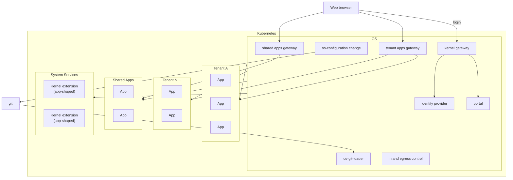

# System Boundaries

Map of the trust/isolation boundaries between the four kinds of thing gentian
runs: the OS itself, tenants (many), shared apps (one realm), and system
services.

## Boundaries

- **OS** is the one component every other box depends on, never the reverse.
  Configuration changes, loading state from git, in/egress control, and
  identity all live here, nowhere else.
- **Gateways** are one per zone and all three live in the OS. Nothing reaches a
  tenant app, a shared app, or identity except through the gateway for that
  zone, which is where entitlement is enforced — the app gateways ask the
  portal, so the authorization credential never leaves the OS.
- **Tenant** is drawn twice with a "..." between them on purpose: there are
  many, each its own isolation boundary. Apps inside one tenant are isolated
  from each other the same way tenants are isolated from each other — no
  edges between sibling apps, none implied.
- **Shared apps** is one boundary, not one per app — but the apps inside it
  are isolated from each other exactly like tenant apps are, despite sharing
  that one boundary.
- **System services** hosts kernel extensions that are shaped like apps
  (same install/lifecycle mechanics) but live in a different trust tier than
  anything in a tenant or shared apps.
